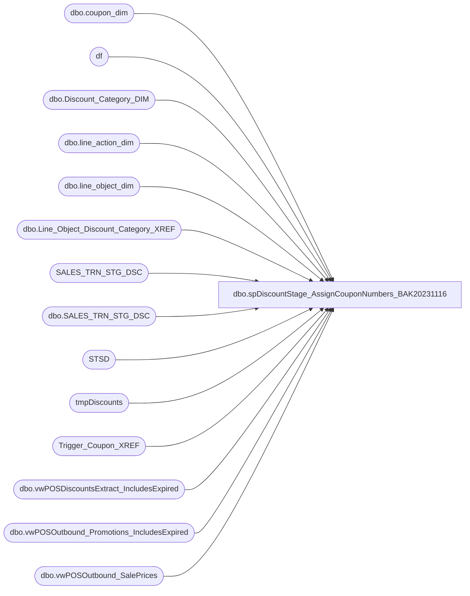

# dbo.spDiscountStage_AssignCouponNumbers_BAK20231116

**Database:** DWStaging  
**Server:** papamart  

## Architecture Diagram



## Table Dependencies

| Referenced Table |
|---|
| dbo.coupon_dim |
| df |
| dbo.Discount_Category_DIM |
| dbo.line_action_dim |
| dbo.line_object_dim |
| dbo.Line_Object_Discount_Category_XREF |
| SALES_TRN_STG_DSC |
| dbo.SALES_TRN_STG_DSC |
| STSD |
| tmpDiscounts |
| Trigger_Coupon_XREF |
| dbo.vwPOSDiscountsExtract_IncludesExpired |
| dbo.vwPOSOutbound_Promotions_IncludesExpired |
| dbo.vwPOSOutbound_SalePrices |

## Stored Procedure Code

```sql
-- =============================================================================================================
-- Name: spDiscountStage_AssignCouponNumbers 
--
-- Description: 
-- Update the SALES_TRN_STG_DSC (Discounts) to assign the Coupon Numbers and Discount Manager Categories
--
--
--		NOTE: CHANGING THE NA LOGIC HERE SHOULD ALSO BE CHANGED IN DW.dbo.spPostCouponChangesToDiscountFacts
-- 
--
-- Input:
--  None
--
-- Output: 
--  None
--
-- Dependencies: 
--
-- EXAMPLE:
--  exec dwstaging.dbo.spDiscountStage_AssignCouponNumbers 
--
-- Revision History
--  Name:			Date:			Comments:
--  Gary Murrish	5/29/2013		created
--	Gary Murrish	5/31/2013		Added logic to convert 'Triggers' to Coupon Numbers
--	Gary Murrish	7/8/2013		Made sure that isExpired is set to zero when there is no coupon.
--	Gary Murrish	10/14/2013		Changed the Group for the Invalid Channel. The user changed this.
--	Gary Murrish	10/16/2013		Made sure that the 'NA' category for the Web stuck.
--	Gary Murrish	2/27/2014		Fixed update with Nolock problem
--	Gary Murrish	7/3/2014		Changed the lookup on the Cross-Reference to add leading zeros
--	Dan Tweedie		06/28/2016		Added line_action_key
--	Dan Tweedie		02/06/2017		Added handling for new SFS Certificates as coupons
--	Kelly Farrar	2/6/2019		Comment out logic to Strip all of the non-numeric characters from the reference numbers
--	Dan Tweedie		2021-08-02		Added indexes, removed staging into #Discounts, and that is now staged earlier in the process into tmpDiscounts
--	Dan Tweedie		2023-8-17		Added mapping for Jump Mind Aptos Deals, per David Walsh, we set reference_no='' if it is like 'manual%' and line object 1625
--	Dan Tweedie		2023-9-12		Added mapping back to Jump Mind Discount Mgr discounts 
--	Tim Callahan	2023-11-01		Added union to  #AptosDeal build to  Get Temp Price Markdowns Data as related to JIRA BIB-656
-- =============================================================================================================

CREATE PROCEDURE [dbo].[spDiscountStage_AssignCouponNumbers_BAK20231116]
AS


--ADD INDEXES -- added on 2021-08-02 -- 
	--CREATE NONCLUSTERED INDEX [NCI_STG_oRef_Ref]
	--ON [dbo].[SALES_TRN_STG_DSC] ([origReference_no],[Reference_No])
	--INCLUDE ([recID])

	--CREATE NONCLUSTERED INDEX [NCI_STG_Line_Object]
	--ON [dbo].[SALES_TRN_STG_DSC] ([Line_Object])
	--INCLUDE ([recID])

	--CREATE NONCLUSTERED INDEX [NCI_STG_Line_Object_Key]
	--ON [dbo].[SALES_TRN_STG_DSC] ([line_object_key])
	--INCLUDE ([recID])

	--CREATE NONCLUSTERED INDEX [NCI_STG_Line_Action]
	--ON [dbo].[SALES_TRN_STG_DSC] ([Line_Action])
	--INCLUDE ([recID])

	--CREATE NONCLUSTERED INDEX [NCI_STG_LO_]
	--ON [dbo].[SALES_TRN_STG_DSC] ([Line_Object])
	--INCLUDE ([recID],[coupon_key],[categoryTypeID])

	--CREATE NONCLUSTERED INDEX [NCI_STG_CK]
	--ON [dbo].[SALES_TRN_STG_DSC] ([coupon_key],[categoryTypeID],[Store_No])
	--INCLUDE ([recID])

	--CREATE NONCLUSTERED INDEX [NCI_STG_CatType]
	--ON [dbo].[SALES_TRN_STG_DSC] ([categoryTypeID])
	--INCLUDE ([recID])

	--CREATE NONCLUSTERED INDEX [NCI_STG_LO_Cat]
	--ON [dbo].[SALES_TRN_STG_DSC] ([Line_Object])
	--INCLUDE ([recID],[categoryTypeID])

BEGIN
	SET NOCOUNT ON;

	UPDATE STSD
		SET STSD.origReference_no = STSD.reference_no
	FROM
		SALES_TRN_STG_DSC STSD
	WHERE STSD.origReference_no IS NULL AND STSD.reference_no IS NOT NULL


	-- Set the Line Object Key
	UPDATE STSD
		SET STSD.line_object_key = lod.line_object_key
	FROM
		SALES_TRN_STG_DSC STSD
		INNER JOIN dw.dbo.line_object_dim lod WITH (NOLOCK)
			ON STSD.Line_Object = lod.Line_Object

	UPDATE SALES_TRN_STG_DSC
		SET line_object_key = -1
	WHERE line_object_key IS NULL

	--Set line action key
	UPDATE STSD
		SET STSD.line_action_key = lad.line_action_key
	FROM
		SALES_TRN_STG_DSC STSD
		INNER JOIN dw.dbo.line_action_dim lad WITH (NOLOCK)
			ON STSD.Line_action = lad.Line_action

--==============================================================================
--==============================================================================


	-- Begin the work on the Coupon Numbers
	UPDATE SALES_TRN_STG_DSC
		SET coupon_key = -1, categoryTypeID = -1

	-- Strip all of the non-numeric characters from the reference numbers
	--UPDATE SALES_TRN_STG_DSC
	--	SET reference_no = dbo.fnRemoveNonNumericCharacters(origReference_no)
	--WHERE coupon_key = -1


	-- Convert all of the 'Triggers' to the actual Coupon Numbers
	UPDATE STSD
		SET STSD.reference_no = tcx.CouponCode
	FROM
		SALES_TRN_STG_DSC STSD 
		INNER JOIN Trigger_Coupon_XREF tcx WITH (NOLOCK)
			ON STSD.reference_no = CAST(tcx.TriggerCode AS varchar)
			OR (STSD.Reference_No = RIGHT('0000000000' + CAST(tcx.TriggerCode AS varchar),6) AND LEN(STSD.Reference_No) = 6)
			OR (STSD.Reference_No = RIGHT('0000000000' + CAST(tcx.TriggerCode AS varchar),7) AND LEN(STSD.Reference_No) = 7)

	--NEW JUMP MIND MAPPING TO APTOS DEALS
	---THE REFERENCE_NO IS THE DEAL_DISCOUNT_ID FROM dw.azure.vwPOSOutbound_Promotions, AND THE DEAL_NO FROM THAT IS THE TRIGGER CODE FROM THE XREF
	--THE COUPON CODE FROM THE XREF IS THE NEW UPDATED REFERENCE_NO, WHICH WILL THEN BE MATCHED IN THE NEXT QUERY, TO THE COUPON_DIM RETAIL_PRO
	select
		deal_discount_id,
		deal_no,
		DealStartDate,
		DealEndDate
	into #AptosDeal
	from bedrockdb02.me_01.dbo.vwPOSOutbound_Promotions_IncludesExpired--dw.azure.vwPOSOutbound_Promotions
	group by 
		deal_discount_id,
		deal_no,
		DealStartDate,
		DealEndDate
	-- 11/01/2023
	-- Added union to Get Temp Price Markdowns Data as related to JIRA BIB-656
	union
		select
		deal_discount_id,
		deal_no,
		DealStartDate,
		DealEndDate	
	from bedrockdb02.me_01.dbo.vwPOSOutbound_SalePrices sp
	group by 
		deal_discount_id,
		deal_no,
		DealStartDate,
		DealEndDate


	select 
		DiscountID,
		couponNumber,
		StartDate,
		EndingDate 
	into #DMDiscounts
	from kodiak.DiscountMstrData.dbo.vwPOSDiscountsExtract_IncludesExpired
	group by 
		DiscountID,
		couponNumber,
		StartDate,
		EndingDate 

	UPDATE STSD
		set	STSD.reference_no=xr.CouponCode
	from SALES_TRN_STG_DSC STSD
	join #AptosDeal AD 
		on STSD.reference_no=cast(AD.deal_discount_id as varchar)
		and cast(stsd.transaction_date as date) between DealStartDate and DealEndDate
	join Trigger_Coupon_XREF xr on AD.deal_no=xr.TriggerCode

	UPDATE STSD
		set	STSD.reference_no=dm.couponNumber
	from SALES_TRN_STG_DSC STSD
	join #DMDiscounts dm 
		on STSD.Reference_No=dm.DiscountID
		and cast(stsd.transaction_date as date) between dm.StartDate and dm.EndingDate

	update s
	set s.Reference_No=''
	from SALES_TRN_STG_DSC s
	join dw.dbo.line_object_dim lod on s.line_object_key=lod.line_object_key 
	where s.reference_no like '%manual%'
	and lod.line_object=1625 


	-------------------------


	-- Build a work table for the Coupon Master
	-- drop table #Coupons
	SELECT
		cd.coupon_key,
		CAST(cd.Retail_Pro AS varchar(25)) AS Retail_Pro_Full,
		CAST(RIGHT('0000000' + CAST(cd.Retail_Pro AS varchar), 6) AS varchar(25)) AS Retail_Pro_6,
		CAST(RIGHT('00000000' + CAST(cd.Retail_Pro AS varchar), 7) AS varchar(25)) AS Retail_Pro_7,
		cd.start_date,
		cd.stop_date,
		cd.categoryTypeID
	INTO #Coupons
	FROM
		dw.dbo.coupon_dim cd WITH (NOLOCK)

--ADD INDEXES
		CREATE NONCLUSTERED INDEX [NCI_Coupons_]
		ON [dbo].[#Coupons] ([Retail_Pro_Full])
		INCLUDE ([coupon_key],[start_date],[stop_date],[categoryTypeID])

		CREATE NONCLUSTERED INDEX [NCI_Coupons__]
		ON [dbo].[#Coupons] ([Retail_Pro_7])
		INCLUDE ([coupon_key],[start_date],[stop_date],[categoryTypeID])


		CREATE NONCLUSTERED INDEX [NCI_Coupons___]
		ON [dbo].[#Coupons] ([Retail_Pro_6])
		INCLUDE ([coupon_key],[start_date],[stop_date],[categoryTypeID])
--


	-- Post all of the records where we have a direct match to the coupons
	-- Use the entire coupon number
	UPDATE STSD
		SET	STSD.coupon_key = cd.coupon_key,
			STSD.categoryTypeID = cd.categoryTypeID,
			STSD.isExpired =
				CASE
					WHEN STSD.transaction_date BETWEEN cd.start_date AND cd.stop_date THEN 0
					ELSE 1
				END
	FROM
		SALES_TRN_STG_DSC STSD 
		INNER JOIN #Coupons cd WITH (NOLOCK)
			ON STSD.reference_no = cd.Retail_Pro_Full
	WHERE STSD.coupon_key = -1 AND LEN(STSD.reference_no) <= 7

		-- Try just the first 7 positions
	UPDATE STSD
		SET	STSD.coupon_key = cd.coupon_key,
			STSD.categoryTypeID = cd.categoryTypeID,
			STSD.isExpired =
				CASE
					WHEN STSD.transaction_date BETWEEN cd.start_date AND cd.stop_date THEN 0
					ELSE 1
				END
	FROM
		SALES_TRN_STG_DSC STSD 
		INNER JOIN #Coupons cd WITH (NOLOCK)
			ON STSD.reference_no = cd.Retail_Pro_7
	WHERE STSD.coupon_key = -1 AND LEN(STSD.reference_no) <= 7


	-- Try just the first 6
	UPDATE STSD
		SET	STSD.coupon_key = cd.coupon_key,
			STSD.categoryTypeID = cd.categoryTypeID,
			STSD.isExpired =
				CASE
					WHEN STSD.transaction_date BETWEEN cd.start_date AND cd.stop_date THEN 0
					ELSE 1
				END
	FROM
		SALES_TRN_STG_DSC STSD 
		INNER JOIN #Coupons cd WITH (NOLOCK)
			ON STSD.reference_no = cd.Retail_Pro_6
	WHERE STSD.coupon_key = -1 AND LEN(STSD.reference_no) <= 7


	-- Try the post-DM Serialized coupons
	UPDATE STSD
		SET	STSD.coupon_key = cd.coupon_key,
			STSD.categoryTypeID = cd.categoryTypeID,
			STSD.isExpired =
				CASE
					WHEN STSD.transaction_date BETWEEN cd.start_date AND cd.stop_date THEN 0
					ELSE 1
				END
	FROM
		SALES_TRN_STG_DSC STSD 
		INNER JOIN #Coupons cd WITH (NOLOCK)
			ON cd.Retail_Pro_7 = LEFT(STSD.reference_no, 7)
	WHERE STSD.coupon_key = -1

	-- Try the pre-DM Serialized coupons
	UPDATE STSD
		SET	STSD.coupon_key = cd.coupon_key,
			STSD.categoryTypeID = cd.categoryTypeID,
			STSD.isExpired =
				CASE
					WHEN STSD.transaction_date BETWEEN cd.start_date AND cd.stop_date THEN 0
					ELSE 1
				END
	FROM
		SALES_TRN_STG_DSC STSD WITH (NOLOCK)
		INNER JOIN #Coupons cd WITH (NOLOCK)
			ON cd.Retail_Pro_6 = SUBSTRING(STSD.reference_no, 2, 6)
	WHERE STSD.coupon_key = -1

	--==============================================================================================
	--==============================================================================================
	-----------------NEW CODE TO ASSIGN THE SFS CERTIFICATES CATEGORY-------------------------------
		--THIS IS NOW STAGED EARLIER VIA spPreStageDiscountsForCoupons

	--IF (Object_ID('tempdb..#discounts') IS NOT NULL) DROP TABLE #discounts;
	--select 
	--	sdd.serializedNum, 
	--	CAST(d.couponNumber AS int) Coupon
	--into #discounts
	--from kodiak.discountmstrdata.dbo.SerializationDiscount sd
	--join kodiak.discountmstrdata.dbo.serializationdiscountdetail sdd on sd.serializationid = sdd.serializationid
	--join kodiak.discountmstrdata.dbo.Discount d on sd.discountID = d.discountID and d.isSerializedCoupon = 1

	update df
		set 
			df.coupon_key = c.coupon_key,
			df.categoryTypeID = c.categoryTypeID,
			df.isExpired =
					CASE
						WHEN df.transaction_date BETWEEN c.start_date AND c.stop_date 
						THEN 0
						ELSE 1
					END
	from dwstaging.dbo.SALES_TRN_STG_DSC df
	--join #discounts d 
	join tmpDiscounts d
		on cast(df.reference_no as varchar) = cast(d.serializedNum as varchar) 
		--and df.line_object = 1701
		and df.categoryTypeID = -1
	join #Coupons c on c.retail_pro_full = d.Coupon and c.CategoryTypeID = 162
	
	--==============================================================================================
	--==============================================================================================


	-- End of the logic for individual coupons, set them to 0 (No Coupon)
	UPDATE SALES_TRN_STG_DSC
		SET coupon_key = 0,
			isExpired = 0
	WHERE coupon_key < 0

	-- Now apply the various line_object Rules to those which have no coupon assigned
	--	or which have no categoryTypeID assigned, this includes the 'NA' asssignment
	UPDATE STSD
		SET STSD.categoryTypeID = dcd.categoryTypeID,
		STSD.isExpired = 0
	FROM
		SALES_TRN_STG_DSC STSD
		INNER JOIN DWStaging.dbo.Line_Object_Discount_Category_XREF X WITH (NOLOCK)
			ON X.Line_Object = STSD.Line_Object
		INNER JOIN dw.dbo.Discount_Category_DIM dcd WITH (NOLOCK)
			ON X.categoryType = dcd.categoryType
			AND X.channelType = dcd.channelType
	WHERE STSD.coupon_key = 0 OR STSD.categoryTypeID = -1


	-- Web Discounts
	DECLARE @WebCategoryType int
	SELECT
		@webCategoryType = dcd.categoryTypeID
	FROM
		dw.dbo.Discount_Category_DIM dcd WITH (NOLOCK)
	WHERE
		dcd.channelType = '.com'
		AND dcd.categoryType = 'On Line Offers'

	UPDATE SALES_TRN_STG_DSC
		SET	categoryTypeID = @WebCategoryType,
			coupon_key = 0
	WHERE store_no IN (13, 2013, 136) AND coupon_key = 0 AND categoryTypeID = -1

	-- Default all unassigned to Other Discounts, Invalid
	DECLARE @OtherCategoryType int
	SELECT
		@OtherCategoryType = dcd.categoryTypeID
	FROM
		dw.dbo.Discount_Category_DIM dcd WITH (NOLOCK)
	WHERE
		dcd.financialGroup = 'Marketing'
		AND dcd.categoryType = 'Invalid'

	UPDATE SALES_TRN_STG_DSC
		SET categoryTypeID = ISNULL(@OtherCategoryType, -1)
	WHERE categoryTypeID = -1


	-- After everything, force the 'NA' (Not Applicable rule to be applied)
	UPDATE STSD
		SET STSD.categoryTypeID = dcd.categoryTypeID,
		STSD.isExpired = 0
	FROM
		SALES_TRN_STG_DSC STSD WITH (NOLOCK)
		INNER JOIN DWStaging.dbo.Line_Object_Discount_Category_XREF X WITH (NOLOCK)
			ON X.Line_Object = STSD.Line_Object
		INNER JOIN dw.dbo.Discount_Category_DIM dcd WITH (NOLOCK)
			ON X.categoryType = dcd.categoryType
			AND X.channelType = dcd.channelType
	WHERE dcd.channelType = 'NA' AND STSD.categoryTypeID <> dcd.categoryTypeID


END
```

