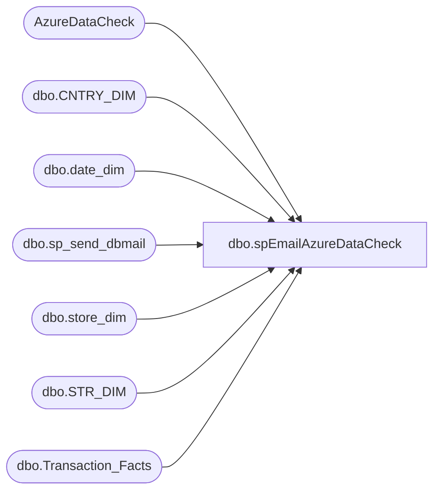

# dbo.spEmailAzureDataCheck

**Database:** DWStaging  
**Server:** papamart  

## Architecture Diagram



## Table Dependencies

| Referenced Table |
|---|
| AzureDataCheck |
| dbo.CNTRY_DIM |
| dbo.date_dim |
| dbo.sp_send_dbmail |
| dbo.store_dim |
| dbo.STR_DIM |
| dbo.Transaction_Facts |

## Stored Procedure Code

```sql
CREATE proc [dbo].[spEmailAzureDataCheck]

as 

set nocount on


		
--IF (Object_ID('tempdb..#DW') IS NOT NULL) DROP TABLE #DW;
--select 
--	tf.TransactionDate,
--	sd.TradingGroup,
--	count(tf.TransactionID) as TransactionCount
--into #DW
--from dw.Azure.vwTransactionFact tf
--join dw.Azure.vwStores sd on tf.StoreKey=sd.StoreKey
--where datediff(dd, tf.TransactionDate, getdate()-1) = 0
--and sd.TradingGroup in ('North America', 'Europe')
--group by 
--	tf.TransactionDate,
--	sd.TradingGroup


IF (Object_ID('tempdb..#Stores') IS NOT NULL) DROP TABLE #Stores
SELECT	 
	CAST(dsd.Store_Key AS VARCHAR) AS StoreKey,
	CASE 
		WHEN cd.NM_ABBRV IN ('US','CA') 
			THEN 'North America'
	    WHEN cd.NM_ABBRV IN ('UK','DK','IE','CN') 
			THEN 'Europe'
		 END AS [TradingGroup]
into #Stores
FROM dw.dbo.store_dim dsd with (nolock)
join kodiak.BABWMstrData.dbo.STR_DIM sd on dsd.store_id=sd.STR_NUM
join kodiak.BABWMstrData.dbo.CNTRY_DIM cd on cd.CNTRY_ID=sd.CNTRY_ID
WHERE sd.CMPNY_ID=1 AND sd.STR_ID > 0
AND sd.STR_NUM not between 501 and 505  -- Labs
AND sd.STR_NUM NOT BETWEEN 9001 AND 9100 -- Test Stores

IF (Object_ID('tempdb..#DW') IS NOT NULL) DROP TABLE #DW;		
SELECT 
	sd.TradingGroup,
	CONVERT(DATE,dd.actual_date) AS TransactionDate,
	count(*) TransactionCount
into #DW
FROM dw.dbo.Transaction_Facts tf WITH(NOLOCK)
join dw.dbo.date_dim dd WITH(NOLOCK)	ON tf.date_key = dd.date_key
join #Stores sd on tf.store_key=sd.StoreKey
where datediff(dd, dd.actual_date, getdate()-1) = 0
group by 
	sd.TradingGroup,
	CONVERT(DATE,dd.actual_date)


IF (Object_ID('tempdb..#Azure') IS NOT NULL) DROP TABLE #Azure;
select
	SalesDate,
	TradingGroup,
	TransactionCount
into #Azure
from AzureDataCheck
where datediff(dd, SalesDate, getdate()-1) = 0

IF (Object_ID('tempdb..#Data') IS NOT NULL) DROP TABLE #Data;
select
	DW.TransactionDate,
	DW.TradingGroup,
	DW.TransactionCount as DWTransactionCount,
	isnull(az.TransactionCount,0) as AzureTransactionCount
into #Data
from #DW dw 
left join #Azure az 
	on dw.TransactionDate=az.SalesDate
	and dw.TradingGroup=az.TradingGroup

--=================
--begin the begin
--=================
declare 
	@Count int,
	@Subj varchar(1000),
	@text nvarchar(max),
	@recip varchar(1000)

select @text = '<font face =arial><H3>Azure Data Load Check: Transaction Counts</H3>' +
		'<table border="1">' +
		'<tr>
		<th>SalesDate</th>
		<th>TradingGroup</th>
		<th>DWTransactionCount</th>
		<th>AzureTransactionCount</th>
		</tr>' +
		'<font face =arial size = 2>' +
		CAST ( ( SELECT td = TransactionDate,'',
						td = TradingGroup,'',
						td = DWTransactionCount,'',
						td = AzureTransactionCount,''
				 from #Data
				 order by TransactionDate,TradingGroup
				  FOR XML PATH('tr'), TYPE 
		) AS NVARCHAR(MAX) ) +
		'</font></table></font></p></p>
		<br>
		<br>
		<br>'

select @Count = count(*) from #Data where DWTransactionCount <> AzureTransactionCount

if @Count > 0
	select 
		@Subj = 'Azure vs DW - *problem*',
		@recip = 'biadmin@buildabear.com;biadmintextalert@buildabear.com'
	else
	select 
		@Subj = 'Azure vs DW - *no problem*',
		@recip = 'biadmin@buildabear.com'

	
begin

	exec msdb.dbo.sp_send_dbmail
	@profile_name = 'BIAdmin',
	@recipients = @recip,
	@body = @text,
	@subject = @subj,
	@body_format = 'HTML'
end
```

