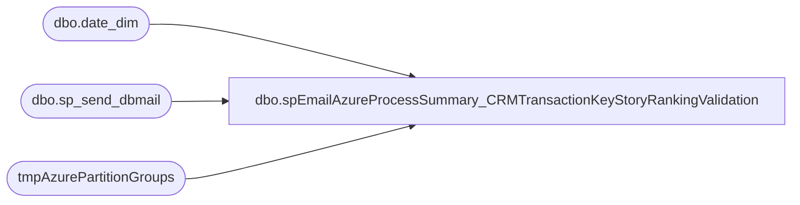

# dbo.spEmailAzureProcessSummary_CRMTransactionKeyStoryRankingValidation

**Database:** DWStaging  
**Server:** papamart  

## Architecture Diagram



## Table Dependencies

| Referenced Table |
|---|
| dbo.date_dim |
| dbo.sp_send_dbmail |
| tmpAzurePartitionGroups |

## Stored Procedure Code

```sql
CREATE proc [dbo].[spEmailAzureProcessSummary_CRMTransactionKeyStoryRankingValidation]

as

set nocount on

IF (Object_ID('tempdb..#x') IS NOT NULL) DROP TABLE #x;

with 
FiscalPeriod as
	(
		select
			fiscal_year,
			fiscal_period
		from dw.dbo.date_dim
		where datediff(dd, actual_date, getdate())=0
	),
WeekOne as
	(
		select 
			min(dd.actual_date) MinDate,
			case when datediff(dd, min(dd.actual_date), getdate())<=7 then 1 else 0 end WeekOne
		from dw.dbo.date_dim dd
		join FiscalPeriod fr 
			on dd.fiscal_year=fr.fiscal_year
			and dd.fiscal_period=fr.fiscal_period
		group by dd.fiscal_year, dd.fiscal_period
	)
select 
	TableType,
	TableName,
	case when datediff(dd, PartitionRefreshedtime, getdate())=0 then 'YES' else 'NO' end as ProcessedToday,
	case when PartitionedTable = 1 then 'YES' else 'NO' end as PartitionedTable,
	PartitionName,
	PartitionRefreshedtime,
	InsertDate
into #x
from tmpAzurePartitionGroups
where CurrentPartition=1
or exists (select * from WeekOne where WeekOne=1)
--and case when datediff(dd, PartitionRefreshedtime, getdate())=0 then 'YES' else 'NO' end <> 'YES'
group by 
	TableType,
	TableName,
	PartitionedTable,
	PartitionName,
	PartitionRefreshedtime,
	InsertDate
order by 
	TableType,
	TableName


declare 
	@text nvarchar(max),
	@CountUnProcessed int,
	@Status varchar(10),
	@Subj varchar(100)

select @CountUnProcessed = count(distinct TableName) 
from #x 
where ProcessedToday='NO'
and (
		 TableName in 
			(
				'CRMTransactionKeyStoryRanking'
			)
		)


select @Status= case when @CountUnProcessed > 0 then 'Problem' else 'No Problem' end
select @Subj= 'Azure Processing Summary - CRMTransactionKeyStoryRanking - ' + @Status

if @CountUnProcessed >0
set @text =
	'<font face =arial size = 2><B>Azure Processing Summary - CRMTransactionKeyStoryRanking Validation - PROBLEM</B><br>
	The following tables were not processed today.
	<br></font>' +
			'<table border="1">' +
				'<tr bgcolor="black"><th><font face =arial size = 2>TableType</font></th>' +
					'<th><font face =arial size = 2>TableName</font></th>' +
					'<th><font face =arial size = 2>PartitionName</font></th>' +
					'<th><font face =arial size = 2>ProcessedToday</font></th>' +
					'<th><font face =arial size = 2>ProcessTime</font></th></tr>' +
		'<font face =arial size = 2>' +
			CAST ( ( SELECT 
							td = TableType,'',
							td = TableName,'',
							td = PartitionName, '',
							td = ProcessedToday, '',
							td = PartitionRefreshedtime, ''
					  from #x
						where ProcessedToday='NO'
						and (
								 TableName in 
									(
										'CRMTransactionKeyStoryRanking'
									)
								)
						  order by TableType, TableName
						  FOR XML PATH('tr'), TYPE 
						) AS NVARCHAR(MAX) ) +
				'</font></table></font></p></p>
				<br>
				<font face =arial size = 1><B>This report was run from papamart.DWStaging.dbo.spEmailAzureProcessSummary_CRMTransactionKeyStoryRankingValidation.</B></font>
				<br>
				<br>
			<font face =arial size = 1><i>The information in this message may be privileged, “confidential” and protected from disclosure and/or intended only for the addressee(s) named above.  If the reader of this message is not the intended recipient, or an employee or agent responsible for delivering this message to the intended recipient, you are hereby notified that any dissemination, distribution or copying of the communication is strictly prohibited.  If you have received this communication in error, please notify us immediately by replying to the message and deleting it from your computer.  Thank you beary much.</i></font>'

else

	set @text = 
		'<font face =arial size = 2><B>Azure Processing Summary - CRMTransactionKeyStoryRanking Validation - No Problem</B><br>
		<br></font>' +
			'<table border="1">' +
				'<tr bgcolor="black"><th><font face =arial size = 2>TableType</font></th>' +
					'<th><font face =arial size = 2>TableName</font></th>' +
					'<th><font face =arial size = 2>PartitionName</font></th>' +
					'<th><font face =arial size = 2>ProcessedToday</font></th>' +
					'<th><font face =arial size = 2>ProcessTime</font></th></tr>' +
		'<font face =arial size = 2>' +
			CAST ( ( SELECT 
							td = TableType,'',
							td = TableName,'',
							td = PartitionName, '',
							td = ProcessedToday, '',
							td = PartitionRefreshedtime, ''
					  from #x
					where TableName in 
						(
							'CRMTransactionKeyStoryRanking'
						)

					  order by TableType, TableName
					  FOR XML PATH('tr'), TYPE 
					) AS NVARCHAR(MAX) ) +
			'</font></table></font></p></p>
			<br>
			<font face =arial size = 1><B>This report was run from papamart.DWStaging.spEmailAzureProcessSummary_CRMTransactionKeyStoryRankingValidation.</B></font>
			<br>
			<br>
		<font face =arial size = 1><i>The information in this message may be privileged, “confidential” and protected from disclosure and/or intended only for the addressee(s) named above.  If the reader of this message is not the intended recipient, or an employee or agent responsible for delivering this message to the intended recipient, you are hereby notified that any dissemination, distribution or copying of the communication is strictly prohibited.  If you have received this communication in error, please notify us immediately by replying to the message and deleting it from your computer.  Thank you beary much.</i></font>'

	
		exec msdb.dbo.sp_send_dbmail
		@profile_name = 'biadmin',
		@recipients = 'biadmin@buildabear.com;davidw@buildabear.com',
		@body = @text,
		@subject = @Subj,
		@body_format = 'HTML'
```

