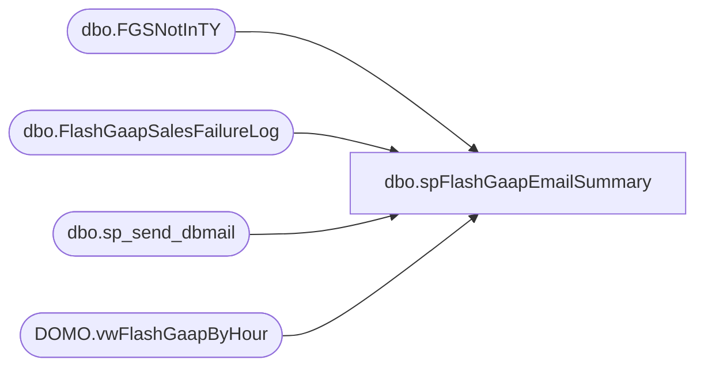

# dbo.spFlashGaapEmailSummary

**Database:** DWStaging  
**Server:** papamart  

## Architecture Diagram



## Table Dependencies

| Referenced Table |
|---|
| dbo.FGSNotInTY |
| dbo.FlashGaapSalesFailureLog |
| dbo.sp_send_dbmail |
| DOMO.vwFlashGaapByHour |

## Stored Procedure Code

```sql
CREATE proc [dbo].[spFlashGaapEmailSummary]
@PackageStart datetime

as

-- =====================================================================================================
-- Name: spFlashGaapEmailSummary
--
--Description: Called from SSIS, captures sales summary, send email
--				
-- Revision History
--		Name:			Date:			Comments:
--		Dan Tweedie		12/14/2016		Created proc
-- =====================================================================================================

set nocount on


if (select datepart(hh, @PackageStart)) in (7, 9, 11, 13, 15, 17, 19, 21, 23)
	and
   (select datepart(mi, @PackageStart)) >= 45

BEGIN 

			IF (Object_ID('tempdb..#Sales') IS NOT NULL) DROP TABLE #Sales
			select 
				StoreKey,
				StoreName,
				sum(TransactionCountThisHour) TransactionCount,
				sum(CompTransactionCountThisHour) CompTransactionCount,
				sum(FlashGaapSalesThisHourUSD) FlashGaapSalesUSD,
				sum(FlashGaapSalesThisHourLocal) FlashGaapSalesLocal,
				sum(CompFlashGaapSalesThisHourUSD) CompFlashGaapSalesUSD,
				sum(CompFlashGaapSalesThisHourLocal) CompFlashGaapSalesLocal,
				sum(distinct LYSalesDayTotalUSD) LYGaapSalesDayTotalUSD,
				sum(distinct LYSalesDayTotalLocal) LYGaapSalesDayTotalLocal,
				sum(distinct CompLYSalesDayTotalUSD) CompLYGaapSalesDayTotalUSD,
				sum(distinct CompLYSalesDayTotalLocal) CompLYGaapSalesDayTotalLocal,
				max(SalesPercentToTotalLY) FlashPercentToLYTotal,
				max(CompSalesPercentToTotalLY) CompFlashPercentToLYTotal,

				sum(LYSalesThisHourLocal) LYSalesThisHourLocal,
				sum(LYSalesThisHourUSD) LYSalesThisHourUSD,
				sum(CompLYSalesThisHourLocal) CompLYSalesThisHourLocal,
				sum(CompLYSalesThisHourUSD) CompLYSalesThisHourUSD,

				max(SalesPercentToHourLY) FlashPercentToLYHour,
				max(CompSalesPercentToHourLY) CompFlashPercentToLYHour,
				DaySalesPlan,
				Jurisdiction,
				TradingGroup,
				cast(Case Jurisdiction
					when 'US' then 1
					when 'United Kingdom' then 2
					when 'Canada' then 3
					when 'China' then 4
					when 'Denmark' then 5
					when 'Ireland' then 6
					else 7
				end as int) as SortOrder
			into #Sales
			from DW.DOMO.vwFlashGaapByHour fgs
			where BusinessDate = cast(getdate() as date)--cast(@PackageStart as date)--cast(getdate() as date)
			group by StoreKey, StoreName, Jurisdiction, TradingGroup, DaySalesPlan

			
			if (select count(*) from dwstaging.dbo.FGSNotInTY) > 0 
			begin
				insert #sales                                        
				select 
					StoreKey,
					StoreName,
					0 TransactionCount,
					0 CompTransactionCount,
					0 FlashGaapSalesUSD,
					0 FlashGaapSalesLocal,
					0 CompFlashGaapSalesUSD,
					0 CompFlashGaapSalesLocal,
					sum(isnull(LYSalesDayTotalUSD,0)) LYGaapSalesDayTotalUSD,
					sum(isnull(LYSalesDayTotalLocal,0)) LYGaapSalesDayTotalLocal,
					sum(isnull(CompLYSalesDayTotalUSD,0)) CompLYGaapSalesDayTotalUSD,
					sum(isnull(CompLYSalesDayTotalLocal,0)) CompLYGaapSalesDayTotalLocal,
					0 FlashPercentToLYTotal,
					0 CompFlashPercentToLYTotal,

					0 LYSalesThisHourLocal,
					0 LYSalesThisHourUSD,
					0 CompLYSalesThisHourLocal,
					0 CompLYSalesThisHourUSD,

					0 FlashPercentToLYHour,
					0 CompFlashPercentToLYHour,
					DaySalesPlan,
					Jurisdiction,
					TradingGroup,
					cast(Case Jurisdiction
						when 'US' then 1
						when 'United Kingdom' then 2
						when 'Canada' then 3
						when 'China' then 4
						when 'Denmark' then 5
						when 'Ireland' then 6
						else 7
					end as int) as SortOrder
				from 
					dwstaging.dbo.FGSNotInTY
				where BusinessDate = cast(getdate() as date)--cast(@PackageStart as date)
				group by 
					StoreKey,
					StoreName,
					BusinessDate,
					TradingGroup,                                      
					Jurisdiction,
					DaySalesPlan     
			end

---------------------------------------------------------------------------------------------------------------------------------
			if (select count(*) from #Sales) > 0

			BEGIN
			

					declare 
						@TotalSummaryTable nvarchar(max),
						@TradingGroupSummaryIncWeb nvarchar(max),
						@TradingGroupSummary nvarchar(max),
						@SummaryTable nvarchar(max),
						@DetailTable nvarchar(max),
						@FailureTable nvarchar(max),
						@EmailBody nvarchar(max),
						@Footer nvarchar(max),
						@emailsubject varchar(100),
						@BodyText nvarchar(max)

					select @BodyText = '<font face = arial size = 2>The Flash Gaap Sales data is current up to the hour <br> 								
										<br>
										<br>'


					select @TotalSummaryTable = 
					'<font face = arial size = 4> <B>Flash Gaap Sales Summary (USD)</font>' + 
									'<BR>' +
									'<table border="1">' +
									'<font face =arial size = 2>' +
									'<tr>
										<th> Flash <br>Gaap Sales </th>
										<th> Comp <br>Flash <br>	Gaap Sales </th>
										<th> Comp <br>LY <br> Day Total </th>
										<th> Comp <br>Percent <br> to LY <br> Day Total </th>
										<th> Comp <br>Percent <br> to LY <br> By This Hour </th>'+
										CAST ( ( SELECT 
														td = sum(FlashGaapSalesUSD), '',
														td = sum(CompFlashGaapSalesUSD), '',
														td = sum(CompLYGaapSalesDayTotalUSD), '',														
														td = cast(cast(100 * isnull((sum(nullif(CompFlashGaapSalesUSD,0)) / sum(nullif(CompLYGaapSalesDayTotalUSD,0)) -1),0) as numeric(10,2)) as varchar) + ' %', '',
														td = cast(cast(100 * isnull((sum(nullif(CompFlashGaapSalesUSD,0)) / sum(nullif(CompLYSalesThisHourUSD,0)) -1),0) as numeric(10,2)) as varchar) + ' %', ''
													from #Sales
													FOR XML PATH('tr'), TYPE 
										) AS NVARCHAR(MAX) ) +
										'</font></table></font></p></p>
										<br>'
					
					select @TradingGroupSummaryIncWeb = 
									'<font face = arial size = 4> <B>Flash Gaap Sales Summary By Trading Group (USD) (includes web)</font>' + 
									'<BR>' +
									'<table border="1">' +
									'<font face =arial size = 2>' +
									'<tr>
										<th> Trading <br>Group </th>
										<th> Flash <br>	Gaap Sales </th>
										<th> Comp <br>Flash <br>	Gaap Sales </th>
										<th> Comp <br>LY <br> Day Total </th>
										<th> Comp <br>Percent <br> to LY <br> Day Total </th>
										<th> Comp <br>Percent <br> to LY <br> By This Hour </th>'+
										CAST ( ( SELECT td = TradingGroup, '',
														td = sum(FlashGaapSalesUSD), '',
														td = sum(CompFlashGaapSalesUSD), '',
														td = sum(CompLYGaapSalesDayTotalUSD), '',
														td = cast(cast(100 * isnull((sum(nullif(CompFlashGaapSalesUSD,0)) / sum(nullif(CompLYGaapSalesDayTotalUSD,0)) -1),0) as numeric(10,2)) as varchar) + ' %', '',
														td = cast(cast(100 * isnull((sum(nullif(CompFlashGaapSalesUSD,0)) / sum(nullif(CompLYSalesThisHourUSD,0)) -1),0) as numeric(10,2)) as varchar) + ' %', ''
													from #Sales
													group by TradingGroup
													order by TradingGroup desc
													FOR XML PATH('tr'), TYPE 
										) AS NVARCHAR(MAX) ) +
										'</font></table></font></p></p>
										<br>'

					select @TradingGroupSummary = 
									'<font face = arial size = 4> <B>Flash Gaap Sales Summary By Trading Group (USD) (excludes web)</font>' + 
									'<BR>' +
									'<table border="1">' +
									'<font face =arial size = 2>' +
									'<tr>
										<th> Trading <br>Group </th>
										<th> Flash <br>	Gaap Sales </th>
										<th> Comp <br>Flash <br>	Gaap Sales </th>
										<th> Comp <br>LY <br> Day Total </th>
										<th> Comp <br>Percent <br> to LY <br> Day Total </th>
										<th> Comp <br>Percent <br> to LY <br> By This Hour </th>'+
										CAST ( ( SELECT td = TradingGroup, '',
														td = sum(FlashGaapSalesUSD), '',
														td = sum(CompFlashGaapSalesUSD), '',
														td = sum(CompLYGaapSalesDayTotalUSD), '',
														td = cast(cast(100 * isnull((sum(nullif(CompFlashGaapSalesUSD,0)) / sum(nullif(CompLYGaapSalesDayTotalUSD,0)) -1),0) as numeric(10,2)) as varchar) + ' %', '',
														td = cast(cast(100 * isnull((sum(nullif(CompFlashGaapSalesUSD,0)) / sum(nullif(CompLYSalesThisHourUSD,0)) -1),0) as numeric(10,2)) as varchar) + ' %', ''
													from #Sales
													where StoreKey not in ('0013','2013')
													group by TradingGroup
													order by TradingGroup desc
													FOR XML PATH('tr'), TYPE 
										) AS NVARCHAR(MAX) ) +
										'</font></table></font></p></p>
										<br>'

					select @SummaryTable = 
									'<font face = arial size = 4> <B>Flash Gaap Sales Summary By Jurisdiction (Native) </font>' + 
									'<BR>' +
									'<table border="1">' +
									'<font face =arial size = 2>' +
									'<tr>
										<th> Jurisdiction </th>
										<th> Flash <br>	Gaap Sales </th>
										<th> Comp <br>Flash <br>	Gaap Sales </th>
										<th> Comp <br>LY <br> Day Total </th>
										<th> Comp <br>Percent <br> to LY <br> Day Total </th>
										<th> Comp <br>Percent <br> to LY <br> By This Hour </th>
										<th> Sales <br>Plan </th>
										<th> Sales vs. Plan <br>(regardless of comp) </th>'+
										CAST ( ( SELECT td = Jurisdiction, '',
														td = sum(FlashGaapSalesLocal), '',
														td = sum(CompFlashGaapSalesLocal), '',
														td = sum(CompLYGaapSalesDayTotalLocal), '',
														td = cast(cast(100 * isnull((sum(nullif(CompFlashGaapSalesLocal,0)) / sum(nullif(CompLYGaapSalesDayTotalLocal,0)) -1),0) as numeric(10,2)) as varchar) + ' %', '',
														td = cast(cast(100 * isnull((sum(nullif(CompFlashGaapSalesLocal,0)) / sum(nullif(CompLYSalesThisHourLocal,0)) -1),0) as numeric(10,2)) as varchar) + ' %', '',
														td = cast(sum(DaySalesPlan) as decimal(38,2)), '',
														td = cast(cast(100 * isnull((sum(nullif(FlashGaapSalesLocal,0)) / sum(nullif(DaySalesPlan,0)) -1),0) as numeric(10,2)) as varchar) + ' %', ''
													from #Sales
													where StoreKey not in ('0013','2013')
													group by Jurisdiction, SortOrder
													order by SortOrder, Jurisdiction
													FOR XML PATH('tr'), TYPE 
										) AS NVARCHAR(MAX) ) +
										'</font></table></font></p></p>
										<br>'

					select @DetailTable = 
									'<font face = arial size = 4> <B>Flash Gaap Sales Summary By Store (Native) </font>' + 
									'<BR>' +
									'<table border="1">' +
									'<font face =arial size = 2>' +
									'<tr>
										<th> Store </th>
										<th> Store Name </th>
										<th> Flash <br> Gaap Sales </th>
										<th> Comp <br>Flash <br> Gaap Sales </th>
										<th> Comp <br>LY <br> Day Total </th>
										<th> Comp <br>Percent <br> to LY <br> Day Total </th>
										<th> Comp <br>Percent <br> to LY <br> By This Hour </th>'+
										CAST ( ( SELECT td = StoreKey, '',
														td = StoreName, '',
														td = FlashGaapSalesLocal, '',
														td = CompFlashGaapSalesLocal, '',
														td = CompLYGaapSalesDayTotalLocal, '',
														td = cast(cast(100 * isnull((nullif(CompFlashGaapSalesLocal,0) / nullif(CompLYGaapSalesDayTotalLocal,0))-1, 0) as numeric(10,2)) as varchar) + ' %', '',
														td = cast(cast(100 * isnull((nullif(CompFlashGaapSalesLocal,0) / nullif(CompLYSalesThisHourLocal,0))-1, 0) as numeric(10,2)) as varchar) + ' %', ''
													from #Sales
													order by StoreKey
													FOR XML PATH('tr'), TYPE 
										) AS NVARCHAR(MAX) ) +
										'</font></table></font></p></p>
										<br>
										<br>
										<br>'

					select @FailureTable = 
									'<font face = arial size = 4> <B>Error Log</font>' + 
									'<BR>' +
									'These stores are noted as Open in StoreMDM, but were unable to query sales.' +
									'<BR>' +
									'<table border="1">' +
									'<font face =arial size = 2> ' +
									'<tr>
										<th> Store </th>
										<th> Store IP </th>
										<th> Error Log </th>' +
										CAST ( ( SELECT td = StoreID, '',
														td = StoreIP, '',
														td = FailureReason, ''
													from dwstaging.dbo.FlashGaapSalesFailureLog
													order by StoreID
													FOR XML PATH('tr'), TYPE 
										) AS NVARCHAR(MAX) ) +
										'</font></table></font></p></p>
										<br>
										<br>
										<br>'

					select @Footer = 'This report was generated by Papamart.DWStaging.dbo.spFlashGaapSalesEmailSummary. <br>
									  The information in this message may be privileged, “confidential” and protected from disclosure and/or intended only for the addressee(s) named above. If the reader of this message is not the intended recipient, or an employee or agent responsible for delivering this message to the intended recipient, you are hereby notified that any dissemination, distribution or copying of the communication is strictly prohibited. If you have received this communication in error, please notify us immediately by replying to the message and deleting it from your computer. Thank you beary much.'


					select @EmailBody = 
						@BodyText + @TotalSummaryTable + @TradingGroupSummaryIncWeb + @TradingGroupSummary + @SummaryTable + @DetailTable + @footer

					If (select count(*) from dwstaging.dbo.FlashGaapSalesFailureLog) > 0 
						begin
							select @EmailBody = 
							@BodyText + @TotalSummaryTable + @TradingGroupSummaryIncWeb + @TradingGroupSummary + @SummaryTable + @DetailTable + @FailureTable + @footer
						end


					select @emailsubject = 
						'Flash GAAP Sales Report as of ' + convert(varchar(20),getdate(),100) + ' (NEW TEST WITH LY COMP UP TO THE HOUR)'

					exec msdb.dbo.sp_send_dbmail
					@profile_name = 'BIAdmin',
					@recipients = 'santiagob@buildabear.com',
					@copy_recipients = 'biadmin@buildabear.com',
					@body = @EmailBody,
					@subject= @emailsubject,
					@body_format = 'HTML'

			END


END
```

