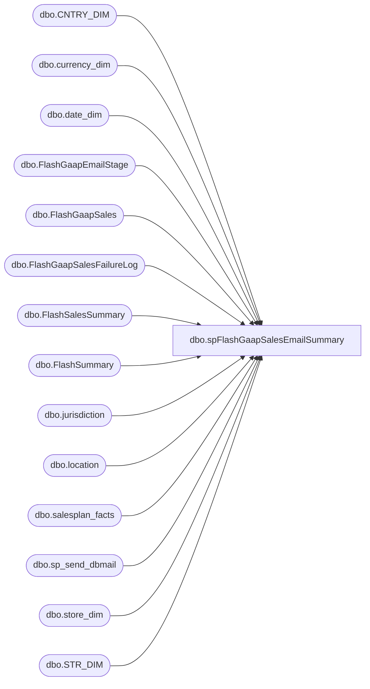

# dbo.spFlashGaapSalesEmailSummary

**Database:** DWStaging  
**Server:** papamart  

## Architecture Diagram



## Table Dependencies

| Referenced Table |
|---|
| dbo.CNTRY_DIM |
| dbo.currency_dim |
| dbo.date_dim |
| dbo.FlashGaapEmailStage |
| dbo.FlashGaapSales |
| dbo.FlashGaapSalesFailureLog |
| dbo.FlashSalesSummary |
| dbo.FlashSummary |
| dbo.jurisdiction |
| dbo.location |
| dbo.salesplan_facts |
| dbo.sp_send_dbmail |
| dbo.store_dim |
| dbo.STR_DIM |

## Stored Procedure Code

```sql
CREATE proc [dbo].[spFlashGaapSalesEmailSummary]
@PackageStart datetime
as

-- =====================================================================================================
-- Name: spFlashGaapSalesEmailSummary
--
--Description: Called from SSIS, captures sales summary, send email
--				
-- Revision History
--		Name:			Date:			Comments:
--		Dan Tweedie		10/13/2016		Created proc
--		Dan Tweedie		12/15/2016		Added TY vs LY by hour
--		Dan Tweedie		01/05/2017		Added + to Comp Percent to LY By This Hour for the Sales Read email
--		Dan Tweedie		01/10/2017		Rounded comp percentages, altered first stage query, after having changed the ETL which feeds the table
--		Dan Tweedie		03/08/2017		Added Merge of data from dwstaging.dbo.FlashSummary to DW.dbo.FlashSalesSummary, for the purpose of joining to Flash Traffic data
--		Dan Tweedie		2017-01-03		Temporarily exclude StoreKey (2075,2076) due to having multiple SalesPlans, which is screwing up the merge. It's expecting one row per Store,Date,Hour and now there are 2 for these stores.
--		Dan Tweedie		2021-03-05		Update email to Executive Summary team so it is now Sales v Plan Summry
-- =====================================================================================================

set nocount on


BEGIN 
		IF (Object_ID('tempdb..#SalesPlan') IS NOT NULL) DROP TABLE #SalesPlan
		select 
			sd.store_id PlanStoreID,
			cast(dd.actual_date as date) PlanDate,
			cd.currency_code,
			cast(replace(j.jurisdiction_description, 'Home', 'US') as varchar(20)) as jurisdiction,
			CASE 
				WHEN cmd.NM_ABBRV IN ('US','CA') THEN 'North America'
				WHEN cmd.NM_ABBRV IN ('UK','DK','IE','CN') THEN 'Europe'
			END AS TradingGroup,
			sp.amount as SalesPlan
		into #SalesPlan
		from DW.dbo.salesplan_facts sp
		join DW.dbo.store_dim sd on sp.store_key=sd.store_key
		join DW.dbo.date_dim dd on sp.date_key=dd.date_key
		join DW.dbo.currency_dim cd on sp.currency_key=cd.currency_key
		join bedrockdb02.me_01.dbo.location l with (nolock) on sd.store_id=cast(l.location_code as int)
		join bedrockdb02.me_01.dbo.jurisdiction j with (nolock) on l.jurisdiction_id = j.jurisdiction_id
		join kodiak.BABWMstrData.dbo.STR_DIM smd with (nolock) on sd.store_id=smd.str_num
		join kodiak.BABWMstrData.dbo.CNTRY_DIM cmd ON smd.CNTRY_ID = cmd.CNTRY_ID
		where cast(dd.actual_date as date) between getdate()-2 and getdate()+1
		and sp.amount<>0
		

					
		IF (Object_ID('dwstaging..FlashGaapEmailStage') IS NOT NULL) DROP TABLE dwstaging.dbo.FlashGaapEmailStage
			select 
				BusinessDate,
				StoreKey,
				StoreName,
				case when 
					cast(BusinessDate as date) = cast(CurrentStoreTime as date)
					then TYGaapByHourRunningTotalUSD 
					else TYDayTotalSalesUSD 
				end as FlashGaapSalesUSD,
				case when 
					cast(BusinessDate as date) = cast(CurrentStoreTime as date)
					then TYGaapByHourRunningTotalNative 
					else TYDayTotalSalesNative 
				end as FlashGaapSalesLocal,
				case when CompStatus = 1 
					then 
						case when 
							cast(BusinessDate as date) = cast(CurrentStoreTime as date)
							then TYGaapByHourRunningTotalUSD 
						else TYDayTotalSalesUSD 
					end 
					else 0 
				end as CompFlashGaapSalesUSD,
				case when CompStatus = 1
					then 
						case when 
							cast(BusinessDate as date) = cast(CurrentStoreTime as date)
							then TYGaapByHourRunningTotalNative 
							else TYDayTotalSalesNative 
						end  
					else 0 
				end as CompFlashGaapSalesLocal,
				LYDayTotalSalesUSD LYGaapSalesDayTotalUSD,
				LYDayTotalSalesNative LYGaapSalesDayTotalLocal,
				case when CompStatus = 1 
					then LYDayTotalSalesUSD
					else 0
				end as CompLYGaapSalesDayTotalUSD,
				case when CompStatus = 1
					then LYDayTotalSalesNative
					else 0
				end as CompLYGaapSalesDayTotalLocal,
				case when 
					cast(BusinessDate as date) = cast(CurrentStoreTime as date)
					then LYGaapByHourRunningTotalNative 
					else LYDayTotalSalesNative
				end as LYSalesThisHourLocal,
				case when 
					cast(BusinessDate as date) = cast(CurrentStoreTime as date)
					then LYGaapByHourRunningTotalUSD 
					else LYDayTotalSalesUSD
				end as LYSalesThisHourUSD,
				case when CompStatus = 1
					then 
						case when 
							cast(BusinessDate as date) = cast(CurrentStoreTime as date)
							then LYGaapByHourRunningTotalNative 
							else LYDayTotalSalesNative
						end
					else 0
				end as CompLYSalesThisHourLocal,
				case when CompStatus = 1
					then 
						case when 
							cast(BusinessDate as date) = cast(CurrentStoreTime as date)
							then LYGaapByHourRunningTotalUSD 
							else LYDayTotalSalesUSD
						end
					else 0
				end as CompLYSalesThisHourUSD,
				DaySalesPlan,
				Jurisdiction,
				TradingGroup,
				cast(Case Jurisdiction
					when 'US' then 1
					when 'Canada' then 2
					when 'United Kingdom' then 3
					when 'Ireland' then 4
					when 'Denmark' then 5
					when 'China' then 6
					else 7
				end as int) as SortOrder
			into dwstaging.dbo.FlashGaapEmailStage
			from dwstaging.dbo.FlashSummary fgs
			Where CurrentHour = 1
			and StoreKey not in (2075,2076)
			order by cast(Case Jurisdiction
					when 'US' then 1
					when 'Canada' then 2
					when 'United Kingdom' then 3
					when 'Ireland' then 4
					when 'Denmark' then 5
					when 'China' then 6
					else 7
				end as int)
			
			
			
---------------------------------------------------------------------------------------------------------------------------------
if (select datepart(hh, @PackageStart)) in (7, 9, 11, 13, 15, 17, 19, 21, 23)
	and (select datepart(mi, @PackageStart)) >= 45 
  OR
  (select datepart(hh, @PackageStart)) in (8, 10, 12, 14, 16, 18, 20, 22, 0)
	and (select datepart(mi, @PackageStart)) <= 15 

			BEGIN
			

					declare 
						@TotalSummaryTable nvarchar(max),
						@TradingGroupSummaryIncWeb nvarchar(max),
						@TradingGroupSummary nvarchar(max),
						@SummaryTable nvarchar(max),
						@DetailTable nvarchar(max),
						@FailureTable nvarchar(max),
						@EmailBody nvarchar(max),
						@Footer nvarchar(max),
						@emailsubject varchar(100),
						@BodyText nvarchar(max)

					select @BodyText = '<font face = arial size = 2>The Flash Gaap Sales data is current up to the hour.<br>
										<br>'


					select @TotalSummaryTable = 
					'<font face = arial size = 4> <B>Flash Gaap Sales Summary (USD)</font>' + 
									'<BR>' +
									'<table border="1">' +
									'<font face =arial size = 2>' +
									'<tr>
										<th> Flash <br>Gaap Sales </th>
										<th> Comp <br>Flash <br>	Gaap Sales </th>
										<th> Comp <br>LY <br>By this Hour</th>
										<th> Comp <br>LY <br> Day Total </th>
										<th> Comp <br>Percent <br> to LY <br> Day Total </th>
										<th> Comp <br>Percent <br> to LY <br> By This Hour </th>'+
										CAST ( ( SELECT 
														td = sum(FlashGaapSalesUSD), '',
														td = sum(CompFlashGaapSalesUSD), '',
														td = sum(CompLYSalesThisHourUSD), '',
														td = sum(CompLYGaapSalesDayTotalUSD), '',														
														td = cast(cast(round(cast(100 * isnull((sum(nullif(CompFlashGaapSalesUSD,0)) / sum(nullif(CompLYGaapSalesDayTotalUSD,0)) -1),0) as numeric(10,2)), 0) as int) as varchar) + ' %', '',
														td = cast(cast(round(cast(100 * isnull((sum(nullif(CompFlashGaapSalesUSD,0)) / sum(nullif(CompLYSalesThisHourUSD,0)) -1),0) as numeric(10,2)), 0) as int) as varchar) + ' %', ''
													from dwstaging.dbo.FlashGaapEmailStage
													where BusinessDate = cast(@PackageStart as date)
													FOR XML PATH('tr'), TYPE 
										) AS NVARCHAR(MAX) ) +
										'</font></table></font></p></p>
										<br>'
					
					select @TradingGroupSummaryIncWeb = 
									'<font face = arial size = 4> <B>Flash Gaap Sales Summary By Trading Group (USD) (includes web)</font>' + 
									'<BR>' +
									'<table border="1">' +
									'<font face =arial size = 2>' +
									'<tr>
										<th> Trading <br>Group </th>
										<th> Flash <br>	Gaap Sales </th>
										<th> Comp <br>Flash <br>	Gaap Sales </th>
										<th> Comp <br>LY <br>By this Hour</th>
										<th> Comp <br>LY <br> Day Total </th>
										<th> Comp <br>Percent <br> to LY <br> Day Total </th>
										<th> Comp <br>Percent <br> to LY <br> By This Hour </th>'+
										CAST ( ( SELECT td = TradingGroup, '',
														td = sum(FlashGaapSalesUSD), '',
														td = sum(CompFlashGaapSalesUSD), '',
														td = sum(CompLYSalesThisHourUSD), '',
														td = sum(CompLYGaapSalesDayTotalUSD), '',
														td = cast(cast(round(cast(100 * isnull((sum(nullif(CompFlashGaapSalesUSD,0)) / sum(nullif(CompLYGaapSalesDayTotalUSD,0)) -1),0) as numeric(10,2)), 0) as int) as varchar) + ' %', '',
														td = cast(cast(round(cast(100 * isnull((sum(nullif(CompFlashGaapSalesUSD,0)) / sum(nullif(CompLYSalesThisHourUSD,0)) -1),0) as numeric(10,2)),0) as int) as varchar) + ' %', ''
													from dwstaging.dbo.FlashGaapEmailStage
													where BusinessDate = cast(@PackageStart as date)
													group by TradingGroup
													order by TradingGroup desc
													FOR XML PATH('tr'), TYPE 
										) AS NVARCHAR(MAX) ) +
										'</font></table></font></p></p>
										<br>'

					select @TradingGroupSummary = 
									'<font face = arial size = 4> <B>Flash Gaap Sales Summary By Trading Group (USD) (excludes web)</font>' + 
									'<BR>' +
									'<table border="1">' +
									'<font face =arial size = 2>' +
									'<tr>
										<th> Trading <br>Group </th>
										<th> Flash <br>	Gaap Sales </th>
										<th> Comp <br>Flash <br>	Gaap Sales </th>
										<th> Comp <br>LY <br>By this Hour</th>
										<th> Comp <br>LY <br> Day Total </th>
										<th> Comp <br>Percent <br> to LY <br> Day Total </th>
										<th> Comp <br>Percent <br> to LY <br> By This Hour </th>'+
										CAST ( ( SELECT td = TradingGroup, '',
														td = sum(FlashGaapSalesUSD), '',
														td = sum(CompFlashGaapSalesUSD), '',
														td = sum(CompLYSalesThisHourUSD), '',
														td = sum(CompLYGaapSalesDayTotalUSD), '',
														td = cast(cast(round(cast(100 * isnull((sum(nullif(CompFlashGaapSalesUSD,0)) / sum(nullif(CompLYGaapSalesDayTotalUSD,0)) -1),0) as numeric(10,2)),0) as int) as varchar) + ' %', '',
														td = cast(cast(round(cast(100 * isnull((sum(nullif(CompFlashGaapSalesUSD,0)) / sum(nullif(CompLYSalesThisHourUSD,0)) -1),0) as numeric(10,2)),0) as int) as varchar) + ' %', ''
													from dwstaging.dbo.FlashGaapEmailStage
													where StoreKey not in ('0013','2013')
													and BusinessDate = cast(@PackageStart as date)
													group by TradingGroup
													order by TradingGroup desc
													FOR XML PATH('tr'), TYPE 
										) AS NVARCHAR(MAX) ) +
										'</font></table></font></p></p>
										<br>'

					select @SummaryTable = 
									'<font face = arial size = 4> <B>Flash Gaap Sales Summary By Jurisdiction (Native) </font>' + 
									'<BR>' +
									'<table border="1">' +
									'<font face =arial size = 2>' +
									'<tr>
										<th> Jurisdiction </th>
										<th> Flash <br>	Gaap Sales </th>
										<th> Comp <br>Flash <br>	Gaap Sales </th>
										<th> Comp <br>LY <br>By this Hour</th>
										<th> Comp <br>LY <br> Day Total </th>
										<th> Comp <br>Percent <br> to LY <br> Day Total </th>
										<th> Comp <br>Percent <br> to LY <br> By This Hour </th>
										<th> Sales <br>Plan </th>
										<th> Sales vs. Plan <br>(regardless of comp) </th>'+
										CAST ( ( SELECT td = Jurisdiction, '',
														td = sum(FlashGaapSalesLocal), '',
														td = sum(CompFlashGaapSalesLocal), '',
														td = sum(CompLYSalesThisHourLocal), '',
														td = sum(CompLYGaapSalesDayTotalLocal), '',
														td = cast(cast(round(cast(100 * isnull((sum(nullif(CompFlashGaapSalesLocal,0)) / sum(nullif(CompLYGaapSalesDayTotalLocal,0)) -1),0) as numeric(10,2)),0) as int) as varchar) + ' %', '',
														td = cast(cast(round(cast(100 * isnull((sum(nullif(CompFlashGaapSalesLocal,0)) / sum(nullif(CompLYSalesThisHourLocal,0)) -1),0) as numeric(10,2)),0) as int) as varchar) + ' %', '',
														td = cast(sum(DaySalesPlan) as decimal(38,2)), '',
														td = cast(cast(round(cast(100 * isnull((sum(nullif(FlashGaapSalesLocal,0)) / sum(nullif(DaySalesPlan,0)) -1),0) as numeric(10,2)),0) as int) as varchar) + ' %', ''
													from dwstaging.dbo.FlashGaapEmailStage
													--where StoreKey not in ('0013','2013')
													where BusinessDate = cast(@PackageStart as date)
													group by Jurisdiction, SortOrder
													order by SortOrder, Jurisdiction
													FOR XML PATH('tr'), TYPE 
										) AS NVARCHAR(MAX) ) +
										'</font></table></font></p></p>
										<br>'

					select @DetailTable = 
									'<font face = arial size = 4> <B>Flash Gaap Sales Summary By Store (Native) </font>' + 
									'<BR>' +
									'<table border="1">' +
									'<font face =arial size = 2>' +
									'<tr>
										<th> Store </th>
										<th> Store Name </th>
										<th> Flash <br> Gaap Sales </th>
										<th> Comp <br>Flash <br> Gaap Sales </th>
										<th> Comp <br>LY <br>By this Hour</th>
										<th> Comp <br>LY <br> Day Total </th>
										<th> Comp <br>Percent <br> to LY <br> Day Total </th>
										<th> Comp <br>Percent <br> to LY <br> By This Hour </th>'+
										CAST ( ( SELECT td = StoreKey, '',
														td = StoreName, '',
														td = FlashGaapSalesLocal, '',
														td = CompFlashGaapSalesLocal, '',
														td = CompLYSalesThisHourLocal, '',
														td = CompLYGaapSalesDayTotalLocal, '',
														td = cast(cast(round(cast(100 * isnull((nullif(CompFlashGaapSalesLocal,0) / nullif(CompLYGaapSalesDayTotalLocal,0))-1, 0) as numeric(10,2)),0) as int) as varchar) + ' %', '',
														td = cast(cast(round(cast(100 * isnull((nullif(CompFlashGaapSalesLocal,0) / nullif(CompLYSalesThisHourLocal,0))-1, 0) as numeric(10,2)),0) as int) as varchar) + ' %', ''
													from dwstaging.dbo.FlashGaapEmailStage
													where BusinessDate = cast(@PackageStart as date)
													order by StoreKey
													FOR XML PATH('tr'), TYPE 
										) AS NVARCHAR(MAX) ) +
										'</font></table></font></p></p>
										<br>
										<br>
										<br>'

					select @FailureTable = 
									'<font face = arial size = 4> <B>Error Log</font>' + 
									'<BR>' +
									'These stores are noted as Open in StoreMDM, but were unable to query sales.' +
									'<BR>' +
									'<table border="1">' +
									'<font face =arial size = 2> ' +
									'<tr>
										<th> Store </th>
										<th> Store IP </th>
										<th> Error Log </th>' +
										CAST ( ( SELECT td = StoreID, '',
														td = StoreIP, '',
														td = FailureReason, ''
													from dwstaging.dbo.FlashGaapSalesFailureLog
													order by StoreID
													FOR XML PATH('tr'), TYPE 
										) AS NVARCHAR(MAX) ) +
										'</font></table></font></p></p>
										<br>
										<br>
										<br>'

					select @Footer = 'This report was generated by Papamart.DWStaging.dbo.spFlashGaapSalesEmailSummary. <br>
									  The information in this message may be privileged, “confidential” and protected from disclosure and/or intended only for the addressee(s) named above. If the reader of this message is not the intended recipient, or an employee or agent responsible for delivering this message to the intended recipient, you are hereby notified that any dissemination, distribution or copying of the communication is strictly prohibited. If you have received this communication in error, please notify us immediately by replying to the message and deleting it from your computer. Thank you beary much.'


					select @EmailBody = 
						@BodyText + @TotalSummaryTable + @TradingGroupSummaryIncWeb + @TradingGroupSummary + @SummaryTable + @DetailTable + @footer

					If (select count(*) from dwstaging.dbo.FlashGaapSalesFailureLog) > 0 
						begin
							select @EmailBody = 
							@BodyText + @TotalSummaryTable + @TradingGroupSummaryIncWeb + @TradingGroupSummary + @SummaryTable + @DetailTable + @FailureTable + @footer
						end


					select @emailsubject = 
						'Flash GAAP Sales Report as of ' + convert(varchar(20),@PackageStart,100) + ' -- TY vs LY Up to the Hour --'

					exec msdb.dbo.sp_send_dbmail
					@profile_name = 'BIAdmin',
					@recipients = 'FinancialAnalyst@buildabear.com',
					@copy_recipients = 'biadmin@buildabear.com',
					@body = @EmailBody,
					@subject= @emailsubject,
					@body_format = 'HTML'


					--Extra email w/summary only (for chiefs)

					--ONLY SEND EMAIL AT 3:45PM, 5:45, 7:45, 9:45
					if (select datepart(hh, @PackageStart)) in (17,19,21)
						and	(select datepart(mi, @PackageStart)) >= 45
						 OR
					  (select datepart(hh, @PackageStart)) in (18,20,22)
						and (select datepart(mi, @PackageStart)) <= 15 
					BEGIN
					
							declare 
								@TradingGroupSummary2 nvarchar(max),
								@JurisdictionSummary2 nvarchar(max),
								@TradingGroupSalesVPlan2 nvarchar(max),
								@JurisdictionSalesVPlan2 nvarchar(max),
								@BodySummary2 nvarchar(max),
								@SubjectSummary2 nvarchar(max),
								@CaptureDate varchar(52)

							select distinct @CaptureDate = convert(varchar, ins_dt, 100) from dw.dbo.FlashGaapSales
						
							select @TradingGroupSummary2 = 
							'<font face = arial size = 4> <B>Comp Sales Summary by Trading Group (Excludes Web)  </font>' + 
											'<BR>' +
											'<table border="1">' +
											'<font face =arial size = 2>' +
											'<tr>
												<th> Trading <br>Group </th>
												<th> Data <br>Capture <br>	Datetime </th>
												<th> Comp <br>Percent <br> to LY <br> By This Hour </th>'+
												CAST ( ( SELECT 
																td = TradingGroup, '',
																td = @CaptureDate, '',
																td = case when 
																			cast(cast(100 * isnull((sum(nullif(CompFlashGaapSalesUSD,0)) / sum(nullif(CompLYSalesThisHourUSD,0)) -1),0) as numeric(10,2)) as varchar) not like '-%' 
																				and cast(cast(100 * isnull((sum(nullif(CompFlashGaapSalesUSD,0)) / sum(nullif(CompLYSalesThisHourUSD,0)) -1),0) as numeric(10,2)) as varchar) <> '0.00'
																			then '+' + cast(cast(round(cast(100 * isnull((sum(nullif(CompFlashGaapSalesUSD,0)) / sum(nullif(CompLYSalesThisHourUSD,0)) -1),0) as numeric(10,2)),0) as int) as varchar) + ' %'
																			else cast(cast(round(cast(100 * isnull((sum(nullif(CompFlashGaapSalesUSD,0)) / sum(nullif(CompLYSalesThisHourUSD,0)) -1),0) as numeric(10,2)),0) as int) as varchar) + ' %'
																	end, ''
															from dwstaging.dbo.FlashGaapEmailStage 
															where BusinessDate = cast(@PackageStart as date)
															and StoreKey not in ('0013','2013')
															group by TradingGroup
															FOR XML PATH('tr'), TYPE 
												) AS NVARCHAR(MAX) ) +
												'</font></table></font></p></p>
												<br>'

							select @JurisdictionSummary2 = 
							'<font face = arial size = 4> <B>Comp Sales Summary By Country (Excludes Web)  </font>' + 
											'<BR>' +
											'<table border="1">' +
											'<font face =arial size = 2>' +
											'<tr>
												<th> Country </th>
												<th> Data <br>Capture <br>	Datetime </th>
												<th> Comp <br>Percent <br> to LY <br> By This Hour </th>'+
												CAST ( ( SELECT 
																td = Jurisdiction, '',
																td = @CaptureDate, '',
																td = case when 
																			cast(cast(100 * isnull((sum(nullif(CompFlashGaapSalesLocal,0)) / sum(nullif(CompLYSalesThisHourLocal,0)) -1),0) as numeric(10,2)) as varchar) not like '-%'
																			and cast(cast(100 * isnull((sum(nullif(CompFlashGaapSalesLocal,0)) / sum(nullif(CompLYSalesThisHourLocal,0)) -1),0) as numeric(10,2)) as varchar) <> '0.00'
																			then '+' + cast(cast(round(cast(100 * isnull((sum(nullif(CompFlashGaapSalesLocal,0)) / sum(nullif(CompLYSalesThisHourLocal,0)) -1),0) as numeric(10,2)),0) as int) as varchar) + ' %'
																			else cast(cast(round(cast(100 * isnull((sum(nullif(CompFlashGaapSalesLocal,0)) / sum(nullif(CompLYSalesThisHourLocal,0)) -1),0) as numeric(10,2)),0) as int) as varchar) + ' %'
																	end, ''
															from dwstaging.dbo.FlashGaapEmailStage
															where BusinessDate = cast(@PackageStart as date)
															and StoreKey not in ('0013','2013')
															group by Jurisdiction, SortOrder
															order by SortOrder
															FOR XML PATH('tr'), TYPE 
												) AS NVARCHAR(MAX) ) +
												'</font></table></font></p></p>
												<br>'

							select @TradingGroupSalesVPlan2 = 
							'<font face = arial size = 4> <B>Sales vs Plan Summary by Trading Group (Excludes Web)  </font>' + 
											'<BR>' +
											'<table border="1">' +
											'<font face =arial size = 2>' +
											'<tr>
												<th> Trading <br>Group </th>
												<th> Data <br>Capture <br>	Datetime </th>
												<th> Sales <br>Percent <br> to Plan <br> </th>'+
												CAST ( ( SELECT 
																td = sp.TradingGroup, '',
																td = @CaptureDate, '',
																td = case when 
																			cast(cast(100 * isnull((sum(nullif(FlashGaapSalesLocal,0)) / sum(nullif(SalesPlan,0)) -1),0) as numeric(10,2)) as varchar) not like '-%' 
																				and cast(cast(100 * isnull((sum(nullif(FlashGaapSalesLocal,0)) / sum(nullif(SalesPlan,0)) -1),0) as numeric(10,2)) as varchar) <> '0.00'
																			then '+' + cast(cast(round(cast(100 * isnull((sum(nullif(FlashGaapSalesLocal,0)) / sum(nullif(SalesPlan,0)) -1),0) as numeric(10,2)),0) as int) as varchar) + ' %'
																			else cast(cast(round(cast(100 * isnull((sum(nullif(FlashGaapSalesLocal,0)) / sum(nullif(SalesPlan,0)) -1),0) as numeric(10,2)),0) as int) as varchar) + ' %'
																	end, ''
															from #SalesPlan sp
															left join dwstaging.dbo.FlashGaapEmailStage fg on 
																sp.PlanStoreID=cast(fg.StoreKey as int)
																and sp.PlanDate=fg.BusinessDate
																--and BusinessDate = cast(@PackageStart as date)
																--and StoreKey not in ('0013','2013')
															where sp.PlanStoreID not in (13,2013)
															and sp.PlanDate=cast(@PackageStart as date)
															group by sp.TradingGroup
															FOR XML PATH('tr'), TYPE 
												) AS NVARCHAR(MAX) ) +
												'</font></table></font></p></p>
												<br>'

							select @JurisdictionSalesVPlan2 = 
							'<font face = arial size = 4> <B>Sales vs Plan Summary By Country (Excludes Web)  </font>' + 
											'<BR>' +
											'<table border="1">' +
											'<font face =arial size = 2>' +
											'<tr>
												<th> Country </th>
												<th> Data <br>Capture <br>	Datetime </th>
												<th> Sales <br>Percent <br> to Plan <br> </th>'+
												CAST ( ( SELECT 
																td = sp.Jurisdiction, '',
																td = @CaptureDate, '',
																td = case when 
																			cast(cast(100 * isnull((sum(nullif(FlashGaapSalesLocal,0)) / sum(nullif(SalesPlan,0)) -1),0) as numeric(10,2)) as varchar) not like '-%'
																			and cast(cast(100 * isnull((sum(nullif(FlashGaapSalesLocal,0)) / sum(nullif(SalesPlan,0)) -1),0) as numeric(10,2)) as varchar) <> '0.00'
																			then '+' + cast(cast(round(cast(100 * isnull((sum(nullif(FlashGaapSalesLocal,0)) / sum(nullif(SalesPlan,0)) -1),0) as numeric(10,2)),0) as int) as varchar) + ' %'
																			else cast(cast(round(cast(100 * isnull((sum(nullif(FlashGaapSalesLocal,0)) / sum(nullif(SalesPlan,0)) -1),0) as numeric(10,2)),0) as int) as varchar) + ' %'
																	end, ''
															from #SalesPlan sp
															left join dwstaging.dbo.FlashGaapEmailStage fg on 
																sp.PlanStoreID=cast(fg.StoreKey as int)
																and sp.PlanDate=fg.BusinessDate
																--and BusinessDate = cast(@PackageStart as date)
																--and StoreKey not in ('0013','2013')
															where sp.PlanStoreID not in (13,2013)
															and sp.PlanDate=cast(@PackageStart as date)
															group by sp.Jurisdiction
															order by 3 desc
															FOR XML PATH('tr'), TYPE 
												) AS NVARCHAR(MAX) ) +
												'</font></table></font></p></p>
												<br>'


							--select @BodySummary2 = 
							--	@TradingGroupSummary2 + @JurisdictionSummary2 + @footer

							select @BodySummary2 = 
								@TradingGroupSalesVPlan2 + @JurisdictionSalesVPlan2 + @footer

							select @SubjectSummary2 =
							'Sales Read as of ' + convert(varchar(20),@PackageStart,100) 

							exec msdb.dbo.sp_send_dbmail
							@profile_name = 'BIAdmin',
							@recipients = 'ExecutiveSummary@buildabear.com',
							@copy_recipients = 'biadmin@buildabear.com',
							@body = @BodySummary2,
							@subject= @SubjectSummary2,
							@body_format = 'HTML'
					END
			END


END

BEGIN --MERGE from dwstaging.dbo.FlashSummary INTO DW.dbo.FlashSalesSummary
	Merge into DW.dbo.FlashSalesSummary as target
	Using 
		(
			select 
				StoreID,
				BusinessDate,
				BusinessHour,
				TYGaapByHourNative,
				TYGaapByHourUSD,
				TYGaapByHourRunningTotalNative,
				TYGaapByHourRunningTotalUSD,
				TYTransCountByHour,
				TYTransCountRunningTotal,
				TYNetUnitsByHour,
				TYNetUnitsRunningTotal
			from dwstaging.dbo.FlashSummary
			where StoreKey not in (2075,2076)
		) as source
	On (target.StoreID = source.StoreID
		and target.BusinessDate = source.BusinessDate
		and target.BusinessHour = source.BusinessHour)
	When Matched 
		and (target.TYGaapByHourNative <> source.TYGaapByHourNative
		or	target.TYGaapByHourUSD <> source.TYGaapByHourUSD
		or	target.TYGaapByHourRunningTotalNative <> source.TYGaapByHourRunningTotalNative
		or	target.TYGaapByHourRunningTotalUSD <> source.TYGaapByHourRunningTotalUSD
		or	target.TYTransCountByHour <> source.TYTransCountByHour
		or	target.TYTransCountRunningTotal <> source.TYTransCountRunningTotal
		or	target.TYNetUnitsByHour <> source.TYNetUnitsByHour
		or	target.TYNetUnitsRunningTotal <> source.TYNetUnitsRunningTotal)
		Then 
			Update 
				Set target.TYGaapByHourNative = source.TYGaapByHourNative,
					target.TYGaapByHourUSD = source.TYGaapByHourUSD,
					target.TYGaapByHourRunningTotalNative = source.TYGaapByHourRunningTotalNative,
					target.TYGaapByHourRunningTotalUSD = source.TYGaapByHourRunningTotalUSD,
					target.TYTransCountByHour = source.TYTransCountByHour,
					target.TYTransCountRunningTotal = source.TYTransCountRunningTotal,
					target.TYNetUnitsByHour = source.TYNetUnitsByHour,
					target.TYNetUnitsRunningTotal = source.TYNetUnitsRunningTotal,
					target.UPDT_DT = getdate()
	When Not Matched By Target 
		Then 
			Insert (
						StoreID,
						BusinessDate,
						BusinessHour,
						TYGaapByHourNative,
						TYGaapByHourUSD,
						TYGaapByHourRunningTotalNative,
						TYGaapByHourRunningTotalUSD,
						TYTransCountByHour,
						TYTransCountRunningTotal,
						TYNetUnitsByHour,
						TYNetUnitsRunningTotal,
						INS_DT,
						UPDT_DT
					)
			Values (
						source.StoreID,
						source.BusinessDate,
						source.BusinessHour,
						source.TYGaapByHourNative,
						source.TYGaapByHourUSD,
						source.TYGaapByHourRunningTotalNative,
						source.TYGaapByHourRunningTotalUSD,
						source.TYTransCountByHour,
						source.TYTransCountRunningTotal,
						source.TYNetUnitsByHour,
						source.TYNetUnitsRunningTotal,
						getdate(),
						NULL
					);
END
```

