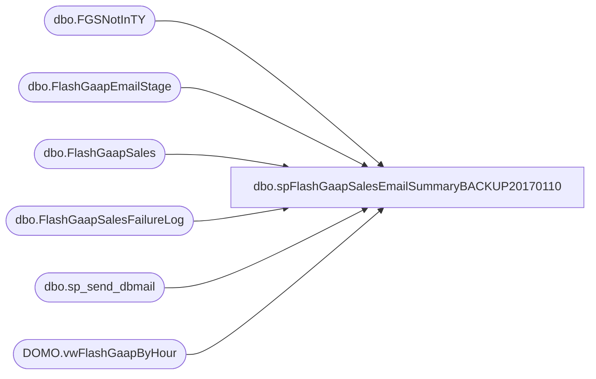

# dbo.spFlashGaapSalesEmailSummaryBACKUP20170110

**Database:** DWStaging  
**Server:** papamart  

## Architecture Diagram



## Table Dependencies

| Referenced Table |
|---|
| dbo.FGSNotInTY |
| dbo.FlashGaapEmailStage |
| dbo.FlashGaapSales |
| dbo.FlashGaapSalesFailureLog |
| dbo.sp_send_dbmail |
| DOMO.vwFlashGaapByHour |

## Stored Procedure Code

```sql
CREATE proc [dbo].[spFlashGaapSalesEmailSummaryBACKUP20170110]
@PackageStart datetime
as

-- =====================================================================================================
-- Name: spFlashGaapSalesEmailSummary
--
--Description: Called from SSIS, captures sales summary, send email
--				
-- Revision History
--		Name:			Date:			Comments:
--		Dan Tweedie		10/13/2016		Created proc
--		Dan Tweedie		12/15/2016		Added TY vs LY by hour
--		Dan Tweedie		01/05/2017		Added + to Comp Percent to LY By This Hour for the Sales Read email
-- =====================================================================================================

set nocount on


BEGIN 

			IF (Object_ID('dwstaging..FlashGaapEmailStage') IS NOT NULL) DROP TABLE dwstaging.dbo.FlashGaapEmailStage
			select 
				BusinessDate,
				StoreKey,
				StoreName,
				sum(TransactionCountThisHour) TransactionCount,
				sum(CompTransactionCountThisHour) CompTransactionCount,
				sum(FlashGaapSalesThisHourUSD) FlashGaapSalesUSD,
				sum(FlashGaapSalesThisHourLocal) FlashGaapSalesLocal,
				sum(CompFlashGaapSalesThisHourUSD) CompFlashGaapSalesUSD,
				sum(CompFlashGaapSalesThisHourLocal) CompFlashGaapSalesLocal,
				sum(distinct LYSalesDayTotalUSD) LYGaapSalesDayTotalUSD,
				sum(distinct LYSalesDayTotalLocal) LYGaapSalesDayTotalLocal,
				sum(distinct CompLYSalesDayTotalUSD) CompLYGaapSalesDayTotalUSD,
				sum(distinct CompLYSalesDayTotalLocal) CompLYGaapSalesDayTotalLocal,
				max(SalesPercentToTotalLY) FlashPercentToLYTotal,
				max(CompSalesPercentToTotalLY) CompFlashPercentToLYTotal,

				sum(LYSalesThisHourLocal) LYSalesThisHourLocal,
				sum(LYSalesThisHourUSD) LYSalesThisHourUSD,
				sum(CompLYSalesThisHourLocal) CompLYSalesThisHourLocal,
				sum(CompLYSalesThisHourUSD) CompLYSalesThisHourUSD,

				max(SalesPercentToHourLY) FlashPercentToLYHour,
				max(CompSalesPercentToHourLY) CompFlashPercentToLYHour,
				DaySalesPlan,
				Jurisdiction,
				TradingGroup,
				cast(Case Jurisdiction
					when 'US' then 1
					when 'Canada' then 2
					when 'United Kingdom' then 3
					when 'Ireland' then 4
					when 'Denmark' then 5
					when 'China' then 6
					else 7
				end as int) as SortOrder
			into dwstaging.dbo.FlashGaapEmailStage
			from DW.DOMO.vwFlashGaapByHour fgs
			--where BusinessDate = cast(@PackageStart as date)--cast(getdate() as date)
			group by BusinessDate, StoreKey, StoreName, Jurisdiction, TradingGroup, DaySalesPlan
			order by cast(Case Jurisdiction
					when 'US' then 1
					when 'Canada' then 2
					when 'United Kingdom' then 3
					when 'Ireland' then 4
					when 'Denmark' then 5
					when 'China' then 6
					else 7
				end as int)
			
			if (select count(*) from dwstaging.dbo.FGSNotInTY) > 0 
			begin
				insert dwstaging.dbo.FlashGaapEmailStage                                        
				select 
					BusinessDate,
					StoreKey,
					StoreName,
					0 TransactionCount,
					0 CompTransactionCount,
					0 FlashGaapSalesUSD,
					0 FlashGaapSalesLocal,
					0 CompFlashGaapSalesUSD,
					0 CompFlashGaapSalesLocal,
					sum(isnull(LYSalesDayTotalUSD,0)) LYGaapSalesDayTotalUSD,
					sum(isnull(LYSalesDayTotalLocal,0)) LYGaapSalesDayTotalLocal,
					sum(isnull(CompLYSalesDayTotalUSD,0)) CompLYGaapSalesDayTotalUSD,
					sum(isnull(CompLYSalesDayTotalLocal,0)) CompLYGaapSalesDayTotalLocal,
					0 FlashPercentToLYTotal,
					0 CompFlashPercentToLYTotal,

					0 LYSalesThisHourLocal,
					0 LYSalesThisHourUSD,
					0 CompLYSalesThisHourLocal,
					0 CompLYSalesThisHourUSD,

					0 FlashPercentToLYHour,
					0 CompFlashPercentToLYHour,
					DaySalesPlan,
					Jurisdiction,
					TradingGroup,
					cast(Case Jurisdiction
						when 'US' then 1
						when 'Canada' then 2
						when 'United Kingdom' then 3
						when 'Ireland' then 4
						when 'Denmark' then 5
						when 'China' then 6
						else 7
					end as int) as SortOrder
				from 
					dwstaging.dbo.FGSNotInTY
				--where BusinessDate = cast(@PackageStart as date) --cast(getdate()-1 as date)
				group by 
					StoreKey,
					StoreName,
					BusinessDate,
					TradingGroup,                                      
					Jurisdiction,
					DaySalesPlan     
			end

---------------------------------------------------------------------------------------------------------------------------------
if (select datepart(hh, @PackageStart)) in (7, 9, 11, 13, 15, 17, 19, 21, 23)
	and
   (select datepart(mi, @PackageStart)) >= 45

			BEGIN
			

					declare 
						@TotalSummaryTable nvarchar(max),
						@TradingGroupSummaryIncWeb nvarchar(max),
						@TradingGroupSummary nvarchar(max),
						@SummaryTable nvarchar(max),
						@DetailTable nvarchar(max),
						@FailureTable nvarchar(max),
						@EmailBody nvarchar(max),
						@Footer nvarchar(max),
						@emailsubject varchar(100),
						@BodyText nvarchar(max)

					select @BodyText = '<font face = arial size = 2>The Flash Gaap Sales data is current up to the hour and will be available in DOMO within the next few minutes at the following URL: <br> 
										https://buildabear.domo.com/page/-100000/kpis/details/815033743
										
										<br>
										<br>'


					select @TotalSummaryTable = 
					'<font face = arial size = 4> <B>Flash Gaap Sales Summary (USD)</font>' + 
									'<BR>' +
									'<table border="1">' +
									'<font face =arial size = 2>' +
									'<tr>
										<th> Flash <br>Gaap Sales </th>
										<th> Comp <br>Flash <br>	Gaap Sales </th>
										<th> Comp <br>LY <br>By this Hour</th>
										<th> Comp <br>LY <br> Day Total </th>
										<th> Comp <br>Percent <br> to LY <br> Day Total </th>
										<th> Comp <br>Percent <br> to LY <br> By This Hour </th>'+
										CAST ( ( SELECT 
														td = sum(FlashGaapSalesUSD), '',
														td = sum(CompFlashGaapSalesUSD), '',
														td = sum(CompLYSalesThisHourUSD), '',
														td = sum(CompLYGaapSalesDayTotalUSD), '',														
														td = cast(cast(100 * isnull((sum(nullif(CompFlashGaapSalesUSD,0)) / sum(nullif(CompLYGaapSalesDayTotalUSD,0)) -1),0) as numeric(10,2)) as varchar) + ' %', '',
														td = cast(cast(100 * isnull((sum(nullif(CompFlashGaapSalesUSD,0)) / sum(nullif(CompLYSalesThisHourUSD,0)) -1),0) as numeric(10,2)) as varchar) + ' %', ''
													from dwstaging.dbo.FlashGaapEmailStage
													where BusinessDate = cast(@PackageStart as date)
													FOR XML PATH('tr'), TYPE 
										) AS NVARCHAR(MAX) ) +
										'</font></table></font></p></p>
										<br>'
					
					select @TradingGroupSummaryIncWeb = 
									'<font face = arial size = 4> <B>Flash Gaap Sales Summary By Trading Group (USD) (includes web)</font>' + 
									'<BR>' +
									'<table border="1">' +
									'<font face =arial size = 2>' +
									'<tr>
										<th> Trading <br>Group </th>
										<th> Flash <br>	Gaap Sales </th>
										<th> Comp <br>Flash <br>	Gaap Sales </th>
										<th> Comp <br>LY <br>By this Hour</th>
										<th> Comp <br>LY <br> Day Total </th>
										<th> Comp <br>Percent <br> to LY <br> Day Total </th>
										<th> Comp <br>Percent <br> to LY <br> By This Hour </th>'+
										CAST ( ( SELECT td = TradingGroup, '',
														td = sum(FlashGaapSalesUSD), '',
														td = sum(CompFlashGaapSalesUSD), '',
														td = sum(CompLYSalesThisHourUSD), '',
														td = sum(CompLYGaapSalesDayTotalUSD), '',
														td = cast(cast(100 * isnull((sum(nullif(CompFlashGaapSalesUSD,0)) / sum(nullif(CompLYGaapSalesDayTotalUSD,0)) -1),0) as numeric(10,2)) as varchar) + ' %', '',
														td = cast(cast(100 * isnull((sum(nullif(CompFlashGaapSalesUSD,0)) / sum(nullif(CompLYSalesThisHourUSD,0)) -1),0) as numeric(10,2)) as varchar) + ' %', ''
													from dwstaging.dbo.FlashGaapEmailStage
													where BusinessDate = cast(@PackageStart as date)
													group by TradingGroup
													order by TradingGroup desc
													FOR XML PATH('tr'), TYPE 
										) AS NVARCHAR(MAX) ) +
										'</font></table></font></p></p>
										<br>'

					select @TradingGroupSummary = 
									'<font face = arial size = 4> <B>Flash Gaap Sales Summary By Trading Group (USD) (excludes web)</font>' + 
									'<BR>' +
									'<table border="1">' +
									'<font face =arial size = 2>' +
									'<tr>
										<th> Trading <br>Group </th>
										<th> Flash <br>	Gaap Sales </th>
										<th> Comp <br>Flash <br>	Gaap Sales </th>
										<th> Comp <br>LY <br>By this Hour</th>
										<th> Comp <br>LY <br> Day Total </th>
										<th> Comp <br>Percent <br> to LY <br> Day Total </th>
										<th> Comp <br>Percent <br> to LY <br> By This Hour </th>'+
										CAST ( ( SELECT td = TradingGroup, '',
														td = sum(FlashGaapSalesUSD), '',
														td = sum(CompFlashGaapSalesUSD), '',
														td = sum(CompLYSalesThisHourUSD), '',
														td = sum(CompLYGaapSalesDayTotalUSD), '',
														td = cast(cast(100 * isnull((sum(nullif(CompFlashGaapSalesUSD,0)) / sum(nullif(CompLYGaapSalesDayTotalUSD,0)) -1),0) as numeric(10,2)) as varchar) + ' %', '',
														td = cast(cast(100 * isnull((sum(nullif(CompFlashGaapSalesUSD,0)) / sum(nullif(CompLYSalesThisHourUSD,0)) -1),0) as numeric(10,2)) as varchar) + ' %', ''
													from dwstaging.dbo.FlashGaapEmailStage
													where StoreKey not in ('0013','2013')
													and BusinessDate = cast(@PackageStart as date)
													group by TradingGroup
													order by TradingGroup desc
													FOR XML PATH('tr'), TYPE 
										) AS NVARCHAR(MAX) ) +
										'</font></table></font></p></p>
										<br>'

					select @SummaryTable = 
									'<font face = arial size = 4> <B>Flash Gaap Sales Summary By Jurisdiction (Native) </font>' + 
									'<BR>' +
									'<table border="1">' +
									'<font face =arial size = 2>' +
									'<tr>
										<th> Jurisdiction </th>
										<th> Flash <br>	Gaap Sales </th>
										<th> Comp <br>Flash <br>	Gaap Sales </th>
										<th> Comp <br>LY <br>By this Hour</th>
										<th> Comp <br>LY <br> Day Total </th>
										<th> Comp <br>Percent <br> to LY <br> Day Total </th>
										<th> Comp <br>Percent <br> to LY <br> By This Hour </th>
										<th> Sales <br>Plan </th>
										<th> Sales vs. Plan <br>(regardless of comp) </th>'+
										CAST ( ( SELECT td = Jurisdiction, '',
														td = sum(FlashGaapSalesLocal), '',
														td = sum(CompFlashGaapSalesLocal), '',
														td = sum(CompLYSalesThisHourLocal), '',
														td = sum(CompLYGaapSalesDayTotalLocal), '',
														td = cast(cast(100 * isnull((sum(nullif(CompFlashGaapSalesLocal,0)) / sum(nullif(CompLYGaapSalesDayTotalLocal,0)) -1),0) as numeric(10,2)) as varchar) + ' %', '',
														td = cast(cast(100 * isnull((sum(nullif(CompFlashGaapSalesLocal,0)) / sum(nullif(CompLYSalesThisHourLocal,0)) -1),0) as numeric(10,2)) as varchar) + ' %', '',
														td = cast(sum(DaySalesPlan) as decimal(38,2)), '',
														td = cast(cast(100 * isnull((sum(nullif(FlashGaapSalesLocal,0)) / sum(nullif(DaySalesPlan,0)) -1),0) as numeric(10,2)) as varchar) + ' %', ''
													from dwstaging.dbo.FlashGaapEmailStage
													--where StoreKey not in ('0013','2013')
													where BusinessDate = cast(@PackageStart as date)
													group by Jurisdiction, SortOrder
													order by SortOrder, Jurisdiction
													FOR XML PATH('tr'), TYPE 
										) AS NVARCHAR(MAX) ) +
										'</font></table></font></p></p>
										<br>'

					select @DetailTable = 
									'<font face = arial size = 4> <B>Flash Gaap Sales Summary By Store (Native) </font>' + 
									'<BR>' +
									'<table border="1">' +
									'<font face =arial size = 2>' +
									'<tr>
										<th> Store </th>
										<th> Store Name </th>
										<th> Flash <br> Gaap Sales </th>
										<th> Comp <br>Flash <br> Gaap Sales </th>
										<th> Comp <br>LY <br>By this Hour</th>
										<th> Comp <br>LY <br> Day Total </th>
										<th> Comp <br>Percent <br> to LY <br> Day Total </th>
										<th> Comp <br>Percent <br> to LY <br> By This Hour </th>'+
										CAST ( ( SELECT td = StoreKey, '',
														td = StoreName, '',
														td = FlashGaapSalesLocal, '',
														td = CompFlashGaapSalesLocal, '',
														td = CompLYSalesThisHourLocal, '',
														td = CompLYGaapSalesDayTotalLocal, '',
														td = cast(cast(100 * isnull((nullif(CompFlashGaapSalesLocal,0) / nullif(CompLYGaapSalesDayTotalLocal,0))-1, 0) as numeric(10,2)) as varchar) + ' %', '',
														td = cast(cast(100 * isnull((nullif(CompFlashGaapSalesLocal,0) / nullif(CompLYSalesThisHourLocal,0))-1, 0) as numeric(10,2)) as varchar) + ' %', ''
													from dwstaging.dbo.FlashGaapEmailStage
													where BusinessDate = cast(@PackageStart as date)
													order by StoreKey
													FOR XML PATH('tr'), TYPE 
										) AS NVARCHAR(MAX) ) +
										'</font></table></font></p></p>
										<br>
										<br>
										<br>'

					select @FailureTable = 
									'<font face = arial size = 4> <B>Error Log</font>' + 
									'<BR>' +
									'These stores are noted as Open in StoreMDM, but were unable to query sales.' +
									'<BR>' +
									'<table border="1">' +
									'<font face =arial size = 2> ' +
									'<tr>
										<th> Store </th>
										<th> Store IP </th>
										<th> Error Log </th>' +
										CAST ( ( SELECT td = StoreID, '',
														td = StoreIP, '',
														td = FailureReason, ''
													from dwstaging.dbo.FlashGaapSalesFailureLog
													order by StoreID
													FOR XML PATH('tr'), TYPE 
										) AS NVARCHAR(MAX) ) +
										'</font></table></font></p></p>
										<br>
										<br>
										<br>'

					select @Footer = 'This report was generated by Papamart.DWStaging.dbo.spFlashGaapSalesEmailSummary. <br>
									  The information in this message may be privileged, “confidential” and protected from disclosure and/or intended only for the addressee(s) named above. If the reader of this message is not the intended recipient, or an employee or agent responsible for delivering this message to the intended recipient, you are hereby notified that any dissemination, distribution or copying of the communication is strictly prohibited. If you have received this communication in error, please notify us immediately by replying to the message and deleting it from your computer. Thank you beary much.'


					select @EmailBody = 
						@BodyText + @TotalSummaryTable + @TradingGroupSummaryIncWeb + @TradingGroupSummary + @SummaryTable + @DetailTable + @footer

					If (select count(*) from dwstaging.dbo.FlashGaapSalesFailureLog) > 0 
						begin
							select @EmailBody = 
							@BodyText + @TotalSummaryTable + @TradingGroupSummaryIncWeb + @TradingGroupSummary + @SummaryTable + @DetailTable + @FailureTable + @footer
						end


					select @emailsubject = 
						'Flash GAAP Sales Report as of ' + convert(varchar(20),getdate(),100) + ' -- TY vs LY Up to the Hour --'

					exec msdb.dbo.sp_send_dbmail
					@profile_name = 'BIAdmin',
					@recipients = 'FinancialAnalyst@buildabear.com',
					@copy_recipients = 'biadmin@buildabear.com',
					@body = @EmailBody,
					@subject= @emailsubject,
					@body_format = 'HTML'


					--Extra email w/summary only (for chiefs)

					--ONLY SEND EMAIL AT 3:45PM, 5:45, 7:45, 9:45
					if (select datepart(hh, @PackageStart)) in (15,17,19,21)
						and	(select datepart(mi, @PackageStart)) >= 45
					BEGIN

							declare 
								@TradingGroupSummary2 nvarchar(max),
								@JurisdictionSummary2 nvarchar(max),
								@BodySummary2 nvarchar(max),
								@SubjectSummary2 nvarchar(max),
								@CaptureDate varchar(52)

							select distinct @CaptureDate = convert(varchar, ins_dt, 100) from dw.dbo.FlashGaapSales
						
							select @TradingGroupSummary2 = 
							'<font face = arial size = 4> <B>Comp Sales Summary by Trading Group (Excludes Web)  </font>' + 
											'<BR>' +
											'<table border="1">' +
											'<font face =arial size = 2>' +
											'<tr>
												<th> Trading <br>Group </th>
												<th> Data <br>Capture <br>	Datetime </th>
												<th> Comp <br>Percent <br> to LY <br> By This Hour </th>'+
												CAST ( ( SELECT 
																td = TradingGroup, '',
																td = @CaptureDate, '',
																td = case when 
																			cast(cast(100 * isnull((sum(nullif(CompFlashGaapSalesUSD,0)) / sum(nullif(CompLYSalesThisHourUSD,0)) -1),0) as numeric(10,2)) as varchar) not like '-%' 
																				and cast(cast(100 * isnull((sum(nullif(CompFlashGaapSalesUSD,0)) / sum(nullif(CompLYSalesThisHourUSD,0)) -1),0) as numeric(10,2)) as varchar) <> '0.00'
																			then '+' + cast(cast(100 * isnull((sum(nullif(CompFlashGaapSalesUSD,0)) / sum(nullif(CompLYSalesThisHourUSD,0)) -1),0) as numeric(10,2)) as varchar) + ' %'
																			else cast(cast(100 * isnull((sum(nullif(CompFlashGaapSalesUSD,0)) / sum(nullif(CompLYSalesThisHourUSD,0)) -1),0) as numeric(10,2)) as varchar) + ' %'
																	end, ''
															from dwstaging.dbo.FlashGaapEmailStage 
															where BusinessDate = cast(@PackageStart as date)
															and StoreKey not in ('0013','2013')
															group by TradingGroup
															FOR XML PATH('tr'), TYPE 
												) AS NVARCHAR(MAX) ) +
												'</font></table></font></p></p>
												<br>'

							select @JurisdictionSummary2 = 
							'<font face = arial size = 4> <B>Comp Sales Summary By Country (Excludes Web)  </font>' + 
											'<BR>' +
											'<table border="1">' +
											'<font face =arial size = 2>' +
											'<tr>
												<th> Country </th>
												<th> Data <br>Capture <br>	Datetime </th>
												<th> Comp <br>Percent <br> to LY <br> By This Hour </th>'+
												CAST ( ( SELECT 
																td = Jurisdiction, '',
																td = @CaptureDate, '',
																td = case when 
																			cast(cast(100 * isnull((sum(nullif(CompFlashGaapSalesLocal,0)) / sum(nullif(CompLYSalesThisHourLocal,0)) -1),0) as numeric(10,2)) as varchar) not like '-%'
																			and cast(cast(100 * isnull((sum(nullif(CompFlashGaapSalesLocal,0)) / sum(nullif(CompLYSalesThisHourLocal,0)) -1),0) as numeric(10,2)) as varchar) <> '0.00'
																			then '+' + cast(cast(100 * isnull((sum(nullif(CompFlashGaapSalesLocal,0)) / sum(nullif(CompLYSalesThisHourLocal,0)) -1),0) as numeric(10,2)) as varchar) + ' %'
																			else cast(cast(100 * isnull((sum(nullif(CompFlashGaapSalesLocal,0)) / sum(nullif(CompLYSalesThisHourLocal,0)) -1),0) as numeric(10,2)) as varchar) + ' %'
																	end, ''
															from dwstaging.dbo.FlashGaapEmailStage 
															where BusinessDate = cast(@PackageStart as date)
															and StoreKey not in ('0013','2013')
															group by Jurisdiction, SortOrder
															order by SortOrder
															FOR XML PATH('tr'), TYPE 
												) AS NVARCHAR(MAX) ) +
												'</font></table></font></p></p>
												<br>'

							select @BodySummary2 = 
								@TradingGroupSummary2 + @JurisdictionSummary2 + @footer

							select @SubjectSummary2 =
							'Sales Read as of ' + convert(varchar(20),getdate(),100) 

							exec msdb.dbo.sp_send_dbmail
							@profile_name = 'BIAdmin',
							@recipients = 'ChiefBears@buildabear.com;ManagingDirectors@buildabear.com;Directors@buildabear.com;SamaraR@buildabear.com;kens@buildabear.com;LindsayMi@buildabear.com;FinancialAnalyst@buildabear.com',
							@copy_recipients = 'biadmin@buildabear.com',
							@body = @BodySummary2,
							@subject= @SubjectSummary2,
							@body_format = 'HTML'
					END
			END


END
```

