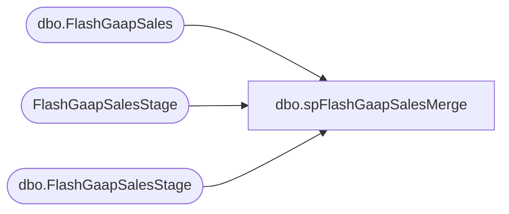

# dbo.spFlashGaapSalesMerge

**Database:** DWStaging  
**Server:** papamart  

## Architecture Diagram



## Table Dependencies

| Referenced Table |
|---|
| dbo.FlashGaapSales |
| FlashGaapSalesStage |
| dbo.FlashGaapSalesStage |

## Stored Procedure Code

```sql
CREATE proc [dbo].[spFlashGaapSalesMerge] 

as 

-- =====================================================================================================
-- Name: spFlashGaapSalesMerge
--
--Description: Merges data from dwstaging.dbo.FlashGaapSalesStage into dw.dbo.FlashGaapSales
--				
-- Revision History
--		Name:			Date:			Comments:
--		Dan Tweedie		09/30/2016		Created proc.	--not being used, as we currently only need 2 days of data
-- =====================================================================================================

set nocount on 

if (select count(*) from dwstaging.dbo.FlashGaapSalesStage) > 0

BEGIN

	MERGE into dw.dbo.FlashGaapSales as target
		using
			(
				select 
					store_key,
					local_date_key,
					local_time_key,
					case when local_hour between 0 and 5
							then local_date_key -1
							else local_date_key 
					end as business_date_key,
					sum(flash_gaap_sales) as flash_gaap_sales,
					TransactionCount,
					source,
					insert_datetime,
					ETLLogID
				from dwstaging.dbo.FlashGaapSalesStage 
				group by 
					store_key,
					local_date_key,
					local_time_key,
					case when local_hour between 0 and 5
							then local_date_key -1
							else local_date_key 
					end,
					TransactionCount,
					source,
					insert_datetime,
					ETLLogID
			) as source
		on
			(
				target.store_key = source.store_key
				and 
				target.business_date_key = source.business_date_key
				and
				target.local_time_key = source.local_time_key
			)

		when matched 
			and 
				(
					target.flash_gaap_sales <> source.flash_gaap_sales
					or
					target.TransactionCount <> source.TransactionCount
				)
				then UPDATE 
					set 
						target.flash_gaap_sales = source.flash_gaap_sales,
						target.TransactionCount = source.TransactionCount,
						target.UPD_DT = source.insert_datetime

		when not matched by target 
			then INSERT 
				(
					store_key,
					local_date_key,
					local_time_key,
					business_date_key,
					flash_gaap_sales,
					TransactionCount,
					source,
					INS_DT,
					ETLLogID
				)
			values 
				(
					source.store_key,
					source.local_date_key,
					source.local_time_key,
					source.business_date_key,
					source.flash_gaap_sales,
					source.TransactionCount,
					source.source,
					source.insert_datetime,
					source.ETLLogID
				)

		when not matched by source 
			then delete

			
		; --A MERGE statement must be terminated by a semi-colon (;).	

		select case when count(*) = 0 then 1 else 0 end as ValidationStatus
		from FlashGaapSalesStage f
		where not exists
			(
				select dw.flash_gaap_sales
				from dw.dbo.FlashGaapSales dw
				where 
					dw.store_key = f.store_key
					and 
					dw.business_date_key = case when f.local_hour between 0 and 5
													then f.local_date_key -1
													else f.local_date_key 
													end
					and
					dw.local_time_key = f.local_time_key
					and
					dw.flash_gaap_sales = f.flash_gaap_sales
					and
					dw.TransactionCount = f.TransactionCount
			)


END

else

begin
	select 1 as ValidationStatus
end

Accounting,spRpt_Transaction_RawSummaryFromStoreServer_ForSingleFiscalMonth,-- =============================================
-- Author:		Shyr, Kevin
-- Create date: 7/29/2015
-- Description:	<Description,,>
-- =============================================
CREATE PROCEDURE [Accounting].[spRpt_Transaction_RawSummaryFromStoreServer_ForSingleFiscalMonth]
	@FiscalYear INT
	, @FiscalPeriod INT
AS
BEGIN
	-- SET NOCOUNT ON added to prevent extra result sets from
	-- interfering with SELECT statements.
	SET NOCOUNT ON;

	SELECT 
		trs.location_code
		, trs.location_name
		, SUM(trs.net_sales) AS net_sales
	--FROM [Accounting].[Sales_GAAP_RawFromStoreServer] trs WITH(NOLOCK)
	from dw.dbo.Sales_GAAP_RawFromStoreServer trs
		INNER JOIN dw.dbo.date_dim dd WITH(NOLOCK)
			ON trs.date_key = dd.date_key
	WHERE dd.fiscal_year = @FiscalYear
		AND dd.fiscal_period = @FiscalPeriod
	GROUP BY 
		trs.location_code
		, trs.location_name
END
```

