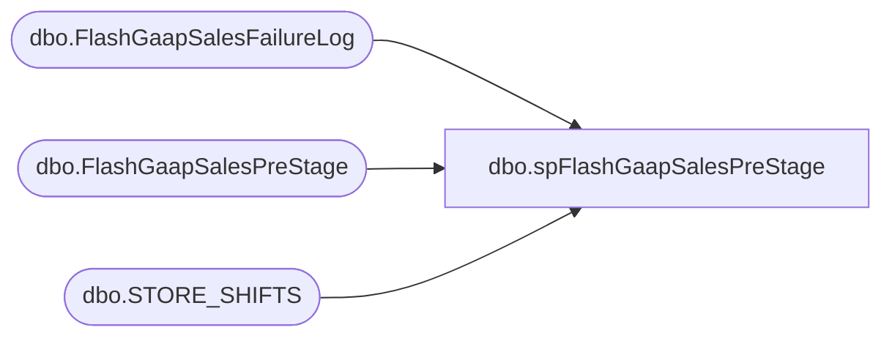

# dbo.spFlashGaapSalesPreStage

**Database:** DWStaging  
**Server:** papamart  

## Architecture Diagram



## Table Dependencies

| Referenced Table |
|---|
| dbo.FlashGaapSalesFailureLog |
| dbo.FlashGaapSalesPreStage |
| dbo.STORE_SHIFTS |

## Stored Procedure Code

```sql
CREATE proc [dbo].[spFlashGaapSalesPreStage]
@StoreID int,
@StoreKey int,
@IP varchar(15),
@UName varchar(2),
@PWord varchar(10)

as

set nocount on

Declare
	@StoreQuery nvarchar(max),
	@StoreShifts nvarchar(max)

Select @StoreQuery = 
						'select 
							cast(a.StoreNo as int) as StoreNo, 
							a.TransactionDate as TransactionDate,
							cast(a.TransactionHour as int) as TransactionHour,
							cast(a.NetSales as decimal(38,2)) as NetSales,
							cast(a.TransactionCount as int) as TransactionCount,
							cast(a.NetUnits as int) as NetUnits,
							cast(a.Source as varchar(10)) as Source
						from openrowset
						(''SQLNCLI'', ''' + @IP + '''; ''' + @Uname + '''; ''' + @PWord + ''',
						''set nocount on
 
						IF (Object_ID(''''USICOAL..DW_GaapStage'''') IS NOT NULL) DROP TABLE USICOAL..DW_GaapStage
						create table USICOAL.dbo.DW_GaapStage
							(RTL_TRN_ID int,
							TRANS_COUNT int,
							NET_UNITS decimal(18,4),
							NET_SALES money,
							BEAR_UNITS decimal(18,4),
							BEAR_SALES money,
							SHOE_UNITS decimal(18,4),
							SHOE_SALES money,
							SOUND_UNITS decimal(18,4),
							SOUND_SALES money, 
							GIFT_CARD_UNITS decimal(18,4),
							PARTY_UNITS decimal(18,4),
							END_DATETIME datetime,
							END_YEAR int,
							END_MONTH int,
							END_DAY int,
							END_HOUR int,
							REDEEMED_AMOUNT money,
							SHIFTID datetime,
							shiftDescription varchar(20),
							Start_Shift datetime,
							Excluded_Items int,
							Tran_Units int)

						declare @Range as varchar(50), @sql varchar(1000)

						set @Range = Char(34) + (select cast(convert(varchar, getdate()-3,121)as varchar(10)))+  Char(34)  + '''','''' +  Char(34)  +(select cast(convert(varchar, getdate(),121)as varchar(10))) +  Char(34) 
			
						set @sql = ''''insert into USICOAL.dbo.DW_GaapStage exec USICOAL.dbo.BEAR_PAWS_RPT'''' + @Range

						exec (@sql)

						select	
							rt.store_no as StoreNo,
							convert(varchar, G.END_DATETIME, 101) as TransactionDate,
							G.END_HOUR as TransactionHour,
							--cast(SUM(isnull((G.net_sales - G.redeemed_amount), 0) as decimal(38,2)) AS NetSales, 
							SUM(cast(isnull((G.net_sales - G.redeemed_amount), 0) as decimal(38,2))) AS NetSales, 
							 --cast(SUM(CASE
								--		WHEN CAST(rt.store_no AS INT) between 3000 and 3999 
								--			THEN isnull((G.net_sales - G.redeemed_amount), 0) / 1.1700
								--		WHEN CAST(rt.store_no as INT) IN (2036, 2054) 
								--			THEN isnull((G.net_sales - G.redeemed_amount), 0) / 1.2300
								--		WHEN CAST(rt.store_no as INT) = 2301 --Denmark
								--			THEN isnull((G.net_sales - G.redeemed_amount), 0) / 1.2500
								--		WHEN CAST(rt.store_no AS INT) >= 2000 
								--			THEN isnull((G.net_sales - G.redeemed_amount), 0) / 1.2
								--		ELSE isnull((G.net_sales - G.redeemed_amount), 0) 
								--		END) as decimal(38,2)) AS NetSales, 
							''''Coalition'''' as Source, sum(G.TRANS_COUNT) TransactionCount, 
							sum(G.NET_UNITS) as NetUnits
						from USICOAL.dbo.DW_GaapStage G
						INNER JOIN USICOAL.dbo.RETAIL_TRANSACTION RT ON G.RTL_TRN_ID = RT.RTL_TRN_ID 
						GROUP BY convert(varchar, G.END_DATETIME, 101), G.END_HOUR, rt.store_no'') as a'

	begin try
		insert dwstaging.dbo.FlashGaapSalesPreStage
		exec(@StoreQuery)
	end try

	begin catch
		insert dwstaging.dbo.FlashGaapSalesFailureLog
		select @StoreID, @StoreKey, @IP, getdate(), error_message()
	end catch
	

Select @StoreShifts = 
						'select 
							b.SHIFT_ID,
							b.STORE_NO,
							b.START_SHIFT,
							b.END_SHIFT
						from openrowset
						(''SQLNCLI'', ''' + @IP + '''; ''' + @Uname + '''; ''' + @PWord + ''',
						''set nocount on

						select 
							[SHIFT_ID],
							[STORE_NO],
							[START_SHIFT],
							[END_SHIFT]
						from USICOAL.dbo.[STORE_SHIFTS]'') as b'

begin try
		insert dwstaging.dbo.STORE_SHIFTS
		exec(@StoreShifts)
	end try

	begin catch
		insert dwstaging.dbo.FlashGaapSalesFailureLog
		select @StoreID, @StoreKey, @IP, getdate(), error_message()
	end catch
```

