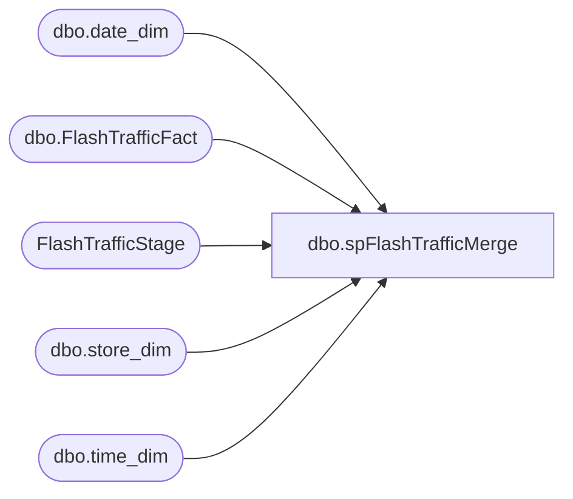

# dbo.spFlashTrafficMerge

**Database:** DWStaging  
**Server:** papamart  

## Architecture Diagram



## Table Dependencies

| Referenced Table |
|---|
| dbo.date_dim |
| dbo.FlashTrafficFact |
| FlashTrafficStage |
| dbo.store_dim |
| dbo.time_dim |

## Stored Procedure Code

```sql
CREATE proc [dbo].[spFlashTrafficMerge] 

as 
-- =============================================================================================================
-- Name: spFlashTrafficMerge
--
-- Description: Merges staged Flash Traffic data to dw.dbo.FlashTrafficFact
-- 
-- Revision History
--		Name:				Date:			Comments:
--		Dan Tweedie			02/20/2017		Created Proc
-- =============================================================================================================

set nocount on

IF (Object_ID('tempdb..#TrafficStage') IS NOT NULL) DROP TABLE #TrafficStage;
		with stagedOne as
			(
				select 
					sd.store_key,
					cast(( substring(fts.startTime, 1, 4) + '-' + substring(fts.startTime, 5, 2) + '-' + substring(fts.startTime, 7, 2) + ' ' + substring(fts.startTime, 9, 2) + ':' + substring(fts.startTime, 11, 2) ) as datetime) as startDateTime,
					fts.enters,
					fts.exits,
					fts.insert_datetime
				from FlashTrafficStage fts
				join dw.dbo.store_dim sd on cast(fts.storeID as int) = sd.store_id
			)
		select
			s1.store_key,
			dd.date_key,
			td.time_key,
			s1.startDateTime,
			max(s1.enters) enters,
			max(s1.exits) exits,
			s1.insert_datetime
		into #TrafficStage
		from stagedOne s1
		join dw.dbo.date_dim dd on cast(s1.startDateTime as date) = cast(dd.actual_date as date)
		join dw.dbo.time_dim td on datepart(hh, s1.startDateTime) = td.hour and datepart(mi, s1.startDateTime) = td.minute
		group by 
			s1.store_key,
			dd.date_key,
			td.time_key,
			s1.startDateTime,
			s1.insert_datetime

merge into dw.dbo.FlashTrafficFact as target
using
	(	
		select * from #TrafficStage
	) as source
on (
		target.store_key = source.store_key
		and target.date_key = source.date_key 
		and target.time_key = source.time_key
	)
when matched 
and isnull(target.enters,0) <> isnull(source.enters,0) or isnull(target.exits,0) <> isnull(source.exits,0)
	then 
		update 
			set target.enters = source.enters,
				target.exits = source.exits,
				update_datetime = getdate()
when not matched by target
	then 
		insert (store_key, date_key, time_key, startDateTime, enters, exits, insert_datetime)
		values (source.store_key, source.date_key, source.time_key, source.startDateTime, source.enters, source.exits, getdate())
;
```

