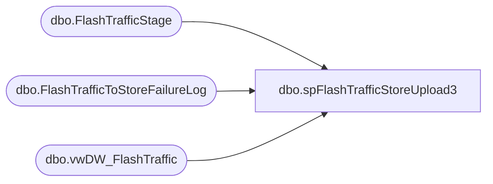

# dbo.spFlashTrafficStoreUpload3

**Database:** DWStaging  
**Server:** papamart  

## Architecture Diagram



## Table Dependencies

| Referenced Table |
|---|
| dbo.FlashTrafficStage |
| dbo.FlashTrafficToStoreFailureLog |
| dbo.vwDW_FlashTraffic |

## Stored Procedure Code

```sql
CREATE proc [dbo].[spFlashTrafficStoreUpload3]
@StoreID int,
@StoreKey int,
@IP varchar(15)

as

set nocount on 

Declare
	@CreateTables nvarchar(max),
	@MergeData nvarchar(max)

select @CreateTables = 
						'
						IF (Object_ID(''USICOAL..FlashTrafficStage'') IS NOT NULL) DROP TABLE USICOAL.dbo.FlashTrafficStage
						CREATE TABLE USICOAL.[dbo].[FlashTrafficStage](
																	[START_TIME] datetime,
																	[STORE_NO] int,
																	[LOCATION_NO] int,
																	[END_TIME] datetime,
																	[ENTERS_COUNT] int,
																	[EXITS_COUNT] int,
																	[COUNTS_TIMESTAMP] datetime
																	) on [PRIMARY]
						---TRAFFIC_COUNT is used instead now
						--IF (Object_ID(''USICOAL..FlashTrafficFact'') IS NULL) 
						--CREATE TABLE USICOAL.[dbo].[FlashTrafficFact](
						--											[StoreID] [varchar](4) NULL,
						--											[startTime] datetime NULL,
						--											[exits] [int] NULL
						--											) on [PRIMARY]
						'
						
begin try
	exec(@CreateTables) at [StoreServer3]
end try

begin catch
	insert dwstaging.dbo.FlashTrafficToStoreFailureLog
	select @StoreID as StoreID, @StoreKey as StoreKey, @IP as StoreIP, getdate() as InsertDate, error_message() as FailureReason
end catch

if (select count(*) from dwstaging.dbo.FlashTrafficToStoreFailureLog where StoreID = @StoreID) = 0
begin
	begin try
		insert into StoreServer3.USICOAL.dbo.FlashTrafficStage
		select START_TIME,STORE_NO,LOCATION_NO,END_TIME,ENTERS_COUNT,EXITS_COUNT,COUNTS_TIMESTAMP
		from DW.dbo.vwDW_FlashTraffic
		where cast(STORE_NO as int) = @StoreID
		and datediff(dd, START_TIME, getdate()) <= 1
		and CAST(Start_Time as time) BETWEEN '06:00' AND '23:59'
	end try

	begin catch
		insert dwstaging.dbo.FlashTrafficToStoreFailureLog
		select @StoreID, @StoreKey, @IP, getdate(), error_message()
	end catch
	-------------

	select @MergeData = 
						'Merge into TRAFFIC_COUNT as target
						Using 
							(
								select 
									*
								from FlashTrafficStage
							) as source
						On (target.STORE_NO = source.STORE_NO and target.START_TIME = source.START_TIME)
						When Matched 
							and target.EXITS_COUNT <> source.EXITS_COUNT
							or target.ENTERS_COUNT <> source.ENTERS_COUNT
							Then 
								Update 
									Set target.EXITS_COUNT = source.EXITS_COUNT,
									    target.ENTERS_COUNT = source.ENTERS_COUNT
						When Not Matched By Target 
							Then 
								Insert ([START_TIME],[STORE_NO],[LOCATION_NO],[END_TIME],[ENTERS_COUNT],[EXITS_COUNT],[COUNTS_TIMESTAMP])
								Values (source.START_TIME, source.STORE_NO, source.LOCATION_NO, source.END_TIME, source.ENTERS_COUNT, source.EXITS_COUNT, source.COUNTS_TIMESTAMP);'
	begin try
		exec(@MergeData) at [StoreServer3]
	end try

	begin catch
		insert dwstaging.dbo.FlashTrafficToStoreFailureLog
		select @StoreID, @StoreKey, @IP, getdate(), error_message()
	end catch
end
```

