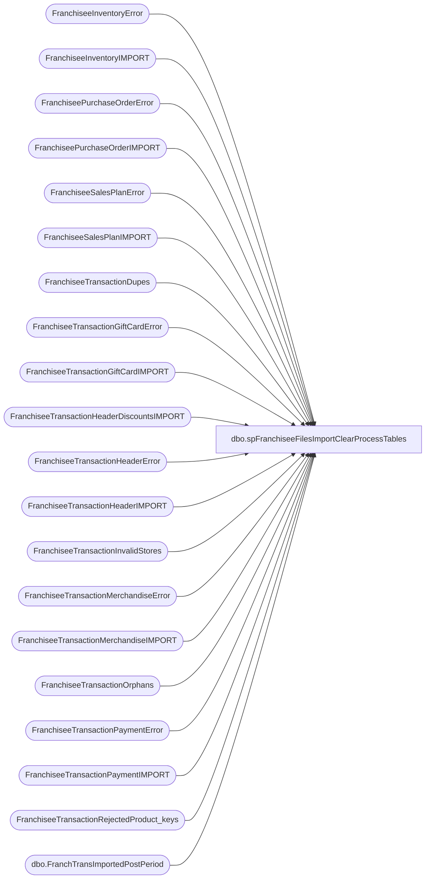

# dbo.spFranchiseeFilesImportClearProcessTables

**Database:** DWStaging  
**Server:** papamart  

## Architecture Diagram



## Table Dependencies

| Referenced Table |
|---|
| FranchiseeInventoryError |
| FranchiseeInventoryIMPORT |
| FranchiseePurchaseOrderError |
| FranchiseePurchaseOrderIMPORT |
| FranchiseeSalesPlanError |
| FranchiseeSalesPlanIMPORT |
| FranchiseeTransactionDupes |
| FranchiseeTransactionGiftCardError |
| FranchiseeTransactionGiftCardIMPORT |
| FranchiseeTransactionHeaderDiscountsIMPORT |
| FranchiseeTransactionHeaderError |
| FranchiseeTransactionHeaderIMPORT |
| FranchiseeTransactionInvalidStores |
| FranchiseeTransactionMerchandiseError |
| FranchiseeTransactionMerchandiseIMPORT |
| FranchiseeTransactionOrphans |
| FranchiseeTransactionPaymentError |
| FranchiseeTransactionPaymentIMPORT |
| FranchiseeTransactionRejectedProduct_keys |
| dbo.FranchTransImportedPostPeriod |

## Stored Procedure Code

```sql
CREATE proc [dbo].[spFranchiseeFilesImportClearProcessTables]
--@franchisee varchar(2)

as

-- =====================================================================================================
-- Name: spFranchiseeFilesImportClearProcessTables
--
--Description: Creates Franchisee specific work tables, purges Franchisee specific records from import staging table
--
-- Revision History
--		Name:			Date:			Comments:
--		Dan Tweedie		01/27/2016		Created proc.	
--		Dan Tweedie		08/05/2016		Rather than deleting for specific Franchisee, now truncating tables
--	     Tim Bytnar	     03/06/2017	     Added tables for Rejected_ProductIDs and InvalidStores
-- =====================================================================================================

set nocount on

------------------------------------
--PURGE RECORDS FROM IMPORT TABLES
------------------------------------
--delete from FranchiseeTransactionHeaderIMPORT where Franchisee = @Franchisee
--delete from FranchiseeTransactionMerchandiseIMPORT where Franchisee = @Franchisee
--delete from FranchiseeTransactionPaymentIMPORT where Franchisee = @Franchisee
--delete from FranchiseeTransactionGiftCardIMPORT where Franchisee = @Franchisee
--delete from FranchiseeInventoryIMPORT where Franchisee = @Franchisee
--delete from FranchiseePurchaseOrderIMPORT where Franchisee = @Franchisee
--delete from FranchiseeSalesPlanIMPORT where Franchisee = @Franchisee

truncate table FranchiseeTransactionHeaderIMPORT
truncate table FranchiseeTransactionMerchandiseIMPORT
truncate table FranchiseeTransactionPaymentIMPORT
truncate table FranchiseeTransactionGiftCardIMPORT
truncate table FranchiseeInventoryIMPORT
truncate table FranchiseePurchaseOrderIMPORT
truncate table FranchiseeSalesPlanIMPORT
truncate table FranchiseeTransactionHeaderDiscountsIMPORT
-- =====================================================================================================

------------------------------------
--PURGE RECORDS FROM ERROR TABLES
------------------------------------
--delete from FranchiseeTransactionHeaderError where Franchisee = @Franchisee
--delete from FranchiseeTransactionMerchandiseError where Franchisee = @Franchisee
--delete from FranchiseeTransactionPaymentError where Franchisee = @Franchisee
--delete from FranchiseeTransactionGiftCardError where Franchisee = @Franchisee
--delete from FranchiseeInventoryError where Franchisee = @Franchisee
--delete from FranchiseePurchaseOrderError where Franchisee = @Franchisee
--delete from FranchiseeSalesPlanError where Franchisee = @Franchisee

truncate table FranchiseeTransactionHeaderError
truncate table FranchiseeTransactionMerchandiseError
truncate table FranchiseeTransactionPaymentError
truncate table FranchiseeTransactionGiftCardError
truncate table FranchiseeInventoryError
truncate table FranchiseePurchaseOrderError
truncate table FranchiseeSalesPlanError

-- =====================================================================================================

------------------------------------
--PURGE RECORDS FROM DUPES & ORPHAN TABLES
------------------------------------
--delete from FranchiseeTransactionDupes where Franchisee = @Franchisee
--delete from FranchiseeTransactionOrphans where Franchisee = @Franchisee

truncate table FranchiseeTransactionDupes
truncate table FranchiseeTransactionOrphans

-- =====================================================================================================


------------------------------------
--PURGE RECORDS FROM VALIDATION TABLES
------------------------------------
truncate table FranchiseeTransactionInvalidStores
truncate table FranchiseeTransactionRejectedProduct_keys
truncate table dwstaging.dbo.FranchTransImportedPostPeriod
-- =====================================================================================================
```

