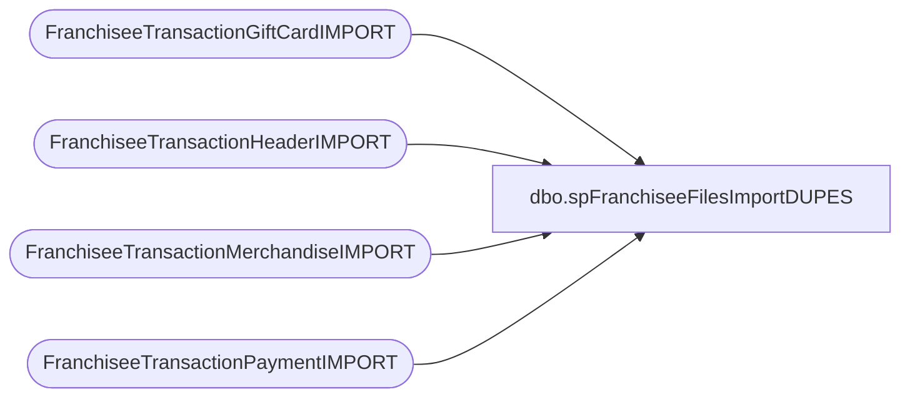

# dbo.spFranchiseeFilesImportDUPES

**Database:** DWStaging  
**Server:** papamart  

## Architecture Diagram



## Table Dependencies

| Referenced Table |
|---|
| FranchiseeTransactionGiftCardIMPORT |
| FranchiseeTransactionHeaderIMPORT |
| FranchiseeTransactionMerchandiseIMPORT |
| FranchiseeTransactionPaymentIMPORT |

## Stored Procedure Code

```sql
CREATE proc [dbo].[spFranchiseeFilesImportDUPES]
@Franchisee varchar(2)

as 


-- =====================================================================================================
-- Name: spFranchiseeFilesImportDUPES
--
-- Description:	Called from SSIS FranchiseeFilesImport. 
--				This proc's purpose is to output a dataset to show duplicate transactions found in the staged franchisee transaction data
--				 
-- Revision History
--		Name:			Date:			Comments:
--		Dan Tweedie		02/08/2016		Created proc.	
--		Dan Tweedie		07/08/2016		No longer lookup transactions from DW tables 
-- =====================================================================================================


set nocount on;

WITH 
HeaderDupes (TransactionID, HeaderRecords)
AS ( 
	--Header TransactionID exists more than once in the file, or already exists in DW
		select i.TransactionID, 
			count(i.TransactionID) HeaderRecords
		from FranchiseeTransactionHeaderIMPORT i with (nolock)
		where i.Franchisee = @Franchisee
		group by i.TransactionID, i.Franchisee
		having count(i.TransactionID) > 1
	),
PaymentDupes (TransactionID, PaymentRecords)
AS (
	--Payment transaction is a Header duplicate
		select tp.TransactionID, 
			count(tp.TransactionID) PaymentRecords 
		from FranchiseeTransactionPaymentIMPORT tp with (nolock)
		where tp.Franchisee = @Franchisee
		group by tp.TransactionID, tp.Franchisee
		having exists (select h.TransactionID from HeaderDupes h where h.TransactionID = tp.TransactionID)
	),
MerchandiseDupes (TransactionID, MerchandiseRecords)
AS (
	--Merchandise transaction is a Header duplicate
		select tm.TransactionID,
			count(tm.TransactionID) MerchandiseRecords 
		from FranchiseeTransactionMerchandiseIMPORT tm with (nolock)
		where tm.Franchisee = @Franchisee
		group by tm.TransactionID, tm.Franchisee
		having exists (select h.TransactionID from HeaderDupes h where h.TransactionID = tm.TransactionID)
	),
GiftCardDupes (TransactionID, GiftCardRecords)
AS (
	--GiftCard transaction is a Header duplicate
		select tgc.TransactionID,
			count(tgc.TransactionID) GiftCardRecords 
		from FranchiseeTransactionGiftCardIMPORT tgc with (nolock)
		where tgc.Franchisee = @Franchisee
		group by tgc.TransactionID, tgc.Franchisee
		having exists (select h.TransactionID from HeaderDupes h where h.TransactionID = tgc.TransactionID)
	),
Summary (TransactionID, HeaderRecords, PaymentRecords, MerchandiseRecords, GiftCardRecords)
AS (
	select  
		TransactionID, 
		HeaderRecords,
		0 as PaymentRecords,
		0 as MerchandiseRecords,
		0 as GiftCardRecords
	from HeaderDupes
	union 
	select 
		TransactionID,
		0 as HeaderRecords,
		PaymentRecords,
		0 as MerchandiseRecords,
		0 as GiftCardRecords
	from PaymentDupes
	union
	select 
		TransactionID,
		0 as HeaderRecords,
		0 as PaymentRecords,
		MerchandiseRecords,
		0 as GiftCardRecords
	from MerchandiseDupes
	union
	select 
		TransactionID,
		0 as HeaderRecords,
		0 as PaymentRecords,
		0 as MerchandiseRecords,
		GiftCardRecords
	from GiftCardDupes
	)
select @Franchisee as Franchisee, s.TransactionID, 
sum(s.HeaderRecords) HeaderRecords, 
sum(s.PaymentRecords) PaymentRecords, 
sum(s.MerchandiseRecords) MerchandiseRecords, 
sum(s.GiftCardRecords) GiftCardRecords
from Summary s
group by s.TransactionID
order by s.TransactionID
```

