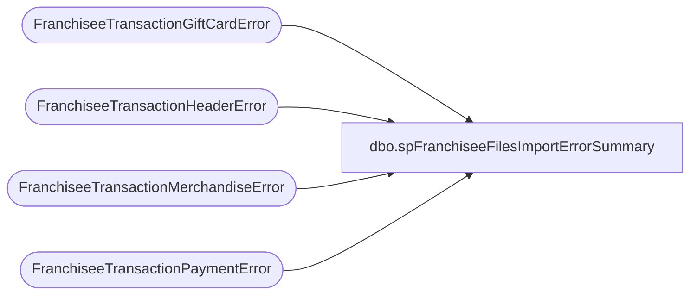

# dbo.spFranchiseeFilesImportErrorSummary

**Database:** DWStaging  
**Server:** papamart  

## Architecture Diagram



## Table Dependencies

| Referenced Table |
|---|
| FranchiseeTransactionGiftCardError |
| FranchiseeTransactionHeaderError |
| FranchiseeTransactionMerchandiseError |
| FranchiseeTransactionPaymentError |

## Stored Procedure Code

```sql
CREATE proc [dbo].[spFranchiseeFilesImportErrorSummary]
@Franchisee varchar(2)

as

set nocount on


Declare
		@TransHeaderFile varchar(25),
		@TransPaymentFile varchar(25),
		@TransMerchFile varchar(25),
		@TransGiftCardFile varchar(25)

Select @TransHeaderFile = 'TransHeader',
	   @TransPaymentFile = 'TransPayment',
	   @TransMerchFile = 'TransMerch',
	   @TransGiftCardFile = 'TransGiftCard'

;
WITH Errors (FileType, ID, ErrorSource, ErrorDesc)
AS (
	select  
			@TransHeaderFile,
			TransactionID,
			ErrorSource,
			ErrorDesc
	from FranchiseeTransactionHeaderError with (nolock) 
	where Franchisee = @Franchisee
	union
	select  
			@TransPaymentFile,
			TransactionID,
			ErrorSource,
			ErrorDesc
	from FranchiseeTransactionPaymentError with (nolock) 
	where Franchisee = @Franchisee
	union
	select  
			@TransMerchFile,
			TransactionID,
			ErrorSource,
			ErrorDesc
	from FranchiseeTransactionMerchandiseError with (nolock) 
	where Franchisee = @Franchisee
	union
	select  
			@TransGiftCardFile,
			TransactionID,
			ErrorSource,
			ErrorDesc
	from FranchiseeTransactionGiftCardError with (nolock) 
	where Franchisee = @Franchisee	
   )
select ID, ErrorDesc
from Errors
where ErrorDesc like '%Empty Column Found'
or ErrorDesc like '%Conversion Error'
or ErrorDesc = 'Insert To DW Error'
group by ID, ErrorDesc
order by ID, ErrorDesc
```

