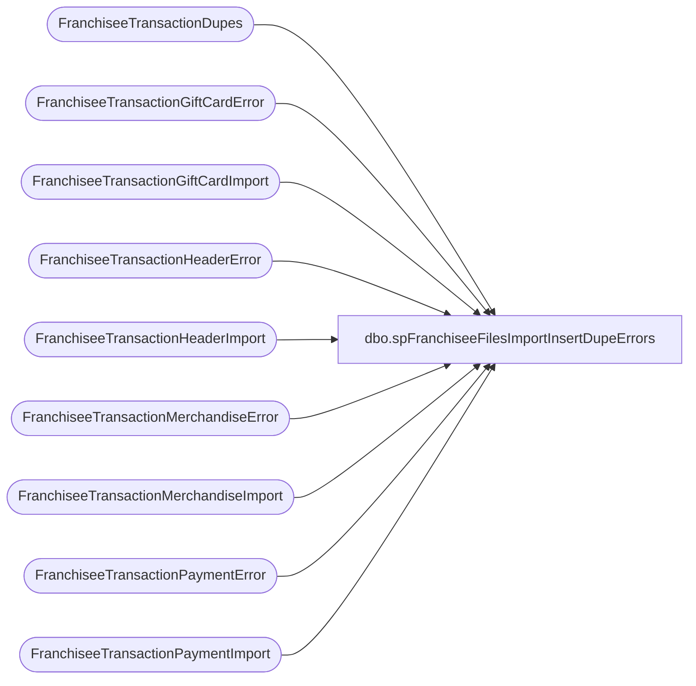

# dbo.spFranchiseeFilesImportInsertDupeErrors

**Database:** DWStaging  
**Server:** papamart  

## Architecture Diagram



## Table Dependencies

| Referenced Table |
|---|
| FranchiseeTransactionDupes |
| FranchiseeTransactionGiftCardError |
| FranchiseeTransactionGiftCardImport |
| FranchiseeTransactionHeaderError |
| FranchiseeTransactionHeaderImport |
| FranchiseeTransactionMerchandiseError |
| FranchiseeTransactionMerchandiseImport |
| FranchiseeTransactionPaymentError |
| FranchiseeTransactionPaymentImport |

## Stored Procedure Code

```sql
CREATE proc [dbo].[spFranchiseeFilesImportInsertDupeErrors]
@Franchisee varchar(2) 

as 

set nocount on

insert FranchiseeTransactionHeaderError
select thi.TransactionID, thi.TransactionDateTime, thi.StoreID, thi.InsertDate, thi.Franchisee, 'Duplicate TransactionID', 'Duplicates Search'
from FranchiseeTransactionHeaderImport thi
where thi.Franchisee = @Franchisee
and exists (select d.TransactionID from FranchiseeTransactionDupes d with (nolock) where thi.TransactionID = d.TransactionID and d.Franchisee = @Franchisee)

insert FranchiseeTransactionPaymentError
select tpi.TransactionID, tpi.PaymentType, tpi.Amount, tpi.InsertDate, tpi.Franchisee, 'Duplicate TransactionID', 'Duplicates Search'
from FranchiseeTransactionPaymentImport tpi
where tpi.Franchisee = @Franchisee
and exists (select d.TransactionID from FranchiseeTransactionDupes d with (nolock) where tpi.TransactionID = d.TransactionID and d.Franchisee = @Franchisee)

insert FranchiseeTransactionMerchandiseError
select tmi.TransactionID, tmi.Style, tmi.Units, tmi.Cost, tmi.GrossSales, tmi.Discount, tmi.VAT, tmi.InsertDate, tmi.Franchisee, 'Duplicate TransactionID', 'Duplicates Search'
from FranchiseeTransactionMerchandiseImport tmi
where tmi.Franchisee = @Franchisee
and exists (select d.TransactionID from FranchiseeTransactionDupes d with (nolock) where tmi.TransactionID = d.TransactionID and d.Franchisee = @Franchisee)

insert FranchiseeTransactionGiftCardError
select tgci.TransactionID, tgci.Units, tgci.GiftCardAmount, tgci.Discount, tgci.InsertDate, tgci.Franchisee, 'Duplicate TransactionID', 'Duplicates Search'
from FranchiseeTransactionGiftCardImport tgci
where tgci.Franchisee = @Franchisee
and exists (select d.TransactionID from FranchiseeTransactionDupes d with (nolock) where tgci.TransactionID = d.TransactionID and d.Franchisee = @Franchisee)
```

