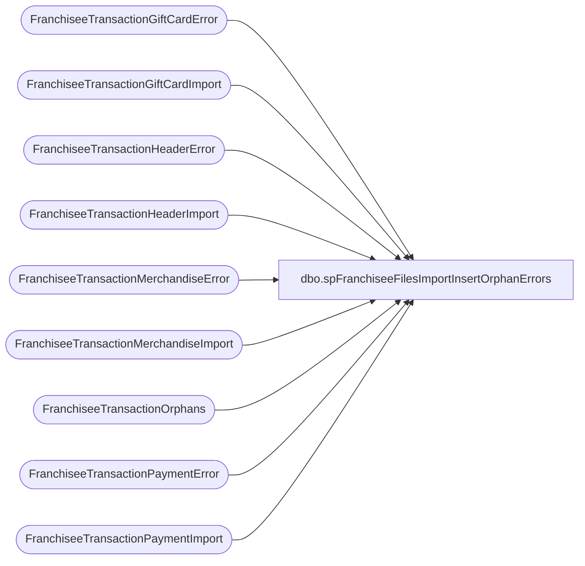

# dbo.spFranchiseeFilesImportInsertOrphanErrors

**Database:** DWStaging  
**Server:** papamart  

## Architecture Diagram



## Table Dependencies

| Referenced Table |
|---|
| FranchiseeTransactionGiftCardError |
| FranchiseeTransactionGiftCardImport |
| FranchiseeTransactionHeaderError |
| FranchiseeTransactionHeaderImport |
| FranchiseeTransactionMerchandiseError |
| FranchiseeTransactionMerchandiseImport |
| FranchiseeTransactionOrphans |
| FranchiseeTransactionPaymentError |
| FranchiseeTransactionPaymentImport |

## Stored Procedure Code

```sql
CREATE proc [dbo].[spFranchiseeFilesImportInsertOrphanErrors]
@Franchisee varchar(2) 

as 

set nocount on


insert FranchiseeTransactionHeaderError
select thi.TransactionID, thi.TransactionDateTime, thi.StoreID, thi.InsertDate, thi.Franchisee, 'Orphan Transaction', 'Orphans Search'
from FranchiseeTransactionHeaderImport thi with (nolock)
where thi.Franchisee = @Franchisee
and exists (select o.TransactionID from FranchiseeTransactionOrphans o with (nolock) where thi.TransactionID = o.TransactionID and o.Franchisee = @Franchisee)

insert FranchiseeTransactionPaymentError
select tpi.TransactionID, tpi.PaymentType, tpi.Amount, tpi.InsertDate, tpi.Franchisee, 'Orphan Transaction', 'Orphans Search'
from FranchiseeTransactionPaymentImport tpi with (nolock)
where tpi.Franchisee = @Franchisee
and exists (select o.TransactionID from FranchiseeTransactionOrphans o with (nolock) where tpi.TransactionID = o.TransactionID and o.Franchisee = @Franchisee)

insert FranchiseeTransactionMerchandiseError
select tmi.TransactionID, tmi.Style, tmi.Units, tmi.Cost, tmi.GrossSales, tmi.Discount, tmi.VAT, tmi.InsertDate, tmi.Franchisee, 'Orphan Transaction', 'Orphans Search'
from FranchiseeTransactionMerchandiseImport tmi with (nolock)
join FranchiseeTransactionOrphans o on tmi.TransactionID = o.TransactionID
where tmi.Franchisee = @Franchisee
and exists (select o.TransactionID from FranchiseeTransactionOrphans o with (nolock) where tmi.TransactionID = o.TransactionID and o.Franchisee = @Franchisee)

insert FranchiseeTransactionGiftCardError
select tgci.TransactionID, tgci.Units, tgci.GiftCardAmount, tgci.Discount, tgci.InsertDate, tgci.Franchisee, 'Orphan Transaction', 'Orphans Search'
from FranchiseeTransactionGiftCardImport tgci with (nolock)
join FranchiseeTransactionOrphans o on tgci.TransactionID = o.TransactionID
where tgci.Franchisee = @Franchisee
and exists (select o.TransactionID from FranchiseeTransactionOrphans o with (nolock) where tgci.TransactionID = o.TransactionID and o.Franchisee = @Franchisee)
```

