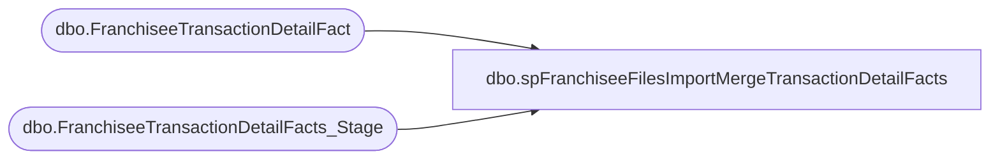

# dbo.spFranchiseeFilesImportMergeTransactionDetailFacts

**Database:** DWStaging  
**Server:** papamart  

## Architecture Diagram



## Table Dependencies

| Referenced Table |
|---|
| dbo.FranchiseeTransactionDetailFact |
| dbo.FranchiseeTransactionDetailFacts_Stage |

## Stored Procedure Code

```sql
CREATE proc [dbo].[spFranchiseeFilesImportMergeTransactionDetailFacts]

as 

-- =====================================================================================================
-- Name: spFranchiseeFilesImportMergeTransactionDetailFacts
--
--Description: Merges data from dwStaging.dbo.FranchiseeTransactionFacts_Stage into dw.dbo.FranchiseeTransactionDetailFact
--				Data to be merged was previously staged by another proc (spFranchiseeFilesImportStageTransactionDetailFacts)
-- Revision History
--		Name:			Date:			Comments:
--		Dan Tweedie		07/27/2016		Created proc.	
-- =====================================================================================================

set nocount on

if (select count(*) from dwStaging.dbo.FranchiseeTransactionDetailFacts_Stage) > 0

BEGIN
		merge into dw.dbo.FranchiseeTransactionDetailFact as target
		using
			(
				select 
					product_key,
					currency_key,			
					transaction_id,
					transaction_line_seq,	 
					register_num,
					cashier_id,
					time_key,
					store_key,
					unit_gross_amount,
					date_key,
					units,
					unit_disc_amount,
					party_y_n,
					transaction_type_key,
					line_object_key,
					transaction_no,
					reference_no,
					vat_tax_amount,
					INS_DT,
					UPDT_DT,
					etl_log_id,
					etl_evnt_id,
					upsell_disc_allocated,
					ext_cost,
					line_action_key
				from dwStaging.dbo.FranchiseeTransactionDetailFacts_Stage
			) as source
		on 
			(
				target.transaction_id = source.transaction_id 
				and 
				target.store_key = source.store_key
				and 
				target.transaction_line_seq = source.transaction_line_seq
			)
		when matched
			and
				(
					isnull(target.product_key, 0) <> isnull(source.product_key, 0) OR
					isnull(target.currency_key, 0) <> isnull(source.currency_key, 0) OR			
					isnull(target.transaction_id, 0) <> isnull(source.transaction_id, 0) OR	 
					isnull(target.register_num, 0) <> isnull(source.register_num, 0) OR
					isnull(target.cashier_id, 0) <> isnull(source.cashier_id, 0) OR
					isnull(target.time_key, 0) <> isnull(source.time_key, 0) OR
					isnull(target.store_key, 0) <> isnull(source.store_key, 0) OR
					isnull(target.unit_gross_amount, 0) <> isnull(source.unit_gross_amount, 0) OR
					isnull(target.date_key, 0) <> isnull(source.date_key, 0) OR
					isnull(target.units, 0) <> isnull(source.units, 0) OR
					isnull(target.unit_disc_amount, 0) <> isnull(source.unit_disc_amount, 0) OR
					isnull(target.party_y_n, 0) <> isnull(source.party_y_n, 0) OR
					isnull(target.transaction_type_key, 0) <> isnull(source.transaction_type_key, 0) OR
					isnull(target.line_object_key, 0) <> isnull(source.line_object_key, 0) OR
					isnull(target.transaction_no, 0) <> isnull(source.transaction_no, 0) OR
					isnull(target.reference_no, 0) <> isnull(source.reference_no, 0) OR 
					isnull(target.vat_tax_amount, 0) <> isnull(source.vat_tax_amount, 0) OR
					isnull(target.upsell_disc_allocated, 0) <> isnull(source.upsell_disc_allocated, 0) OR
					isnull(target.ext_cost, 0) <> isnull(source.ext_cost, 0) OR
					isnull(target.line_action_key, 0) <> isnull(source.line_action_key, 0)
				)
			then UPDATE 
					set
						target.product_key = source.product_key,
						target.currency_key = source.currency_key,
						target.register_num = source.register_num,
						target.cashier_id = source.cashier_id,
						target.time_key = source.time_key,
						target.unit_gross_amount = source.unit_gross_amount,
						target.date_key = source.date_key,
						target.units = source.units,
						target.unit_disc_amount = source.unit_disc_amount,
						target.party_y_n = source.party_y_n,
						target.transaction_type_key = source.transaction_type_key,
						target.line_object_key = source.line_object_key,
						target.transaction_no = source.transaction_no,
						target.reference_no = source.reference_no,
						target.vat_tax_amount = source.vat_tax_amount,
						target.INS_DT = target.INS_DT,
						target.UPDT_DT = getdate(),
						target.etl_log_id = source.etl_log_id,
						target.etl_evnt_id = source.etl_evnt_id,
						target.upsell_disc_allocated = source.upsell_disc_allocated,
						target.ext_cost = source.ext_cost,
						target.line_action_key = source.line_action_key
		When Not Matched By Target 
			Then 
				Insert 
					(
					product_key,
					currency_key,			
					transaction_id,
					transaction_line_seq,	 
					register_num,
					cashier_id,
					time_key,
					store_key,
					unit_gross_amount,
					date_key,
					units,
					unit_disc_amount,
					party_y_n,
					transaction_type_key,
					line_object_key,
					transaction_no,
					reference_no,
					vat_tax_amount,
					INS_DT,
					UPDT_DT,
					etl_log_id,
					etl_evnt_id,
					upsell_disc_allocated,
					ext_cost,
					line_action_key
					)
				values
					(
						source.product_key,
						source.currency_key,			
						source.transaction_id,
						source.transaction_line_seq,	 
						source.register_num,
						source.cashier_id,
						source.time_key,
						source.store_key,
						source.unit_gross_amount,
						source.date_key,
						source.units,
						source.unit_disc_amount,
						source.party_y_n,
						source.transaction_type_key,
						source.line_object_key,
						source.transaction_no,
						source.reference_no,
						source.vat_tax_amount,
						getdate(),
						getdate(),
						source.etl_log_id,
						source.etl_evnt_id,
						source.upsell_disc_allocated,
						source.ext_cost,
						source.line_action_key
					)
		; --A MERGE statement must be terminated by a semi-colon (;).
END
```

