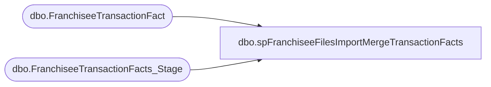

# dbo.spFranchiseeFilesImportMergeTransactionFacts

**Database:** DWStaging  
**Server:** papamart  

## Architecture Diagram



## Table Dependencies

| Referenced Table |
|---|
| dbo.FranchiseeTransactionFact |
| dbo.FranchiseeTransactionFacts_Stage |

## Stored Procedure Code

```sql
CREATE proc [dbo].[spFranchiseeFilesImportMergeTransactionFacts]

as 

-- =====================================================================================================
-- Name: spFranchiseeFilesImportMergeTransactionFacts
--
--Description: Merges data from dwStaging.dbo.FranchiseeTransactionFacts_Stage into dw.dbo.FranchiseeTransactionFact
--				Data to be merged was previously staged by another proc (spFranchiseeFilesImportStageTransactionFacts)
-- Revision History
--		Name:			Date:			Comments:
--		Dan Tweedie		07/27/2016		Created proc.	
--		Dan Tweedie		08/10/2016		Added new columns used for Enterprise Selling (not used for franchisee)
--		Dan Tweedie		08/30/2016		Added gaap_units
-- =====================================================================================================

set nocount on

if (select count(*) from dwStaging.dbo.FranchiseeTransactionFacts_Stage) > 0

BEGIN
		merge into dw.dbo.FranchiseeTransactionFact as target
		using
			(
				select 
					transaction_id,
					store_key,
					date_key,
					time_key,
					transaction_type_key,
					currency_key,
					transaction_key,
					transaction_no,
					register_no,
					line_count,
					party_flag,
					GAAP_transaction_flag,
					donation_only_flag,
					giftcard_only_flag,
					party_deposit_only_flag,
					GAAP_sales_amount,
					net_sales_amount,
					total_units,
					unit_net_amount,
					unit_gross_amount,
					reward_certificate_amount,
					buy_stuff_amount,
					tax_amount,
					redemption_amount,
					unit_discount_amount,
					coupon_discount_amount,
					coupon_discount_units,
					giftcard_discount_amount,
					total_discount_amount,
					receipt_total_amount,
					merchandise_uga,
					merchandise_units,
					gaap_units,
					donations_UGA,
					donations_units,
					party_deposit_UGA,
					party_deposit_units,
					giftcard_uga,
					giftcard_units,
					animal_UGA,
					animal_units,
					non_animal_UGA,
					non_animal_units,
					footwear_UGA,
					footwear_units,
					accessories_UGA,
					accessories_units,
					sounds_UGA,
					sounds_units,
					clothing_UGA,
					clothing_units,
					other_UGA,
					other_units,
					shipping_UGA,
					shipping_units,
					other_fees_UGA,
					other_fees_units,
					cub_cash_UGA,
					cub_cash_units,
					paid_outs_UGA,
					paid_outs_units,
					stuffing_supplies_UGA,
					stuffing_supplies_units,
					sports_UGA,
					sports_units,
					prestuffed_UGA,
					prestuffed_units,
					fin_GAAP_sales_amount,
					upsell_discount_amount,
					cashier_key,
					merchandise_cost,
					animal_cost,
					non_animal_cost,
					footwear_cost,
					accessories_cost,
					sounds_cost,
					clothing_cost,
					other_cost,
					sports_cost,
					prestuffed_cost,
					Scents_UGA,
					Scents_units,
					Scents_cost,
					Store_transaction_flag,
					Store_Sales_Amount,
					Store_units,
					fin_Store_sales_amount
				from dwStaging.dbo.FranchiseeTransactionFacts_Stage
			) as source
		on 
			(
				target.transaction_id = source.transaction_id 
				and 
				target.store_key = source.store_key
			)
		when matched
			and
				(
					isnull(target.date_key,0) <> isnull(source.date_key,0) OR
					isnull(target.time_key,0) <> isnull(source.time_key,0) OR
					isnull(target.transaction_type_key,0) <> isnull(source.transaction_type_key,0) OR
					isnull(target.currency_key,0) <> isnull(source.currency_key,0) OR
					isnull(target.transaction_key,0) <> isnull(source.transaction_key,0) OR
					isnull(target.transaction_no,0) <> isnull(source.transaction_no,0) OR
					isnull(target.register_no,0) <> isnull(source.register_no,0) OR
					isnull(target.line_count,0) <> isnull(source.line_count,0) OR
					isnull(target.party_flag,0) <> isnull(source.party_flag,0) OR
					isnull(target.GAAP_transaction_flag,0) <> isnull(source.GAAP_transaction_flag,0) OR
					isnull(target.donation_only_flag,0) <> isnull(source.donation_only_flag,0) OR
					isnull(target.giftcard_only_flag,0) <> isnull(source.giftcard_only_flag,0) OR
					isnull(target.party_deposit_only_flag,0) <> isnull(source.party_deposit_only_flag,0) OR
					isnull(target.GAAP_sales_amount,0) <> isnull(source.GAAP_sales_amount,0) OR
					isnull(target.net_sales_amount,0) <> isnull(source.net_sales_amount,0) OR
					isnull(target.total_units,0) <> isnull(source.total_units,0) OR
					isnull(target.unit_net_amount,0) <> isnull(source.unit_net_amount,0) OR
					isnull(target.unit_gross_amount,0) <> isnull(source.unit_gross_amount,0) OR
					isnull(target.reward_certificate_amount,0) <> isnull(source.reward_certificate_amount,0) OR
					isnull(target.buy_stuff_amount,0) <> isnull(source.buy_stuff_amount,0) OR
					isnull(target.tax_amount,0) <> isnull(source.tax_amount,0) OR
					isnull(target.redemption_amount,0) <> isnull(source.redemption_amount,0) OR
					isnull(target.unit_discount_amount,0) <> isnull(source.unit_discount_amount,0) OR
					isnull(target.coupon_discount_amount,0) <> isnull(source.coupon_discount_amount,0) OR
					isnull(target.coupon_discount_units,0) <> isnull(source.coupon_discount_units,0) OR
					isnull(target.giftcard_discount_amount,0) <> isnull(source.giftcard_discount_amount,0) OR
					isnull(target.total_discount_amount,0) <> isnull(source.total_discount_amount,0) OR
					isnull(target.receipt_total_amount,0) <> isnull(source.receipt_total_amount,0) OR
					isnull(target.merchandise_uga,0) <> isnull(source.merchandise_uga,0) OR
					isnull(target.merchandise_units,0) <> isnull(source.merchandise_units,0) OR
					isnull(target.gaap_units,0) <> isnull(source.gaap_units,0) OR
					isnull(target.donations_UGA,0) <> isnull(source.donations_UGA,0) OR
					isnull(target.donations_units,0) <> isnull(source.donations_units,0) OR
					isnull(target.party_deposit_UGA,0) <> isnull(source.party_deposit_UGA,0) OR
					isnull(target.party_deposit_units,0) <> isnull(source.party_deposit_units,0) OR
					isnull(target.giftcard_uga,0) <> isnull(source.giftcard_uga,0) OR
					isnull(target.giftcard_units,0) <> isnull(source.giftcard_units,0) OR
					isnull(target.animal_UGA,0) <> isnull(source.animal_UGA,0) OR
					isnull(target.animal_units,0) <> isnull(source.animal_units,0) OR
					isnull(target.non_animal_UGA,0) <> isnull(source.non_animal_UGA,0) OR
					isnull(target.non_animal_units,0) <> isnull(source.non_animal_units,0) OR
					isnull(target.footwear_UGA,0) <> isnull(source.footwear_UGA,0) OR
					isnull(target.footwear_units,0) <> isnull(source.footwear_units,0) OR
					isnull(target.accessories_UGA,0) <> isnull(source.accessories_UGA,0) OR
					isnull(target.accessories_units,0) <> isnull(source.accessories_units,0) OR
					isnull(target.sounds_UGA,0) <> isnull(source.sounds_UGA,0) OR
					isnull(target.sounds_units,0) <> isnull(source.sounds_units,0) OR
					isnull(target.clothing_UGA,0) <> isnull(source.clothing_UGA,0) OR
					isnull(target.clothing_units,0) <> isnull(source.clothing_units,0) OR
					isnull(target.other_UGA,0) <> isnull(source.other_UGA,0) OR
					isnull(target.other_units,0) <> isnull(source.other_units,0) OR
					isnull(target.shipping_UGA,0) <> isnull(source.shipping_UGA,0) OR
					isnull(target.shipping_units,0) <> isnull(source.shipping_units,0) OR
					isnull(target.other_fees_UGA,0) <> isnull(source.other_fees_UGA,0) OR
					isnull(target.other_fees_units,0) <> isnull(source.other_fees_units,0) OR
					isnull(target.cub_cash_UGA,0) <> isnull(source.cub_cash_UGA,0) OR
					isnull(target.cub_cash_units,0) <> isnull(source.cub_cash_units,0) OR
					isnull(target.paid_outs_UGA,0) <> isnull(source.paid_outs_UGA,0) OR
					isnull(target.paid_outs_units,0) <> isnull(source.paid_outs_units,0) OR
					isnull(target.stuffing_supplies_UGA,0) <> isnull(source.stuffing_supplies_UGA,0) OR
					isnull(target.stuffing_supplies_units,0) <> isnull(source.stuffing_supplies_units,0) OR
					isnull(target.sports_UGA,0) <> isnull(source.sports_UGA,0) OR
					isnull(target.sports_units,0) <> isnull(source.sports_units,0) OR
					isnull(target.prestuffed_UGA,0) <> isnull(source.prestuffed_UGA,0) OR
					isnull(target.prestuffed_units,0) <> isnull(source.prestuffed_units,0) OR
					isnull(target.fin_GAAP_sales_amount,0) <> isnull(source.fin_GAAP_sales_amount,0) OR
					isnull(target.upsell_discount_amount,0) <> isnull(source.upsell_discount_amount,0) OR
					isnull(target.cashier_key,0) <> isnull(source.cashier_key,0) OR
					isnull(target.merchandise_cost,0) <> isnull(source.merchandise_cost,0) OR
					isnull(target.animal_cost,0) <> isnull(source.animal_cost,0) OR
					isnull(target.non_animal_cost,0) <> isnull(source.non_animal_cost,0) OR
					isnull(target.footwear_cost,0) <> isnull(source.footwear_cost,0) OR
					isnull(target.accessories_cost,0) <> isnull(source.accessories_cost,0) OR
					isnull(target.sounds_cost,0) <> isnull(source.sounds_cost,0) OR
					isnull(target.clothing_cost,0) <> isnull(source.clothing_cost,0) OR
					isnull(target.other_cost,0) <> isnull(source.other_cost,0) OR
					isnull(target.sports_cost,0) <> isnull(source.sports_cost,0) OR
					isnull(target.prestuffed_cost,0) <> isnull(source.prestuffed_cost,0) OR
					isnull(target.Scents_UGA,0) <> isnull(source.Scents_UGA,0) OR
					isnull(target.Scents_units,0) <> isnull(source.Scents_units,0) OR
					isnull(target.Scents_cost,0) <> isnull(source.Scents_cost,0) OR
					isnull(target.Store_transaction_flag,0) <> isnull(source.Store_transaction_flag,0) OR
					isnull(target.Store_Sales_Amount,0) <> isnull(source.Store_Sales_Amount,0) OR
					isnull(target.Store_units,0) <> isnull(source.Store_units,0) OR
					isnull(target.fin_Store_sales_amount,0) <> isnull(source.fin_Store_sales_amount,0) 
				)
			then UPDATE 
					set
						target.date_key = source.date_key,
						target.time_key = source.time_key,
						target.transaction_type_key = source.transaction_type_key, 
						target.currency_key = source.currency_key, 
						target.transaction_key = source.transaction_key, 
						target.transaction_no = source.transaction_no, 
						target.register_no = source.register_no, 
						target.line_count = source.line_count, 
						target.party_flag = source.party_flag, 
						target.GAAP_transaction_flag = source.GAAP_transaction_flag, 
						target.donation_only_flag = source.donation_only_flag, 
						target.giftcard_only_flag = source.giftcard_only_flag, 
						target.party_deposit_only_flag = source.party_deposit_only_flag, 
						target.GAAP_sales_amount = source.GAAP_sales_amount, 
						target.net_sales_amount = source.net_sales_amount, 
						target.total_units = source.total_units, 
						target.unit_net_amount = source.unit_net_amount, 
						target.unit_gross_amount = source.unit_gross_amount, 
						target.reward_certificate_amount = source.reward_certificate_amount, 
						target.buy_stuff_amount = source.buy_stuff_amount, 
						target.tax_amount = source.tax_amount,
						target.redemption_amount = source.redemption_amount, 
						target.unit_discount_amount = source.unit_discount_amount, 
						target.coupon_discount_amount = source.coupon_discount_amount, 
						target.coupon_discount_units = source.coupon_discount_units, 
						target.giftcard_discount_amount = source.giftcard_discount_amount, 
						target.total_discount_amount = source.total_discount_amount, 
						target.receipt_total_amount = source.receipt_total_amount, 
						target.merchandise_uga = source.merchandise_uga, 
						target.merchandise_units = source.merchandise_units, 
						target.gaap_units = source.gaap_units, 
						target.donations_UGA = source.donations_UGA, 
						target.donations_units = source.donations_units, 
						target.party_deposit_UGA = source.party_deposit_UGA, 
						target.party_deposit_units = source.party_deposit_units, 
						target.giftcard_uga = source.giftcard_uga, 
						target.giftcard_units = source.giftcard_units, 
						target.animal_UGA = source.animal_UGA, 
						target.animal_units = source.animal_units, 
						target.non_animal_UGA = source.non_animal_UGA, 
						target.non_animal_units = source.non_animal_units, 
						target.footwear_UGA = source.footwear_UGA, 
						target.footwear_units = source.footwear_units, 
						target.accessories_UGA = source.accessories_UGA, 
						target.accessories_units = source.accessories_units, 
						target.sounds_UGA = source.sounds_UGA, 
						target.sounds_units = source.sounds_units, 
						target.clothing_UGA = source.clothing_UGA, 
						target.clothing_units = source.clothing_units, 
						target.other_UGA = source.other_UGA, 
						target.other_units = source.other_units, 
						target.shipping_UGA = source.shipping_UGA, 
						target.shipping_units = source.shipping_units, 
						target.other_fees_UGA = source.other_fees_UGA, 
						target.other_fees_units = source.other_fees_units, 
						target.cub_cash_UGA = source.cub_cash_UGA, 
						target.cub_cash_units = source.cub_cash_units, 
						target.paid_outs_UGA = source.paid_outs_UGA,
						target.paid_outs_units = source.paid_outs_units, 
						target.stuffing_supplies_UGA = source.stuffing_supplies_UGA, 
						target.stuffing_supplies_units = source.stuffing_supplies_units, 
						target.sports_UGA = source.sports_UGA, 
						target.sports_units = source.sports_units, 
						target.prestuffed_UGA = source.prestuffed_UGA, 
						target.prestuffed_units = source.prestuffed_units, 
						target.fin_GAAP_sales_amount = source.fin_GAAP_sales_amount, 
						target.upsell_discount_amount = source.upsell_discount_amount, 
						target.cashier_key = source.cashier_key, 
						target.merchandise_cost = source.merchandise_cost, 
						target.animal_cost = source.animal_cost, 
						target.non_animal_cost = source.non_animal_cost, 
						target.footwear_cost = source.footwear_cost, 
						target.accessories_cost = source.accessories_cost, 
						target.sounds_cost = source.sounds_cost, 
						target.clothing_cost = source.clothing_cost, 
						target.other_cost = source.other_cost, 
						target.sports_cost = source.sports_cost, 
						target.prestuffed_cost = source.prestuffed_cost, 
						target.Scents_UGA = source.Scents_UGA, 
						target.Scents_units = source.Scents_units, 
						target.Scents_cost = source.Scents_cost, 
						target.Store_transaction_flag = source.Store_transaction_flag, 
						target.Store_Sales_Amount = source.Store_Sales_Amount, 
						target.Store_units = source.Store_units, 
						target.fin_Store_sales_amount = source.fin_Store_sales_amount,
						target.INS_DT = target.INS_DT,
						target.UPDT_DT = getdate()
		When Not Matched By Target 
			Then 
				Insert 
					(
						transaction_id,
						store_key,
						date_key,
						time_key,
						transaction_type_key,
						currency_key,
						transaction_key,
						transaction_no,
						register_no,
						line_count,
						party_flag,
						GAAP_transaction_flag,
						donation_only_flag,
						giftcard_only_flag,
						party_deposit_only_flag,
						GAAP_sales_amount,
						net_sales_amount,
						total_units,
						unit_net_amount,
						unit_gross_amount,
						reward_certificate_amount,
						buy_stuff_amount,
						tax_amount,
						redemption_amount,
						unit_discount_amount,
						coupon_discount_amount,
						coupon_discount_units,
						giftcard_discount_amount,
						total_discount_amount,
						receipt_total_amount,
						merchandise_uga,
						merchandise_units,
						gaap_units,
						donations_UGA,
						donations_units,
						party_deposit_UGA,
						party_deposit_units,
						giftcard_uga,
						giftcard_units,
						animal_UGA,
						animal_units,
						non_animal_UGA,
						non_animal_units,
						footwear_UGA,
						footwear_units,
						accessories_UGA,
						accessories_units,
						sounds_UGA,
						sounds_units,
						clothing_UGA,
						clothing_units,
						other_UGA,
						other_units,
						shipping_UGA,
						shipping_units,
						other_fees_UGA,
						other_fees_units,
						cub_cash_UGA,
						cub_cash_units,
						paid_outs_UGA,
						paid_outs_units,
						stuffing_supplies_UGA,
						stuffing_supplies_units,
						sports_UGA,
						sports_units,
						prestuffed_UGA,
						prestuffed_units,
						fin_GAAP_sales_amount,
						upsell_discount_amount,
						cashier_key,
						merchandise_cost,
						animal_cost,
						non_animal_cost,
						footwear_cost,
						accessories_cost,
						sounds_cost,
						clothing_cost,
						other_cost,
						sports_cost,
						prestuffed_cost,
						Scents_UGA,
						Scents_units,
						Scents_cost,
						Store_transaction_flag,
						Store_Sales_Amount,
						Store_units,
						fin_Store_sales_amount,
						INS_DT,
						UPDT_DT,
						Enterprise_Selling_Amount,
						Enterprise_Selling_Only_Flag,
						Enterprise_Selling_Units
					)
				values
					(
						source.transaction_id,
						source.store_key,
						source.date_key,
						source.time_key,
						source.transaction_type_key,
						source.currency_key,
						source.transaction_key,
						source.transaction_no,
						source.register_no,
						source.line_count,
						source.party_flag,
						source.GAAP_transaction_flag,
						source.donation_only_flag,
						source.giftcard_only_flag,
						source.party_deposit_only_flag,
						source.GAAP_sales_amount,
						source.net_sales_amount,
						source.total_units,
						source.unit_net_amount,
						source.unit_gross_amount,
						source.reward_certificate_amount,
						source.buy_stuff_amount,
						source.tax_amount,
						source.redemption_amount,
						source.unit_discount_amount,
						source.coupon_discount_amount,
						source.coupon_discount_units,
						source.giftcard_discount_amount,
						source.total_discount_amount,
						source.receipt_total_amount,
						source.merchandise_uga,
						source.merchandise_units,
						source.gaap_units,
						source.donations_UGA,
						source.donations_units,
						source.party_deposit_UGA,
						source.party_deposit_units,
						source.giftcard_uga,
						source.giftcard_units,
						source.animal_UGA,
						source.animal_units,
						source.non_animal_UGA,
						source.non_animal_units,
						source.footwear_UGA,
						source.footwear_units,
						source.accessories_UGA,
						source.accessories_units,
						source.sounds_UGA,
						source.sounds_units,
						source.clothing_UGA,
						source.clothing_units,
						source.other_UGA,
						source.other_units,
						source.shipping_UGA,
						source.shipping_units,
						source.other_fees_UGA,
						source.other_fees_units,
						source.cub_cash_UGA,
						source.cub_cash_units,
						source.paid_outs_UGA,
						source.paid_outs_units,
						source.stuffing_supplies_UGA,
						source.stuffing_supplies_units,
						source.sports_UGA,
						source.sports_units,
						source.prestuffed_UGA,
						source.prestuffed_units,
						source.fin_GAAP_sales_amount,
						source.upsell_discount_amount,
						source.cashier_key,
						source.merchandise_cost,
						source.animal_cost,
						source.non_animal_cost,
						source.footwear_cost,
						source.accessories_cost,
						source.sounds_cost,
						source.clothing_cost,
						source.other_cost,
						source.sports_cost,
						source.prestuffed_cost,
						source.Scents_UGA,
						source.Scents_units,
						source.Scents_cost,
						source.Store_transaction_flag,
						source.Store_Sales_Amount,
						source.Store_units,
						source.fin_Store_sales_amount,
						getdate(),
						getdate(),
						0,
						0,
						0
					)
		; --A MERGE statement must be terminated by a semi-colon (;).
END
```

