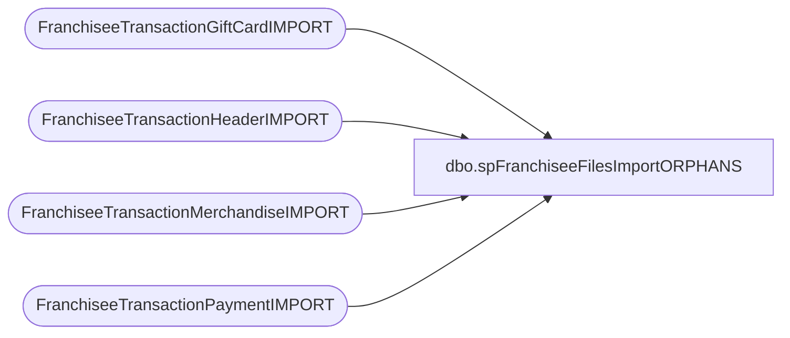

# dbo.spFranchiseeFilesImportORPHANS

**Database:** DWStaging  
**Server:** papamart  

## Architecture Diagram



## Table Dependencies

| Referenced Table |
|---|
| FranchiseeTransactionGiftCardIMPORT |
| FranchiseeTransactionHeaderIMPORT |
| FranchiseeTransactionMerchandiseIMPORT |
| FranchiseeTransactionPaymentIMPORT |

## Stored Procedure Code

```sql
CREATE proc [dbo].[spFranchiseeFilesImportORPHANS]
@Franchisee varchar(2)

as

set nocount on;

WITH 
HeaderOrphans (TransactionType, TransactionID, PaymentRecords, MerchandiseRecords, GiftCardRecords)
AS ( 
	--Header must have Payment and (Merch OR GiftCard)
	select 'Transaction Header' as TransactionType,
		th.TransactionID,
		count(tp.TransactionID) PaymentRecords,
		count(tm.TransactionID) MerchandiseRecords,
		count(tgc.TransactionID) GiftCardRecords
	from FranchiseeTransactionHeaderIMPORT th
	left join FranchiseeTransactionPaymentIMPORT tp on th.TransactionID = tp.TransactionID and th.Franchisee = tp.Franchisee
	left join FranchiseeTransactionMerchandiseIMPORT tm on th.TransactionID = tm.TransactionID and th.Franchisee = tm.Franchisee
	left join FranchiseeTransactionGiftCardIMPORT tgc on th.TransactionID = tgc.TransactionID and th.Franchisee = tgc.Franchisee
	where th.Franchisee = @Franchisee
	and
	(tp.TransactionID is NULL 
		 OR (tm.TransactionID is NULL AND tgc.TransactionID is NULL) )
	group by th.TransactionID
	),
PaymentOrphans (TransactionType, TransactionID, HeaderRecords, MerchandiseRecords, GiftCardRecords)
AS (
	--Payment must have Header and (Merch or GiftCard)
	select 'Transaction Payment' as TransactionType,
		tp.TransactionID,
		count(th.TransactionID) HeaderRecords,
		count(tm.TransactionID) MerchandiseRecords,
		count(tgc.TransactionID) GiftCardRecords
	from FranchiseeTransactionPaymentIMPORT tp 
	left join FranchiseeTransactionHeaderIMPORT th on tp.TransactionID = th.TransactionID and tp.Franchisee = th.Franchisee
	left join FranchiseeTransactionMerchandiseIMPORT tm on tp.TransactionID = tm.TransactionID and tp.Franchisee = tm.Franchisee
	left join FranchiseeTransactionGiftCardIMPORT tgc on tp.TransactionID = tgc.TransactionID and tp.Franchisee = tgc.Franchisee
	where tp.Franchisee = @Franchisee
	and
	(th.TransactionID is NULL
	OR (tm.TransactionID is NULL AND tgc.TransactionID is NULL) )
	group by tp.TransactionID
	),
MerchandiseOrphans (TransactionType, TransactionID, HeaderRecords, PaymentRecords, GiftCardRecords)
AS (
	--Merch must have Header and Payment
	select 'Transaction Merchandise' as TransactionType,
		tm.TransactionID,
		count(th.TransactionID) HeaderRecords,
		count(tp.TransactionID) PaymentRecords,
		count(tgc.TransactionID) GiftCardRecords
	from FranchiseeTransactionMerchandiseIMPORT tm
	left join FranchiseeTransactionHeaderIMPORT th on tm.TransactionID = th.TransactionID and tm.Franchisee = th.Franchisee
	left join FranchiseeTransactionPaymentIMPORT tp on tm.TransactionID = tp.TransactionID and tm.Franchisee = tp.Franchisee
	left join FranchiseeTransactionGiftCardIMPORT tgc on tm.TransactionID = tgc.TransactionID and tm.Franchisee = tgc.Franchisee
	where tm.Franchisee = @Franchisee
	and (th.TransactionID is NULL or tp.TransactionID is NULL)
	group by tm.TransactionID
	),
GiftCardOrphans (TransactionType, TransactionID, HeaderRecords, PaymentRecords, MerchandiseRecords)
AS ( 
	--GiftCard must have Header and Payment
	select 'Transaction GiftCard' as TransactionType,
		tgc.TransactionID,
		count(th.TransactionID) HeaderRecords,
		count(tp.TransactionID) PaymentRecords,
		count(tm.TransactionID) MerchandiseRecords
	from FranchiseeTransactionGiftCardIMPORT tgc
	left join FranchiseeTransactionHeaderIMPORT th on tgc.TransactionID = th.TransactionID and tgc.Franchisee = th.Franchisee
	left join FranchiseeTransactionPaymentIMPORT tp on tgc.TransactionID = tp.TransactionID and tgc.Franchisee = tp.Franchisee
	left join FranchiseeTransactionMerchandiseIMPORT tm on tgc.TransactionID = tm.TransactionID and tgc.Franchisee = tm.Franchisee
	where tgc.Franchisee = @Franchisee 
	and (th.TransactionID is NULL or tp.TransactionID is NULL)
	group by tgc.TransactionID
	),
--Errors (TransactionID)
--AS (
--		select distinct TransactionID from FranchiseeTransactionHeaderError with (nolock) where Franchisee = @Franchisee and ErrorDesc like '%EmptyColumnsFound'
--		union
--		select distinct TransactionID from FranchiseeTransactionPaymentError with (nolock) where Franchisee = @Franchisee and ErrorDesc like '%EmptyColumnsFound'
--		union
--		select distinct  TransactionID from FranchiseeTransactionMerchandiseError with (nolock) where Franchisee = @Franchisee and ErrorDesc like '%EmptyColumnsFound'
--		union
--		select distinct  TransactionID from FranchiseeTransactionGiftCardError with (nolock) where Franchisee = @Franchisee and ErrorDesc like '%EmptyColumnsFound'
--	),
Summary (TransactionID, HeaderRecords, PaymentRecords, MerchandiseRecords, GiftCardRecords)
AS (
	select 
		TransactionID, 
		'YES' HeaderRecords,
		case when PaymentRecords = 0 then 'NO' else 'YES' end as PaymentRecords,
		case when MerchandiseRecords = 0 then 'NO' else 'YES' end as MerchandiseRecords, 
		case when GiftCardRecords = 0 then 'NO' else 'YES' end as GiftCardRecords
	from HeaderOrphans
	union 
	select 
		TransactionID,
		case when HeaderRecords = 0 then 'NO' else 'YES' end as HeaderRecords,
		'YES' as PaymentRecords, 
		case when MerchandiseRecords = 0 then 'NO' else 'YES' end as MerchandiseRecords, 
		case when GiftCardRecords = 0 then 'NO' else 'YES' end as GiftCardRecords
	from PaymentOrphans
	union
	select 
		TransactionID,
		case when HeaderRecords = 0 then 'NO' else 'YES' end as HeaderRecords,
		case when PaymentRecords = 0 then 'NO' else 'YES' end as PaymentRecords, 
		'YES' MerchandiseRecords,
		case when GiftCardRecords = 0 then 'NO' else 'YES' end as GiftCardRecords
	from MerchandiseOrphans
	union
	select 
		TransactionID,
		case when HeaderRecords = 0 then 'NO' else 'YES' end as HeaderRecords,
		case when PaymentRecords = 0 then 'NO' else 'YES' end as PaymentRecords, 
		case when MerchandiseRecords = 0 then 'NO' else 'YES' end as MerchandiseRecords, 
		'YES' GiftCardRecords
	from GiftCardOrphans
	)
select @Franchisee as Franchisee, s.TransactionID, s.HeaderRecords, s.PaymentRecords, s.MerchandiseRecords, s.GiftCardRecords,
	   case when HeaderRecords <> 'YES' 
				then 'Header Missing'
			when PaymentRecords <> 'Yes' 
				then 'Payment Missing'
			when MerchandiseRecords = 'NO' and GiftCardRecords = 'NO'
				then 'Merchandise OR GiftCard Missing'
		end as OrphanMessage
		--,
		--case 
		--	when e.TransactionID is not NULL then 'YES' else 'NO'
		--end as 'EmptyColumnsFound'
from Summary s
--left join Errors e on s.TransactionID = e.TransactionID
--where e.TransactionID is NULL
order by s.TransactionID
```

