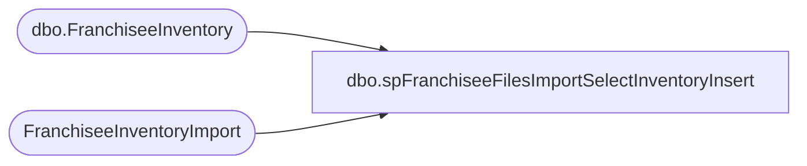

# dbo.spFranchiseeFilesImportSelectInventoryInsert

**Database:** DWStaging  
**Server:** papamart  

## Architecture Diagram



## Table Dependencies

| Referenced Table |
|---|
| dbo.FranchiseeInventory |
| FranchiseeInventoryImport |

## Stored Procedure Code

```sql
CREATE proc [dbo].[spFranchiseeFilesImportSelectInventoryInsert]
@Franchisee varchar(2)

as

set nocount on;

WITH 
DWInventory (InventoryID)
AS (
	select distinct dw.InventoryID
	from DW.dbo.FranchiseeInventory dw with (nolock)
	join FranchiseeInventoryImport i with (nolock)
		on dw.InventoryID = cast (	(i.Franchisee + convert(varchar, i.InventoryDate, 112) + cast(i.StoreID as varchar) ) as varchar(25) )
   )
Delete from DW.dbo.FranchiseeInventory
where InventoryID in (select InventoryID from DWInventory); --Per the specification guide, the data in DW will be purged and replaced with data from Franchisee, 
															--this code does that by Franchisee, Store and Date, based on the ID

--WITH 
--Errors (InventoryID, StoreID, Style, InventoryDate, OnHand, Cost)
--AS (
--	select distinct cast (	(@Franchisee + convert(varchar, InventoryDate, 112) + cast(StoreID as varchar) ) as varchar(25) ) InventoryID,
--					StoreID, 
--					Style, 
--					InventoryDate, 
--					OnHand, 
--					Cost 
--	from FranchiseeInventoryError with (nolock) 
--	where Franchisee = @Franchisee
--   ),
--InventoryImport (InventoryID, InventoryLineNo, StoreID, InventoryDate, Style, OnHand, Cost, InsertDate, Franchisee)
--AS ( 
	select 
			cast (
			(
				  i.Franchisee 
				+ convert(varchar, i.InventoryDate, 112) 
				+ cast(i.StoreID as varchar) 
			) as varchar(25) ) as InventoryID,
		   cast ( row_number() over (partition by i.StoreID, i.InventoryDate order by i.Style, i.OnHand, i.Cost) as int) as InventoryLineNo,
		   i.StoreID,
		   i.InventoryDate,
		   i.Style,
		   i.OnHand,
		   i.Cost,
		   i.InsertDate,
		   i.Franchisee
	from FranchiseeInventoryImport i
	where i.Franchisee = @Franchisee
--   )
--select InventoryID, InventoryLineNo, StoreID, InventoryDate, Style, OnHand, Cost, InsertDate, Franchisee
--from InventoryImport
--where InventoryID + cast(Style as varchar) not in (select e.InventoryID + cast(e.Style as varchar) from Errors e where e.InventoryID = InventoryID and e.Style = Style)
```

