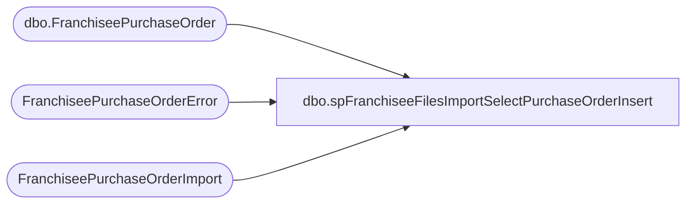

# dbo.spFranchiseeFilesImportSelectPurchaseOrderInsert

**Database:** DWStaging  
**Server:** papamart  

## Architecture Diagram



## Table Dependencies

| Referenced Table |
|---|
| dbo.FranchiseePurchaseOrder |
| FranchiseePurchaseOrderError |
| FranchiseePurchaseOrderImport |

## Stored Procedure Code

```sql
CREATE proc [dbo].[spFranchiseeFilesImportSelectPurchaseOrderInsert]
@Franchisee varchar(2)

as

set nocount on;

if exists (select top 1 * from FranchiseePurchaseOrderImport where Franchisee = @Franchisee) 
delete from DW.dbo.FranchiseePurchaseOrder where Franchisee = @Franchisee; --Per the specification guide, the PO's in DW are purged and replaced with the snapshot provided by Franchisee


WITH 
Errors (PurchaseOrderID)
as (
	select PurchaseOrderID from FranchiseePurchaseOrderError with (nolock) where Franchisee = @Franchisee
   )
select i.PurchaseOrderID,
	   row_number() over (partition by i.PurchaseOrderID order by i.WarehouseID, i.Style, i.DueDate) as PurchaseOrderLineID,
	   i.WarehouseID,
	   i.Style,
	   i.Units,
	   i.LinePrice,
	   i.DueDate,
	   i.InsertDate,
	   i.Franchisee
from FranchiseePurchaseOrderImport i with (nolock)
where i.Franchisee = @Franchisee
and not exists (select e.PurchaseOrderID from Errors e where i.PurchaseOrderID = e.PurchaseOrderID)
order by 1, 2
```

