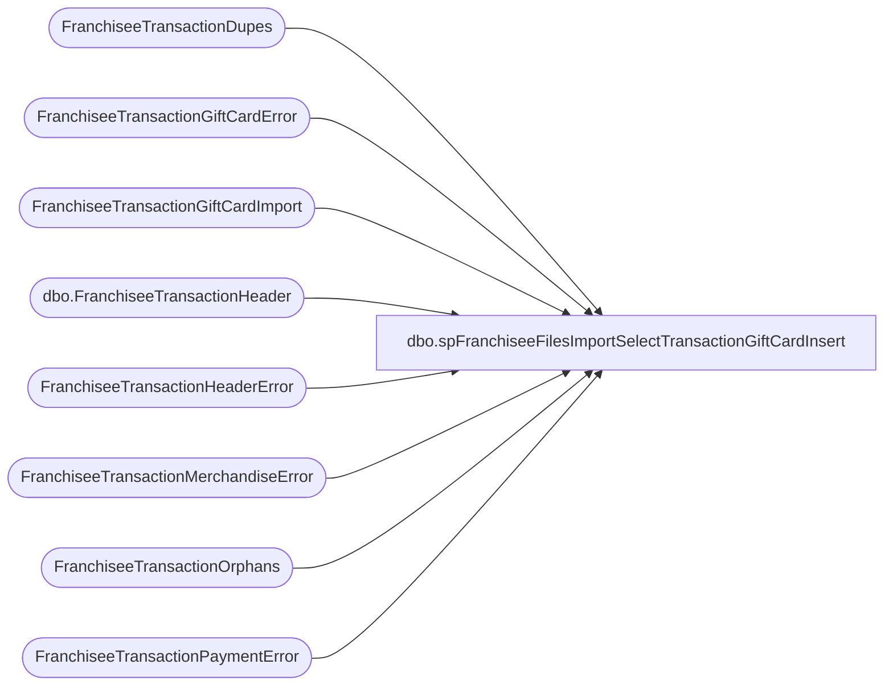

# dbo.spFranchiseeFilesImportSelectTransactionGiftCardInsert

**Database:** DWStaging  
**Server:** papamart  

## Architecture Diagram



## Table Dependencies

| Referenced Table |
|---|
| FranchiseeTransactionDupes |
| FranchiseeTransactionGiftCardError |
| FranchiseeTransactionGiftCardImport |
| dbo.FranchiseeTransactionHeader |
| FranchiseeTransactionHeaderError |
| FranchiseeTransactionMerchandiseError |
| FranchiseeTransactionOrphans |
| FranchiseeTransactionPaymentError |

## Stored Procedure Code

```sql
CREATE proc [dbo].[spFranchiseeFilesImportSelectTransactionGiftCardInsert]
@Franchisee varchar(2)

as

-- =====================================================================================================
-- Name: spFranchiseeFilesImportSelectTransactionGiftCardInsert
--
-- Description:	Called from SSIS FranchiseeFilesImport. 
--				This proc's purpose is to return a dataset that will be inserted into a table via SSIS
--				 
-- Revision History
--		Name:			Date:			Comments:
--		Dan Tweedie		02/08/2016		Created proc.
--		Dan Tweedie		07/08/2106		Added UpdateDate
-- =====================================================================================================

set nocount on;

WITH Errors (TransactionID)
AS (
	select distinct TransactionID from FranchiseeTransactionHeaderError with (nolock) where Franchisee = @Franchisee
	union
	select distinct TransactionID from FranchiseeTransactionPaymentError with (nolock) where Franchisee = @Franchisee
	union
	select distinct  TransactionID from FranchiseeTransactionMerchandiseError with (nolock) where Franchisee = @Franchisee
	union
	select distinct  TransactionID from FranchiseeTransactionGiftCardError with (nolock) where Franchisee = @Franchisee
	union
	select distinct  TransactionID from FranchiseeTransactionDupes with (nolock) where Franchisee = @Franchisee
	union
	select distinct  TransactionID from FranchiseeTransactionOrphans with (nolock) where Franchisee = @Franchisee
   )
select th.FranchiseeTransactionHeaderID,
	   row_number() over (partition by th.FranchiseeTransactionHeaderID order by tgc.GiftCardAmount, tgc.Discount) FranchiseeTransactionGiftCardID,
	   tgc.TransactionID,
	   tgc.Units,
	   tgc.GiftCardAmount,
	   tgc.Discount,
	   tgc.InsertDate,
	   tgc.Franchisee,
	   getdate() as UpdateDate
from FranchiseeTransactionGiftCardImport tgc with (nolock) 
join DW.dbo.FranchiseeTransactionHeader th with (nolock) on tgc.Franchisee = th.Franchisee and tgc.TransactionID = th.TransactionID
where tgc.Franchisee = @Franchisee
and not exists (select e.TransactionID from Errors e where e.TransactionID = tgc.TransactionID)
order by 1,2,5
```

