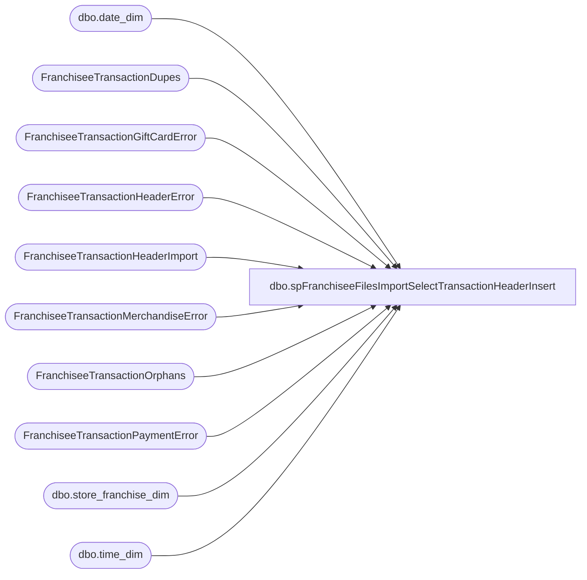

# dbo.spFranchiseeFilesImportSelectTransactionHeaderInsert

**Database:** DWStaging  
**Server:** papamart  

## Architecture Diagram



## Table Dependencies

| Referenced Table |
|---|
| dbo.date_dim |
| FranchiseeTransactionDupes |
| FranchiseeTransactionGiftCardError |
| FranchiseeTransactionHeaderError |
| FranchiseeTransactionHeaderImport |
| FranchiseeTransactionMerchandiseError |
| FranchiseeTransactionOrphans |
| FranchiseeTransactionPaymentError |
| dbo.store_franchise_dim |
| dbo.time_dim |

## Stored Procedure Code

```sql
CREATE proc [dbo].[spFranchiseeFilesImportSelectTransactionHeaderInsert]
@Franchisee varchar(2)

as


-- =====================================================================================================
-- Name: spFranchiseeFilesImportSelectTransactionHeaderInsert
--
-- Description:	Called from SSIS FranchiseeFilesImport. 
--				This proc's purpose is to return a dataset that will be inserted into a table via SSIS
--				 
-- Revision History
--		Name:			Date:			Comments:
--		Dan Tweedie		02/08/2016		Created proc.
--		Dan Tweedie		07/08/2106		Added dimension keys
-- =====================================================================================================

set nocount on;

WITH Errors (TransactionID)
AS (
	select distinct TransactionID from FranchiseeTransactionHeaderError with (nolock) where Franchisee = @Franchisee
	union
	select distinct TransactionID from FranchiseeTransactionPaymentError with (nolock) where Franchisee = @Franchisee
	union
	select distinct  TransactionID from FranchiseeTransactionMerchandiseError with (nolock) where Franchisee = @Franchisee
	union
	select distinct  TransactionID from FranchiseeTransactionGiftCardError with (nolock) where Franchisee = @Franchisee
	union
	select distinct  TransactionID from FranchiseeTransactionDupes with (nolock) where Franchisee = @Franchisee
	union
	select distinct  TransactionID from FranchiseeTransactionOrphans with (nolock) where Franchisee = @Franchisee
   )
select 
	i.TransactionID, 
	i.TransactionDateTime, 
	cast(i.StoreID as varchar(10)) as StoreID,
	i.StoreID as RawStoreID,
	i.InsertDate, 
	i.Franchisee,
	isnull(sd.store_key, 0) as store_key, 
	dd.date_key, 
	td.time_key, 
	getdate() as UpdateDate
from FranchiseeTransactionHeaderImport i with (nolock)
left join DW.dbo.store_franchise_dim sd with (nolock) on i.StoreID = sd.store_id 
join DW.dbo.date_dim dd with (nolock) on cast(i.TransactionDateTime as date) = cast(dd.actual_date as date)
join DW.dbo.time_dim td with (nolock) on datepart(hh, i.TransactionDateTime) = td.hour
		and datepart(mi, i.TransactionDateTime) = td.minute
where i.Franchisee = @Franchisee
and not exists (select e.TransactionID from Errors e where e.TransactionID = i.TransactionID)
order by i.TransactionID, i.TransactionDateTime
```

