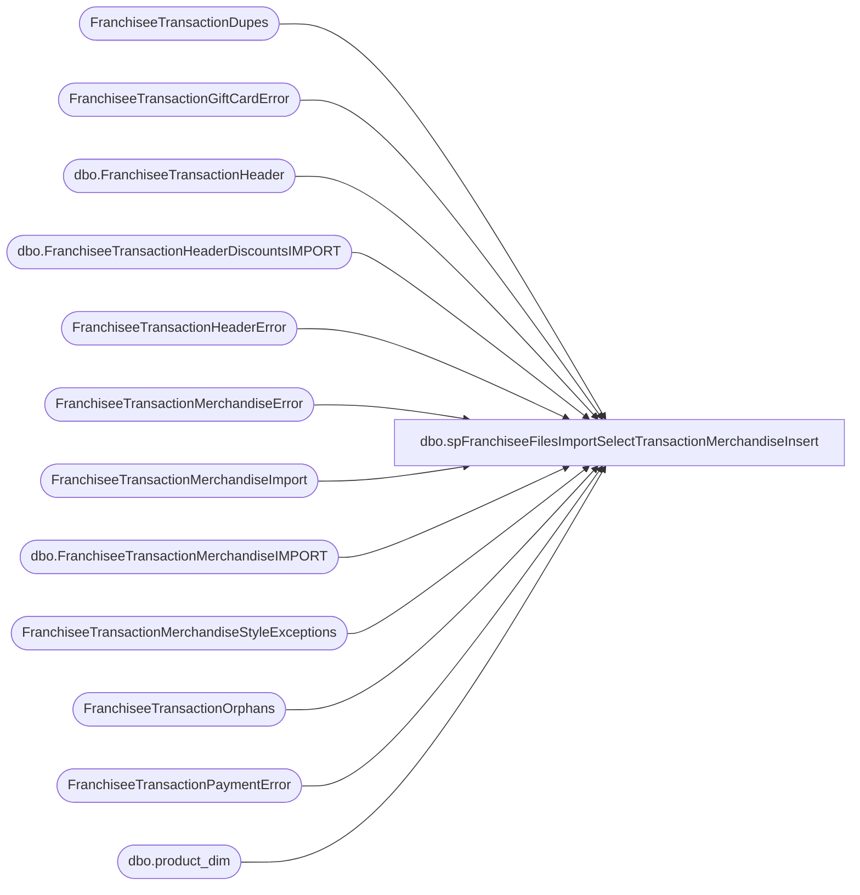

# dbo.spFranchiseeFilesImportSelectTransactionMerchandiseInsert

**Database:** DWStaging  
**Server:** papamart  

## Architecture Diagram



## Table Dependencies

| Referenced Table |
|---|
| FranchiseeTransactionDupes |
| FranchiseeTransactionGiftCardError |
| dbo.FranchiseeTransactionHeader |
| dbo.FranchiseeTransactionHeaderDiscountsIMPORT |
| FranchiseeTransactionHeaderError |
| FranchiseeTransactionMerchandiseError |
| FranchiseeTransactionMerchandiseImport |
| dbo.FranchiseeTransactionMerchandiseIMPORT |
| FranchiseeTransactionMerchandiseStyleExceptions |
| FranchiseeTransactionOrphans |
| FranchiseeTransactionPaymentError |
| dbo.product_dim |

## Stored Procedure Code

```sql
CREATE proc [dbo].[spFranchiseeFilesImportSelectTransactionMerchandiseInsert]
@Franchisee varchar(2)

as

-- =====================================================================================================
-- Name: spFranchiseeFilesImportSelectTransactionMerchandiseInsert
--
-- Description:	Called from SSIS FranchiseeFilesImport. 
--				This proc's purpose is to return a dataset that will be inserted into a table via SSIS
--				 
-- Revision History
--		Name:			Date:			Comments:
--		Dan Tweedie		02/08/2016		Created proc.
--		Dan Tweedie		07/08/2106		Added dimension keys
--	     Tim Bytnar	     02/08/2017	     Added logic for handling header level discounts
-- =====================================================================================================

set nocount on;

WITH Errors (TransactionID)
AS (
	select distinct TransactionID from FranchiseeTransactionHeaderError with (nolock) where Franchisee = @Franchisee
	union
	select distinct TransactionID from FranchiseeTransactionPaymentError with (nolock) where Franchisee = @Franchisee
	union
	select distinct  TransactionID from FranchiseeTransactionMerchandiseError with (nolock) where Franchisee = @Franchisee
	union
	select distinct  TransactionID from FranchiseeTransactionGiftCardError with (nolock) where Franchisee = @Franchisee
	union
	select distinct  TransactionID from FranchiseeTransactionDupes with (nolock) where Franchisee = @Franchisee
	union
	select distinct  TransactionID from FranchiseeTransactionOrphans with (nolock) where Franchisee = @Franchisee
   ),
MinProductKey -- this is needed because we have some style_codes that are repeated in multiple product_dim records. I think this must be old, due to Zhu Zhu products, the old product data may not be current in Merch
	AS (		 
		select style_code, min(product_key) product_key
		from DW.dbo.product_dim
		group by style_code
	),
MerchSummedDiscounts AS
(
    SELECT SUM(Discount) as DiscountSum,
	      TransactionID,
		 COUNT(TransactionID) as TotalTrans
    FROM [dbo].[FranchiseeTransactionMerchandiseIMPORT]
    WHERE Franchisee = @Franchisee
    GROUP BY TransactionID,Franchisee
),
HeaderDiscounts AS
(
    SELECT th.TransactionID,
		 th.Franchisee,
		 th.FranchiseeTransactionHeaderID,
		 thd.HeaderDiscount AS Discount
    FROM DW.dbo.FranchiseeTransactionHeader th
    INNER JOIN [dbo].[FranchiseeTransactionHeaderDiscountsIMPORT] thd ON th.TransactionID = thd.TRANSACTIONID
    WHERE Franchisee = @Franchisee
    GROUP BY th.TransactionID, th.Franchisee, th.FranchiseeTransactionHeaderID, thd.HeaderDiscount
)

select th.FranchiseeTransactionHeaderID,
	   row_number() over (partition by th.FranchiseeTransactionHeaderID order by m.Style) FranchiseeTransactionMerchandiseID,
	   m.TransactionID,
	   m.Style,
	   m.Units,
	   m.Cost,
	   m.GrossSales,
	   CASE WHEN m.Discount = 0 AND hd.Discount != 0 THEN CAST((((hd.Discount - msd.DiscountSum) / msd.TotalTrans)) AS NUMERIC(9,2))
		   WHEN m.Discount != 0 AND hd.Discount !=0 THEN CAST((((hd.Discount - msd.DiscountSum) / msd.TotalTrans) + m.Discount) AS NUMERIC(9,2))
		   ELSE m.Discount
	   END AS Discount,
	   --m.Discount,
	   m.VAT,
	   m.InsertDate,
	   m.Franchisee,
	   CASE WHEN m.Style IN (SELECT style_code FROM FranchiseeTransactionMerchandiseStyleExceptions) THEN 0
		  ELSE isnull(pd.product_key, 999999)
	   END AS product_key,
	   getdate() as UpdateDate,
	   m.Discount as OriginalDiscount
from FranchiseeTransactionMerchandiseImport m with (nolock)
join DW.dbo.FranchiseeTransactionHeader th on m.Franchisee = th.Franchisee and m.TransactionID = th.TransactionID
left join HeaderDiscounts hd on m.TransactionID = hd.TransactionID
right JOIN MerchSummedDiscounts msd ON msd.TransactionID = m.TransactionID
left join MinProductKey pd with (nolock) on m.Style = pd.style_code

where m.Franchisee = @Franchisee
and not exists (select e.TransactionID from Errors e where e.TransactionID = m.TransactionID)
order by 1, 2
```

