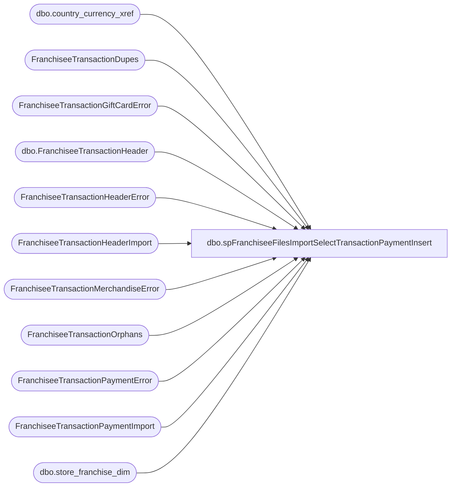

# dbo.spFranchiseeFilesImportSelectTransactionPaymentInsert

**Database:** DWStaging  
**Server:** papamart  

## Architecture Diagram



## Table Dependencies

| Referenced Table |
|---|
| dbo.country_currency_xref |
| FranchiseeTransactionDupes |
| FranchiseeTransactionGiftCardError |
| dbo.FranchiseeTransactionHeader |
| FranchiseeTransactionHeaderError |
| FranchiseeTransactionHeaderImport |
| FranchiseeTransactionMerchandiseError |
| FranchiseeTransactionOrphans |
| FranchiseeTransactionPaymentError |
| FranchiseeTransactionPaymentImport |
| dbo.store_franchise_dim |

## Stored Procedure Code

```sql
CREATE proc [dbo].[spFranchiseeFilesImportSelectTransactionPaymentInsert]
@Franchisee varchar(2)

as

-- =====================================================================================================
-- Name: spFranchiseeFilesImportSelectTransactionPaymentInsert
--
-- Description:	Called from SSIS FranchiseeFilesImport. 
--				This proc's purpose is to return a dataset that will be inserted into a table via SSIS
--				 
-- Revision History
--		Name:			Date:			Comments:
--		Dan Tweedie		02/08/2016		Created proc.
--		Dan Tweedie		07/08/2106		Added dimension keys
--		Dan Tweedie		04/11/2017		Added Country CTE to get country based on the store instead of the franchisee, to join to the currency lookup for currency key
-- =====================================================================================================

set nocount on;


WITH Errors (TransactionID)
AS (
	select distinct TransactionID from FranchiseeTransactionHeaderError with (nolock) where Franchisee = @Franchisee
	union
	select distinct TransactionID from FranchiseeTransactionPaymentError with (nolock) where Franchisee = @Franchisee
	union
	select distinct  TransactionID from FranchiseeTransactionMerchandiseError with (nolock) where Franchisee = @Franchisee
	union
	select distinct  TransactionID from FranchiseeTransactionGiftCardError with (nolock) where Franchisee = @Franchisee
	union
	select distinct  TransactionID from FranchiseeTransactionDupes with (nolock) where Franchisee = @Franchisee
	union
	select distinct  TransactionID from FranchiseeTransactionOrphans with (nolock) where Franchisee = @Franchisee
   ),
Country as
	(
		select distinct th.TransactionID, sd.country CountryCode
		from FranchiseeTransactionHeaderImport th
		left join DW.dbo.store_franchise_dim sd with (nolock) on th.StoreID = sd.store_id 
	)
select 
	th.FranchiseeTransactionHeaderID, 
	row_number() over (partition by th.FranchiseeTransactionHeaderID order by p.PaymentType) FranchiseeTransactionPaymentID,
	p.TransactionID, 
	p.PaymentType, 
	p.Amount, 
	p.InsertDate, 
	p.Franchisee,
	isnull(ccx.currency_key,0) currency_key,
	getdate() as UpdateDate
from FranchiseeTransactionPaymentImport p with (nolock)
join DW.dbo.FranchiseeTransactionHeader th with (nolock) on p.Franchisee = th.Franchisee and p.TransactionID = th.TransactionID
	
	join Country c on p.TransactionID = c.TransactionID
	left join DW.dbo.country_currency_xref ccx with (nolock) on c.CountryCode = ccx.country_code
	--if rollback, comment out the 2 lines above, uncomment the line below
--left join DW.dbo.country_currency_xref ccx with (nolock) on th.Franchisee = ccx.country_code
where p.Franchisee = @Franchisee
and not exists (select e.TransactionID from Errors e where e.TransactionID = p.TransactionID)
order by 1, 2
```

