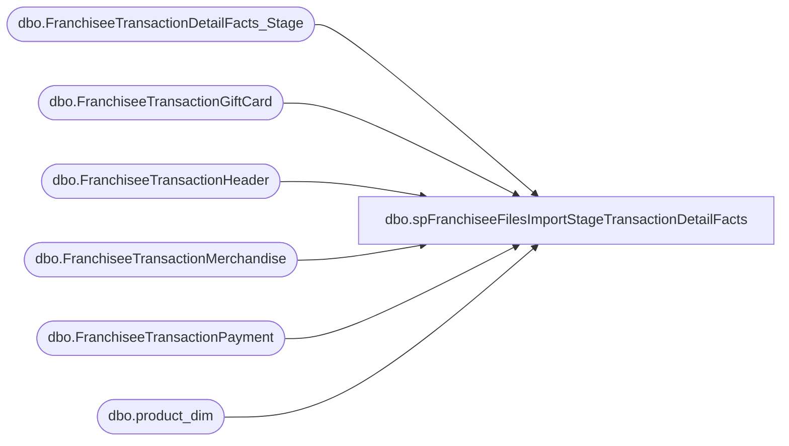

# dbo.spFranchiseeFilesImportStageTransactionDetailFacts

**Database:** DWStaging  
**Server:** papamart  

## Architecture Diagram



## Table Dependencies

| Referenced Table |
|---|
| dbo.FranchiseeTransactionDetailFacts_Stage |
| dbo.FranchiseeTransactionGiftCard |
| dbo.FranchiseeTransactionHeader |
| dbo.FranchiseeTransactionMerchandise |
| dbo.FranchiseeTransactionPayment |
| dbo.product_dim |

## Stored Procedure Code

```sql
CREATE proc [dbo].[spFranchiseeFilesImportStageTransactionDetailFacts]
@range int = 21

as

-- =====================================================================================================
-- Name: spFranchiseeFilesImportStageTransactionDetailFacts
--
--Description: Pulls data from DW.dbo..FranchiseeTransactionHeader/Payment/Merchandise/Giftcard, stages into dwStaging.dbo.FranchiseeTransactionDetailFacts_Stage
--				will be merged into dw.dbo.FranchiseeTransactionDetailFact later when another proc is run (spFranchiseeFilesImportMergeTransactionDetailFacts)
-- Revision History
--		Name:			Date:			Comments:
--		Dan Tweedie		07/27/2016		Created proc.	
--		Dan Tweedie		09/02/2016		added DE franchisee
--		Dan Tweedie		06/19/2017		Fixed issue with joins
-- =====================================================================================================

set nocount on


truncate table dwStaging.dbo.FranchiseeTransactionDetailFacts_Stage


BEGIN
	IF (Object_ID('tempdb..#TransHeader') IS NOT NULL) DROP TABLE #TransHeader;
	Select *
	into #TransHeader
	From 
		dw.dbo.FranchiseeTransactionHeader with (nolock)
	where 
		TransactionDateTime > dateadd(day, -@range, getdate())

	IF (Object_ID('tempdb..#TransPayment') IS NOT NULL) DROP TABLE #TransPayment;
	Select distinct
		TP.FranchiseeTransactionHeaderID,
		TP.currency_key
	into #TransPayment
	From 
		dw.dbo.FranchiseeTransactionPayment TP with (nolock)
	Join #TransHeader TH on TP.FranchiseeTransactionHeaderID = TH.FranchiseeTransactionHeaderID
	IF (Object_ID('tempdb..#TransMerchandise') IS NOT NULL) DROP TABLE #TransMerchandise;
	Select
		TM.*
	into #TransMerchandise
	From 
		dw.dbo.FranchiseeTransactionMerchandise TM with (nolock)
	Join #TransHeader TH on TM.FranchiseeTransactionHeaderID = TH.FranchiseeTransactionHeaderID
	Join dw.dbo.product_dim pd with (nolock) on TM.product_key = pd.product_key
		
	IF (Object_ID('tempdb..#TransGiftCard') IS NOT NULL) DROP TABLE #TransGiftCard;
	Select 
		TGC.*
	into #TransGiftCard
	From 
		dw.dbo.FranchiseeTransactionGiftCard TGC with (nolock)
	Join #TransHeader TH on TGC.FranchiseeTransactionHeaderID = TH.FranchiseeTransactionHeaderID

	IF (Object_ID('tempdb..#TransactionMerchandiseDetail') IS NOT NULL) DROP TABLE #TransactionMerchandiseDetail;
	Select
		tm.product_key,
		isnull((select tp.currency_key from #TransPayment tp where th.FranchiseeTransactionHeaderID = tp.FranchiseeTransactionHeaderID),0) as currency_key,			
		th.TransactionID as transaction_id,
		tm.FranchiseeTransactionMerchandiseID as transaction_line_seq,	 
		0 as register_num,
		NULL as cashier_id,
		th.time_key,
		th.store_key,
		sum(isnull(tm.GrossSales,0)) as unit_gross_amount,
		th.date_key,
		sum(isnull(tm.Units,0)) as units,
		sum(isnull(tm.Discount,0)) * -1 unit_disc_amount,
		NULL as party_y_n,
		NULL as transaction_type_key,
		NULL as line_object_key,
		th.TransactionID as transaction_no,
		NULL as reference_no,
		sum(isnull(tm.VAT,0)) vat_tax_amount,
		getdate() as INS_DT,
		getdate() as UPDT_DT,
		NULL as etl_log_id,
		NULL as etl_evnt_id,
		0 as upsell_disc_allocated,
		sum(isnull(tm.Cost, 0)) as ext_cost,
		NULL as line_action_key
	into #TransactionMerchandiseDetail
	From
		#TransHeader th with (nolock)
	join #TransMerchandise tm with (nolock)
			on th.FranchiseeTransactionHeaderID = tm.FranchiseeTransactionHeaderID
	Group By 
		th.FranchiseeTransactionHeaderID,
		tm.product_key,			
		th.TransactionID,
		tm.FranchiseeTransactionMerchandiseID,	 
		th.time_key,
		th.store_key,
		th.date_key,
		th.TransactionID
	
	IF (Object_ID('tempdb..#MaxMerchLine') IS NOT NULL) DROP TABLE #MaxMerchLine;
	select transaction_id, max(transaction_line_seq) max_line
	into #MaxMerchLine
	from #TransactionMerchandiseDetail
	group by transaction_id		
		
	IF (Object_ID('tempdb..#TransactionGiftCardDetail') IS NOT NULL) DROP TABLE #TransactionGiftCardDetail;
	Select
		-6 as product_key,
		isnull((select tp.currency_key from #TransPayment tp where th.FranchiseeTransactionHeaderID = tp.FranchiseeTransactionHeaderID),0) as currency_key,			
		th.TransactionID as transaction_id,
		tgc.FranchiseeTransactionGiftCardID + isnull(mml.max_line, 0) as transaction_line_seq,
		0 as register_num,
		NULL as cashier_id,
		th.time_key,
		th.store_key,
		sum(isnull(tgc.GiftCardAmount,0)) as unit_gross_amount,
		th.date_key,
		sum(isnull(tgc.Units,0)) as units,
		sum(isnull(tgc.Discount,0)) * -1 unit_disc_amount,
		NULL as party_y_n,
		NULL as transaction_type_key,
		NULL as line_object_key,
		th.TransactionID as transaction_no,
		NULL as reference_no,
		0 as vat_tax_amount,
		getdate() as INS_DT,
		getdate() as UPDT_DT,
		NULL as etl_log_id,
		NULL as etl_evnt_id,
		0 as upsell_disc_allocated,
		0 as ext_cost,
		NULL as line_action_key
	into #TransactionGiftCardDetail
	From
		#TransHeader th with (nolock)
	join #TransGiftCard tgc with (nolock)
			on th.FranchiseeTransactionHeaderID = tgc.FranchiseeTransactionHeaderID
	left join #MaxMerchLine mml on th.TransactionID = mml.transaction_id
	Group By 		
		th.FranchiseeTransactionHeaderID,
		th.TransactionID,
		tgc.FranchiseeTransactionGiftCardID,	 
		th.time_key,
		th.store_key,
		th.date_key,
		th.TransactionID,
		isnull(mml.max_line, 0)
		
	insert dwStaging.dbo.FranchiseeTransactionDetailFacts_Stage
	select 
				product_key,
				currency_key,			
				transaction_id,
				transaction_line_seq,	 
				register_num,
				cashier_id,
				time_key,
				store_key,
				unit_gross_amount,
				date_key,
				units,
				unit_disc_amount,
				party_y_n,
				transaction_type_key,
				line_object_key,
				transaction_no,
				reference_no,
				vat_tax_amount,
				getdate() as INS_DT,
				getdate() as UPDT_DT,
				etl_log_id,
				etl_evnt_id,
				upsell_disc_allocated,
				ext_cost,
				line_action_key
	from #TransactionMerchandiseDetail
	union
	select 
				product_key,
				currency_key,			
				transaction_id,
				transaction_line_seq,	 
				register_num,
				cashier_id,
				time_key,
				store_key,
				unit_gross_amount,
				date_key,
				units,
				unit_disc_amount,
				party_y_n,
				transaction_type_key,
				line_object_key,
				transaction_no,
				reference_no,
				vat_tax_amount,
				getdate() as INS_DT,
				getdate() as UPDT_DT,
				etl_log_id,
				etl_evnt_id,
				upsell_disc_allocated,
				ext_cost,
				line_action_key
	from #TransactionGiftCardDetail


END
```

