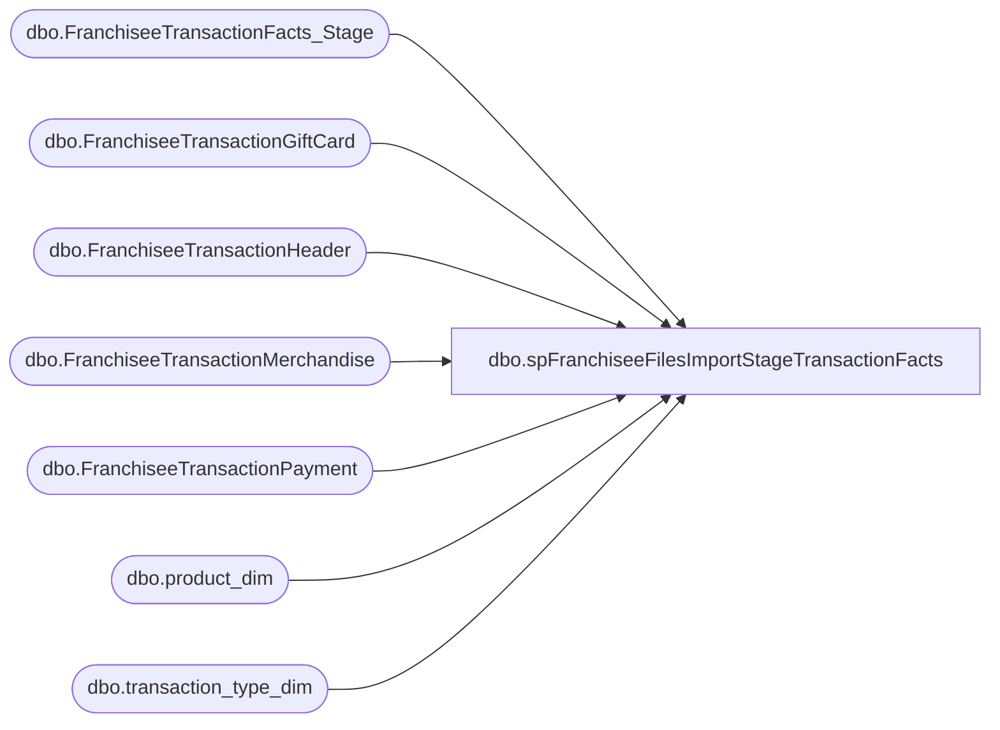

# dbo.spFranchiseeFilesImportStageTransactionFacts

**Database:** DWStaging  
**Server:** papamart  

## Architecture Diagram



## Table Dependencies

| Referenced Table |
|---|
| dbo.FranchiseeTransactionFacts_Stage |
| dbo.FranchiseeTransactionGiftCard |
| dbo.FranchiseeTransactionHeader |
| dbo.FranchiseeTransactionMerchandise |
| dbo.FranchiseeTransactionPayment |
| dbo.product_dim |
| dbo.transaction_type_dim |

## Stored Procedure Code

```sql
CREATE proc [dbo].[spFranchiseeFilesImportStageTransactionFacts]
@range int = 21

as 

-- =====================================================================================================
-- Name: exec spFranchiseeFilesImportStageTransactionFacts 52

--Description: Pulls data from DW.dbo..FranchiseeTransactionHeader/Payment/Merchandise/Giftcard, stages into dwStaging.dbo.FranchiseeTransactionFacts_Stage
--				will be merged into dw.dbo.FranchiseeTransactionFact later when another proc is run (spFranchiseeFilesImportMergeTransactionFacts)
-- Revision History
--		Name:			Date:			Comments:
--		Dan Tweedie		07/27/2016		Created proc.	
--		Dan Tweedie		08/30/2016		Calculate redemption_amount to be sum(dw.dbo.FranchiseeTransactionPayment.Amount) where dw.dbo.FranchiseeTransactionPayment.paymenttype = 'GiftCard'
--										Subtract redemption_amount from the following measures:
--										-> net_sales_amount
--										-> receipt_total_amount
--										Added gaap_units column to be same as merchandise_units
--		Dan Tweedie		09/02/2016		Added DE franchisee
--		Dan Tweedie		04/12/2017		Updated Gaap, it was mistakenly subtracting the unit_discount instead of merchandise_discount
--		Dan Tweedie		06/19/2017		Fixed issue with how discounts were being handled
--		Dan Tweedie		2018-01-18		Fixed issue with how transaction was being staged into #TransactionsStageTwo, which was skewing the results due to bad join
--										Fixed issue with how TransactionType was being set as it relates to identifying a party
-- =====================================================================================================

set nocount on 

truncate table dwStaging.dbo.FranchiseeTransactionFacts_Stage


BEGIN

	IF (Object_ID('tempdb..#TransHeader') IS NOT NULL) DROP TABLE #TransHeader;
	Select 
		*
	into #TransHeader
	From 
		dw.dbo.FranchiseeTransactionHeader with (nolock)
	where 
		TransactionDateTime > dateadd(day, -@range, getdate())

	IF (Object_ID('tempdb..#TransPayment') IS NOT NULL) DROP TABLE #TransPayment;
	Select distinct
		TP.FranchiseeTransactionHeaderID,
		TP.currency_key,
		sum(case when TP.paymenttype = 'GiftCard' then isnull(TP.Amount, 0) else 0 end) as redemption_amount
	into #TransPayment
	From 
		dw.dbo.FranchiseeTransactionPayment TP with (nolock)
	Join #TransHeader TH on TP.FranchiseeTransactionHeaderID = TH.FranchiseeTransactionHeaderID
	group by 
		TP.FranchiseeTransactionHeaderID,
		TP.currency_key
		
	IF (Object_ID('tempdb..#TransMerchandise') IS NOT NULL) DROP TABLE #TransMerchandise;
	Select
		TM.*,
		--CASE WHEN RIGHT(pd.department_code, 2) IN (25) 
		--				OR RIGHT(pd.subclass_code, 2) = 25 
		--			THEN 'Skin'
		--			WHEN RIGHT(pd.department_code, 2) IN (38, 40, 45, 55, 46, 65, 70, 80, 35, 51, 75, 49, 48, 60, 47, 50) 
		--			THEN 'Neutral' 
		--			ELSE 'Non-Neutral'
		--	END AS TransactionType,
		CASE WHEN LEFT(department_code, 1) = 'W'  -- new hierarchy 2015
			THEN CASE WHEN pd.ScorecardCategory = 'Animal' THEN 'Skin'
				WHEN pd.ScorecardCategory = 'Human' THEN 'Neutral' -- HUMAN: the old department 35 maps to new department 18 
				WHEN RIGHT(pd.department_code, 2) IN (35, 38, 40, 45, 46, 47, 48, 49, 50, 51, 55, 60, 65, 70, 75, 80) THEN 'Neutral' 
				ELSE 'Non-Neutral'
				END
		ELSE  -- Old hierarchy
			CASE WHEN pd.ScorecardCategory = 'Animal' THEN 'Skin'
				WHEN RIGHT(pd.department_code, 2) IN (38, 40, 45, 55, 46, 65, 70, 80, 35, 51, 75, 49, 48, 60, 47, 50) THEN 'Neutral' 
				ELSE 'Non-Neutral'
			END
		END AS TransactionType,
		pd.ScorecardCategory
	into #TransMerchandise
	From 
		dw.dbo.FranchiseeTransactionMerchandise TM with (nolock)
	Join #TransHeader TH on TM.FranchiseeTransactionHeaderID = TH.FranchiseeTransactionHeaderID
	Join dw.dbo.product_dim pd with (nolock) on TM.product_key = pd.product_key

	IF (Object_ID('tempdb..#TransGiftCard') IS NOT NULL) DROP TABLE #TransGiftCard;
	Select 
		TGC.*, -6 as product_key, 'FranchGiftCard' as ScorecardCategory
	into #TransGiftCard
	From 
		dw.dbo.FranchiseeTransactionGiftCard TGC with (nolock)
	Join #TransHeader TH on TGC.FranchiseeTransactionHeaderID = TH.FranchiseeTransactionHeaderID

	IF (Object_ID('tempdb..#MerchNGift') IS NOT NULL) DROP TABLE #MerchNGift;
	select 
		a.FranchiseeTransactionHeaderID,
		sum(a.GrossSales) GrossSales,
		sum(a.Discount) Discount,
		sum(a.units) units,
		sum(a.Cost) Cost,
		sum(a.VAT) VAT,
		sum(a.GiftCardUnits) GiftCardUnits,
		sum(a.GiftcardAmount) GiftcardAmount,
		sum(a.GiftCardDiscount) GiftCardDiscount,
		a.ScorecardCategory
	into #MerchNGift
	from
		(
			select 
				tm.FranchiseeTransactionHeaderID,
				sum(tm.GrossSales) GrossSales,
				sum(tm.Discount) Discount,
				sum(tm.units) units,
				sum(tm.Cost) Cost,
				sum(tm.VAT) VAT,
				0 as GiftCardUnits,
				0 as GiftcardAmount,
				0 as GiftCardDiscount,
				tm.ScorecardCategory
			from #TransMerchandise tm
			group by tm.FranchiseeTransactionHeaderID, tm.ScorecardCategory
			UNION 
			select 
				tgc.FranchiseeTransactionHeaderID,
				0 as GrossSales,
				0 as Discount,
				0 as units,
				0 as Cost,
				0 as VAT,
				sum(tgc.units) GiftCardUnits,
				sum(tgc.GiftcardAmount) GiftcardAmount,
				sum(tgc.Discount) GiftCardDiscount,
				tgc.ScorecardCategory
			from #TransGiftCard tgc
			group by tgc.FranchiseeTransactionHeaderID, tgc.ScorecardCategory
		) as a
	group by a.FranchiseeTransactionHeaderID, a.ScorecardCategory


	IF (Object_ID('tempdb..#TransactionsStageOne') IS NOT NULL) DROP TABLE #TransactionsStageOne;
	Select
		th.FranchiseeTransactionHeaderID,
		th.TransactionID as transaction_id,
		th.store_key,
		th.date_key,
		th.time_key,
		isnull((select tp.currency_key from #TransPayment tp where th.FranchiseeTransactionHeaderID = tp.FranchiseeTransactionHeaderID),0) as currency_key,
		CAST(th.TransactionID AS varchar) + '-' + CAST(th.store_key AS varchar) + '-' + CAST(th.date_key AS varchar) transaction_key,
		th.TransactionID as transaction_no,
		isnull((select sum(tp.redemption_amount) from #TransPayment tp where th.FranchiseeTransactionHeaderID = tp.FranchiseeTransactionHeaderID),0) as redemption_amount,
		(
			(select count(tm.FranchiseeTransactionHeaderID) from #TransMerchandise tm where th.FranchiseeTransactionHeaderID = tm.FranchiseeTransactionHeaderID)
			+
			(select count(tgc.FranchiseeTransactionHeaderID) from #TransGiftCard tgc where th.FranchiseeTransactionHeaderID = tgc.FranchiseeTransactionHeaderID) 
		) as line_count,
		mg.GrossSales + mg.GiftCardAmount as unit_gross_amount,
		mg.Discount + mg.GiftCardDiscount as unit_discount_amount,
		mg.units + mg.GiftCardUnits as total_units,
		mg.units as merchandise_units,
		mg.units as gaap_units,
		mg.GrossSales as merchandise_uga,
		mg.Discount as merchandise_discount,
		mg.Cost as merchandise_cost,
		mg.GiftCardUnits as giftcard_units,
		mg.GiftCardDiscount as giftcard_discount_amount,
		mg.GiftCardAmount as giftcard_uga,
		mg.VAT as tax_amount,
		mg.VAT as VAT,
		mg.ScorecardCategory
	into #TransactionsStageOne
	From
		#TransHeader th
	join #MerchNGift mg on th.FranchiseeTransactionHeaderID = mg.FranchiseeTransactionHeaderID

	IF (Object_ID('tempdb..#animal_uga') IS NOT NULL) DROP TABLE #animal_uga;
	select 
		FranchiseeTransactionHeaderID,
		sum(merchandise_uga-merchandise_discount) uga,
		sum(merchandise_units) units,
		sum(merchandise_cost) cost
	into #animal_uga
	from #TransactionsStageOne 
	where ScorecardCategory = 'Animal'
	group by FranchiseeTransactionHeaderID

	IF (Object_ID('tempdb..#non_animal_uga') IS NOT NULL) DROP TABLE #non_animal_uga;
	select 
		FranchiseeTransactionHeaderID,
		sum(merchandise_uga-merchandise_discount) uga,
		sum(merchandise_units) units,
		sum(merchandise_cost) cost
	into #non_animal_uga
	from #TransactionsStageOne 
	where ScorecardCategory <> 'Animal'
	group by FranchiseeTransactionHeaderID

	IF (Object_ID('tempdb..#Footwear_uga') IS NOT NULL) DROP TABLE #Footwear_uga;
	select 
		FranchiseeTransactionHeaderID,
		sum(merchandise_uga-merchandise_discount) uga,
		sum(merchandise_units) units,
		sum(merchandise_cost) cost
	into #Footwear_uga
	from #TransactionsStageOne 
	where ScorecardCategory = 'Footwear'
	group by FranchiseeTransactionHeaderID

	IF (Object_ID('tempdb..#Accessories_uga') IS NOT NULL) DROP TABLE #Accessories_uga;
	select 
		FranchiseeTransactionHeaderID,
		sum(merchandise_uga-merchandise_discount) uga,
		sum(merchandise_units) units,
		sum(merchandise_cost) cost
	into #Accessories_uga
	from #TransactionsStageOne 
	where ScorecardCategory = 'Accessories'
	group by FranchiseeTransactionHeaderID

	IF (Object_ID('tempdb..#Sounds_uga') IS NOT NULL) DROP TABLE #Sounds_uga;
	select 
		FranchiseeTransactionHeaderID,
		sum(merchandise_uga-merchandise_discount) uga,
		sum(merchandise_units) units,
		sum(merchandise_cost) cost
	into #Sounds_uga
	from #TransactionsStageOne 
	where ScorecardCategory = 'Sounds'
	group by FranchiseeTransactionHeaderID

	IF (Object_ID('tempdb..#Clothing_uga') IS NOT NULL) DROP TABLE #Clothing_uga;
	select 
		FranchiseeTransactionHeaderID,
		sum(merchandise_uga-merchandise_discount) uga,
		sum(merchandise_units) units,
		sum(merchandise_cost) cost
	into #Clothing_uga
	from #TransactionsStageOne 
	where ScorecardCategory = 'Clothing'
	group by FranchiseeTransactionHeaderID

	IF (Object_ID('tempdb..#Sports_uga') IS NOT NULL) DROP TABLE #Sports_uga;
	select 
		FranchiseeTransactionHeaderID,
		sum(merchandise_uga-merchandise_discount) uga,
		sum(merchandise_units) units,
		sum(merchandise_cost) cost
	into #Sports_uga
	from #TransactionsStageOne 
	where ScorecardCategory = 'Sports'
	group by FranchiseeTransactionHeaderID

	IF (Object_ID('tempdb..#PreStuffed_uga') IS NOT NULL) DROP TABLE #PreStuffed_uga;
	select 
		FranchiseeTransactionHeaderID,
		sum(merchandise_uga-merchandise_discount) uga,
		sum(merchandise_units) units,
		sum(merchandise_cost) cost
	into #PreStuffed_uga
	from #TransactionsStageOne 
	where ScorecardCategory = 'PreStuffed'
	group by FranchiseeTransactionHeaderID

	IF (Object_ID('tempdb..#Scents_uga') IS NOT NULL) DROP TABLE #Scents_uga;
	select 
		FranchiseeTransactionHeaderID,
		sum(merchandise_uga-merchandise_discount) uga,
		sum(merchandise_units) units,
		sum(merchandise_cost) cost
	into #Scents_uga
	from #TransactionsStageOne 
	where ScorecardCategory = 'Scents'
	group by FranchiseeTransactionHeaderID

	IF (Object_ID('tempdb..#other_uga') IS NOT NULL) DROP TABLE #other_uga;
	select 
		FranchiseeTransactionHeaderID,
		sum(merchandise_uga-merchandise_discount) uga,
		sum(merchandise_units) units,
		sum(merchandise_cost) cost
	into #other_uga
	from #TransactionsStageOne 
	where ScorecardCategory not in ('Animal', 'Footwear', 'Accessories', 'Sounds', 'Clothing', 'Sports','Prestuffed','Scents') 
	or ScorecardCategory is NULL
	group by FranchiseeTransactionHeaderID

	--IF (Object_ID('tempdb..#TransactionsStageTwo') IS NOT NULL) DROP TABLE #TransactionsStageTwo;
	--select
	--	th.FranchiseeTransactionHeaderID,
	--	th.transaction_id,
	--	th.store_key,
	--	th.date_key,
	--	th.time_key,
	--	th.currency_key,
	--	th.transaction_key,
	--	th.transaction_no,
	--	th.line_count,
	--	sum(th.redemption_amount) as redemption_amount,
	--	sum(th.unit_gross_amount) as unit_gross_amount,
	--	sum(th.unit_discount_amount) as unit_discount_amount,
	--	sum(th.total_units) as total_units,
	--	sum(th.merchandise_units) as merchandise_units,
	--	sum(th.gaap_units) as gaap_units,
	--	sum(th.merchandise_uga) as merchandise_uga,
	--	sum(th.merchandise_discount) as merchandise_discount,
	--	sum(th.merchandise_cost) as merchandise_cost,
	--	sum(th.giftcard_units) as giftcard_units,
	--	sum(th.giftcard_discount_amount) as giftcard_discount_amount,
	--	sum(th.giftcard_uga) as giftcard_uga,
	--	sum(th.tax_amount) as tax_amount,
	--	sum(th.VAT) as VAT,
	--	NULL as ScorecardCategory,
	--	sum(isnull(au.uga,0)) as animal_uga ,
	--	sum(isnull(au.units,0)) as animal_units,
	--	sum(isnull(au.cost,0)) as animal_cost ,
	--	sum(isnull(nau.uga,0)) as non_animal_uga,
	--	sum(isnull(nau.units,0)) as non_animal_units,
	--	sum(isnull(nau.cost,0)) as non_animal_cost,
	--	sum(isnull(fu.uga,0)) as Footwear_uga ,
	--	sum(isnull(fu.units,0)) as Footwear_units,
	--	sum(isnull(fu.cost,0)) as Footwear_cost,	
	--	sum(isnull(acu.uga,0)) as Accessories_uga ,
	--	sum(isnull(acu.units,0)) as Accessories_units,
	--	sum(isnull(acu.cost,0)) as Accessories_cost,
	--	sum(isnull(su.uga,0)) as Sounds_uga ,
	--	sum(isnull(su.units,0)) as Sounds_units,
	--	sum(isnull(su.cost,0)) as Sounds_cost,
	--	sum(isnull(cu.uga,0)) as Clothing_uga ,
	--	sum(isnull(cu.units,0)) as Clothing_units,
	--	sum(isnull(cu.cost,0)) as Clothing_cost,
	--	sum(isnull(spu.uga,0)) as Sports_uga ,
	--	sum(isnull(spu.units,0)) as Sports_units,
	--	sum(isnull(spu.cost,0)) as Sports_cost,
	--	sum(isnull(psu.uga,0)) as Prestuffed_uga ,
	--	sum(isnull(psu.units,0)) as Prestuffed_units,
	--	sum(isnull(psu.cost,0)) as Prestuffed_cost,
	--	sum(isnull(scu.uga,0)) as Scents_uga ,
	--	sum(isnull(scu.units,0)) as Scents_units,
	--	sum(isnull(scu.cost,0)) as Scents_cost,
	--	sum(isnull(ou.uga,0)) as other_UGA,
	--	sum(isnull(ou.units,0)) other_units,
	--	sum(isnull(ou.cost,0)) as other_cost
	--into #TransactionsStageTwo
	--From
	--	#TransactionsStageOne th
	--left join #animal_uga au on th.FranchiseeTransactionHeaderID = au.FranchiseeTransactionHeaderID
	--left join #non_animal_uga nau on th.FranchiseeTransactionHeaderID = nau.FranchiseeTransactionHeaderID
	--left join #Footwear_uga fu on th.FranchiseeTransactionHeaderID = fu.FranchiseeTransactionHeaderID
	--left join #Accessories_uga acu on th.FranchiseeTransactionHeaderID = acu.FranchiseeTransactionHeaderID
	--left join #Sounds_uga su on th.FranchiseeTransactionHeaderID = su.FranchiseeTransactionHeaderID
	--left join #Clothing_uga cu on th.FranchiseeTransactionHeaderID = cu.FranchiseeTransactionHeaderID
	--left join #Sports_uga spu on th.FranchiseeTransactionHeaderID = spu.FranchiseeTransactionHeaderID
	--left join #PreStuffed_uga psu on th.FranchiseeTransactionHeaderID = psu.FranchiseeTransactionHeaderID
	--left join #Scents_uga scu on th.FranchiseeTransactionHeaderID = scu.FranchiseeTransactionHeaderID
	--left join #other_uga ou on th.FranchiseeTransactionHeaderID = ou.FranchiseeTransactionHeaderID
	--group by 
	--	th.FranchiseeTransactionHeaderID,
	--	th.transaction_id,
	--	th.store_key,
	--	th.date_key,
	--	th.time_key,
	--	th.currency_key,
	--	th.transaction_key,
	--	th.transaction_no,
	--	th.line_count

	IF (Object_ID('tempdb..#TransactionsStageTwo') IS NOT NULL) DROP TABLE #TransactionsStageTwo;
	with Transactions as
		(
		select 
			FranchiseeTransactionHeaderID,
			transaction_id,
			store_key,
			date_key,
			time_key,
			currency_key,
			transaction_key,
			transaction_no,
			redemption_amount,
			line_count,
			sum(unit_gross_amount) unit_gross_amount,
			sum(unit_discount_amount) unit_discount_amount,
			sum(total_units) total_units,
			sum(merchandise_units) merchandise_units,
			sum(gaap_units) gaap_units,
			sum(merchandise_uga) merchandise_uga,
			sum(merchandise_discount) merchandise_discount,
			sum(merchandise_cost) merchandise_cost,
			sum(giftcard_units) giftcard_units,
			sum(giftcard_discount_amount) giftcard_discount_amount,
			sum(giftcard_uga) giftcard_uga,
			sum(tax_amount) tax_amount,
			sum(VAT) VAT
		from #TransactionsStageOne
		group by 
			FranchiseeTransactionHeaderID,
			transaction_id,
			store_key,
			date_key,
			time_key,
			currency_key,
			transaction_key,
			transaction_no,
			redemption_amount,
			line_count
	)
	select
		th.FranchiseeTransactionHeaderID,
		th.transaction_id,
		th.store_key,
		th.date_key,
		th.time_key,
		th.currency_key,
		th.transaction_key,
		th.transaction_no,
		th.line_count,
		sum(th.redemption_amount) as redemption_amount,
		sum(th.unit_gross_amount) as unit_gross_amount,
		sum(th.unit_discount_amount) as unit_discount_amount,
		sum(th.total_units) as total_units,
		sum(th.merchandise_units) as merchandise_units,
		sum(th.gaap_units) as gaap_units,
		sum(th.merchandise_uga) as merchandise_uga,
		sum(th.merchandise_discount) as merchandise_discount,
		sum(th.merchandise_cost) as merchandise_cost,
		sum(th.giftcard_units) as giftcard_units,
		sum(th.giftcard_discount_amount) as giftcard_discount_amount,
		sum(th.giftcard_uga) as giftcard_uga,
		sum(th.tax_amount) as tax_amount,
		sum(th.VAT) as VAT,
		NULL as ScorecardCategory,
		sum(isnull(au.uga,0)) as animal_uga ,
		sum(isnull(au.units,0)) as animal_units,
		sum(isnull(au.cost,0)) as animal_cost ,
		sum(isnull(nau.uga,0)) as non_animal_uga,
		sum(isnull(nau.units,0)) as non_animal_units,
		sum(isnull(nau.cost,0)) as non_animal_cost,
		sum(isnull(fu.uga,0)) as Footwear_uga ,
		sum(isnull(fu.units,0)) as Footwear_units,
		sum(isnull(fu.cost,0)) as Footwear_cost,	
		sum(isnull(acu.uga,0)) as Accessories_uga ,
		sum(isnull(acu.units,0)) as Accessories_units,
		sum(isnull(acu.cost,0)) as Accessories_cost,
		sum(isnull(su.uga,0)) as Sounds_uga ,
		sum(isnull(su.units,0)) as Sounds_units,
		sum(isnull(su.cost,0)) as Sounds_cost,
		sum(isnull(cu.uga,0)) as Clothing_uga ,
		sum(isnull(cu.units,0)) as Clothing_units,
		sum(isnull(cu.cost,0)) as Clothing_cost,
		sum(isnull(spu.uga,0)) as Sports_uga ,
		sum(isnull(spu.units,0)) as Sports_units,
		sum(isnull(spu.cost,0)) as Sports_cost,
		sum(isnull(psu.uga,0)) as Prestuffed_uga ,
		sum(isnull(psu.units,0)) as Prestuffed_units,
		sum(isnull(psu.cost,0)) as Prestuffed_cost,
		sum(isnull(scu.uga,0)) as Scents_uga ,
		sum(isnull(scu.units,0)) as Scents_units,
		sum(isnull(scu.cost,0)) as Scents_cost,
		sum(isnull(ou.uga,0)) as other_UGA,
		sum(isnull(ou.units,0)) other_units,
		sum(isnull(ou.cost,0)) as other_cost
	into #TransactionsStageTwo
	From
		Transactions th
	left join #animal_uga au on th.FranchiseeTransactionHeaderID = au.FranchiseeTransactionHeaderID
	left join #non_animal_uga nau on th.FranchiseeTransactionHeaderID = nau.FranchiseeTransactionHeaderID
	left join #Footwear_uga fu on th.FranchiseeTransactionHeaderID = fu.FranchiseeTransactionHeaderID
	left join #Accessories_uga acu on th.FranchiseeTransactionHeaderID = acu.FranchiseeTransactionHeaderID
	left join #Sounds_uga su on th.FranchiseeTransactionHeaderID = su.FranchiseeTransactionHeaderID
	left join #Clothing_uga cu on th.FranchiseeTransactionHeaderID = cu.FranchiseeTransactionHeaderID
	left join #Sports_uga spu on th.FranchiseeTransactionHeaderID = spu.FranchiseeTransactionHeaderID
	left join #PreStuffed_uga psu on th.FranchiseeTransactionHeaderID = psu.FranchiseeTransactionHeaderID
	left join #Scents_uga scu on th.FranchiseeTransactionHeaderID = scu.FranchiseeTransactionHeaderID
	left join #other_uga ou on th.FranchiseeTransactionHeaderID = ou.FranchiseeTransactionHeaderID
	group by 
		th.FranchiseeTransactionHeaderID,
		th.transaction_id,
		th.store_key,
		th.date_key,
		th.time_key,
		th.currency_key,
		th.transaction_key,
		th.transaction_no,
		th.line_count

	
		IF (Object_ID('tempdb..#TransactionTypeUnits') IS NOT NULL) DROP TABLE #TransactionTypeUnits;
		SELECT
			T1.FranchiseeTransactionHeaderID,
			tm.TransactionType,
			SUM(CAST(ABS(tm.Units) AS int)) AS Units
		into #TransactionTypeUnits
		From 
			#TransHeader T1
		join #TransMerchandise tm on T1.FranchiseeTransactionHeaderID = tm.FranchiseeTransactionHeaderID
		Group By 
			T1.FranchiseeTransactionHeaderID,
			tm.TransactionType
			
		IF (Object_ID('tempdb..#SkinUnits') IS NOT NULL) DROP TABLE #SkinUnits;
		SELECT 
			ttu.FranchiseeTransactionHeaderID,
			SUM(CASE WHEN ttu.TransactionType = 'Skin' 
						THEN ttu.Units 
					ELSE 0
				END) AS numSkins,
			SUM(CASE WHEN ttu.TransactionType = 'Neutral' 
						THEN ttu.Units 
					ELSE 0
				END) AS numNeutral,
			SUM(CASE WHEN ttu.TransactionType = 'Non-Neutral' 
						THEN ttu.Units 
					ELSE 0
				END) AS numNonNeutral 
		into #SkinUnits
		FROM 
			#TransactionTypeUnits ttu
		Group By 
			ttu.FranchiseeTransactionHeaderID

			IF (Object_ID('tempdb..#TransactionTypeFlag') IS NOT NULL) DROP TABLE #TransactionTypeFlag;
			SELECT 
				*,
				CAST(CASE WHEN su.numSkins <> 0 
							THEN 1 
						ELSE 0
					END AS smallint) 
				+
				CAST(CASE WHEN su.numNeutral <> 0 
							THEN 2 ELSE 0
						END AS smallint) 
				+
				CAST(CASE WHEN su.numNonNeutral <> 0 
							THEN 4 ELSE 0
						END AS smallint)
				as ttFlag
			into #TransactionTypeFlag
			From
				#SkinUnits su

			IF (Object_ID('tempdb..#TransactionTypeKey') IS NOT NULL) DROP TABLE #TransactionTypeKey;
			Select
				T2.FranchiseeTransactionHeaderID,
				ttd.transaction_key as transaction_type_key
			into #TransactionTypeKey
			FROM 
				#TransactionsStageTwo T2
			left join #TransactionTypeFlag ttf 
				on T2.FranchiseeTransactionHeaderID = ttf.FranchiseeTransactionHeaderID
			left join dw.dbo.transaction_type_dim ttd
				on ttd.transaction_type = 
					CASE
						WHEN ttf.ttFlag IN (1, 3) THEN 'Bare Bear' 
						WHEN ttf.ttFlag IN (4, 6) THEN 'Plus Only'
						WHEN ttf.ttFlag IN (5, 7) THEN 'Bear Plus'
						WHEN ttf.ttFlag IN (2) THEN 'Unclassified'
					ELSE 'Not Applicable' end
	
			IF (Object_ID('tempdb..#PartySkins') IS NOT NULL) DROP TABLE #PartySkins;
			select FranchiseeTransactionHeaderID
			into #PartySkins
			from #SkinUnits su 
			where su.numSkins >= 6
			group by FranchiseeTransactionHeaderID
	
	
			IF (Object_ID('tempdb..#TransactionsStageThree') IS NOT NULL) DROP TABLE #TransactionsStageThree;
			Select 
				--T1.FranchiseeTransactionHeaderID,
				T2.transaction_id,
				isnull(T2.store_key, 0) store_key,
				T2.date_key,
				T2.time_key,
				TTK.transaction_type_key,
				isnull(T2.currency_key, 0) currency_key,
				isnull(T2.transaction_key, 0) transaction_key,
				T2.transaction_no,
				0 as register_no,
				T2.line_count,
				case when PS.FranchiseeTransactionHeaderID is NULL
						then 0
						else 1
				end as party_flag,
				case when T2.merchandise_units = 0
						then 0
						else 1
				end as GAAP_transaction_flag,
				0 as donation_only_flag,
				case when T2.merchandise_units = 0 
							and T2.giftcard_units <> 0
						then 1
						else 0
				end as giftcard_only_flag,
				0 as party_deposit_only_flag,
				(
					T2.merchandise_uga
					- T2.merchandise_discount
				) as GAAP_sales_amount,
				T2.unit_gross_amount - T2.redemption_amount as net_sales_amount, --added (- T2.redemption_amount) 2016-08-30 DanT
				T2.total_units,
				(
					T2.unit_gross_amount
				-	T2.unit_discount_amount
				) as unit_net_amount,
				T2.unit_gross_amount,
				0 as reward_certificate_amount,
				0 as buy_stuff_amount,
				T2.tax_amount,
				T2.redemption_amount,
				T2.unit_discount_amount,
				0 as coupon_discount_amount,
				0 as coupon_discount_units,
				T2.giftcard_discount_amount,
				T2.unit_discount_amount as total_discount_amount,
				(
					T2.unit_gross_amount
				-	T2.unit_discount_amount
				+	T2.VAT
				-	T2.redemption_amount --added (- T2.redemption_amount) 2016-08-30 DanT
				) as receipt_total_amount,
				T2.merchandise_uga,
				T2.merchandise_units,
				T2.gaap_units,
				0 as donations_UGA,
				0 as donations_units,
				0 as party_deposit_UGA,
				0 as party_deposit_units,
				T2.giftcard_uga,
				T2.giftcard_units,
				T2.animal_UGA,
				T2.animal_units,
				T2.non_animal_UGA,
				T2.non_animal_units,
				T2.footwear_UGA,
				T2.footwear_units,
				T2.accessories_UGA,
				T2.accessories_units,
				T2.sounds_UGA,
				T2.sounds_units,
				T2.clothing_UGA,
				T2.clothing_units,
				T2.other_UGA,
				T2.other_units,
				0 as shipping_UGA,
				0 as shipping_units,
				0 as other_fees_UGA,
				0 as other_fees_units,
				0 as cub_cash_UGA,
				0 as cub_cash_units,
				0 as paid_outs_UGA,
				0 as paid_outs_units,
				0 as stuffing_supplies_UGA,
				0 as stuffing_supplies_units,
				T2.sports_UGA,
				T2.sports_units,
				T2.prestuffed_UGA,
				T2.prestuffed_units,
				(
					T2.merchandise_uga
				-	T2.unit_discount_amount
				-	(T2.giftcard_discount_amount)
				) as fin_GAAP_sales_amount,
				0 as upsell_discount_amount,
				0 as cashier_key,
				T2.merchandise_cost,
				T2.animal_cost,
				T2.non_animal_cost,
				T2.footwear_cost,
				T2.accessories_cost,
				T2.sounds_cost,
				T2.clothing_cost,
				T2.other_cost,
				T2.sports_cost,
				T2.prestuffed_cost,
				T2.Scents_UGA,
				T2.Scents_units,
				T2.Scents_cost,
				case when T2.merchandise_units = 0
						then 0
					else 1
				end as Store_transaction_flag,
				(
					T2.merchandise_uga
					- T2.merchandise_discount
				) as Store_Sales_Amount,
				T2.merchandise_units as Store_units,
			(
					T2.merchandise_uga
				-	T2.unit_discount_amount
				-	(T2.giftcard_discount_amount)
				) as fin_Store_sales_amount
			into #TransactionsStageThree
			From 
				#TransactionsStageTwo T2
					join #TransactionTypeKey TTK on T2.FranchiseeTransactionHeaderID = TTK.FranchiseeTransactionHeaderID
			left join #PartySkins PS on T2.FranchiseeTransactionHeaderID = PS.FranchiseeTransactionHeaderID
			
		insert dwStaging.dbo.FranchiseeTransactionFacts_Stage
		select 
			transaction_id,
			store_key,
			date_key,
			time_key,
			transaction_type_key,
			currency_key,
			transaction_key,
			transaction_no,
			register_no,
			line_count,
			party_flag,
			GAAP_transaction_flag,
			donation_only_flag,
			giftcard_only_flag,
			party_deposit_only_flag,
			GAAP_sales_amount,
			net_sales_amount,
			total_units,
			unit_net_amount,
			unit_gross_amount,
			reward_certificate_amount,
			buy_stuff_amount,
			tax_amount,
			redemption_amount,
			unit_discount_amount,
			coupon_discount_amount,
			coupon_discount_units,
			giftcard_discount_amount,
			total_discount_amount,
			receipt_total_amount,
			merchandise_uga,
			merchandise_units,
			gaap_units,
			donations_UGA,
			donations_units,
			party_deposit_UGA,
			party_deposit_units,
			giftcard_uga,
			giftcard_units,
			animal_UGA,
			animal_units,
			non_animal_UGA,
			non_animal_units,
			footwear_UGA,
			footwear_units,
			accessories_UGA,
			accessories_units,
			sounds_UGA,
			sounds_units,
			clothing_UGA,
			clothing_units,
			other_UGA,
			other_units,
			shipping_UGA,
			shipping_units,
			other_fees_UGA,
			other_fees_units,
			cub_cash_UGA,
			cub_cash_units,
			paid_outs_UGA,
			paid_outs_units,
			stuffing_supplies_UGA,
			stuffing_supplies_units,
			sports_UGA,
			sports_units,
			prestuffed_UGA,
			prestuffed_units,
			fin_GAAP_sales_amount,
			upsell_discount_amount,
			cashier_key,
			merchandise_cost,
			animal_cost,
			non_animal_cost,
			footwear_cost,
			accessories_cost,
			sounds_cost,
			clothing_cost,
			other_cost,
			sports_cost,
			prestuffed_cost,
			Scents_UGA,
			Scents_units,
			Scents_cost,
			Store_transaction_flag,
			Store_Sales_Amount,
			Store_units,
			fin_Store_sales_amount
		from #TransactionsStageThree

END
```

