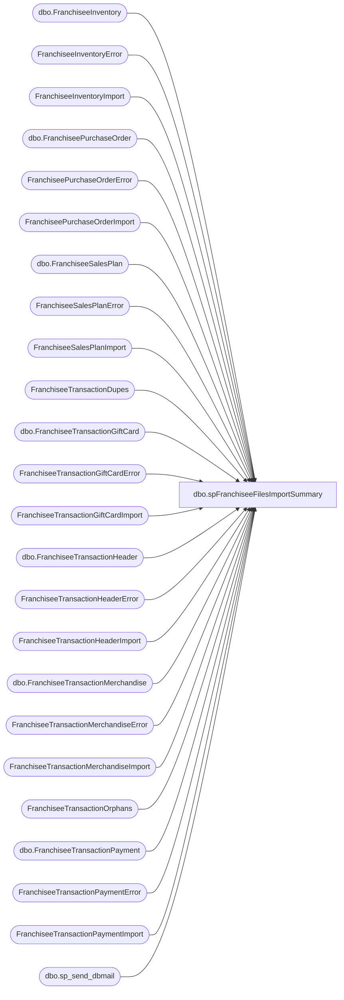

# dbo.spFranchiseeFilesImportSummary

**Database:** DWStaging  
**Server:** papamart  

## Architecture Diagram



## Table Dependencies

| Referenced Table |
|---|
| dbo.FranchiseeInventory |
| FranchiseeInventoryError |
| FranchiseeInventoryImport |
| dbo.FranchiseePurchaseOrder |
| FranchiseePurchaseOrderError |
| FranchiseePurchaseOrderImport |
| dbo.FranchiseeSalesPlan |
| FranchiseeSalesPlanError |
| FranchiseeSalesPlanImport |
| FranchiseeTransactionDupes |
| dbo.FranchiseeTransactionGiftCard |
| FranchiseeTransactionGiftCardError |
| FranchiseeTransactionGiftCardImport |
| dbo.FranchiseeTransactionHeader |
| FranchiseeTransactionHeaderError |
| FranchiseeTransactionHeaderImport |
| dbo.FranchiseeTransactionMerchandise |
| FranchiseeTransactionMerchandiseError |
| FranchiseeTransactionMerchandiseImport |
| FranchiseeTransactionOrphans |
| dbo.FranchiseeTransactionPayment |
| FranchiseeTransactionPaymentError |
| FranchiseeTransactionPaymentImport |
| dbo.sp_send_dbmail |

## Stored Procedure Code

```sql
CREATE proc [dbo].[spFranchiseeFilesImportSummary]
		@Franchisee varchar(2),
		@BatchID varchar(1000),
		@TransHeader int,
		@TransPayment int,
		@TransMerch int,
		@TransGiftCard int,
		@Inventory int,
		@PurchaseOrder int,
		@SalesPlan int,
		@InvalidStores int,
		@RejectedProduct_keys int,
		@THImpRows int,
		@TPImpRows int,
		@TMImpRows int,
		@TGCImpRows int,
		@InvImpRows int,
		@POImpRows int,
		@SPImpRows int,
		@THEmptyRows int, -- = completely empty row - all columns are blank
		@TPEmptyRows int, -- = completely empty row - all columns are blank
		@TMEmptyRows int, -- = completely empty row - all columns are blank
		@TGCEmptyRows int, -- = completely empty row - all columns are blank
		@InvEmptyRows int, -- = completely empty row - all columns are blank
		@POEmptyRows int, -- = completely empty row - all columns are blank
		@SPEmptyRows int, -- = completely empty row - all columns are blank
		@PreviousPeriodRows int
as 

-- =====================================================================================================
-- Name: spFranchiseeFilesImportSummary
--
--Description: Captures summary of Franchisee File Import process

-- Revision History
--		Name:			Date:			Comments:
--		Dan Tweedie		02/09/2016		Created proc.	
--		Tim Bytnar		11/11/2016		Added in the columns for validations
--		Tim Bytnar		11/6/2017		Added the CN recipients in case statements
--		Anuhya Relangi	11/11/2019		Updated the IN recipients.
--		Anuhya Relangi  11/18/2019      Added new recipients to IN list.
--      Anuhya Relangi	4/2/2020		Added new recipients to copy_recipients
-- =====================================================================================================

set nocount on

Declare
		@TransHeaderFile varchar(25),
		@TransPaymentFile varchar(25),
		@TransMerchFile varchar(25),
		@TransGiftCardFile varchar(25),
		@InvFile varchar(25),
		@POFile varchar(25),
		@SPFile varchar(25)

Select @TransHeaderFile = 'TransHeader',
	   @TransPaymentFile = 'TransPayment',
	   @TransMerchFile = 'TransMerch',
	   @TransGiftCardFile = 'TransGiftCard',
	   @InvFile = 'Inventory',
	   @POFile = 'PurchaseOrder',
	   @SPFile = 'SalesPlan'
	   


IF (Object_ID('tempdb..#Errors') IS NOT NULL) DROP TABLE #Errors;
WITH Errors (FileType, ID, ErrorSource, ErrorDesc)
AS (
	select  
			@TransHeaderFile,
			TransactionID,
			ErrorSource,
			ErrorDesc
	from FranchiseeTransactionHeaderError with (nolock) 
	where Franchisee = @Franchisee
	union all
	select  
			@TransPaymentFile,
			TransactionID,
			ErrorSource,
			ErrorDesc
	from FranchiseeTransactionPaymentError with (nolock) 
	where Franchisee = @Franchisee
	union all
	select  
			@TransMerchFile,
			TransactionID,
			ErrorSource,
			ErrorDesc
	from FranchiseeTransactionMerchandiseError with (nolock) 
	where Franchisee = @Franchisee
	union all
	select  
			@TransGiftCardFile,
			TransactionID,
			ErrorSource,
			ErrorDesc
	from FranchiseeTransactionGiftCardError with (nolock) 
	where Franchisee = @Franchisee
	union all
	select 
			@InvFile,
			cast (
					(
						  i.Franchisee 
						+ convert(varchar, i.InventoryDate, 112) 
						+ cast(i.StoreID as varchar) 
						+ cast(row_number() over (partition by i.StoreID, i.InventoryDate order by i.style) as varchar)
					) as varchar(25) 
				) as InventoryID, --this is the code used to derive the InventoryID during the insert to DW, this is NULL until insert to DW
			i.ErrorSource,
			i.ErrorDesc
	from FranchiseeInventoryError i with (nolock) 
	where Franchisee = @Franchisee
	union all
	select
			@POFile,
			p.PurchaseOrderID,
			p.ErrorSource,
			p.ErrorDesc
	from FranchiseePurchaseOrderError p with (nolock)
	where p.Franchisee = @Franchisee
	union all
	select 
			@SPFile,
			cast (
					(
					   s.Franchisee
					   + s.FiscalYear
					   + s.FiscalWeek
					   + s.StoreID
					   + convert(varchar, s.InsertDate, 112)
					) as varchar(25) 
				) as SalesPlanID,
			s.ErrorSource,
			s.ErrorDesc
	from FranchiseeSalesPlanError s with (nolock)
	where s.Franchisee = @Franchisee			
   )
select *
into #Errors
from Errors

--==================================================================

IF (Object_ID('tempdb..#SUMMARY') IS NOT NULL) DROP TABLE #SUMMARY;
WITH 
FilesStaged (FileType, FilesStaged, RowsInFile) 
as (
	select 
			@TransHeaderFile as FileType,
			case when @TransHeader = 0 then 'NO' else 'YES' end as FilesStaged,
			@THImpRows - @THEmptyRows as RowsInFile
	UNION
	select 
			@TransPaymentFile as FileType,
			case when @TransPayment = 0 then 'NO' else 'YES' end as FilesStaged,
			@TPImpRows - @TPEmptyRows as RowsInFile
	UNION
	select 
			@TransMerchFile as FileType,
			case when @TransMerch = 0 then 'NO' else 'YES' end as FilesStaged,
			@TMImpRows - @TMEmptyRows as RowsInFile
	UNION
	select 
			@TransGiftCardFile as FileType,
			case when @TransGiftCard = 0 then 'NO' else 'YES' end as FilesStaged,
			@TGCImpRows - @TGCEmptyRows as RowsInFile
	UNION
	select 
			@InvFile as FileType,
			case when @Inventory = 0 then 'NO' else 'YES' end as FilesStaged,
			@InvImpRows - @InvEmptyRows as RowsInFile
	UNION
	select 
			@POFile as FileType,
			case when @PurchaseOrder = 0 then 'NO' else 'YES' end as FilesStaged,
			@POImpRows - @POEmptyRows as RowsInFile
	UNION
	select 
			@SPFile FileType,
			case when @SalesPlan = 0 then 'NO' else 'YES' end as FilesStaged,
			@SPImpRows - @SPEmptyRows as RowsInFile
),
EmptyColumns (FileType, EmptyColumnRows)
AS (
	Select  
			@TransHeaderFile as FileType,
			count(*) as EmptyColumnErrorRows
	from #Errors 
	where ErrorDesc in ('Transaction Header Empty Column Found') 
	UNION
	Select  
			@TransPaymentFile as FileType,
			count(*) as EmptyColumnErrorRows
	from #Errors 
	where ErrorDesc in ('Transaction Payment Empty Column Found')
	UNION
	Select  
			@TransMerchFile as FileType,
			count(*) as EmptyColumnErrorRows
	from #Errors 
	where ErrorDesc in ('Transaction Merchandise Empty Column Found')
	UNION
	Select  
			@TransGiftCardFile as FileType,
			count(*) as EmptyColumnErrorRows
	from #Errors 
	where ErrorDesc in ('Transaction GiftCard Empty Column Found')
	UNION
	Select 
		   @InvFile,
		   count(*) as EmptyColumnErrorRows
	from #Errors
	where ErrorDesc in ('Inventory Empty Column Found')
	UNION
	Select 
		   @POFile,
		   count(*) as EmptyColumnErrorRows
	from #Errors
	where ErrorDesc in ('Purchase Order Empty Column Found')
	UNION
	Select 
		   @SPFile,
		   count(*) as EmptyColumnErrorRows
	from #Errors
	where ErrorDesc in ('Sales Plan Empty Column Found')
   ),
ConversionErrors (FileType, ConversionErrorRows)
AS (
	Select  
			@TransHeaderFile as FileType,
	count(*) as ConversionErrorRows
	from #Errors 
	where ErrorDesc in ('Transaction Header TransDateTime Conversion Error', 'Transaction Header Conversion Error') 
	UNION
	Select	
			@TransPaymentFile as FileType,
			count(*) as ConversionErrorRows
	from #Errors 
	where ErrorDesc in ('Transaction Payment Conversion Error')
	UNION
	Select 
			@TransMerchFile as FileType,
			count(*) as ConversionErrorRows
	from #Errors 
	where ErrorDesc in ('Transaction Merchandise Conversion Error')
	UNION
	Select 
			@TransGiftCardFile as FileType,
			count(*) as ConversionErrorRows
	from #Errors 
	where ErrorDesc in ('Transaction GiftCard Conversion Error')
	UNION
	Select 
		   @InvFile,
		   count(*) ConversionErrorRows
	from #Errors
	where ErrorDesc in ('InventoryDate Conversion Error', 'Inventory Conversion Error')
	UNION
	Select 
		   @POFile,
		   count(*) ConversionErrorRows
	from #Errors
	where ErrorDesc in ('Purchase Order DueDate Conversion Error', 'Purchase Order Conversion Error')
	UNION
	Select 
		   @SPFile,
		   count(*) ConversionErrorRows
	from #Errors
	where ErrorDesc in ('Sales Plan Conversion Error')
   ),
ImportedRows (FileType, ImportedRows)
as (
	select 
			@TransHeaderFile as FileType,
			count(*) as ImportedRows
	from FranchiseeTransactionHeaderImport with (nolock)
	where Franchisee = @Franchisee
	UNION
	select 
			@TransPaymentFile as FileType,
			count(*) as ImportedRows
	from FranchiseeTransactionPaymentImport with (nolock)
	where Franchisee = @Franchisee
	UNION
	select 
			@TransMerchFile as FileType,
			count(*) as ImportedRows
	from FranchiseeTransactionMerchandiseImport with (nolock)
	where Franchisee = @Franchisee
	UNION
	select 
			@TransGiftCardFile as FileType,
			count(*) as ImportedRows
	from FranchiseeTransactionGiftCardImport with (nolock)
	where Franchisee = @Franchisee
	UNION
	select 
			@InvFile as FileType,
			count(*) as ImportedRows
	from FranchiseeInventoryImport with (nolock)
	where Franchisee = @Franchisee
	UNION
	select 
			@POFile as FileType,
			count(*) as ImportedRows
	from FranchiseePurchaseOrderImport with (nolock)
	where Franchisee = @Franchisee
	UNION
	select 
			@SPFile FileType,
			count(*) as ImportedRows
	from FranchiseeSalesPlanImport with (nolock)
	where Franchisee = @Franchisee
	),
DuplicateRows (FileType, DuplicateRows)
as (
	Select 
			@TransHeaderFile as FileType,
			count(*) as DupeRows
	from FranchiseeTransactionHeaderImport i with (nolock)
	where i.Franchisee = @Franchisee
	and exists (select d.TransactionID from FranchiseeTransactionDupes d with (nolock) where i.TransactionID = d.TransactionID and d.Franchisee = @Franchisee)
	UNION
	Select 
			@TransPaymentFile as FileType,
			count(*) as DupeRows
	from FranchiseeTransactionPaymentImport i with (nolock)
	where i.Franchisee = @Franchisee
	and exists (select d.TransactionID from FranchiseeTransactionDupes d with (nolock) where i.TransactionID = d.TransactionID and d.Franchisee = @Franchisee)
	UNION
	Select 
			@TransMerchFile as FileType,
			count(*) as DupeRows
	from FranchiseeTransactionMerchandiseImport i with (nolock)
	where i.Franchisee = @Franchisee
	and exists (select d.TransactionID from FranchiseeTransactionDupes d with (nolock) where i.TransactionID = d.TransactionID and d.Franchisee = @Franchisee)
	UNION
	Select 
			@TransGiftCardFile as FileType,
			count(*) as DupeRows
	from FranchiseeTransactionGiftCardImport i with (nolock)
	where i.Franchisee = @Franchisee
	and exists (select d.TransactionID from FranchiseeTransactionDupes d with (nolock) where i.TransactionID = d.TransactionID and d.Franchisee = @Franchisee)
	UNION
	select 
			@InvFile as FileType,
			0 as DupeRows
	UNION
	select 
			@POFile as FileType,
			0 as DupeRows
	UNION
	select 
			@SPFile FileType,
			0 as DupeRows
	),
OrphanRows (FileType, OrphanRows)
as (
	Select 
			@TransHeaderFile as FileType,
			count(*) as OrphanRows
	from FranchiseeTransactionHeaderImport i with (nolock)
	where i.Franchisee = @Franchisee
	and exists (select d.TransactionID from FranchiseeTransactionOrphans d with (nolock) where i.TransactionID = d.TransactionID and d.Franchisee = @Franchisee)
	UNION
	Select 
			@TransPaymentFile as FileType,
			count(*) as OrphanRows
	from FranchiseeTransactionPaymentImport i with (nolock)
	where i.Franchisee = @Franchisee
	and exists (select d.TransactionID from FranchiseeTransactionOrphans d with (nolock) where i.TransactionID = d.TransactionID and d.Franchisee = @Franchisee)
	UNION
	Select 
			@TransMerchFile as FileType,
			count(*) as OrphanRows
	from FranchiseeTransactionMerchandiseImport i with (nolock)
	where i.Franchisee = @Franchisee
	and exists (select d.TransactionID from FranchiseeTransactionOrphans d with (nolock) where i.TransactionID = d.TransactionID and d.Franchisee = @Franchisee)
	UNION
	Select 
			@TransGiftCardFile as FileType,
			count(*) as OrphanRows
	from FranchiseeTransactionGiftCardImport i with (nolock)
	where i.Franchisee = @Franchisee
	and exists (select d.TransactionID from FranchiseeTransactionOrphans d with (nolock) where i.TransactionID = d.TransactionID and d.Franchisee = @Franchisee)
	UNION
	select 
			@InvFile as FileType,
			0 as OrphanRows
	UNION
	select 
			@POFile as FileType,
			0 as OrphanRows
	UNION
	select 
			@SPFile FileType,
			0 as OrphanRows
	),
StoreReject as
	(
		select 
			@TransHeaderFile as FileType,
			@InvalidStores as RejectRows
	),
StyleReject as
	(
		select
			@TransMerchFile as FileType,
			@RejectedProduct_keys as RejectRows
	),
DWRows (FileType, DWRows)
as (
	Select 
		@TransHeaderFile as FileType,
		count(*) as DWRows
	from DW.dbo.FranchiseeTransactionHeader
	where BatchID = @BatchID
	UNION
	Select 
			@TransPaymentFile as FileType,
			count(*) as DWRows
	from DW.dbo.FranchiseeTransactionPayment
	where BatchID = @BatchID
	UNION
	Select 
			@TransMerchFile as FileType,
			count(*) as DWRows
	from DW.dbo.FranchiseeTransactionMerchandise
	where BatchID = @BatchID
	UNION
	Select 
			@TransGiftCardFile as FileType,
			count(*) as DWRows
	from DW.dbo.FranchiseeTransactionGiftCard
	where BatchID = @BatchID
	UNION
	Select 
			@InvFile as FileType,
			count(*) as DWRows
	from DW.dbo.FranchiseeInventory
	where BatchID = @BatchID
	UNION
	Select 
			@POFile as FileType,
			count(*) as DWRows
	from DW.dbo.FranchiseePurchaseOrder
	where BatchID = @BatchID
	UNION
	Select 
			@SPFile FileType,
			count(*) as DWRows
	from DW.dbo.FranchiseeSalesPlan
	where BatchID = @BatchID
	),
InsertToDWErrors (FileType, InsertToDWErrorRows)
AS (
	Select 
			@TransHeaderFile as FileType,
			count(*) as InsertErrorRows
	from #Errors
	where FileType = @TransHeaderFile
	and ErrorDesc = 'Insert To DW Error'
	UNION
	Select 
			@TransPaymentFile as FileType,
			count(*) as InsertErrorRows
	from #Errors
	where FileType = @TransPaymentFile
	and ErrorDesc = 'Insert To DW Error'
	UNION
	Select 
			@TransMerchFile as FileType,
			count(*) as InsertErrorRows
	from #Errors
	where FileType = @TransMerchFile
	and ErrorDesc = 'Insert To DW Error'
	UNION
	Select 
			@TransGiftCardFile as FileType,
			count(*) as InsertErrorRows
	from #Errors
	where FileType = @TransGiftCardFile
	and ErrorDesc = 'Insert To DW Error'
	UNION
	Select 
		   @InvFile,
		   count(*) as InsertErrorRows
	from #Errors
	where FileType = @InvFile
	and ErrorDesc = 'Insert To DW Error'
	UNION
	Select 
		   @POFile,
		   count(*) as InsertErrorRows
	from #Errors
	where FileType = @POFile
	and ErrorDesc = 'Insert To DW Error'
	UNION
	Select 
		   @SPFile,
		   count(*) as InsertErrorRows
	from #Errors
	where FileType = @SPFile
	and ErrorDesc = 'Insert To DW Error'
   )

select 
	f.FileType, 
	f.FilesStaged, 
	isnull(f.RowsInFile, 0) RowsInFile,
	isnull(ec.EmptyColumnRows, 0) EmptyColumnRows,
	isnull(ce.ConversionErrorRows, 0) ConversionErrorRows,
	isnull(i.ImportedRows, 0) ImportedRows,
	isnull(d.DuplicateRows, 0) DuplicateRows,
	isnull(o.OrphanRows, 0) OrphanRows,
	isnull(dw.DWRows, 0) InsertToDWRows,
	isnull(idwe.InsertToDWErrorRows, 0) DWErrorRows,
	isnull(ist.RejectRows, 0) InvalidStoreRows,
	isnull(rpk.RejectRows, 0) RejectedProduct_keysRows
into #SUMMARY
from FilesStaged f
left join EmptyColumns ec on f.FileType = ec.FileType
left join ConversionErrors ce on f.FileType = ce.FileType
left join ImportedRows i on f.FileType = i.FileType 
left join DuplicateRows d on f.FileType = d.FileType
left join OrphanRows o on f.FileType = o.FileType
left join DWRows dw on f.FileType = dw.FileType
left join InsertToDWErrors idwe on f.FileType = idwe.FileType
left join StoreReject ist on f.FileType = ist.FileType
left join StyleReject rpk on f.FileType = rpk.FileType

----SEND EMAIL
declare 
		@date varchar(10),
		@subj varchar(1000),
		@recip varchar(1000),
		@text nvarchar(max),
		@exception nvarchar(max),
		@exceptionSubject varchar(1000),
		@FranchiseeText varchar(52)

IF (SELECT COUNT(*) FROM #SUMMARY) > 0 
BEGIN
    SET @recip = case @Franchisee 
	   when 'AU' then 'duane.roberts@buildabear.com.au'
	   when 'DE' then 'levent.isli@kidsretailgroup.com;Volker.Seitz@kids-fashion-group.com'
	   when 'MX' then 'luis.pena@buildabear.mx;victor.pena@buildabear.mx;'
	   when 'AE' then 'jong@buildabear.ae;mahesh@ajb.ae'
	   when 'TR' then 'nihala@buildabear.com.tr;arzukushan@ozsay.com;tufana@buildabear.com.tr;omerk@buildabear.com.tr'
	   when 'ZA' then 'alex@toykingdom.co.za;kyle@toykingdom.co.za;michelle@buildabear.co.za;Lance@toykingdom.co.za'
	   when 'SG' then 'duane.roberts@buildabear.com.au;Gavin.Port@buildabear.com.au'
	   when 'CN' then 'donald@harrys-kitchen.com;johan@harrys-kitchen.com;frank.lin@harrys-kinderactive.com;KevenXiao@buildabear.com;benjamin@harrys-kinderactive.com;benjamin@harrys-kitchen.com'
	   when 'IN' then 'steve.antony@pearldatadirect.com;raiji.jolly@pearldatadirect.com;tablez.it@pearldatadirect.com;sumanta.guha@in.tablez.com;arun.cs@in.tablez.com'
	   when 'CL' then 'sjerez@ansaldo.cl;alex@ansaldo.cl;jmadera_sistemas@ansaldo.cl'
	   else 'biadmin@buildabear.com'
    end
END
ELSE
BEGIN
    SET @recip = 'biadmin@buildabear.com'
END


select 
		@date = convert(varchar, getdate(), 101),
		@FranchiseeText = case @Franchisee
							when 'AU' then '(Australia)'
							when 'DE' then '(Germany)'
							when 'MX' then '(Mexico)'
							when 'AE' then '(Gulf States)'
							when 'TR' then '(Turkey)'
							when 'ZA' then '(South Africa)'
							when 'SG' then '(Singapore)'
							when 'CN' then '(China)'
							when 'IN' then '(India)'
							when 'CL' then '(Chile)'
							end,
		
		@subj = 'Franchisee File Summary - ' + @franchisee + ' - ' + @FranchiseeText + ' - ' + @date
	
set @text = '<font face = arial size = 4> <B>' + @subj + '</font>' + 
				'<BR>' +
				'<font face =arial size = 2>' +
				'<BR>' +
				'The following table summarizes the ' + @franchisee + ' franchisee file import procedure for files located on the Build-A-Bear FTP server on ' + @date + '.' +
				'<br>' + 
				'Exception data has been packaged into CSV files, zipped and attached to this email for your reference.' + 
				'</B>' +
				'<BR>' +
				'<b>NOTE:There were ' + convert(varchar, @PreviousPeriodRows) + ' transactions with the transaction date being on a prior fiscal period. See attachment for more information.</b><br><br>'+
				'<table border="1">' +
				'<font face =arial size = 2>' +
				'<tr><th>File Type</th><th>Files Staged</th><th>Rows In File</th><th>Empty Column Rows</th><th>Conversion Error Rows</th><th>Imported Rows</th><th>Duplicate Rows</th><th>Orphan Rows</th><th>Invalid Stores</th><th>Rejected Product Keys</th><th>Insert To Data Warehouse</th><th>DW Error Rows</th></tr>' +
					CAST ( ( SELECT td = FileType, '',
									td = FilesStaged, '',
									td = RowsInFile, '',
									td = EmptyColumnRows, '',
									td = ConversionErrorRows, '',
									td = ImportedRows, '',
									td = DuplicateRows, '',
									td = OrphanRows, '',
									td = InvalidStoreRows, '',
									td = RejectedProduct_keysRows, '',
									td = InsertToDWRows, '',
									td = DWErrorRows, ''
								from #SUMMARY
								order by FileType
								FOR XML PATH('tr'), TYPE 
					) AS NVARCHAR(MAX) ) +
					'</font></table></font></p></p>
					<br>
					<br>
					<br>
					<font face =arial size = 2>
					<B><U>DEFINITIONS</U></B>
					<br>
					<B>Files Staged:</b> States whether a file was on the FTP server when the process ran.
					<br>
					<B>Rows In File: </b>Count of rows contained in the file, without regard to empty columns or conversion errors.
					<br>
					<B>Empty Column Rows:</b> Count of rows which contain one or more columns with no data. Rows are not imported into staging table. (If not reported in Exceptions attachment, this is empty rows at end of file)
					<br>
					<B>Conversion Error Rows:</b> Count of rows with columns that did not successfully convert to the data types defined on the data warehouse tables. Rows are not imported into staging table.
					<br>
					<B>Imported Rows:</b> Count of rows imported from specific file into preliminary staging table. Excludes Empty Column Rows and Conversion Error Rows.
					<br>
					<B>Duplicate Rows:</b> Count of rows removed from Imported Rows, due to duplicated TransactionID in Header file OR due to having TransactionID already in the data warehouse. When this occurs, the records are also removed from the Payment, Merchandise and GiftCard files.
					<br>
					<B>Orphan Rows:</b> Count of rows removed from Imported Rows, due to TransactionID not found in each of the required files. For example, if the Header file transaction is not found in the Payment file, the Header becomes an orphan, as will the Merchandise and/or GiftCard transactions.
					<br>
					<B>Inserted to Data Warehouse</b> Count of rows successfully integrated into our data warehouse. Ideally, this will be the same number as Rows In File and Imported Rows.				
					<br>
					<B>DW Error Rows:</b> Count of rows that did not successfully insert to the Data Warehouse. Exludes all other errors. This error occured while attempting to insert to data warehouse.		
					<br>
					<B>Invalid Stores:</b> Count of transactions with a store key specified that does not match what is in the data warehouse.		
					<br>
					<B>Rejected Product Keys:</b> Count of transactions with product keys that are rejected because they do not exist within the data warehouse and are not on the exceptions list. 		
					<br>
					<br>
					<B><U>ATTACHMENTS</U></B> (if any)
					<br>
					<B>If data exceptions are found, they will be output to CSV files, zipped and included as an attachment to this email.
					</font>
					'
	


--Check to see if Exceptions.zip exists, if not, change @zip to '' -- Exceptions.zip represents data exceptions found during runtime, exported to csv and zipped
declare @dir varchar(1000),
	@Zip nvarchar(max)
		
select @dir = 'dir \\ftp01\files\International\MerchData\' + @franchisee + '\*.zip /B'
select @Zip = '\\ftp01\files\International\MerchData\' + @franchisee + '\Exceptions.zip'

IF (Object_ID('tempdb..#dir') IS NOT NULL) DROP TABLE #dir
create table #dir
(DIR nvarchar(max) )
	
Insert #dir
exec master..xp_cmdshell @dir 
delete from #dir where DIR is null or DIR <> 'Exceptions.zip'

if (select count(*) from #dir) = 0
begin
select @Zip = ''
end

	
exec msdb.dbo.sp_send_dbmail
@profile_name = 'BIAdmin',
@recipients = @Recip,
@copy_recipients = 'biadmin@buildabear.com;victoriak@buildabear.com;GeorgeR@buildabear.co.uk;ColleenMe@buildabear.com',
@body = @text,
@subject= @subj,
@file_attachments = @Zip,
@body_format = 'HTML'
```

