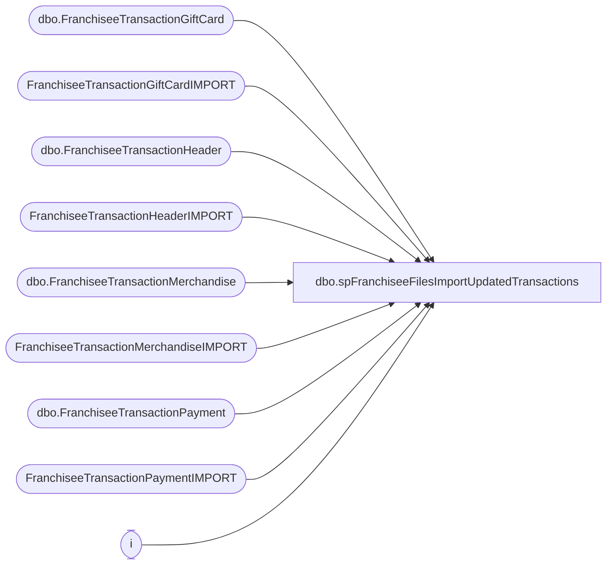

# dbo.spFranchiseeFilesImportUpdatedTransactions

**Database:** DWStaging  
**Server:** papamart  

## Architecture Diagram



## Table Dependencies

| Referenced Table |
|---|
| dbo.FranchiseeTransactionGiftCard |
| FranchiseeTransactionGiftCardIMPORT |
| dbo.FranchiseeTransactionHeader |
| FranchiseeTransactionHeaderIMPORT |
| dbo.FranchiseeTransactionMerchandise |
| FranchiseeTransactionMerchandiseIMPORT |
| dbo.FranchiseeTransactionPayment |
| FranchiseeTransactionPaymentIMPORT |
| i |

## Stored Procedure Code

```sql
CREATE proc [dbo].[spFranchiseeFilesImportUpdatedTransactions]
@Franchisee varchar(2)

as


-- =====================================================================================================
-- Name: spFranchiseeFilesImportUpdatedTransactions
--
-- Description:	Called from SSIS FranchiseeFilesImport. 
--				This proc's purpose is to remove previously loaded transactions if they are present in the new batch.
--				Rather than a merge, it updates the new transaction's InsertDate to equal the original transaction's InsertDate, then deletes the original transaction
--				 
-- Revision History
--		Name:			Date:			Comments:
--		Dan Tweedie		07/08/2016		Created proc.	
-- =====================================================================================================


set nocount on


--==================================================================================================================================================
--If import transactions are already in data warehouse, we're going to allow them to be imported again, 
--so we first remove the originals, update the new records with original insert date
--==================================================================================================================================================


IF (Object_ID('tempdb..#UpdatedFranchTransactions') IS NOT NULL) DROP TABLE #UpdatedFranchTransactions
select dw.FranchiseeTransactionHeaderID, i.TransactionID, dw.InsertDate
into #UpdatedFranchTransactions
from FranchiseeTransactionHeaderIMPORT i with (nolock)
join dw.dbo.FranchiseeTransactionHeader dw with (nolock) on dw.TransactionID = i.TransactionID and dw.Franchisee = i.Franchisee
where i.Franchisee = @Franchisee


if (select count(*) from #UpdatedFranchTransactions) > 0
BEGIN
	
	---UPDATE STAGED RECORD INSERT DATE TO BE THAT OF THE DW RECORD INSERT DATA
	update i
	set i.InsertDate = dw.InsertDate 
	from FranchiseeTransactionPaymentIMPORT i
	join #UpdatedFranchTransactions dw on i.TransactionID = dw.TransactionID
						
	update i
	set i.InsertDate = dw.InsertDate 
	from FranchiseeTransactionMerchandiseIMPORT i
	join #UpdatedFranchTransactions dw on i.TransactionID = dw.TransactionID
			
	update i
	set i.InsertDate = dw.InsertDate 
	from FranchiseeTransactionGiftCardIMPORT i
	join #UpdatedFranchTransactions dw on i.TransactionID = dw.TransactionID
			
	update i
	set i.InsertDate = dw.InsertDate 
	from FranchiseeTransactionHeaderIMPORT i
	join #UpdatedFranchTransactions dw on i.TransactionID = dw.TransactionID

	---DELETE THE DW RECORDS 
	delete i
	from dw.dbo.FranchiseeTransactionPayment i
	join #UpdatedFranchTransactions dw on i.FranchiseeTransactionHeaderID = dw.FranchiseeTransactionHeaderID

	delete i
	from dw.dbo.FranchiseeTransactionMerchandise i
	join #UpdatedFranchTransactions dw on i.FranchiseeTransactionHeaderID = dw.FranchiseeTransactionHeaderID	

	delete i
	from dw.dbo.FranchiseeTransactionGiftCard i
	join #UpdatedFranchTransactions dw on i.FranchiseeTransactionHeaderID = dw.FranchiseeTransactionHeaderID

	delete i
	from dw.dbo.FranchiseeTransactionHeader i
	join #UpdatedFranchTransactions dw on i.FranchiseeTransactionHeaderID = dw.FranchiseeTransactionHeaderID

END


---------------------------------------------------------
--if (select count(*) from #UpdatedFranchTransactions) > 0
--BEGIN
	
--	if (
--			select count(*) 
--			from FranchiseeTransactionPaymentIMPORT i
--			join #UpdatedFranchTransactions dw on i.TransactionID = dw.TransactionID
--		) >0

--			begin
--				update i
--				set i.InsertDate = dw.InsertDate 
--				from FranchiseeTransactionPaymentIMPORT i
--				join #UpdatedFranchTransactions dw on i.TransactionID = dw.TransactionID

--				delete i
--				from dw.dbo.FranchiseeTransactionPayment i
--				join #UpdatedFranchTransactions dw on i.FranchiseeTransactionHeaderID = dw.FranchiseeTransactionHeaderID
--			end

--	if (
--			select count(*) 
--			from FranchiseeTransactionMerchandiseIMPORT i
--			join #UpdatedFranchTransactions dw on i.TransactionID = dw.TransactionID
--		) >0

--			begin
--				update i
--				set i.InsertDate = dw.InsertDate 
--				from FranchiseeTransactionMerchandiseIMPORT i
--				join #UpdatedFranchTransactions dw on i.TransactionID = dw.TransactionID

--				delete i
--				from dw.dbo.FranchiseeTransactionMerchandise i
--				join #UpdatedFranchTransactions dw on i.FranchiseeTransactionHeaderID = dw.FranchiseeTransactionHeaderID
--			end

--	if (
--			select count(*)
--			from FranchiseeTransactionGiftCardIMPORT i
--			join #UpdatedFranchTransactions dw on i.TransactionID = dw.TransactionID
--		) >0

--			begin
--				update i
--				set i.InsertDate = dw.InsertDate 
--				from FranchiseeTransactionGiftCardIMPORT i
--				join #UpdatedFranchTransactions dw on i.TransactionID = dw.TransactionID

--				delete i
--				from dw.dbo.FranchiseeTransactionGiftCard i
--				join #UpdatedFranchTransactions dw on i.FranchiseeTransactionHeaderID = dw.FranchiseeTransactionHeaderID
--			end

--	update i
--	set i.InsertDate = dw.InsertDate 
--	from FranchiseeTransactionHeaderIMPORT i
--	join #UpdatedFranchTransactions dw on i.TransactionID = dw.TransactionID

--	delete i
--	from dw.dbo.FranchiseeTransactionHeader i
--	join #UpdatedFranchTransactions dw on i.FranchiseeTransactionHeaderID = dw.FranchiseeTransactionHeaderID

--END
```

