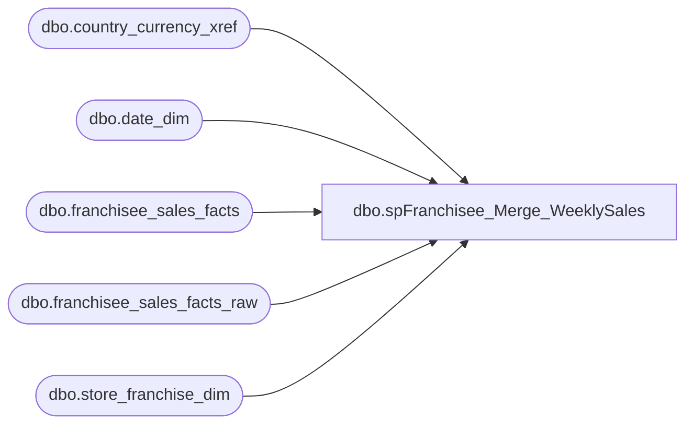

# dbo.spFranchisee_Merge_WeeklySales

**Database:** DWStaging  
**Server:** papamart  

## Architecture Diagram



## Table Dependencies

| Referenced Table |
|---|
| dbo.country_currency_xref |
| dbo.date_dim |
| dbo.franchisee_sales_facts |
| dbo.franchisee_sales_facts_raw |
| dbo.store_franchise_dim |

## Stored Procedure Code

```sql
CREATE PROC [dbo].[spFranchisee_Merge_WeeklySales]
-- =============================================================================================================
-- Name: [spFranchisee_Insert_WeeklySales]
--
-- Description:	use RAW table to insert/update the fact table, return # of rows affected
--
-- Revision History
--		Name:				Date:			Comments:
--		Kevin Shyr			12/10/2014		CREATED
--		Outside contractor	2/5/2015		1. Altered by added 8 new columns; (Friends,Human,Sales,Stuffers)
--											2. Added dw prefix in front of the following tables dw.dbo.country_currency_xref,
--											dw.dbo.date_dim,dw.dbo.store_franchise_dim, dw.dbo.franchisee_sales_facts
--											3. Merge Updates for franchisee_sales_facts table for existing records.
-- =============================================================================================================
AS
BEGIN
	SET NOCOUNT ON
	DECLARE @CntRowsInserted INT
	DECLARE @CntRowsUpdated INT
	DECLARE @CntRowsUpdated2015 INT
	DECLARE @CntRowsDeleted INT
	-- ********************* Working with raw data  *********************
	---------------------------------------------------------------------
	-- Update WeekEndingDateKey
	---------------------------------------------------------------------
	UPDATE fsfr
	SET week_ending_date_key = weekendkey.WeekEndingDateKey
	--SELECT COUNT(*)
	FROM dbo.franchisee_sales_facts_raw fsfr
		INNER JOIN (SELECT week_id 
						, actual_date
					FROM dw.dbo.date_dim WITH(NOLOCK)
		) dateweek
			ON CAST(CONVERT(varchar(10),fsfr.WeekEndingDateRaw,101) AS smalldatetime) = dateweek.actual_date
		INNER JOIN (SELECT week_id
						, MAX(date_key) AS WeekEndingDateKey
					FROM dw.dbo.date_dim WITH(NOLOCK)
					GROUP BY week_id
		) weekendkey
			ON dateweek.week_id = weekendkey.week_id
	---------------------------------------------------------------------
	-- Update store_key and currency_key
	---------------------------------------------------------------------
	UPDATE fsfr
	SET franchisee_store_key = s.store_key
		, currency_key = cc.currency_key
	-- SELECT COUNT(*)
	FROM dbo.franchisee_sales_facts_raw fsfr
		INNER JOIN dw.dbo.store_franchise_dim s WITH(NOLOCK)
			ON s.store_id = SUBSTRING(fsfr.StoreNameRaw, CHARINDEX('#', fsfr.StoreNameRaw) + 1, CHARINDEX(' ', fsfr.StoreNameRaw) - CHARINDEX('#', fsfr.StoreNameRaw) - 1)
		LEFT OUTER JOIN dw.dbo.country_currency_xref cc WITH(NOLOCK)
			ON cc.country_code = s.country
	WHERE ISNULL(fsfr.StoreNameRaw, '') <> ''

	-- Select good records
	UPDATE fsfr
	SET IsGoodRecord = 1
	-- SELECT COUNT(*)
	FROM dbo.franchisee_sales_facts_raw fsfr
		INNER JOIN (SELECT Max(RawRecordID) AS RawRecordID
					, franchisee_store_key
						, week_ending_date_key
						, currency_key FROM 
(SELECT Min(RawRecordID) AS RawRecordID
						, franchisee_store_key
						, week_ending_date_key
						, currency_key
					FROM dbo.franchisee_sales_facts_raw r WITH(NOLOCK)
					WHERE franchisee_store_key IS NOT NULL
						AND week_ending_date_key IS NOT NULL
						AND currency_key IS NOT NULL
						AND IsNewList = 0 -- This identifies this group of records coming from the old list
					GROUP BY franchisee_store_key
						, week_ending_date_key
						, currency_key
UNION -- Adding additional Lines for New Hieraracy List
SELECT Min(RawRecordID) AS RawRecordID
						, franchisee_store_key
						, week_ending_date_key
						, currency_key
					FROM dbo.franchisee_sales_facts_raw r WITH(NOLOCK)
					WHERE franchisee_store_key IS NOT NULL
						AND week_ending_date_key IS NOT NULL
						AND currency_key IS NOT NULL
						AND (human_sales IS NOT NULL) AND (human_units IS NOT NULL) 
						AND IsNewList = 1 --This identifies this group of records coming from the new list
					GROUP BY franchisee_store_key
						, week_ending_date_key
						, currency_key
						) ug
GROUP BY franchisee_store_key
, week_ending_date_key
, currency_key) g
			ON fsfr.RawRecordID = g.RawRecordID

	---------------------------------------------------------------------
	-- Delete records that were removed
	---------------------------------------------------------------------
       DELETE fsf
       FROM dw.dbo.franchisee_sales_facts fsf
              INNER JOIN dw.dbo.store_franchise_dim sfd WITH(READCOMMITTED)
                     ON fsf.franchisee_store_key = sfd.store_key
              INNER JOIN dw.dbo.date_dim dd WITH(READCOMMITTED)
                     ON fsf.week_ending_date_key = dd.date_key
              LEFT OUTER JOIN dbo.franchisee_sales_facts_raw fsfr WITH(READCOMMITTED)
                     ON fsf.franchisee_store_key = fsfr.franchisee_store_key
                           AND fsf.week_ending_date_key = fsfr.week_ending_date_key
       WHERE fsfr.franchisee_store_key IS NULL
              AND (sfd.store_id NOT LIKE 'DE%') -- exclude Germany, we determined that Denmark should be deleted
     
       SELECT @CntRowsDeleted = @@ROWCOUNT
       
	---------------------------------------------------------------------
	-- Update changed records
	---------------------------------------------------------------------
	UPDATE fsf
	SET [currency_key] = fsfr.[currency_key]
		, [total_sales] = fsfr.[total_sales]
		, [sales_plan] = fsfr.[sales_plan]
		, [transaction_count] = fsfr.[transaction_count]
		, [footware_sales] = fsfr.[footware_sales]
		, [footware_units] = fsfr.[footware_units]
		, [sound_sales] = fsfr.[sound_sales]
		, [sound_units] = fsfr.[sound_units]
		, [unstuffed_sales] = fsfr.[unstuffed_sales]
		, [unstuffed_units] = fsfr.[unstuffed_units]
		, [party_sales] = fsfr.[party_sales]
		, [party_count] = fsfr.[party_count]
		, [gift_card_sales] = fsfr.[gift_card_sales]
		, [gift_card_units] = fsfr.[gift_card_units]
		, [accessories_sales] = fsfr.[accessories_sales]
		, [accessories_units] = fsfr.[accessories_units]
		, [clothes_sales] = fsfr.[clothes_sales]
		, [clothes_units] = fsfr.[clothes_units]
		, [sports_sales] = fsfr.[sports_sales]
		, [sports_units] = fsfr.[sports_units]
		, [prestuffed_sales] = fsfr.[prestuffed_sales] 
		, [prestuffed_units] = fsfr.[prestuffed_units]
		, [friend_sales] = fsfr.[friend_sales]
		, [friend_units] = fsfr.[friend_units]
		, [human_sales] = fsfr.[human_sales]
		, [human_units] = fsfr.[human_units]
		, [pet_sales] = fsfr.[pet_sales]
		, [pet_units] = fsfr.[pet_units]
		, [stuffers_sales] = fsfr.[stuffers_sales]
		, [stuffers_units] = fsfr.[stuffers_units]
		, coupons_and_discounts = fsfr.coupons_and_discounts
		, [RETURNS] = fsf.[RETURNS]
		, giftcards_redeemed = fsfr.giftcards_redeemed
		, exchange_rate = fsfr.exchange_rate 
		, withholding_tax_rate = fsfr.withholding_tax_rate
	-- SELECT COUNT(*)
	FROM dw.dbo.franchisee_sales_facts fsf
		INNER JOIN dbo.franchisee_sales_facts_raw fsfr WITH(NOLOCK)
			ON fsf.franchisee_store_key = fsfr.franchisee_store_key
				AND fsf.week_ending_date_key = fsfr.week_ending_date_key
				AND fsfr.IsGoodRecord = 1
	WHERE (fsf.[currency_key] <> fsfr.[currency_key]
		OR ISNULL(fsf.[total_sales], 0) <> ISNULL(fsfr.[total_sales], 0)
		OR ISNULL(fsf.[sales_plan], 0) <> ISNULL(fsfr.[sales_plan], 0)
		OR ISNULL(fsf.[transaction_count], 0) <> ISNULL(fsfr.[transaction_count], 0)
		OR ISNULL(fsf.[footware_sales], 0) <> ISNULL(fsfr.[footware_sales], 0)
		OR ISNULL(fsf.[footware_units], 0) <> ISNULL(fsfr.[footware_units], 0)
		OR ISNULL(fsf.[sound_sales], 0) <> ISNULL(fsfr.[sound_sales], 0)
		OR ISNULL(fsf.[sound_units], 0) <> ISNULL(fsfr.[sound_units], 0)
		OR ISNULL(fsf.[unstuffed_sales], 0) <> ISNULL(fsfr.[unstuffed_sales], 0)
		OR ISNULL(fsf.[unstuffed_units], 0) <> ISNULL(fsfr.[unstuffed_units], 0)
		OR ISNULL(fsf.[party_sales], 0) <> ISNULL(fsfr.[party_sales], 0)
		OR ISNULL(fsf.[party_count], 0) <> ISNULL(fsfr.[party_count], 0)
		OR ISNULL(fsf.[gift_card_sales], 0) <> ISNULL(fsfr.[gift_card_sales], 0)
		OR ISNULL(fsf.[gift_card_units], 0) <> ISNULL(fsfr.[gift_card_units], 0)
		OR ISNULL(fsf.[accessories_sales], 0) <> ISNULL(fsfr.[accessories_sales], 0)
		OR ISNULL(fsf.[accessories_units], 0) <> ISNULL(fsfr.[accessories_units], 0)
		OR ISNULL(fsf.[clothes_sales], 0) <> ISNULL(fsfr.[clothes_sales], 0)
		OR ISNULL(fsf.[clothes_units], 0) <> ISNULL(fsfr.[clothes_units], 0)
		OR ISNULL(fsf.[sports_sales], 0) <> ISNULL(fsfr.[sports_sales], 0)
		OR ISNULL(fsf.[sports_units], 0) <> ISNULL(fsfr.[sports_units], 0)
		OR ISNULL(fsf.[prestuffed_sales], 0) <> ISNULL(fsfr.[prestuffed_sales], 0) 
		OR ISNULL(fsf.[prestuffed_units], 0) <> ISNULL(fsfr.[prestuffed_units], 0)
		OR ISNULL(fsf.[friend_sales], 0) <> ISNULL(fsfr.[friend_sales], 0)
		OR ISNULL(fsf.[friend_units], 0) <> ISNULL(fsfr.[friend_units], 0)
		OR ISNULL(fsf.[human_sales], 0) <> ISNULL(fsfr.[human_sales], 0)
		OR ISNULL(fsf.[human_units], 0) <> ISNULL(fsfr.[human_units], 0)
		OR ISNULL(fsf.[pet_sales], 0) <> ISNULL(fsfr.[pet_sales], 0)
		OR ISNULL(fsf.[pet_units], 0) <> ISNULL(fsfr.[pet_units], 0)
		OR ISNULL(fsf.[stuffers_sales], 0) <> ISNULL(fsfr.[stuffers_sales], 0)
		OR ISNULL(fsf.[stuffers_units], 0) <> ISNULL(fsfr.[stuffers_units], 0)
		OR ISNULL(fsf.coupons_and_discounts, 0) <> ISNULL(fsfr.coupons_and_discounts, 0)
		OR ISNULL(fsf.[RETURNS], 0) <> ISNULL(fsf.[RETURNS], 0)
		OR ISNULL(fsf.giftcards_redeemed, 0) <> ISNULL(fsfr.giftcards_redeemed, 0)
		OR ISNULL(fsf.exchange_rate, 0) <> ISNULL(fsfr.exchange_rate, 0)
		OR ISNULL(fsf.withholding_tax_rate, 0) <> ISNULL(fsfr.withholding_tax_rate, 0)
		OR fsfr.human_sales IS NOT NULL AND fsfr.human_units IS NOT NULL -- Adding additional Lines for New Hieraracy List
		AND fsfr.pet_sales IS NOT NULL AND fsfr.pet_units IS NOT NULL
		AND fsfr.stuffers_sales IS NOT NULL AND fsfr.stuffers_units IS NOT NULL
		AND fsfr.friend_sales IS NOT NULL AND fsfr.friend_units IS NOT NULL)
	
	SELECT @CntRowsUpdated = @@ROWCOUNT
	PRINT CAST(@CntRowsUpdated AS VARCHAR(10)) + ' updated'
	
	INSERT INTO dw.[dbo].[franchisee_sales_facts]
		([week_ending_date_key]
		,[franchisee_store_key]
		,[currency_key]
		,[total_sales]
		,[sales_plan]
		,[transaction_count]
		,[footware_sales]
		,[footware_units]
		,[sound_sales]
		,[sound_units]
		,[unstuffed_sales]
		,[unstuffed_units]
		,[party_sales]
		,[party_count]
		,[gift_card_sales]
		,[gift_card_units]
		,[accessories_sales]
		,[accessories_units]
		,[clothes_sales]
		,[clothes_units]
		,[sports_sales]
		,[sports_units]
		,[prestuffed_sales]
		,[prestuffed_units]
		,[friend_sales] 
		,[friend_units] 
		,[human_sales] 
		,[human_units]
		,[pet_sales]
		,[pet_units]
		,[stuffers_sales] 
		,[stuffers_units]
		,coupons_and_discounts
		,[RETURNS]
		,giftcards_redeemed
		,exchange_rate
		,withholding_tax_rate)
	SELECT fsfr.[week_ending_date_key]
		, fsfr.[franchisee_store_key]
		, fsfr.[currency_key]
		, fsfr.[total_sales]
		, fsfr.[sales_plan]
		, fsfr.[transaction_count]
		, fsfr.[footware_sales]
		, fsfr.[footware_units]
		, fsfr.[sound_sales]
		, fsfr.[sound_units]
		, fsfr.[unstuffed_sales]
		, fsfr.[unstuffed_units]
		, fsfr.[party_sales]
		, fsfr.[party_count]
		, fsfr.[gift_card_sales]
		, fsfr.[gift_card_units]
		, fsfr.[accessories_sales]
		, fsfr.[accessories_units]
		, fsfr.[clothes_sales]
		, fsfr.[clothes_units]
		, fsfr.[sports_sales]
		, fsfr.[sports_units]
		, fsfr.[prestuffed_sales]
		, fsfr.[prestuffed_units]
		, fsfr.[friend_sales]
		, fsfr.[friend_units]
		, fsfr.[human_sales]
		, fsfr.[human_units]
		, fsfr.[pet_sales]
		, fsfr.[pet_units]
		, fsfr.[stuffers_sales]
		, fsfr.[stuffers_units]
		, fsfr.coupons_and_discounts
		, fsfr.[RETURNS]
		, fsfr.giftcards_redeemed
		, fsfr.exchange_rate
		, fsfr.withholding_tax_rate
	FROM dbo.franchisee_sales_facts_raw fsfr WITH(NOLOCK)
		LEFT OUTER JOIN dw.dbo.franchisee_sales_facts fsf WITH(NOLOCK)		
			ON fsf.franchisee_store_key = fsfr.franchisee_store_key
				AND fsf.week_ending_date_key = fsfr.week_ending_date_key
	WHERE fsfr.IsGoodRecord = 1
		AND fsf.franchisee_store_key IS NULL

	SELECT @CntRowsInserted = @@ROWCOUNT
	PRINT CAST(@CntRowsInserted AS VARCHAR(10)) + ' inserted'

	SELECT ISNULL(@CntRowsInserted, 0) + ISNULL(@CntRowsUpdated, 0) + ISNULL(@CntRowsDeleted, 0) 
	
END
```

