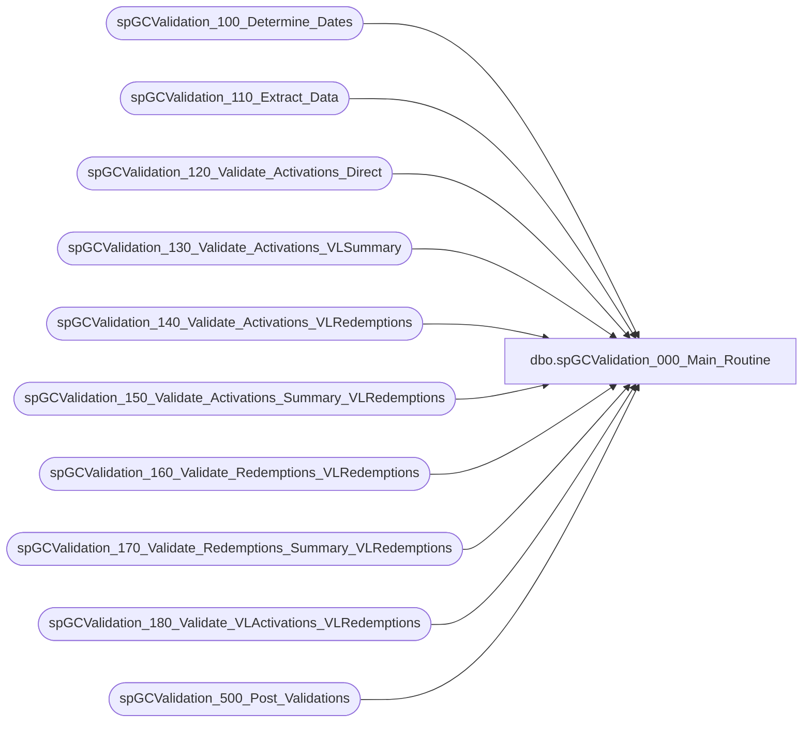

# dbo.spGCValidation_000_Main_Routine

**Database:** DWStaging  
**Server:** papamart  

## Architecture Diagram



## Table Dependencies

| Referenced Table |
|---|
| spGCValidation_100_Determine_Dates |
| spGCValidation_110_Extract_Data |
| spGCValidation_120_Validate_Activations_Direct |
| spGCValidation_130_Validate_Activations_VLSummary |
| spGCValidation_140_Validate_Activations_VLRedemptions |
| spGCValidation_150_Validate_Activations_Summary_VLRedemptions |
| spGCValidation_160_Validate_Redemptions_VLRedemptions |
| spGCValidation_170_Validate_Redemptions_Summary_VLRedemptions |
| spGCValidation_180_Validate_VLActivations_VLRedemptions |
| spGCValidation_500_Post_Validations |

## Stored Procedure Code

```sql
CREATE PROCEDURE [dbo].[spGCValidation_000_Main_Routine]
-- =============================================================================================================
-- Name: spGCValidation_000_Main_Routine
--
-- Description:	
--	This is the main routine for the Giftcard Validation
--
--
-- Input:		
--
-- Output: 
--
-- Dependencies: 
--
-- Revision History
--		Name:			Date:			Comments:
--		Gary Murrish	11/21/2013		Created

-- =============================================================================================================
AS

	SET NOCOUNT ON

	-- Set the dates for this run
	EXEC spGCValidation_100_Determine_Dates

	-- Extract the data from the data warehouse to the staging tables
	--	for this validation run
	EXEC spGCValidation_110_Extract_Data

	-- Validate Activations between DW and Valuelink directly
	EXEC spGCValidation_120_Validate_Activations_Direct

	-- Validate Activations between DW and Summarized Valuelink records
	EXEC spGCValidation_130_Validate_Activations_VLSummary

	-- Validate DW Activations against VL Redemptions directly
	EXEC spGCValidation_140_Validate_Activations_VLRedemptions

	-- Validate DW Activations against summarized VL Redemptions
	EXEC spGCValidation_150_Validate_Activations_Summary_VLRedemptions

	-- Validate DW Redemptions against detail VL Redemptions
	EXEC spGCValidation_160_Validate_Redemptions_VLRedemptions

	-- Validate DW Redemptions against summariezed VL Redemptions
	EXEC spGCValidation_170_Validate_Redemptions_Summary_VLRedemptions

	-- Clear up the Web problems of VLActivations to VLRedemptions
	EXEC spGCValidation_180_Validate_VLActivations_VLRedemptions

	-- Complete the analysis and post the results back to the data warehouse
	EXEC spGCValidation_500_Post_Validations
```

