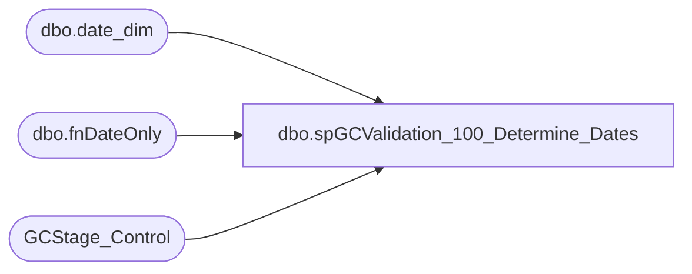

# dbo.spGCValidation_100_Determine_Dates

**Database:** DWStaging  
**Server:** papamart  

## Architecture Diagram



## Table Dependencies

| Referenced Table |
|---|
| dbo.date_dim |
| dbo.fnDateOnly |
| GCStage_Control |

## Stored Procedure Code

```sql
CREATE PROCEDURE [dbo].[spGCValidation_100_Determine_Dates]
-- =============================================================================================================
-- Name: spGCValidation_100_Determine_Dates
--
-- Description:	
--	Determine the dates for this Validation Run
--
--
-- Input:		
--
-- Output: 
--
-- Dependencies: 
--
-- Revision History
--		Name:			Date:			Comments:
--		Gary Murrish	11/21/2013		Created

-- =============================================================================================================
AS

	SET NOCOUNT ON

	DECLARE @numDaysToAnalyze int
	DECLARE @numDaysPrior int
	SET @numDaysToAnalyze = 15
	SET @numDaysPrior = 10

	DECLARE @maxDate AS datetime
	DECLARE @maxDateKey AS int
	DECLARE @minAnalysisDate AS datetime
	DECLARE @minAnalysisDateKey AS int
	DECLARE @minExtractDate AS datetime
	DECLARE @minExtractDateKey AS int

	SET @maxDate = DATEADD(D, -1, dw.dbo.fnDateOnly(GETDATE()))
	SET @minAnalysisDate = DATEADD(D, -1 * @numDaysToAnalyze, @maxDate)
	SET @minExtractDate = DATEADD(D, -1 * (@numDaysToAnalyze + @numDaysPrior), @maxDate)

	SELECT
		@maxDateKey = date_key
	FROM
		dw.dbo.date_dim dd WITH (NOLOCK)
	WHERE
		dd.actual_date = @maxDate
	SELECT
		@minAnalysisDateKey = date_key
	FROM
		dw.dbo.date_dim dd WITH (NOLOCK)
	WHERE
		dd.actual_date = @minAnalysisDate
	SELECT
		@minExtractDateKey = date_key
	FROM
		dw.dbo.date_dim dd WITH (NOLOCK)
	WHERE
		dd.actual_date = @minExtractDate

	TRUNCATE TABLE GCStage_Control

	INSERT INTO GCStage_Control
		(	maxDate,
			maxDateKey,
			minAnalysisDate,
			minAnalysisDateKey,
			minExtractDate,
			minExtractDateKey)
		SELECT
			@maxDate AS maxDate,
			@maxDateKey AS maxDateKey,
			@minAnalysisDate AS minAnalysisDate,
			@minAnalysisDateKey AS minAnalysisDateKey,
			@minExtractDate AS minExtractDate,
			@minExtractDateKey AS minExtractDateKey


dbo,usp_UnpivotBearAttributes,-- =============================================
-- Author:		Burge, Shawn
-- Create date: 08/13/2012
-- Description:	Takes the pivoted data from Enterprise Return and unpivots it.
-- =============================================
CREATE PROCEDURE [dbo].[usp_UnpivotBearAttributes]
AS
BEGIN
	TRUNCATE TABLE dbo.StagingBearAttributesUnpivoted;
	TRUNCATE TABLE dbo.StagingBearItemsUnpivoted;

	DECLARE @UnpivotedAttributesData TABLE(
		  TableKey VARCHAR(128),
		  Value VARCHAR(32)
	);

	DECLARE @AttributeType VARCHAR(32);
	DECLARE @AttributeValue VARCHAR(4000);
	DECLARE AttributeTypeCursor CURSOR FOR
		SELECT CAST(StagingBearPivotedId AS VARCHAR(32)) + ',' + AttributeType AS TableKey, AttributeValues AS Value
			FROM dbo.StagingBearPivoted
			ORDER BY StagingBearPivotedId
	OPEN AttributeTypeCursor;
	FETCH NEXT FROM AttributeTypeCursor INTO @AttributeType, @AttributeValue;
	WHILE @@FETCH_STATUS = 0
		  BEGIN
				INSERT INTO @UnpivotedAttributesData(TableKey, Value)
					  SELECT [Key], [Val] FROM [DBAUtility].[dbo].[fnDBA_StringToTableWithKey](@AttributeType, @AttributeValue, ',', 1)
				FETCH NEXT FROM AttributeTypeCursor INTO @AttributeType, @AttributeValue;
		  END
	CLOSE AttributeTypeCursor;
	DEALLOCATE AttributeTypeCursor;

	INSERT INTO dbo.StagingBearAttributesUnpivoted
	SELECT DISTINCT CAST(SUBSTRING(TableKey, 1, PATINDEX('%,%', TableKey) - 1) AS INT) AS StagingBearAttributesPivotedId,
		CAST(SUBSTRING(TableKey, PATINDEX('%,%', TableKey) + 1, 64) AS VARCHAR(32)) AS AttributeKey,
		Value AS AttributeValue
		FROM @UnpivotedAttributesData;
		
		
	
	
	
	DECLARE @UnpivotedItemsData TABLE(
		  TableKey VARCHAR(128),
		  Value VARCHAR(32)
	);

	DECLARE @ItemType VARCHAR(32);
	DECLARE @ItemValue VARCHAR(4000);
	DECLARE ItemTypeCursor CURSOR FOR
		SELECT CAST(StagingBearPivotedId AS VARCHAR(32)) AS TableKey, Items AS Value
			FROM dbo.StagingBearPivoted
			ORDER BY StagingBearPivotedId
	OPEN ItemTypeCursor;
	FETCH NEXT FROM ItemTypeCursor INTO @ItemType, @ItemValue;
	WHILE @@FETCH_STATUS = 0
		  BEGIN
				INSERT INTO @UnpivotedItemsData(TableKey, Value)
					  SELECT [Key], [Val] FROM [DBAUtility].[dbo].[fnDBA_StringToTableWithKey](@ItemType, @ItemValue, ',', 1)
				FETCH NEXT FROM ItemTypeCursor INTO @ItemType, @ItemValue;
		  END
	CLOSE ItemTypeCursor;
	DEALLOCATE ItemTypeCursor;

	INSERT INTO dbo.StagingBearItemsUnpivoted
	SELECT DISTINCT CAST(TableKey AS INT) AS StagingBearAttributesPivotedId,
		Value AS AttributeValue
		FROM @UnpivotedItemsData;
END
```

