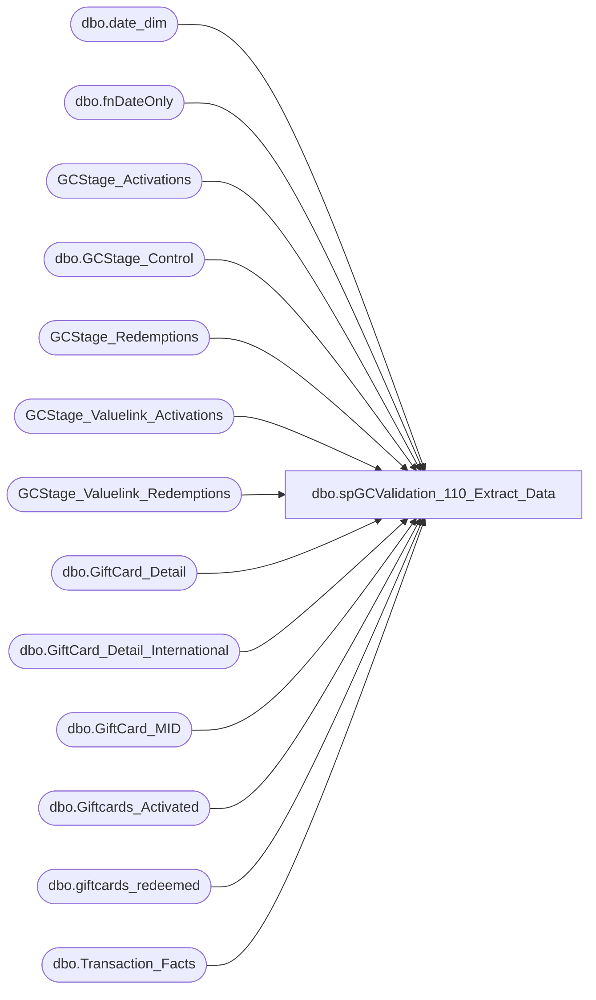

# dbo.spGCValidation_110_Extract_Data

**Database:** DWStaging  
**Server:** papamart  

## Architecture Diagram



## Table Dependencies

| Referenced Table |
|---|
| dbo.date_dim |
| dbo.fnDateOnly |
| GCStage_Activations |
| dbo.GCStage_Control |
| GCStage_Redemptions |
| GCStage_Valuelink_Activations |
| GCStage_Valuelink_Redemptions |
| dbo.GiftCard_Detail |
| dbo.GiftCard_Detail_International |
| dbo.GiftCard_MID |
| dbo.Giftcards_Activated |
| dbo.giftcards_redeemed |
| dbo.Transaction_Facts |

## Stored Procedure Code

```sql
CREATE PROCEDURE [dbo].[spGCValidation_110_Extract_Data]
-- =============================================================================================================
-- Name: spGCValidation_110_Extact_Data
--
-- Description:	
--	Extract the data for this Validation Run
--
--
-- Input:		
--
-- Output: 
--
-- Dependencies: 
--
-- Revision History
--		Name:			Date:			Comments:
--		Gary Murrish	11/21/2013		Created
--		Dan Tweedie		08/15/2016		Added filter to query that selects into GCStage_Activations, to exclude source = 'VL' 
--										- These are actually Valuelink Activations previously captured from giftcard_details tables by another proc (spGiftCard_Extract_Activations_Valuelink). 
--											I'm not sure why that proc runs, but if we include those records here, we get false returns in our validation results, showing that the VL records are in AW but not in Valuelink, and that is clearly not true, as Valuelink is the source of the record.
-- =============================================================================================================
AS

	SET NOCOUNT ON


	DECLARE @minDateKey int
	DECLARE @maxDateKey int

	-- Get the dates from the Control table
	SELECT
		@maxDateKey = gc.maxDateKey,
		@minDateKey = gc.minExtractDateKey
	FROM
		DWStaging.dbo.GCStage_Control gc WITH (NOLOCK)


	TRUNCATE TABLE GCStage_Valuelink_Activations


	INSERT INTO GCStage_Valuelink_Activations
		(	ActivationDate,
			date_key,
			store_key,
			terminal_id,
			terminal_transaction_number,
			account_number,
			transaction_amount,
			reversal_flag,
			LineID,
			merchant_id,
			postedPhase,
			gaRecID)
		SELECT
			x.ActivationDate,
			x.date_key,
			x.store_key,
			x.terminal_id,
			x.terminal_transaction_number,
			x.account_number,
			x.transaction_amount,
			x.reversal_flag,
			x.LineID,
			x.merchant_id,
			x.postedPhase,
			x.gaRecID
		FROM
			(SELECT
					dw.dbo.fnDateOnly(gcd.FDMS_local_timestamp) AS activationDate,
					dd.date_key,
					gcd.store_key,
					gcd.terminal_id,
					gcd.terminal_transaction_number,
					gcd.account_number,
					gcd.transaction_amount,
					gcd.reversal_flag,
					gcd.LineID,
					gcd.merchant_id,
					CAST(0 AS int) AS postedPhase,
					CAST(0 AS int) AS gaRecID
				FROM
					dw.dbo.GiftCard_Detail gcd WITH (NOLOCK)
					LEFT JOIN dw.dbo.date_dim dd WITH (NOLOCK)
						ON dw.dbo.fnDateOnly(gcd.FDMS_local_timestamp) = dd.actual_date
				WHERE
					(gcd.internal_request_code IN (18, 28, 43, 3)
					OR gcd.request_code = 300)
					AND gcd.Response_Code = 0
					AND gcd.reversal_flag = 0
					AND dd.date_key BETWEEN @minDateKey AND @maxDateKey
				UNION ALL
				SELECT
					dw.dbo.fnDateOnly(gcd.FDMS_local_timestamp) AS activationDate,
					dd.date_key,
					gcd.store_key,
					gcd.terminal_id,
					gcd.terminal_transaction_number,
					gcd.account_number,
					gcd.transaction_amount,
					gcd.reversal_flag,
					gcd.LineID,
					gcd.merchant_id,
					CAST(0 AS int) AS postedPhase,
					CAST(0 AS int) AS gaRecID
				FROM
					dw.dbo.GiftCard_Detail_International gcd WITH (NOLOCK)
					LEFT JOIN dw.dbo.date_dim dd WITH (NOLOCK)
						ON dw.dbo.fnDateOnly(gcd.FDMS_local_timestamp) = dd.actual_date
				WHERE
					(gcd.internal_request_code IN (18, 28, 43, 3)
					OR gcd.request_code = 300)
					AND gcd.Response_Code = 0
					AND gcd.reversal_flag = 0
					AND dd.date_key BETWEEN @minDateKey AND @maxDateKey) x


	TRUNCATE TABLE GCStage_Activations

	INSERT INTO GCStage_Activations
		(	recID,
			store_key,
			transaction_id,
			date_key,
			activated_amount,
			discount_amount,
			giftcard_no,
			currency_key,
			MID,
			Source,
			VLVerified,
			Register_No,
			Transaction_No,
			postedPhase,
			vlLineID)
		SELECT
			ga.recID,
			ga.store_key,
			ga.transaction_id,
			ga.date_key,
			ga.activated_amount,
			ga.discount_amount,
			ga.giftcard_no,
			ga.currency_key,
			ga.MID,
			ga.Source,
			ga.VLVerified,
			ISNULL(tf.register_no, -1) AS register_no,
			ISNULL(tf.transaction_no, -1) AS transaction_no,
			CAST(0 AS int) AS postedPhase,
			CAST(0 AS int) AS vlLineID

		FROM
			dw.dbo.Giftcards_Activated ga WITH (NOLOCK)
			LEFT JOIN dw.dbo.Transaction_Facts tf WITH (NOLOCK)
				ON ga.transaction_id = tf.transaction_id
		WHERE
			ga.date_key BETWEEN @minDateKey AND @maxDateKey
			AND ga.Source NOT LIKE 'VLA%'
			AND ga.Source <> 'VL' --added 08/15/2016


	TRUNCATE TABLE GCStage_Valuelink_Redemptions

	INSERT INTO GCStage_Valuelink_Redemptions
		(	ActivationDate,
			date_key,
			store_key,
			terminal_id,
			terminal_transaction_number,
			account_number,
			transaction_amount,
			reversal_flag,
			LineID,
			merchant_id,
			postedPhase,
			gaRecID)
		SELECT
			ActivationDate,
			date_key,
			store_key,
			terminal_id,
			terminal_transaction_number,
			account_number,
			transaction_amount,
			reversal_flag,
			LineID,
			merchant_id,
			postedPhase,
			gaRecID
		FROM
			(SELECT
					dw.dbo.fnDateOnly(gcd.FDMS_local_timestamp) AS activationDate,
					dd.date_key,
					gcd.store_key,
					gcd.terminal_id,
					gcd.terminal_transaction_number,
					gcd.account_number,
					gcd.transaction_amount,
					gcd.reversal_flag,
					gcd.LineID,
					gcd.merchant_id,
					CAST(0 AS int) AS postedPhase,
					CAST(0 AS int) AS gaRecID
				FROM
					dw.dbo.GiftCard_Detail gcd WITH (NOLOCK)
					INNER JOIN dw.dbo.GiftCard_MID gcm WITH (NOLOCK)
						ON gcd.merchant_id = gcm.MID
					LEFT JOIN dw.dbo.date_dim dd WITH (NOLOCK)
						ON dw.dbo.fnDateOnly(gcd.FDMS_local_timestamp) = dd.actual_date
				WHERE
					gcd.internal_request_code IN (1)
					AND gcd.Response_Code = 0
					AND gcd.reversal_flag = 0
					AND dd.date_key BETWEEN @minDateKey AND @maxDateKey
				UNION ALL
				SELECT
					dw.dbo.fnDateOnly(gcd.FDMS_local_timestamp) AS activationDate,
					dd.date_key,
					gcd.store_key,
					gcd.terminal_id,
					gcd.terminal_transaction_number,
					gcd.account_number,
					gcd.transaction_amount,
					gcd.reversal_flag,
					gcd.LineID,
					gcd.merchant_id,
					CAST(0 AS int) AS postedPhase,
					CAST(0 AS int) AS gaRecID
				FROM
					dw.dbo.GiftCard_Detail_International gcd WITH (NOLOCK)
					INNER JOIN dw.dbo.GiftCard_MID gcm WITH (NOLOCK)
						ON gcd.merchant_id = gcm.MID
					LEFT JOIN dw.dbo.date_dim dd WITH (NOLOCK)
						ON dw.dbo.fnDateOnly(gcd.FDMS_local_timestamp) = dd.actual_date
				WHERE
					gcd.internal_request_code IN (1)
					AND gcd.Response_Code = 0
					AND gcd.reversal_flag = 0
					AND dd.date_key BETWEEN @minDateKey AND @maxDateKey) x


	TRUNCATE TABLE GCStage_Redemptions

	INSERT INTO GCStage_Redemptions
		(	recID,
			store_key,
			transaction_id,
			date_key,
			Redemption_Amount,
			discount_amount,
			giftcard_no,
			currency_key,
			MID,
			daysSinceLastActivation,
			Lift_Amount,
			activation_discount_amount,
			Source,
			VLVerified,
			Register_No,
			Transaction_No,
			postedPhase,
			vlLineID)
		SELECT
			gr.recID,
			gr.store_key,
			gr.transaction_id,
			gr.date_key,
			gr.Redemption_Amount,
			gr.discount_amount,
			gr.giftcard_no,
			gr.currency_key,
			gr.MID,
			gr.daysSinceLastActivation,
			gr.Lift_Amount,
			gr.activation_discount_amount,
			gr.Source,
			gr.VLVerified,
			ISNULL(tf.register_no, -1) AS register_no,
			ISNULL(tf.transaction_no, -1) AS transaction_no,
			CAST(0 AS int) AS postedPhase,
			CAST(0 AS int) AS vlLineID

		FROM
			dw.dbo.giftcards_redeemed gr WITH (NOLOCK)
			LEFT JOIN dw.dbo.Transaction_Facts tf WITH (NOLOCK)
				ON gr.transaction_id = tf.transaction_id
		WHERE
			gr.date_key BETWEEN @minDateKey AND @maxDateKey
			AND NOT (gr.Source LIKE 'VLA%')
```

