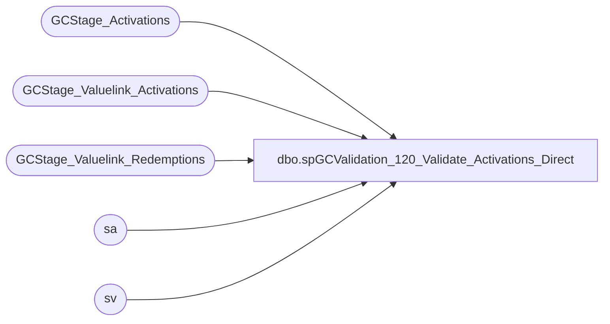

# dbo.spGCValidation_120_Validate_Activations_Direct

**Database:** DWStaging  
**Server:** papamart  

## Architecture Diagram



## Table Dependencies

| Referenced Table |
|---|
| GCStage_Activations |
| GCStage_Valuelink_Activations |
| GCStage_Valuelink_Redemptions |
| sa |
| sv |

## Stored Procedure Code

```sql
CREATE PROCEDURE [dbo].[spGCValidation_120_Validate_Activations_Direct]
-- =============================================================================================================
-- Name: spGCValidation_120_Validate_Activations_Direct
--
-- Description:	
--	Validate the Activations between DW and Valuelink directly
--
--
-- Input:		
--
-- Output: 
--
-- Dependencies: 
--
-- Revision History
--		Name:			Date:			Comments:
--		Gary Murrish	11/21/2013		Created

-- =============================================================================================================
AS

	SET NOCOUNT ON


	-- Clear all of the zero amount records

	UPDATE GCStage_Valuelink_Activations
		SET postedPhase = 10000
	WHERE transaction_amount = 0
	AND postedPhase = 0

	UPDATE GCStage_Valuelink_Redemptions
		SET postedPhase = 10000
	WHERE transaction_amount = 0
	AND postedPhase = 0

	-- Phase 10, Full Match
	UPDATE sa
		SET	sa.vlLineID = sv.LineID,
			sa.postedPhase = 10
	FROM
		GCStage_Valuelink_Activations sv WITH (NOLOCK)
		INNER JOIN GCStage_Activations sa WITH (NOLOCK)
			ON sv.account_number = sa.giftcard_no
			AND sv.date_key = sa.date_key
			AND sv.store_key = sa.store_key
			AND sv.terminal_id = sa.Register_No
			AND sv.terminal_transaction_number = sa.Transaction_No
			AND sv.transaction_amount = sa.activated_amount
			AND sa.postedPhase = 0
			AND sv.postedPhase = 0

	UPDATE sv
		SET	sv.gaRecID = sa.recID,
			sv.postedPhase = 10
	FROM
		GCStage_Valuelink_Activations sv WITH (NOLOCK)
		INNER JOIN GCStage_Activations sa WITH (NOLOCK)
			ON sa.vlLineID = sv.LineID
			AND sa.postedPhase = 10
			AND sv.postedPhase <> 10


	-- Phase 20, Card, Date, Store, Amount
	UPDATE sa
		SET	sa.vlLineID = sv.LineID,
			sa.postedPhase = 20
	FROM
		GCStage_Valuelink_Activations sv WITH (NOLOCK)
		INNER JOIN GCStage_Activations sa WITH (NOLOCK)
			ON sv.account_number = sa.giftcard_no
			AND sv.date_key = sa.date_key
			AND sv.store_key = sa.store_key
			AND sv.transaction_amount = sa.activated_amount
			AND sa.postedPhase = 0
			AND sv.postedPhase = 0

	UPDATE sv
		SET	sv.gaRecID = sa.recID,
			sv.postedPhase = 20
	FROM
		GCStage_Valuelink_Activations sv WITH (NOLOCK)
		INNER JOIN GCStage_Activations sa WITH (NOLOCK)
			ON sa.vlLineID = sv.LineID
			AND sa.postedPhase = 20
			AND sv.postedPhase <> 20


	-- Phase 30, Card, Date, Amount
	UPDATE sa
		SET	sa.vlLineID = sv.LineID,
			sa.postedPhase = 30
	FROM
		GCStage_Valuelink_Activations sv WITH (NOLOCK)
		INNER JOIN GCStage_Activations sa WITH (NOLOCK)
			ON sv.account_number = sa.giftcard_no
			AND sv.date_key = sa.date_key
			AND sv.transaction_amount = sa.activated_amount
			AND sa.postedPhase = 0
			AND sv.postedPhase = 0

	UPDATE sv
		SET	sv.gaRecID = sa.recID,
			sv.postedPhase = 30
	FROM
		GCStage_Valuelink_Activations sv WITH (NOLOCK)
		INNER JOIN GCStage_Activations sa WITH (NOLOCK)
			ON sa.vlLineID = sv.LineID
			AND sa.postedPhase = 30
			AND sv.postedPhase <> 30


	-- Phase 40, Card, Amount
	UPDATE sa
		SET	sa.vlLineID = sv.LineID,
			sa.postedPhase = 40
	FROM
		GCStage_Valuelink_Activations sv WITH (NOLOCK)
		INNER JOIN GCStage_Activations sa WITH (NOLOCK)
			ON sv.account_number = sa.giftcard_no
			AND sv.transaction_amount = sa.activated_amount
			AND sa.postedPhase = 0
			AND sv.postedPhase = 0

	UPDATE sv
		SET	sv.gaRecID = sa.recID,
			sv.postedPhase = 40
	FROM
		GCStage_Valuelink_Activations sv WITH (NOLOCK)
		INNER JOIN GCStage_Activations sa WITH (NOLOCK)
			ON sa.vlLineID = sv.LineID
			AND sa.postedPhase = 40
			AND sv.postedPhase <> 40
```

