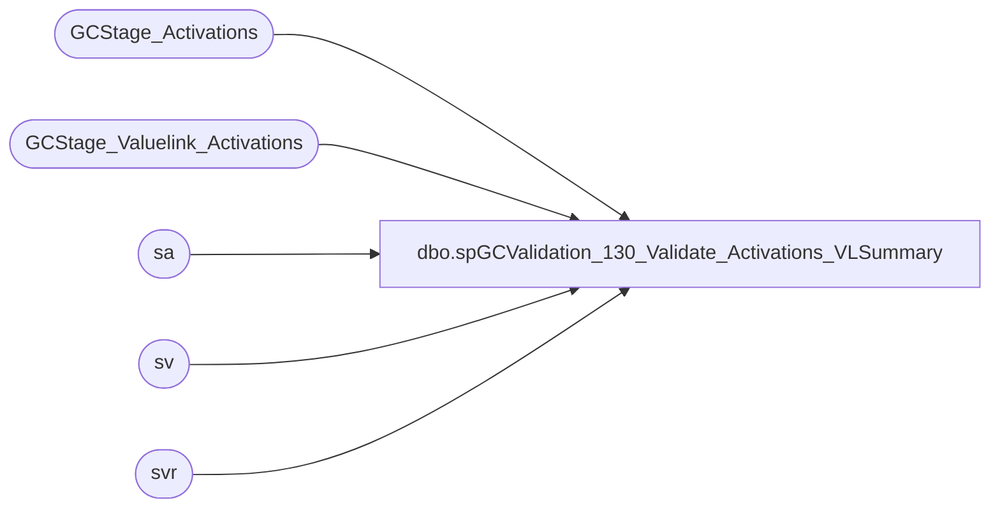

# dbo.spGCValidation_130_Validate_Activations_VLSummary

**Database:** DWStaging  
**Server:** papamart  

## Architecture Diagram



## Table Dependencies

| Referenced Table |
|---|
| GCStage_Activations |
| GCStage_Valuelink_Activations |
| sa |
| sv |
| svr |

## Stored Procedure Code

```sql
CREATE PROCEDURE [dbo].[spGCValidation_130_Validate_Activations_VLSummary]
-- =============================================================================================================
-- Name: spGCValidation_130_Validate_Activations_VLSummary
--
-- Description:	
--	Validate the Activations between DW and Valuelink against summarized Valuelink Records
--
--
-- Input:		
--
-- Output: 
--
-- Dependencies: 
--
-- Revision History
--		Name:			Date:			Comments:
--		Gary Murrish	11/21/2013		Created

-- =============================================================================================================
AS

	SET NOCOUNT ON


	

if object_id('tempdb..#tmpSummaryValuelink') is not null
BEGIN
	DROP TABLE #tmpSummaryValuelink
end

SELECT
	sv.account_number,
	sv.store_key,
	sv.date_key,
	sv.terminal_id,
	sv.terminal_transaction_number,
	SUM(sv.transaction_amount) AS transaction_amount,
	MIN(sv.LineID) AS LineID,
	CAST(0 AS int) AS gaRecID,
	CAST(0 AS int) AS postedPhase
INTO #tmpSummaryValuelink
FROM
	GCStage_Valuelink_Activations sv WITH (NOLOCK)
WHERE
	sv.postedPhase = 0
GROUP BY	sv.account_number,
			sv.store_key,
			sv.date_key,
			sv.terminal_id,
			sv.terminal_transaction_number
-- (6602 row(s) affected)

-- Phase 110 - Summary Valuelink, one Auditworks, Full Match
UPDATE sa
	SET	sa.vlLineID = sv.LineID,
		sa.postedPhase = 110
FROM
	#tmpSummaryValuelink sv WITH (NOLOCK)
	INNER JOIN GCStage_Activations sa WITH (NOLOCK)
		ON sv.account_number = sa.giftcard_no
		AND sv.date_key = sa.date_key
		AND sv.store_key = sa.store_key
		AND sv.terminal_id = sa.register_no
		AND sv.terminal_transaction_number = sa.transaction_no
		AND sv.transaction_amount = sa.activated_amount
		AND sa.postedPhase = 0
		AND sv.postedPhase = 0

UPDATE sv
	SET	sv.gaRecID = sa.recID,
		sv.postedPhase = 110
FROM
	#tmpSummaryValuelink sv WITH (NOLOCK)
	INNER JOIN GCStage_Activations sa WITH (NOLOCK)
		ON sa.vlLineID = sv.LineID
		AND sa.postedPhase = 110
		AND sv.postedPhase <> 110
--(872 row(s) affected)


-- Phase 120 - Summary Valuelink, one Auditworks, Card, Date, Store, Amount
UPDATE sa
	SET	sa.vlLineID = sv.LineID,
		sa.postedPhase = 120
FROM
	(SELECT
			tmp.account_number,
			tmp.date_key,
			tmp.store_key,
			MIN(tmp.LineID) AS LineID,
			SUM(tmp.transaction_amount) AS transaction_amount
		FROM
			#tmpSummaryValuelink tmp WITH (NOLOCK)
		WHERE
			tmp.postedPhase = 0
		GROUP BY	tmp.account_number,
					tmp.date_key,
					tmp.store_key) sv
	INNER JOIN GCStage_Activations sa WITH (NOLOCK)
		ON sv.account_number = sa.giftcard_no
		AND sv.date_key = sa.date_key
		AND sv.store_key = sa.store_key
		AND sv.transaction_amount = sa.activated_amount
		AND sa.postedPhase = 0


UPDATE sv
	SET	sv.gaRecID = sa.recID,
		sv.postedPhase = 120
FROM
	#tmpSummaryValuelink sv WITH (NOLOCK)
	INNER JOIN GCStage_Activations sa WITH (NOLOCK)
		ON sa.vlLineID = sv.LineID
		AND sa.postedPhase = 120
		AND sv.postedPhase <> 120
-- (127 row(s) affected)


-- Phase 130 - Summary Valuelink, one Auditworks, Card, Date, Amount
UPDATE sa
	SET	sa.vlLineID = sv.LineID,
		sa.postedPhase = 130
FROM
	(SELECT
			tmp.account_number,
			tmp.date_key,
			MIN(tmp.LineID) AS LineID,
			SUM(tmp.transaction_amount) AS transaction_amount
		FROM
			#tmpSummaryValuelink tmp WITH (NOLOCK)
		WHERE
			tmp.postedPhase = 0
		GROUP BY	tmp.account_number,
					tmp.date_key) sv
	INNER JOIN GCStage_Activations sa WITH (NOLOCK)
		ON sv.account_number = sa.giftcard_no
		AND sv.date_key = sa.date_key
		AND sv.transaction_amount = sa.activated_amount
		AND sa.postedPhase = 0


UPDATE sv
	SET	sv.gaRecID = sa.recID,
		sv.postedPhase = 130
FROM
	#tmpSummaryValuelink sv WITH (NOLOCK)
	INNER JOIN GCStage_Activations sa WITH (NOLOCK)
		ON sa.vlLineID = sv.LineID
		AND sa.postedPhase = 130
		AND sv.postedPhase <> 130
-- (0 row(s) affected)

-- Phase 140 - Summary Valuelink, one Auditworks, Card, Amount
UPDATE sa
	SET	sa.vlLineID = sv.LineID,
		sa.postedPhase = 140
FROM
	(SELECT
			tmp.account_number,
			MIN(tmp.LineID) AS LineID,
			SUM(tmp.transaction_amount) AS transaction_amount
		FROM
			#tmpSummaryValuelink tmp WITH (NOLOCK)
		WHERE
			tmp.postedPhase = 0
		GROUP BY tmp.account_number) sv
	INNER JOIN GCStage_Activations sa WITH (NOLOCK)
		ON sv.account_number = sa.giftcard_no
		AND sv.transaction_amount = sa.activated_amount
		AND sa.postedPhase = 0


UPDATE sv
	SET	sv.gaRecID = sa.recID,
		sv.postedPhase = 140
FROM
	#tmpSummaryValuelink sv WITH (NOLOCK)
	INNER JOIN GCStage_Activations sa WITH (NOLOCK)
		ON sa.vlLineID = sv.LineID
		AND sa.postedPhase = 140
		AND sv.postedPhase <> 140
-- (3 row(s) affected)


--- Post back to Stage Valuelink
UPDATE sv
	SET	sv.postedPhase = sv1.postedPhase,
		sv.gaRecID = sv1.gaRecID
FROM
	GCStage_Valuelink_Activations sv WITH (NOLOCK)
	INNER JOIN #tmpSummaryValuelink sv1 WITH (NOLOCK)
		ON sv.account_number = sv1.account_number
		AND sv.store_key = sv1.store_key
		AND sv.date_key = sv1.date_key
		AND sv.terminal_id = sv1.terminal_id
		AND sv.terminal_transaction_number = sv1.terminal_transaction_number
WHERE sv1.postedPhase <> 0
AND sv.postedPhase = 0
-- (2129 row(s) affected)

UPDATE svr
	SET	svr.postedPhase = sr.postedPhase,
		svr.gaRecID = sr.gaRecID
FROM
	#tmpSummaryValuelink sr WITH (NOLOCK)
	INNER JOIN GCStage_Valuelink_Activations svr WITH (NOLOCK)
		ON sr.account_number = svr.account_number
		AND sr.date_key = svr.date_key
		AND sr.store_key = svr.store_key
		AND sr.terminal_id = svr.terminal_id
		AND sr.terminal_transaction_number = svr.terminal_transaction_number
WHERE sr.postedPhase = 110
AND svr.postedPhase <> 110


UPDATE svr
	SET	svr.postedPhase = sr.postedPhase,
		svr.gaRecID = sr.gaRecID
FROM
	#tmpSummaryValuelink sr WITH (NOLOCK)
	INNER JOIN GCStage_Valuelink_Activations svr WITH (NOLOCK)
		ON sr.account_number = svr.account_number
		AND sr.date_key = svr.date_key
		AND sr.store_key = svr.store_key
WHERE sr.postedPhase = 120
AND svr.postedPhase <> 120


UPDATE svr
	SET	svr.postedPhase = sr.postedPhase,
		svr.gaRecID = sr.gaRecID
FROM
	#tmpSummaryValuelink sr WITH (NOLOCK)
	INNER JOIN GCStage_Valuelink_Activations svr WITH (NOLOCK)
		ON sr.account_number = svr.account_number
		AND sr.date_key = svr.date_key
WHERE sr.postedPhase = 130
AND svr.postedPhase <> 130

UPDATE svr
	SET	svr.postedPhase = sr.postedPhase,
		svr.gaRecID = sr.gaRecID
FROM
	#tmpSummaryValuelink sr WITH (NOLOCK)
	INNER JOIN GCStage_Valuelink_Activations svr WITH (NOLOCK)
		ON sr.account_number = svr.account_number
WHERE sr.postedPhase = 140
AND svr.postedPhase <> 140
```

