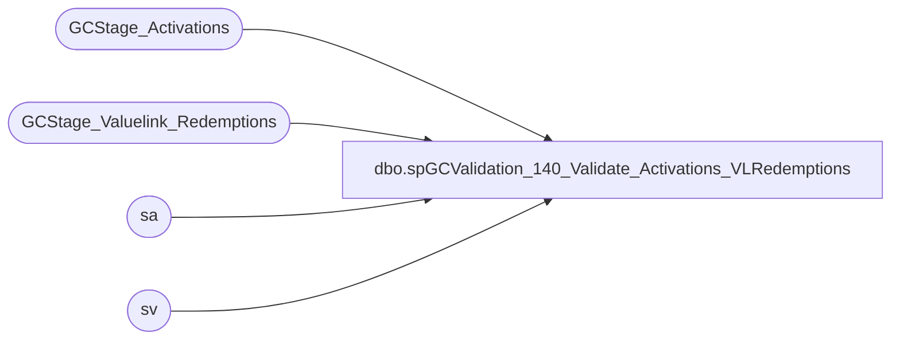

# dbo.spGCValidation_140_Validate_Activations_VLRedemptions

**Database:** DWStaging  
**Server:** papamart  

## Architecture Diagram



## Table Dependencies

| Referenced Table |
|---|
| GCStage_Activations |
| GCStage_Valuelink_Redemptions |
| sa |
| sv |

## Stored Procedure Code

```sql
CREATE PROCEDURE [dbo].[spGCValidation_140_Validate_Activations_VLRedemptions]
-- =============================================================================================================
-- Name: spGCValidation_140_Validate_Activations_VLRedemptions
--
-- Description:	
--	Validate the Activations between DW and Valuelink against Valuelink Redemptions
--
--
-- Input:		
--
-- Output: 
--
-- Dependencies: 
--
-- Revision History
--		Name:			Date:			Comments:
--		Gary Murrish	11/21/2013		Created

-- =============================================================================================================
AS

	SET NOCOUNT ON

	-- Phase 310, Full Match
	UPDATE sa
		SET	sa.vlLineID = sv.LineID * -1,
			sa.postedPhase = 310
	FROM
		GCStage_Valuelink_Redemptions sv WITH (NOLOCK)
		INNER JOIN GCStage_Activations sa WITH (NOLOCK)
			ON sv.account_number = sa.giftcard_no
			AND sv.date_key = sa.date_key
			AND sv.store_key = sa.store_key
			AND sv.terminal_id = sa.Register_No
			AND sv.terminal_transaction_number = sa.Transaction_No
			AND sv.transaction_amount = sa.activated_amount
			AND sa.postedPhase = 0
			AND sv.postedPhase = 0

	UPDATE sv
		SET	sv.gaRecID = sa.recID * -1,
			sv.postedPhase = 310
	FROM
		GCStage_Valuelink_Redemptions sv WITH (NOLOCK)
		INNER JOIN GCStage_Activations sa WITH (NOLOCK)
			ON sa.vlLineID = sv.LineID * -1
			AND sa.postedPhase = 310
			AND sv.postedPhase <> 310

	-- (3 row(s) affected)


	-- Phase 320, Card, Date, Store, Amount
	UPDATE sa
		SET	sa.vlLineID = sv.LineID * -1,
			sa.postedPhase = 320
	FROM
		GCStage_Valuelink_Redemptions sv WITH (NOLOCK)
		INNER JOIN GCStage_Activations sa WITH (NOLOCK)
			ON sv.account_number = sa.giftcard_no
			AND sv.date_key = sa.date_key
			AND sv.store_key = sa.store_key
			AND sv.transaction_amount = sa.activated_amount
			AND sa.postedPhase = 0
			AND sv.postedPhase = 0

	UPDATE sv
		SET	sv.gaRecID = sa.recID * -1,
			sv.postedPhase = 320
	FROM
		GCStage_Valuelink_Redemptions sv WITH (NOLOCK)
		INNER JOIN GCStage_Activations sa WITH (NOLOCK)
			ON sa.vlLineID = sv.LineID * -1
			AND sa.postedPhase = 320
			AND sv.postedPhase <> 320

	-- (0 row(s) affected)

	-- Phase 330, Card, Date, Amount
	UPDATE sa
		SET	sa.vlLineID = sv.LineID * -1,
			sa.postedPhase = 330
	FROM
		GCStage_Valuelink_Redemptions sv WITH (NOLOCK)
		INNER JOIN GCStage_Activations sa WITH (NOLOCK)
			ON sv.account_number = sa.giftcard_no
			AND sv.date_key = sa.date_key
			AND sv.transaction_amount = sa.activated_amount
			AND sa.postedPhase = 0
			AND sv.postedPhase = 0

	UPDATE sv
		SET	sv.gaRecID = sa.recID * -1,
			sv.postedPhase = 330
	FROM
		GCStage_Valuelink_Redemptions sv WITH (NOLOCK)
		INNER JOIN GCStage_Activations sa WITH (NOLOCK)
			ON sa.vlLineID = sv.LineID * -1
			AND sa.postedPhase = 330
			AND sv.postedPhase <> 330
	-- 8

	-- Phase 340, Card, Amount
	UPDATE sa
		SET	sa.vlLineID = sv.LineID * -1,
			sa.postedPhase = 340
	FROM
		GCStage_Valuelink_Redemptions sv WITH (NOLOCK)
		INNER JOIN GCStage_Activations sa WITH (NOLOCK)
			ON sv.account_number = sa.giftcard_no
			AND sv.transaction_amount = sa.activated_amount
			AND sa.postedPhase = 0
			AND sv.postedPhase = 0

	UPDATE sv
		SET	sv.gaRecID = sa.recID * -1,
			sv.postedPhase = 340
	FROM
		GCStage_Valuelink_Redemptions sv WITH (NOLOCK)
		INNER JOIN GCStage_Activations sa WITH (NOLOCK)
			ON sa.vlLineID = sv.LineID * -1
			AND sa.postedPhase = 340
			AND sv.postedPhase <> 340
-- (4 row(s) affected)
```

