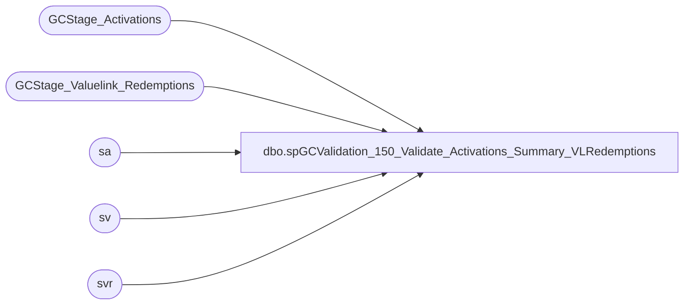

# dbo.spGCValidation_150_Validate_Activations_Summary_VLRedemptions

**Database:** DWStaging  
**Server:** papamart  

## Architecture Diagram



## Table Dependencies

| Referenced Table |
|---|
| GCStage_Activations |
| GCStage_Valuelink_Redemptions |
| sa |
| sv |
| svr |

## Stored Procedure Code

```sql
CREATE PROCEDURE [dbo].[spGCValidation_150_Validate_Activations_Summary_VLRedemptions]
-- =============================================================================================================
-- Name: spGCValidation_150_Validate_Activations_Summary_VLRedemptions
--
-- Description:	
--	Validate the Activations between DW and Valuelink against Summarized Valuelink Redemptions
--
--
-- Input:		
--
-- Output: 
--
-- Dependencies: 
--
-- Revision History
--		Name:			Date:			Comments:
--		Gary Murrish	11/21/2013		Created

-- =============================================================================================================
AS

	SET NOCOUNT ON


	IF OBJECT_ID('tempdb..#tmpSummaryRedemptions') IS NOT NULL
	BEGIN
		DROP TABLE #tmpSummaryRedemptions
	END

	SELECT
		sv.account_number,
		sv.store_key,
		sv.date_key,
		sv.terminal_id,
		sv.terminal_transaction_number,
		SUM(sv.transaction_amount) AS transaction_amount,
		MIN(sv.LineID) AS LineID,
		CAST(0 AS int) AS gaRecID,
		CAST(0 AS int) AS postedPhase
	INTO #tmpSummaryRedemptions
	FROM
		GCStage_Valuelink_Redemptions sv WITH (NOLOCK)
	WHERE
		sv.postedPhase = 0
	GROUP BY	sv.account_number,
				sv.store_key,
				sv.date_key,
				sv.terminal_id,
				sv.terminal_transaction_number
	-- (6602 row(s) affected)

	-- Phase 410 - Summary Valuelink, one Auditworks, Full Match
	UPDATE sa
		SET	sa.vlLineID = sv.LineID,
			sa.postedPhase = 410
	FROM
		#tmpSummaryRedemptions sv WITH (NOLOCK)
		INNER JOIN GCStage_Activations sa WITH (NOLOCK)
			ON sv.account_number = sa.giftcard_no
			AND sv.date_key = sa.date_key
			AND sv.store_key = sa.store_key
			AND sv.terminal_id = sa.Register_No
			AND sv.terminal_transaction_number = sa.Transaction_No
			AND sv.transaction_amount = sa.activated_amount
			AND sa.postedPhase = 0
			AND sv.postedPhase = 0

	UPDATE sv
		SET	sv.gaRecID = sa.recID,
			sv.postedPhase = 410
	FROM
		#tmpSummaryRedemptions sv WITH (NOLOCK)
		INNER JOIN GCStage_Activations sa WITH (NOLOCK)
			ON sa.vlLineID = sv.LineID
			AND sa.postedPhase = 410
			AND sv.postedPhase <> 410
	--(872 row(s) affected)

	-- Update the other summary records


	-- Phase 420 - Summary Valuelink, one Auditworks, Card, Date, Store, Amount
	UPDATE sa
		SET	sa.vlLineID = sv.LineID,
			sa.postedPhase = 420
	FROM
		(SELECT
				tmp.account_number,
				tmp.date_key,
				tmp.store_key,
				MIN(tmp.LineID) AS LineID,
				SUM(tmp.transaction_amount) AS transaction_amount
			FROM
				#tmpSummaryRedemptions tmp WITH (NOLOCK)
			WHERE
				tmp.postedPhase = 0
			GROUP BY	tmp.account_number,
						tmp.date_key,
						tmp.store_key) sv
		INNER JOIN GCStage_Activations sa WITH (NOLOCK)
			ON sv.account_number = sa.giftcard_no
			AND sv.date_key = sa.date_key
			AND sv.store_key = sa.store_key
			AND sv.transaction_amount = sa.activated_amount
			AND sa.postedPhase = 0


	UPDATE sv
		SET	sv.gaRecID = sa.recID,
			sv.postedPhase = 420
	FROM
		#tmpSummaryRedemptions sv WITH (NOLOCK)
		INNER JOIN GCStage_Activations sa WITH (NOLOCK)
			ON sa.vlLineID = sv.LineID
			AND sa.postedPhase = 420
			AND sv.postedPhase <> 420
	-- (127 row(s) affected)


	-- Phase 130 - Summary Valuelink, one Auditworks, Card, Date, Amount
	UPDATE sa
		SET	sa.vlLineID = sv.LineID,
			sa.postedPhase = 430
	FROM
		(SELECT
				tmp.account_number,
				tmp.date_key,
				MIN(tmp.LineID) AS LineID,
				SUM(tmp.transaction_amount) AS transaction_amount
			FROM
				#tmpSummaryRedemptions tmp WITH (NOLOCK)
			WHERE
				tmp.postedPhase = 0
			GROUP BY	tmp.account_number,
						tmp.date_key) sv
		INNER JOIN GCStage_Activations sa WITH (NOLOCK)
			ON sv.account_number = sa.giftcard_no
			AND sv.date_key = sa.date_key
			AND sv.transaction_amount = sa.activated_amount
			AND sa.postedPhase = 0


	UPDATE sv
		SET	sv.gaRecID = sa.recID,
			sv.postedPhase = 430
	FROM
		#tmpSummaryRedemptions sv WITH (NOLOCK)
		INNER JOIN GCStage_Activations sa WITH (NOLOCK)
			ON sa.vlLineID = sv.LineID
			AND sa.postedPhase = 430
			AND sv.postedPhase <> 430
	-- (0 row(s) affected)

	-- Phase 440 - Summary Valuelink, one Auditworks, Card, Amount
	UPDATE sa
		SET	sa.vlLineID = sv.LineID,
			sa.postedPhase = 440
	FROM
		(SELECT
				tmp.account_number,
				MIN(tmp.LineID) AS LineID,
				SUM(tmp.transaction_amount) AS transaction_amount
			FROM
				#tmpSummaryRedemptions tmp WITH (NOLOCK)
			WHERE
				tmp.postedPhase = 0
			GROUP BY tmp.account_number) sv
		INNER JOIN GCStage_Activations sa WITH (NOLOCK)
			ON sv.account_number = sa.giftcard_no
			AND sv.transaction_amount = sa.activated_amount
			AND sa.postedPhase = 0


	UPDATE sv
		SET	sv.gaRecID = sa.recID,
			sv.postedPhase = 440
	FROM
		#tmpSummaryRedemptions sv WITH (NOLOCK)
		INNER JOIN GCStage_Activations sa WITH (NOLOCK)
			ON sa.vlLineID = sv.LineID
			AND sa.postedPhase = 440
			AND sv.postedPhase <> 440
	-- (3 row(s) affected)


	--- Post back to Stage Valuelink
	UPDATE sv
		SET	sv.postedPhase = sv1.postedPhase,
			sv.gaRecID = sv1.gaRecID
	FROM
		GCStage_Valuelink_Redemptions sv WITH (NOLOCK)
		INNER JOIN #tmpSummaryRedemptions sv1 WITH (NOLOCK)
			ON sv.account_number = sv1.account_number
			AND sv.store_key = sv1.store_key
			AND sv.date_key = sv1.date_key
			AND sv.terminal_id = sv1.terminal_id
			AND sv.terminal_transaction_number = sv1.terminal_transaction_number
	WHERE sv1.postedPhase <> 0
	AND sv.postedPhase = 0

	UPDATE svr
		SET	svr.postedPhase = sr.postedPhase,
			svr.gaRecID = sr.gaRecID
	FROM
		#tmpSummaryRedemptions sr WITH (NOLOCK)
		INNER JOIN GCStage_Valuelink_Redemptions svr WITH (NOLOCK)
			ON sr.account_number = svr.account_number
			AND sr.date_key = svr.date_key
			AND sr.store_key = svr.store_key
			AND sr.terminal_id = svr.terminal_id
			AND sr.terminal_transaction_number = svr.terminal_transaction_number
	WHERE sr.postedPhase = 410
	AND svr.postedPhase <> 410


	UPDATE svr
		SET	svr.postedPhase = sr.postedPhase,
			svr.gaRecID = sr.gaRecID
	FROM
		#tmpSummaryRedemptions sr WITH (NOLOCK)
		INNER JOIN GCStage_Valuelink_Redemptions svr WITH (NOLOCK)
			ON sr.account_number = svr.account_number
			AND sr.date_key = svr.date_key
			AND sr.store_key = svr.store_key
	WHERE sr.postedPhase = 420
	AND svr.postedPhase <> 420


	UPDATE svr
		SET	svr.postedPhase = sr.postedPhase,
			svr.gaRecID = sr.gaRecID
	FROM
		#tmpSummaryRedemptions sr WITH (NOLOCK)
		INNER JOIN GCStage_Valuelink_Redemptions svr WITH (NOLOCK)
			ON sr.account_number = svr.account_number
			AND sr.date_key = svr.date_key
	WHERE sr.postedPhase = 430
	AND svr.postedPhase <> 430

	UPDATE svr
		SET	svr.postedPhase = sr.postedPhase,
			svr.gaRecID = sr.gaRecID
	FROM
		#tmpSummaryRedemptions sr WITH (NOLOCK)
		INNER JOIN GCStage_Valuelink_Redemptions svr WITH (NOLOCK)
			ON sr.account_number = svr.account_number
	WHERE sr.postedPhase = 440
	AND svr.postedPhase <> 440
```

