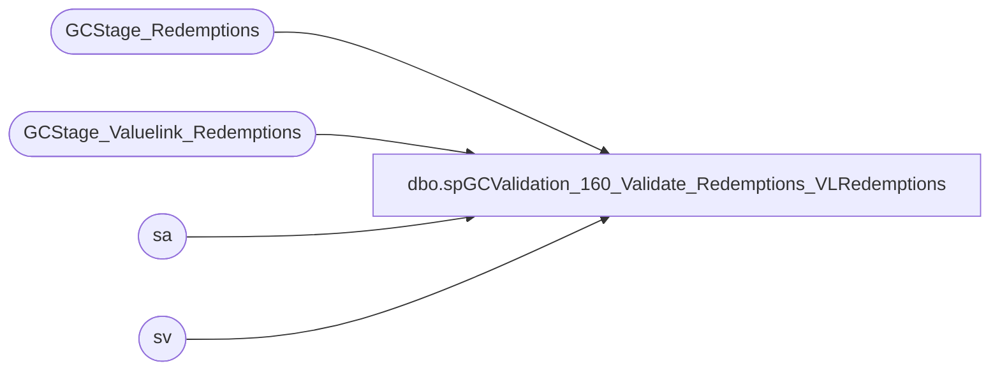

# dbo.spGCValidation_160_Validate_Redemptions_VLRedemptions

**Database:** DWStaging  
**Server:** papamart  

## Architecture Diagram



## Table Dependencies

| Referenced Table |
|---|
| GCStage_Redemptions |
| GCStage_Valuelink_Redemptions |
| sa |
| sv |

## Stored Procedure Code

```sql
CREATE PROCEDURE [dbo].[spGCValidation_160_Validate_Redemptions_VLRedemptions]
-- =============================================================================================================
-- Name: spGCValidation_160_Validate_Redemptions_VLRedemptions
--
-- Description:	
--	Validate the Redemptions between DW and Valuelink against detail Valuelink Redemptions
--
--
-- Input:		
--
-- Output: 
--
-- Dependencies: 
--
-- Revision History
--		Name:			Date:			Comments:
--		Gary Murrish	11/21/2013		Created

-- =============================================================================================================
AS

	SET NOCOUNT ON


	-- Phase 1010, Full Match
	UPDATE sa
		SET	sa.vlLineID = sv.LineID,
			sa.postedPhase = 1010
	FROM
		GCStage_Valuelink_Redemptions sv WITH (NOLOCK)
		INNER JOIN GCStage_Redemptions sa WITH (NOLOCK)
			ON sv.account_number = sa.giftcard_no
			AND sv.date_key = sa.date_key
			AND sv.store_key = sa.store_key
			AND sv.terminal_id = sa.Register_No
			AND sv.terminal_transaction_number = sa.Transaction_No
			AND sv.transaction_amount = sa.Redemption_Amount * -1
			AND sa.postedPhase = 0
			AND sv.postedPhase = 0

	UPDATE sv
		SET	sv.gaRecID = sa.recID,
			sv.postedPhase = 1010
	FROM
		GCStage_Valuelink_Redemptions sv WITH (NOLOCK)
		INNER JOIN GCStage_Redemptions sa WITH (NOLOCK)
			ON sa.vlLineID = sv.LineID
			AND sa.postedPhase = 1010
			AND sv.postedPhase <> 1010


	-- Phase 1020, Card, Date, Store, Amount
	UPDATE sa
		SET	sa.vlLineID = sv.LineID,
			sa.postedPhase = 1020
	FROM
		GCStage_Valuelink_Redemptions sv WITH (NOLOCK)
		INNER JOIN GCStage_Redemptions sa WITH (NOLOCK)
			ON sv.account_number = sa.giftcard_no
			AND sv.date_key = sa.date_key
			AND sv.store_key = sa.store_key
			AND sv.transaction_amount = sa.Redemption_Amount * -1
			AND sa.postedPhase = 0
			AND sv.postedPhase = 0

	UPDATE sv
		SET	sv.gaRecID = sa.recID,
			sv.postedPhase = 1020
	FROM
		GCStage_Valuelink_Redemptions sv WITH (NOLOCK)
		INNER JOIN GCStage_Redemptions sa WITH (NOLOCK)
			ON sa.vlLineID = sv.LineID
			AND sa.postedPhase = 1020
			AND sv.postedPhase <> 1020

	-- Phase 1030, Card, Date, Amount
	UPDATE sa
		SET	sa.vlLineID = sv.LineID,
			sa.postedPhase = 1030
	FROM
		GCStage_Valuelink_Redemptions sv WITH (NOLOCK)
		INNER JOIN GCStage_Redemptions sa WITH (NOLOCK)
			ON sv.account_number = sa.giftcard_no
			AND sv.date_key = sa.date_key
			AND sv.transaction_amount = sa.Redemption_Amount * -1
			AND sa.postedPhase = 0
			AND sv.postedPhase = 0

	UPDATE sv
		SET	sv.gaRecID = sa.recID,
			sv.postedPhase = 1030
	FROM
		GCStage_Valuelink_Redemptions sv WITH (NOLOCK)
		INNER JOIN GCStage_Redemptions sa WITH (NOLOCK)
			ON sa.vlLineID = sv.LineID
			AND sa.postedPhase = 1030
			AND sv.postedPhase <> 1030

	-- Phase 1040, Card, Amount
	UPDATE sa
		SET	sa.vlLineID = sv.LineID,
			sa.postedPhase = 1040
	FROM
		GCStage_Valuelink_Redemptions sv WITH (NOLOCK)
		INNER JOIN GCStage_Redemptions sa WITH (NOLOCK)
			ON sv.account_number = sa.giftcard_no
			AND sv.transaction_amount = sa.Redemption_Amount * -1
			AND sa.postedPhase = 0
			AND sv.postedPhase = 0

	UPDATE sv
		SET	sv.gaRecID = sa.recID,
			sv.postedPhase = 1040
	FROM
		GCStage_Valuelink_Redemptions sv WITH (NOLOCK)
		INNER JOIN GCStage_Redemptions sa WITH (NOLOCK)
			ON sa.vlLineID = sv.LineID
			AND sa.postedPhase = 1040
			AND sv.postedPhase <> 1040
```

