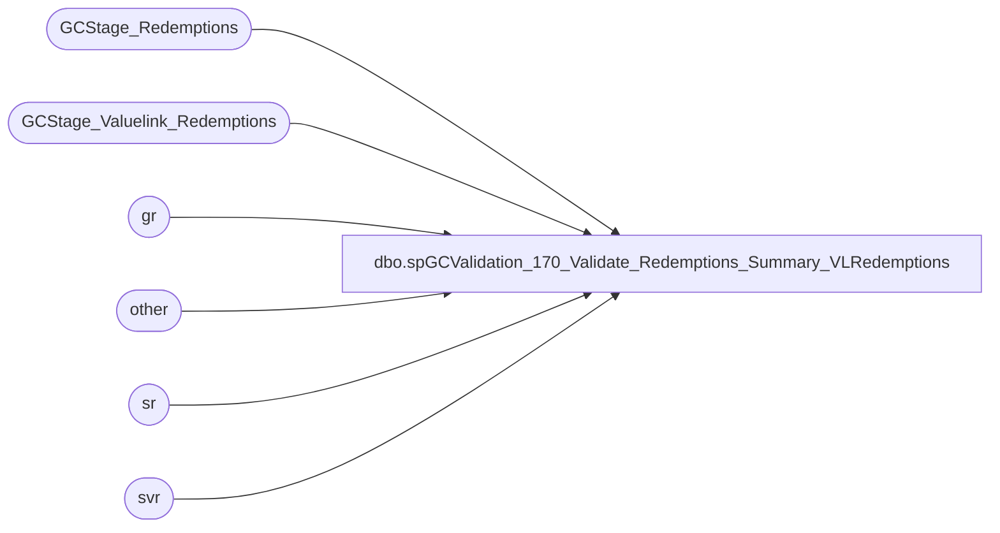

# dbo.spGCValidation_170_Validate_Redemptions_Summary_VLRedemptions

**Database:** DWStaging  
**Server:** papamart  

## Architecture Diagram



## Table Dependencies

| Referenced Table |
|---|
| GCStage_Redemptions |
| GCStage_Valuelink_Redemptions |
| gr |
| other |
| sr |
| svr |

## Stored Procedure Code

```sql
CREATE PROCEDURE [dbo].[spGCValidation_170_Validate_Redemptions_Summary_VLRedemptions]
-- =============================================================================================================
-- Name: spGCValidation_170_Validate_Redemptions_Summary_VLRedemptions
--
-- Description:	
--	Validate the Redemptions between DW and Valuelink against Summarized Valuelink Redemptions
--
--
-- Input:		
--
-- Output: 
--
-- Dependencies: 
--
-- Revision History
--		Name:			Date:			Comments:
--		Gary Murrish	11/21/2013		Created

-- =============================================================================================================
AS

	SET NOCOUNT ON

	IF OBJECT_ID('tempdb..#tmpGrpRedemptions') IS NOT NULL
	BEGIN
		DROP TABLE #tmpGrpRedemptions
	END

	SELECT
		svr.account_number,
		svr.date_key,
		svr.store_key,
		svr.terminal_id,
		svr.terminal_transaction_number,
		MIN(svr.lineID) AS lineID,
		MIN(svr.postedPhase) AS postedPhase,
		SUM(svr.transaction_amount * -1) AS transaction_amount,
		CAST(0 AS int) AS grRecID
	INTO #tmpGrpRedemptions
	FROM
		GCStage_Valuelink_Redemptions svr WITH (NOLOCK)
	WHERE
		svr.postedPhase = 0
	GROUP BY	svr.account_number,
				svr.date_key,
				svr.store_key,
				svr.terminal_id,
				svr.terminal_transaction_number

	-- Phase 1110 , Full Match
	UPDATE sr
		SET	sr.vlLineID = gr.LineID,
			sr.postedPhase = 1110
	FROM
		#tmpGrpRedemptions gr WITH (NOLOCK)
		INNER JOIN GCStage_Redemptions sr WITH (NOLOCK)
			ON sr.giftcard_no = gr.account_number
			AND sr.store_key = gr.store_key
			AND sr.date_key = gr.date_key
			AND sr.Register_No = gr.terminal_id
			AND sr.Transaction_No = gr.terminal_transaction_number
			AND sr.Redemption_Amount = gr.transaction_amount
			AND gr.postedPhase = 0
			AND sr.postedPhase = 0

	UPDATE gr
		SET	gr.postedPhase = sr.postedPhase,
			gr.grRecID = sr.recID
	FROM
		#tmpGrpRedemptions gr WITH (NOLOCK)
		INNER JOIN GCStage_Redemptions sr WITH (NOLOCK)
			ON gr.LineID = sr.vlLineID
			AND sr.postedPhase = 1110
			AND gr.postedPhase <> 1110

	-- Phase 1120 , Card, Store, Date, Amount
	UPDATE sr
		SET	sr.vlLineID = gr.LineID,
			sr.postedPhase = 1120
	FROM
		(SELECT
				gr.account_number,
				gr.date_key,
				gr.store_key,
				MIN(gr.LineID) AS LineID,
				SUM(gr.transaction_amount) AS transaction_amount,
				CAST(0 AS int) AS postedPhase
			FROM
				#tmpGrpRedemptions gr WITH (NOLOCK)
			WHERE
				gr.postedPhase = 0
			GROUP BY	gr.account_number,
						gr.date_key,
						gr.store_key) gr
		INNER JOIN GCStage_Redemptions sr WITH (NOLOCK)
			ON sr.giftcard_no = gr.account_number
			AND sr.store_key = gr.store_key
			AND sr.date_key = gr.date_key
			AND sr.Redemption_Amount = gr.transaction_amount
			AND gr.postedPhase = 0
			AND sr.postedPhase = 0

	-- Update the Primary Record
	UPDATE gr
		SET	gr.postedPhase = sr.postedPhase,
			gr.grRecID = sr.recID
	FROM
		#tmpGrpRedemptions gr WITH (NOLOCK)
		INNER JOIN GCStage_Redemptions sr WITH (NOLOCK)
			ON gr.LineID = sr.vlLineID
			AND sr.postedPhase = 1120
			AND gr.postedPhase <> 1120

	-- Update the other records
	UPDATE other
		SET	other.grRecID = gr.grRecID,
			other.postedPhase = gr.postedPhase
	FROM
		#tmpGrpRedemptions gr WITH (NOLOCK)
		INNER JOIN #tmpGrpRedemptions other WITH (NOLOCK)
			ON gr.account_number = other.account_number
			AND gr.date_key = other.date_key
			AND gr.store_key = other.store_key
			AND other.postedPhase = 0
	WHERE gr.postedPhase = 1120


	-- Phase 1110 , Full Match
	UPDATE sr
		SET	sr.vlLineID = gr.LineID,
			sr.postedPhase = 1120
	FROM
		#tmpGrpRedemptions gr WITH (NOLOCK)
		INNER JOIN GCStage_Redemptions sr WITH (NOLOCK)
			ON sr.giftcard_no = gr.account_number
			AND sr.store_key = gr.store_key
			AND sr.date_key = gr.date_key
			AND sr.Register_No = gr.terminal_id
			AND sr.Transaction_No = gr.terminal_transaction_number
			AND sr.Redemption_Amount = gr.transaction_amount
			AND gr.postedPhase = 0
			AND sr.postedPhase = 0

	UPDATE gr
		SET	gr.postedPhase = sr.postedPhase,
			gr.grRecID = sr.recID
	FROM
		#tmpGrpRedemptions gr WITH (NOLOCK)
		INNER JOIN GCStage_Redemptions sr WITH (NOLOCK)
			ON gr.LineID = sr.vlLineID
			AND sr.postedPhase = 1120
			AND gr.postedPhase <> 1120

	-- Phase 1130 , Card, Date, Amount
	UPDATE sr
		SET	sr.vlLineID = gr.LineID,
			sr.postedPhase = 1130
	FROM
		(SELECT
				gr.account_number,
				gr.date_key,
				MIN(gr.LineID) AS LineID,
				SUM(gr.transaction_amount) AS transaction_amount,
				CAST(0 AS int) AS postedPhase
			FROM
				#tmpGrpRedemptions gr WITH (NOLOCK)
			WHERE
				gr.postedPhase = 0
			GROUP BY	gr.account_number,
						gr.date_key) gr
		INNER JOIN GCStage_Redemptions sr WITH (NOLOCK)
			ON sr.giftcard_no = gr.account_number
			AND sr.date_key = gr.date_key
			AND sr.Redemption_Amount = gr.transaction_amount
			AND gr.postedPhase = 0
			AND sr.postedPhase = 0

	-- Update the Primary Record
	UPDATE gr
		SET	gr.postedPhase = sr.postedPhase,
			gr.grRecID = sr.recID
	FROM
		#tmpGrpRedemptions gr WITH (NOLOCK)
		INNER JOIN GCStage_Redemptions sr WITH (NOLOCK)
			ON gr.LineID = sr.vlLineID
			AND sr.postedPhase = 1130
			AND gr.postedPhase <> 1130

	-- Update the other records
	UPDATE other
		SET	other.grRecID = gr.grRecID,
			other.postedPhase = gr.postedPhase
	FROM
		#tmpGrpRedemptions gr WITH (NOLOCK)
		INNER JOIN #tmpGrpRedemptions other WITH (NOLOCK)
			ON gr.account_number = other.account_number
			AND gr.date_key = other.date_key
			AND other.postedPhase = 0
	WHERE gr.postedPhase = 1130

	-- Phase 1140 , Card, Amount
	UPDATE sr
		SET	sr.vlLineID = gr.LineID,
			sr.postedPhase = 1140
	FROM
		(SELECT
				gr.account_number,
				MIN(gr.LineID) AS LineID,
				SUM(gr.transaction_amount) AS transaction_amount,
				CAST(0 AS int) AS postedPhase
			FROM
				#tmpGrpRedemptions gr WITH (NOLOCK)
			WHERE
				gr.postedPhase = 0
			GROUP BY gr.account_number) gr
		INNER JOIN GCStage_Redemptions sr WITH (NOLOCK)
			ON sr.giftcard_no = gr.account_number
			AND sr.Redemption_Amount = gr.transaction_amount
			AND gr.postedPhase = 0
			AND sr.postedPhase = 0

	-- Update the Primary Record
	UPDATE gr
		SET	gr.postedPhase = sr.postedPhase,
			gr.grRecID = sr.recID
	FROM
		#tmpGrpRedemptions gr WITH (NOLOCK)
		INNER JOIN GCStage_Redemptions sr WITH (NOLOCK)
			ON gr.LineID = sr.vlLineID
			AND sr.postedPhase = 1140
			AND gr.postedPhase <> 1140

	-- Update the other records
	UPDATE other
		SET	other.grRecID = gr.grRecID,
			other.postedPhase = gr.postedPhase
	FROM
		#tmpGrpRedemptions gr WITH (NOLOCK)
		INNER JOIN #tmpGrpRedemptions other WITH (NOLOCK)
			ON gr.account_number = other.account_number
			AND other.postedPhase = 0
	WHERE gr.postedPhase = 1140


	-- Now post it back to the Staging tables
	UPDATE svr
		SET	svr.postedPhase = gr.postedPhase,
			svr.gaRecID = gr.grRecID
	FROM
		GCStage_Valuelink_Redemptions svr WITH (NOLOCK)
		INNER JOIN #tmpGrpRedemptions gr WITH (NOLOCK)
			ON svr.account_number = gr.account_number
			AND svr.date_key = gr.date_key
			AND svr.store_key = gr.store_key
			AND svr.terminal_id = gr.terminal_id
			AND svr.terminal_transaction_number = gr.terminal_transaction_number
	WHERE gr.postedPhase = 1110
	AND svr.postedPhase = 0

	UPDATE svr
		SET	svr.postedPhase = gr.postedPhase,
			svr.gaRecID = gr.grRecID
	FROM
		GCStage_Valuelink_Redemptions svr WITH (NOLOCK)
		INNER JOIN #tmpGrpRedemptions gr WITH (NOLOCK)
			ON svr.account_number = gr.account_number
			AND svr.date_key = gr.date_key
			AND svr.store_key = gr.store_key
	WHERE gr.postedPhase = 1120
	AND svr.postedPhase = 0

	UPDATE svr
		SET	svr.postedPhase = gr.postedPhase,
			svr.gaRecID = gr.grRecID
	FROM
		GCStage_Valuelink_Redemptions svr WITH (NOLOCK)
		INNER JOIN #tmpGrpRedemptions gr WITH (NOLOCK)
			ON svr.account_number = gr.account_number
			AND svr.date_key = gr.date_key
	WHERE gr.postedPhase = 1130
	AND svr.postedPhase = 0

	UPDATE svr
		SET	svr.postedPhase = gr.postedPhase,
			svr.gaRecID = gr.grRecID
	FROM
		GCStage_Valuelink_Redemptions svr WITH (NOLOCK)
		INNER JOIN #tmpGrpRedemptions gr WITH (NOLOCK)
			ON svr.account_number = gr.account_number
	WHERE gr.postedPhase = 1140
	AND svr.postedPhase = 0
```

