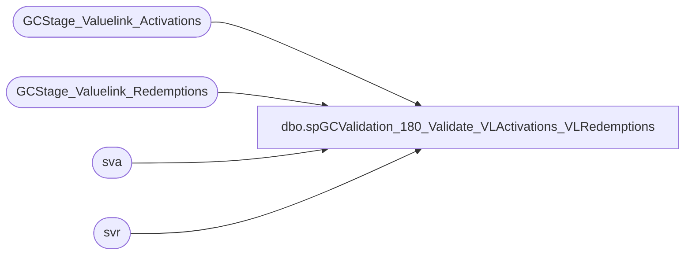

# dbo.spGCValidation_180_Validate_VLActivations_VLRedemptions

**Database:** DWStaging  
**Server:** papamart  

## Architecture Diagram



## Table Dependencies

| Referenced Table |
|---|
| GCStage_Valuelink_Activations |
| GCStage_Valuelink_Redemptions |
| sva |
| svr |

## Stored Procedure Code

```sql
CREATE PROCEDURE [dbo].[spGCValidation_180_Validate_VLActivations_VLRedemptions]
-- =============================================================================================================
-- Name: spGCValidation_180_Validate_VLActivations_VLRedemptions
--
-- Description:	
-- This section will match the web records for one activation and one redemptions with
--	the same dollar amount.
--	This is because of a problem with the web 'allocating' the giftcards prior to the 
--	transaction being completed

--
--
-- Input:		
--
-- Output: 
--
-- Dependencies: 
--
-- Revision History
--		Name:			Date:			Comments:
--		Gary Murrish	11/21/2013		Created

-- =============================================================================================================
AS

	SET NOCOUNT ON


DECLARE @recsUpdated int
SET @recsUpdated = 1

WHILE @recsUpdated > 0
BEGIN


	IF OBJECT_ID('tempdb..#loopActivations') IS NOT NULL
	BEGIN
		DROP TABLE #loopActivations
	END

	IF OBJECT_ID('tempdb..#loopRedemptions') IS NOT NULL
	BEGIN
		DROP TABLE #loopRedemptions
	END

	-- Get the Activations
	SELECT
		sva.account_number,
		sva.transaction_amount,
		MIN(sva.LineID) AS LineID
	INTO #loopActivations
	FROM
		GCStage_Valuelink_Activations sva WITH (NOLOCK)
	WHERE
		sva.store_key = 13
		AND sva.postedPhase = 0
	GROUP BY	sva.account_number,
				sva.transaction_amount

	-- Get the redemptions
	SELECT
		svr.account_number,
		svr.transaction_amount,
		MIN(svr.LineID) AS LineID
	INTO #loopRedemptions
	FROM
		GCStage_Valuelink_Redemptions svr WITH (NOLOCK)
	WHERE
		svr.store_key = 13
		AND svr.postedPhase = 0
	GROUP BY	svr.account_number,
				svr.transaction_amount

	-- Update the activations that match
	UPDATE sva
		SET	sva.postedPhase = 5030,
			sva.gaRecID = r.LineID
	FROM
		GCStage_Valuelink_Activations sva
		INNER JOIN #loopActivations a WITH (NOLOCK)
			ON sva.LineID = a.LineID
		INNER JOIN #loopRedemptions r WITH (NOLOCK)
			ON a.account_number = r.account_number
			AND a.transaction_amount = r.transaction_amount * -1

	-- Update the redemptions that match
	UPDATE svr
		SET	svr.postedPhase = 5030,
			svr.gaRecID = a.LineID
	FROM
		GCStage_Valuelink_Redemptions svr
		INNER JOIN #loopRedemptions r WITH (NOLOCK)
			ON svr.LineID = r.LineID
		INNER JOIN #loopActivations a WITH (NOLOCK)
			ON a.account_number = r.account_number
			AND a.transaction_amount = r.transaction_amount * -1

	SET @recsUpdated = @@rowcount
END
```

