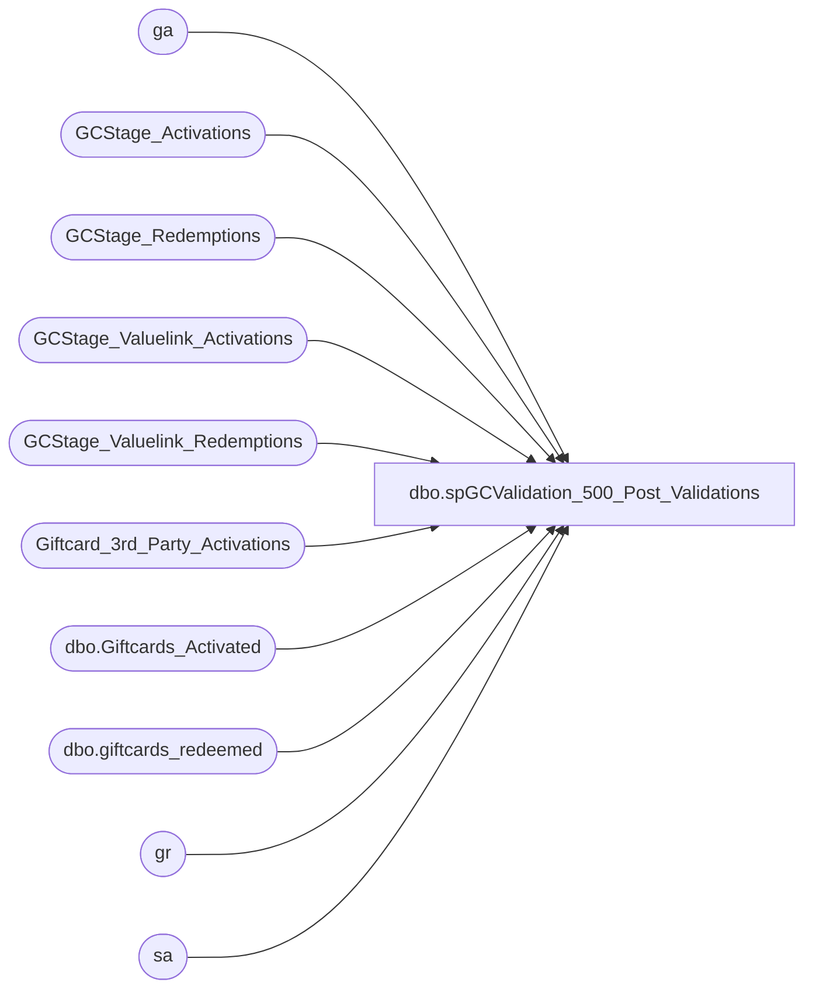

# dbo.spGCValidation_500_Post_Validations

**Database:** DWStaging  
**Server:** papamart  

## Architecture Diagram



## Table Dependencies

| Referenced Table |
|---|
| ga |
| GCStage_Activations |
| GCStage_Redemptions |
| GCStage_Valuelink_Activations |
| GCStage_Valuelink_Redemptions |
| Giftcard_3rd_Party_Activations |
| dbo.Giftcards_Activated |
| dbo.giftcards_redeemed |
| gr |
| sa |

## Stored Procedure Code

```sql
CREATE PROCEDURE [dbo].[spGCValidation_500_Post_Validations]
-- =============================================================================================================
-- Name: spGCValidation_500_Post_Validations
--
-- Description:	
-- Post the validation and the MID results back to the Data warehouse
--
--
-- Input:		
--
-- Output: 
--
-- Dependencies: 
--
-- Revision History
--		Name:			Date:			Comments:
--		Gary Murrish	11/21/2013		Created

-- =============================================================================================================
AS

	SET NOCOUNT ON


	-- Flag those Valuelink activations which were BABW Mid, but sold by third parties as verified
	UPDATE sa
		SET sa.postedPhase = 4000
	FROM
		GCStage_Valuelink_Activations sa
		INNER JOIN Giftcard_3rd_Party_Activations grpa WITH (NOLOCK)
			ON LEFT(sa.account_number, 12) BETWEEN grpa.StartCardNumber AND grpa.EndCardNumber
			AND sa.postedPhase = 0

	-- Post the fact that the Activation was validated and update the MID (merchant ID) if necessary
	-- Update activations
	UPDATE ga
		SET	ga.MID = sv.merchant_id,
			ga.VLVerified = 1
	FROM
		GCStage_Activations sa WITH (NOLOCK)
		INNER JOIN dw.dbo.Giftcards_Activated ga
			ON sa.recID = ga.recID
		INNER JOIN GCStage_Valuelink_Activations sv WITH (NOLOCK)
			ON sa.vlLineID = sv.LineID
	WHERE sa.postedPhase > 0
	AND (ISNULL(ga.MID, '') <> sv.merchant_id
	OR ga.VLVerified <> 1)

	-- Post the fact that the Activation was validated and update the MID (merchant ID) if necessary
	-- Update activations from Redemptions
	UPDATE ga
		SET	ga.MID = sv.merchant_id,
			ga.VLVerified = 1
	FROM
		GCStage_Activations sa WITH (NOLOCK)
		INNER JOIN dw.dbo.Giftcards_Activated ga
			ON sa.recID = ga.recID
		INNER JOIN GCStage_Valuelink_Redemptions sv WITH (NOLOCK)
			ON sa.vlLineID = sv.LineID * -1
	WHERE sa.postedPhase > 0
	AND (ISNULL(ga.MID, '') <> sv.merchant_id
	OR ga.VLVerified <> 1)


	-- Post the fact that the Redemption was validated and update the MID (merchant ID) if necessary
	--UPDATE redemptions
	UPDATE gr
		SET	MID = svr.merchant_id,
			VLVerified = 1
	FROM
		GCStage_Redemptions sr WITH (NOLOCK)
		INNER JOIN dw.dbo.giftcards_redeemed gr
			ON sr.recID = gr.recID
		INNER JOIN GCStage_Valuelink_Redemptions svr WITH (NOLOCK)
			ON sr.vlLineID = svr.LineID
	WHERE sr.postedPhase <> 0
	AND (ISNULL(gr.MID, '') <> svr.merchant_id
	OR gr.VLVerified = 0)
```

