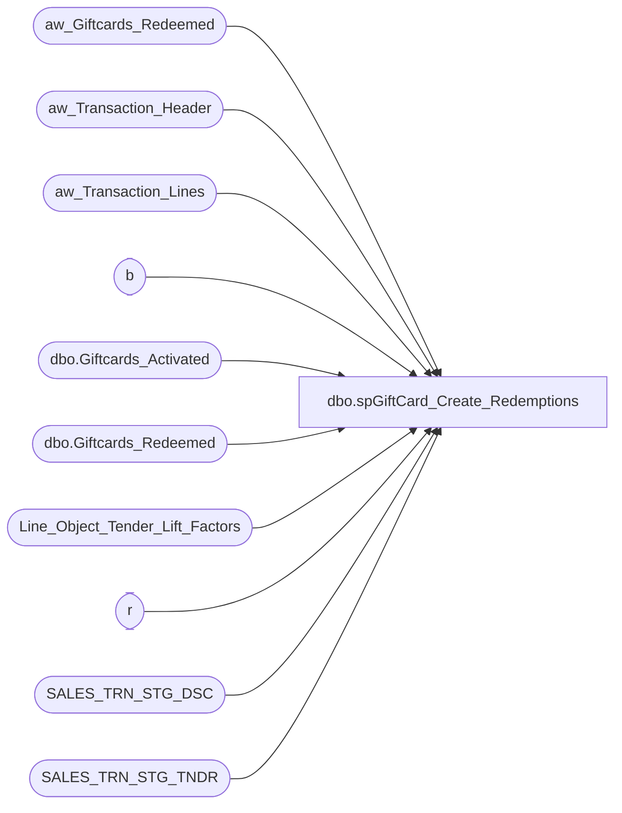

# dbo.spGiftCard_Create_Redemptions

**Database:** DWStaging  
**Server:** papamart  

## Architecture Diagram



## Table Dependencies

| Referenced Table |
|---|
| aw_Giftcards_Redeemed |
| aw_Transaction_Header |
| aw_Transaction_Lines |
| b |
| dbo.Giftcards_Activated |
| dbo.Giftcards_Redeemed |
| Line_Object_Tender_Lift_Factors |
| r |
| SALES_TRN_STG_DSC |
| SALES_TRN_STG_TNDR |

## Stored Procedure Code

```sql
CREATE PROCEDURE [dbo].[spGiftCard_Create_Redemptions]
-- =============================================================================================================
-- Name: spGiftCard_Create_Redemptions
--
-- Description:	
--	Pull the giftcard redemptions for pulling the datawarehouse and load into the table aw_Giftcards_Redeemed
--
--
-- Input:		
--
-- Output: 
--
-- Dependencies: 
--
-- Revision History
--		Name:			Date:			Comments:
--		Gary Murrish	5/6/2013		Because SFS Certs moved to discounts, still include them
--										in the lift calculation.
--		Gary Murrish	12/12/2013		Added additional Criteria for Redemptions
--		Gary Murrish	4/17/2013		Created

-- =============================================================================================================
AS

	SET NOCOUNT ON


	-- Get the cards which were redeemed this batch
	TRUNCATE TABLE aw_Giftcards_Redeemed

	INSERT INTO aw_Giftcards_Redeemed
		(	Transaction_ID,
			date_key,
			Gross_Line_Amount,
			POS_Discount_Amount,
			Reference_No,
			currency_key,
			store_key,
			priorRedemptionsThisBatch,
			daysSinceLastActivation,
			activation_discount_amount,
			liftAmount)
		SELECT
			base.Transaction_ID,
			MIN(base.date_key) AS date_key,
			SUM(base.gross_line_amount) AS gross_line_amount,
			SUM(base.pos_discount_amount) AS pos_discount_amount,
			base.Reference_No,
			MIN(base.currency_key) AS currency_key,
			MIN(base.store_key) AS store_key,
			CAST(0 AS money) AS priorRedemptionsThisBatch,
			CAST(0 AS int) AS daysSinceLastActivation,
			CAST(0 AS money) AS activation_discount_amount,
			CAST(0 AS money) AS liftAmount
		FROM
			(SELECT
					CAST(th.transaction_id AS integer) AS transaction_id,
					th.date_key,
					CAST((tl.gross_line_amount * tl.db_cr_none) AS money) AS gross_line_amount,
					CAST((tl.pos_discount_amount * tl.db_cr_none) AS money) AS pos_discount_amount,
					LTRIM(RTRIM(tl.reference_no)) COLLATE SQL_Latin1_General_CP1_CI_AS reference_no,
					th.currency_key,
					th.store_key
				FROM
					aw_Transaction_Header th WITH (NOLOCK)
					INNER JOIN aw_Transaction_Lines tl WITH (NOLOCK)
						ON th.transaction_id = tl.transaction_id
				WHERE
					tl.reference_no IS NOT NULL
					AND tl.gross_line_amount <> 0
					AND LEFT(LTRIM(tl.reference_no), 1) = '6'
					AND (tl.Line_Object = 633 -- Gift Card Redemptions
					AND tl.Line_Action IN (25, 26))) base
		GROUP BY	base.Reference_No,
					base.Transaction_ID


	-- Set the Days since Activation
	UPDATE aw_Giftcards_Redeemed
		SET daysSinceLastActivation = ISNULL(aw_Giftcards_Redeemed.date_key - (SELECT
				MAX(date_key)
			FROM
				dw.dbo.Giftcards_Activated ga WITH (NOLOCK)
			WHERE
				ga.giftcard_no = aw_Giftcards_Redeemed.Reference_No)
		, -1)

	-- Set the prior redemption amount for each giftcard in this batch for those cards where
	--		there is more than one redemption
	UPDATE aw_Giftcards_Redeemed
		SET priorRedemptionsThisBatch = ISNULL((SELECT
				SUM(x.Gross_Line_Amount)
			FROM
				aw_Giftcards_Redeemed x WITH (NOLOCK)
			WHERE
				x.Reference_No = aw_Giftcards_Redeemed.Reference_No
				AND x.Transaction_ID < aw_Giftcards_Redeemed.Transaction_ID)
		, 0)

	-- For each giftcard, construct the beginning balances
	-- Drop table #tmpBalance
	SELECT
		ga.giftcard_no,
		SUM(ga.activated_amount) AS activated_amount,
		SUM(ga.discount_amount) AS discount_amount,
		CAST(0 AS money) AS priorPostedDiscount,
		CAST(0 AS money) AS thisPostedDiscount,
		MIN(x.minDate_Key) AS minDate_Key
	INTO #tmpBalance
	FROM
		dw.dbo.Giftcards_Activated ga WITH (NOLOCK)
		INNER JOIN (SELECT
				Reference_No AS giftcard_no,
				MIN(r.date_key) AS minDate_Key
			FROM
				aw_Giftcards_Redeemed r WITH (NOLOCK)
			GROUP BY r.Reference_No) x
			ON x.giftcard_no = ga.giftcard_no
	GROUP BY ga.giftcard_no

	-- Now compute for each of these giftcards, the amount of the discount
	--	which have previously been posted to redemptions
	UPDATE b
		SET priorPostedDiscount = x.priorPostedDiscount
	FROM
		#tmpBalance b
		INNER JOIN (SELECT
				gr.giftcard_no,
				SUM(gr.activation_discount_amount) AS priorPostedDiscount
			FROM
				dw.dbo.Giftcards_Redeemed gr WITH (NOLOCK)
				INNER JOIN #tmpBalance b WITH (NOLOCK)
					ON gr.giftcard_no = b.giftcard_no
			WHERE
				gr.date_key < b.minDate_Key
			GROUP BY gr.giftcard_no) x
			ON x.giftcard_no = b.giftcard_no


	-- Set the amount of the original POS discount should be applied to this transaction
	UPDATE r
		SET r.activation_discount_amount =
			CASE
				WHEN x.openDiscount <= x.redemption_amount THEN x.openDiscount
				ELSE x.redemption_amount
			END
	FROM
		aw_Giftcards_Redeemed r WITH (NOLOCK)
		INNER JOIN (SELECT
				r.Transaction_ID,
				b.giftcard_no,
				(b.discount_amount - b.priorPostedDiscount - r.priorRedemptionsThisBatch) AS openDiscount,
				r.Gross_Line_Amount AS redemption_amount
			FROM
				aw_Giftcards_Redeemed r WITH (NOLOCK)
				INNER JOIN #tmpBalance b WITH (NOLOCK)
					ON r.Reference_No = b.giftcard_no
			WHERE
				(b.discount_amount - b.priorPostedDiscount - r.priorRedemptionsThisBatch) > 0) x
			ON x.Transaction_ID = r.Transaction_ID
			AND x.giftcard_no = r.Reference_No


	-- Now compute the lift on the redemptions
	-- Drop table #tmpLift
	SELECT
		x.Transaction_ID,
		x.totalRedemption,
		ISNULL(tender.totalTender, 0) AS totalTender,
		x.firstGiftcard_No
	INTO #tmpLift
	FROM
		(SELECT
				r.Transaction_ID,
				SUM(r.Gross_Line_Amount) AS totalRedemption,
				MIN(r.Reference_No) AS firstGiftcard_No

			FROM
				aw_Giftcards_Redeemed r
			GROUP BY r.Transaction_ID) x
		LEFT JOIN (SELECT
				x.Transaction_ID,
				SUM(totalTender) AS totalTender
			FROM
				(SELECT
						STST.Transaction_ID,
						SUM(STST.Gross_Line_Amount * fctr.factorGiftcardLift) AS totalTender
					FROM
						SALES_TRN_STG_TNDR STST WITH (NOLOCK)
						INNER JOIN Line_Object_Tender_Lift_Factors fctr WITH (NOLOCK)
							ON STST.Line_Object = fctr.Line_Object
					GROUP BY STST.Transaction_ID
					UNION ALL
					SELECT
						STST.Transaction_ID,
						SUM(STST.Gross_Line_Amount * fctr.factorGiftcardLift) AS totalTender
					FROM
						SALES_TRN_STG_DSC STST WITH (NOLOCK)
						INNER JOIN Line_Object_Tender_Lift_Factors fctr WITH (NOLOCK)
							ON STST.Line_Object = fctr.Line_Object
					GROUP BY STST.Transaction_ID) x
			GROUP BY x.Transaction_ID) tender
			ON tender.Transaction_ID = x.Transaction_ID

	-- Now post a percentage of the lift to each giftcard
	UPDATE r
		SET r.liftAmount = ROUND(l.totalTender * (r.Gross_Line_Amount / l.totalRedemption), 2)
	FROM
		aw_Giftcards_Redeemed r WITH (NOLOCK)
		INNER JOIN #tmpLift l WITH (NOLOCK)
			ON r.Transaction_ID = l.Transaction_ID


	-- Build the total lift differences that need to be adjusted
	-- Drop table #tmpNeedToAdjust
	SELECT
		l.*,
		x.postedLift
	INTO #tmpNeedToAdjust
	FROM
		(SELECT
				r.Transaction_ID,
				SUM(r.liftAmount) AS postedLift
			FROM
				aw_Giftcards_Redeemed r
			GROUP BY r.Transaction_ID) x
		INNER JOIN #tmpLift l WITH (NOLOCK)
			ON l.Transaction_ID = x.Transaction_ID
	WHERE
		x.postedLift <> l.totalTender

	-- Put any rounding differences on the first giftcard
	UPDATE r
		SET r.liftAmount = r.liftAmount + (adj.totalTender - adj.postedLift)
	FROM
		aw_Giftcards_Redeemed r
		INNER JOIN #tmpNeedToAdjust
		adj
			ON adj.Transaction_ID = r.Transaction_ID
			AND adj.firstGiftcard_No = r.Reference_No
```

