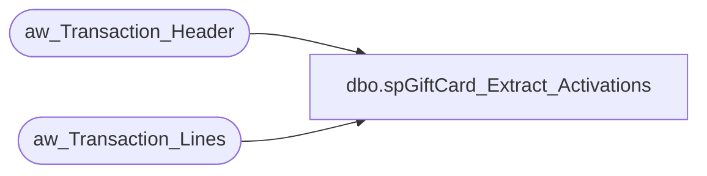

# dbo.spGiftCard_Extract_Activations

**Database:** DWStaging  
**Server:** papamart  

## Architecture Diagram



## Table Dependencies

| Referenced Table |
|---|
| aw_Transaction_Header |
| aw_Transaction_Lines |

## Stored Procedure Code

```sql
CREATE PROCEDURE [dbo].[spGiftCard_Extract_Activations]
	-- =============================================================================================================
	-- Name: spGiftCard_Extract_Activations
	--
	-- Description:	
	--	Pull the giftcard activations for pulling the datawarehouse.
	--
	--
	-- Input:		None
	--
	-- Output: 
	--
	-- Dependencies: NOTE THE UNION STATEMENT IN THE SELECTION IF YOU HAVE TO CHANGE THE CRITERIA
	--
	-- Revision History
	--		Name:			Date:			Comments:
	--		Gary Murrish	12/12/2013		Added additional type for Activations
	--		Gary Murrish	4/17/2013		Created

	-- =============================================================================================================

AS

	SET NOCOUNT ON


	SELECT
		base.transaction_id,
		MIN(base.date_key) AS date_key,
		SUM(base.gross_line_amount) AS gross_line_amount,
		SUM(base.pos_discount_amount) AS pos_discount_amount,
		base.reference_no,
		MIN(base.currency_key) AS currency_key,
		MIN(base.store_key) AS store_key
	FROM
		(SELECT
				CAST(th.transaction_id AS integer) AS transaction_id,
				th.date_key,
				CAST((tl.gross_line_amount * tl.db_cr_none * -1) AS money) AS gross_line_amount,
				CAST((tl.pos_discount_amount * tl.db_cr_none * -1) AS money) AS pos_discount_amount,
				LTRIM(RTRIM(tl.reference_no)) COLLATE SQL_Latin1_General_CP1_CI_AS reference_no,
				th.currency_key,
				th.store_key
			FROM
				aw_Transaction_Header  th WITH (NOLOCK)
				INNER JOIN aw_Transaction_Lines tl WITH (NOLOCK)
					ON th.transaction_id = tl.transaction_id
			WHERE
				tl.reference_no IS NOT NULL
				AND tl.gross_line_amount <> 0
				AND LEFT(LTRIM(tl.reference_no), 1) = '6'
				AND ((tl.line_object = 403 -- E-Card Activations
				AND tl.line_action IN (1,2))
				OR (tl.line_object = 404 -- Gift Card Activations
				AND tl.line_action IN (1,2))
				OR (tl.line_object = 633 -- Gift Card Activations
				AND tl.line_action IN (12, 24, 23))) 
		)
		base
	GROUP BY	base.transaction_id,
				base.reference_no

ORDER BY base.reference_no, base.transaction_id


DW_Monitor,spDatabaseGrowthLogCaptureCurrentDatabaseSizes,-- =============================================
-- Author:		Kevin Shyr
-- Create date: 6/5/2016
-- Description:	This sp logs the current database sizes
-- =============================================
CREATE PROCEDURE [DW_Monitor].[spDatabaseGrowthLogCaptureCurrentDatabaseSizes] 
AS
BEGIN
	-- SET NOCOUNT ON added to prevent extra result sets from
	-- interfering with SELECT statements.
	SET NOCOUNT ON;

	-- variable to store current server name
	DECLARE @CurrentServerName AS VARCHAR(100)
		, @CurrentConnectionString AS VARCHAR(255)
		, @CurrentDateKey AS INT
		, @CurrentDynamicSQL AS NVARCHAR(4000)

	-- get current datekey
	SELECT @CurrentDateKey = dd.date_key
	FROM dw.dbo.date_dim dd WITH(NOLOCK)
	WHERE dd.actual_date = CAST(GETDATE() AS DATE)

	-- Cursor to get all the servers we want
	DECLARE ServerName_cursor CURSOR FOR 
		SELECT DISTINCT ServerName
		FROM DW_Monitor.DatabaseToMonitorGrowth
		WHERE ServerName NOT IN ('Biapp01')

	OPEN ServerName_cursor

	FETCH NEXT FROM ServerName_cursor 
	INTO @CurrentServerName

	WHILE @@FETCH_STATUS = 0
	BEGIN
		PRINT 'Getting info from server: ' + @CurrentServerName
		-- clean up the temp table
		TRUNCATE TABLE DW_Monitor.DatabaseGrowthLog_OneServerResultPlaceHolder

		-- SET dynamic sql query 
		SET @CurrentDynamicSQL = 'INSERT INTO DW_Monitor.DatabaseGrowthLog_OneServerResultPlaceHolder
(DatabaseName, SizeInMB)
SELECT name, Size_MBs
FROM OPENQUERY(' + @CurrentServerName + ',
	''SELECT d.name
		,ROUND(SUM(cast(mf.size as bigint)) * 8 / 1024, 0) Size_MBs
	FROM sys.master_files mf
		INNER JOIN sys.databases d ON d.database_id = mf.database_id
	WHERE d.database_id > 4 -- Skip system databases
	GROUP BY d.name
	ORDER BY d.name'')'

		PRINT @CurrentDynamicSQL
		EXECUTE sp_executesql @CurrentDynamicSQL

		INSERT INTO [DW_Monitor].[DatabaseGrowthLog]
				([DatabaseToMonitorGrowthKey],[DateKey],[SizeInMB],[LogTimestamp])
			SELECT db.DatabaseToMonitorGrowthKey
				, @CurrentDateKey
				, rs.SizeInMB
				, GETDATE()
			FROM DW_Monitor.DatabaseGrowthLog_OneServerResultPlaceHolder rs
				INNER JOIN [DW_Monitor].[DatabaseToMonitorGrowth] db WITH(NOLOCK) 
					ON db.DatabaseName = rs.DatabaseName
						AND db.ServerName = @CurrentServerName

		-- Get the next server.
		FETCH NEXT FROM ServerName_cursor 
		INTO @CurrentServerName
	END 
	CLOSE ServerName_cursor;
	DEALLOCATE ServerName_cursor;


	/*
	SELECT d.name
		,ROUND(SUM(mf.size) * 8 / 1024, 0) Size_MBs
	FROM sys.master_files mf
		INNER JOIN sys.databases d ON d.database_id = mf.database_id
	WHERE d.database_id > 4 -- Skip system databases
	GROUP BY d.name
	ORDER BY d.name
	*/

END
```

