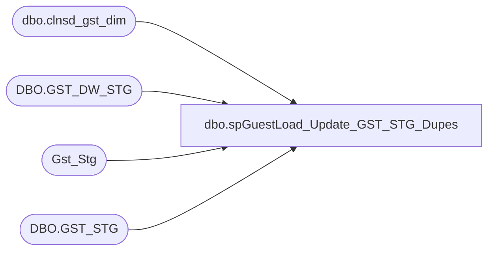

# dbo.spGuestLoad_Update_GST_STG_Dupes

**Database:** DWStaging  
**Server:** papamart  

## Architecture Diagram



## Table Dependencies

| Referenced Table |
|---|
| dbo.clnsd_gst_dim |
| DBO.GST_DW_STG |
| Gst_Stg |
| DBO.GST_STG |

## Stored Procedure Code

```sql
CREATE proc [dbo].[spGuestLoad_Update_GST_STG_Dupes]


as 

-- =============================================================================================================
-- Name: spGuestLoad_Update_GST_STG_Dupes
--
-- Description:	
--		As we are now bypassing the Matchit system, this proc will perform some of the functions of the Matchit system.
--		Update dwstaging.dbo.gst_stg to:
--			1) set records as DUP if there are duplicates within this table, which is truncated and reloaded per load. Add non-dupe gst_stg_id to dupe rec_id column.
--			2) Set dupe records to have the sames column values as non-dupe
--			3) Set records as Reject if they don't meet data requirements
--			4) Set records as Existing if they already exist in Gst_DW_Stg, add clnsd_gst_id from Gst_DW_Stg to gst_stg.ovrlp_rec_id
--			5) Set records as Loyalty if crm_gst_nbr is matched to crm_gst_dim 
--
-- Revision History
--		Name:			Date:			Comments:
--		Dan Tweedie		08/17/2016		created proc
-- =============================================================================================================


set nocount on

--MARk DUPES WITH GST_STG 
BEGIN
		;with 
		GST as
			(
				select
					gst_stg_id,
					crm_gst_nbr,
					lylty_gst_nbr,
					frst_nm,
					last_nm,
					brth_dt
				from
					DWSTAGING.DBO.GST_STG
			),
		FirstGstStgID as
			(
				select 
					min(gs.GST_STG_ID) gst_stg_id
				from 
						 GST gs
					join GST gs2 
					on	gs.gst_stg_id <> gs2.gst_stg_id
					and (
								(
									gs.crm_gst_nbr = gs2.crm_gst_nbr
									or
									gs.lylty_gst_nbr = gs2.lylty_gst_nbr
			
								)
							OR
								(
									gs.frst_nm = gs2.frst_nm
									and
									gs.last_nm = gs2.last_nm
									and
									gs.brth_dt = gs2.brth_dt
								)
						)
			),
		DupeGST as
			(
				select 
					gs2.gst_stg_id, f.gst_stg_id as nonDupe_GST_ID
				from 
						 GST gs
					join GST gs2 
					on	gs.gst_stg_id <> gs2.gst_stg_id
					and (
								(
									gs.crm_gst_nbr = gs2.crm_gst_nbr
									or
									gs.lylty_gst_nbr = gs2.lylty_gst_nbr
			
								)
							OR
								(
									gs.frst_nm = gs2.frst_nm
									and
									gs.last_nm = gs2.last_nm
									and
									gs.brth_dt = gs2.brth_dt
								)
						)
					join FirstGstStgID f on gs.gst_stg_id = f.gst_stg_id
				where
					gs2.gst_stg_id not in (select gst_stg_id from FirstGstStgID)
			)
		update g
		set g.dta_set_cd = 'DUP',
			g.rec_id = gd.nonDupe_GST_ID
		from DWSTAGING.DBO.GST_STG g
		join DupeGST gd on g.gst_stg_id = gd.gst_stg_id

END
---===========================================================================================

-----CONSOLIDATE DATA - Updates DUP records with the values from the Non-Dupe record
BEGIN

	update Gst_Stg
	set 
		frst_nm = d.frst_nm,
		last_nm = d.last_nm,
		nck_nm = d.nck_nm,
		drvd_gndr_cd = d.drvd_gndr_cd,
		brth_dt = d.brth_dt, 
		email_addr_txt = d.email_addr_txt,
		phn_nbr = d.phn_nbr,
		phn_extns_nbr = d.phn_extns_nbr,
		crm_mbrshp_dt = d.crm_mbrshp_dt,
		crm_gst_nbr = d.crm_gst_nbr,
		lylty_gst_nbr = d.lylty_gst_nbr,
		crm_regis_str_id = d.crm_regis_str_id,
		drvd_parnt_cnsnt_ind = d.drvd_parnt_cnsnt_ind,
		parnt_nm = d.parnt_nm,
		drvd_undr_age_13_ind = d.drvd_undr_age_13_ind,
		mobile_txt_nbr = d.mobile_txt_nbr
	from Gst_Stg m
		join (
		select  rec_id, 
			(select top 1 crm_mbrshp_dt from Gst_Stg g where g.rec_id = m.rec_id and crm_mbrshp_dt is not null group by crm_mbrshp_dt order by count(*) desc, crm_mbrshp_dt desc) crm_mbrshp_dt,
			(select top 1 crm_gst_nbr from Gst_Stg g where g.rec_id = m.rec_id and crm_gst_nbr is not null group by crm_gst_nbr order by count(*) desc, crm_gst_nbr desc ) crm_gst_nbr,
			(select top 1 lylty_gst_nbr from Gst_Stg g where g.rec_id = m.rec_id and lylty_gst_nbr is not null group by lylty_gst_nbr order by count(*) desc, lylty_gst_nbr desc) lylty_gst_nbr,
			(select top 1 crm_regis_str_id from Gst_Stg g where g.rec_id = m.rec_id and crm_regis_str_id is not null group by crm_regis_str_id order by count(*) desc, crm_regis_str_id desc) crm_regis_str_id,

			(select top 1 frst_nm from Gst_Stg g where g.rec_id = m.rec_id and frst_nm is not null group by frst_nm order by count(*) desc, len(frst_nm) asc) frst_nm,
			(select top 1 last_nm from Gst_Stg g where g.rec_id = m.rec_id and last_nm is not null group by last_nm order by count(*) desc, len(last_nm) asc) last_nm,
			(select top 1 nck_nm from Gst_Stg g where g.rec_id = m.rec_id and nck_nm is not null group by nck_nm order by count(*) desc, len(nck_nm) asc) nck_nm,
			(select top 1 drvd_gndr_cd from Gst_Stg g where g.rec_id = m.rec_id and drvd_gndr_cd is not null group by drvd_gndr_cd order by count(*) desc, drvd_gndr_cd asc) drvd_gndr_cd,
			(select top 1 brth_dt from Gst_Stg g where g.rec_id = m.rec_id and brth_dt is not null group by brth_dt order by count(*) desc, brth_dt asc) brth_dt,
			(select top 1 email_addr_txt from Gst_Stg e where e.rec_id = m.rec_id and email_addr_txt is not null group by email_addr_txt order by count(*) desc, email_addr_txt desc) email_addr_txt,
			(select top 1 phn_nbr from Gst_Stg g where g.rec_id = m.rec_id and phn_nbr is not null group by phn_nbr order by count(*) desc, len(phn_nbr) desc) phn_nbr,
			(select top 1 phn_extns_nbr from Gst_Stg g where g.rec_id = m.rec_id and phn_extns_nbr is not null group by phn_extns_nbr order by count(*) desc, len(phn_extns_nbr) desc) phn_extns_nbr,
			(select top 1 drvd_parnt_cnsnt_ind from Gst_Stg g where g.rec_id = m.rec_id and drvd_parnt_cnsnt_ind is not null group by drvd_parnt_cnsnt_ind order by count(*) desc, len(drvd_parnt_cnsnt_ind) desc) drvd_parnt_cnsnt_ind,
			(select top 1 parnt_nm from Gst_Stg g where g.rec_id = m.rec_id and parnt_nm is not null group by parnt_nm order by count(*) desc, len(parnt_nm) desc) parnt_nm,
			(select top 1 drvd_undr_age_13_ind from Gst_Stg g where g.rec_id = m.rec_id and drvd_undr_age_13_ind is not null group by drvd_undr_age_13_ind order by count(*) desc, len(drvd_undr_age_13_ind) desc) drvd_undr_age_13_ind,
			(select top 1 mobile_txt_nbr from Gst_Stg e where e.rec_id = m.rec_id and mobile_txt_nbr is not null group by mobile_txt_nbr order by count(*) desc, mobile_txt_nbr desc) mobile_txt_nbr
		from Gst_Stg m
		where rec_id is not null
		group by rec_id
		) d
		on d.rec_id = m.rec_id

END
--===========================================

--MARK REJECTs
BEGIN
	UPDATE DWSTAGING.DBO.GST_STG
	SET dta_set_cd = 'REJECT'
	where not ((last_nm is not null and crm_gst_nbr is not null)
	or (last_nm is not null and clnsd_addr_id >=0))
END
--============================================================

--MARK EXISTING
BEGIN

	;with 
			GST as
				(
					select
						gst_stg_id,
						crm_gst_nbr,
						lylty_gst_nbr,
						frst_nm,
						last_nm,
						brth_dt
					from
						DWSTAGING.DBO.GST_STG
				),
			GST_DW as
				(
					select
						gst_DW_stg_id,
						crm_gst_nbr,
						lylty_gst_nbr,
						frst_nm,
						last_nm,
						brth_dt
					from
						DWSTAGING.DBO.GST_DW_STG
				),
			FirstGstStgID as
				(
					select 
						min(gs.GST_DW_STG_ID) gst_stg_id
					from 
							 GST_DW gs
						join GST gs2 
						on 
							(
									(
										gs.crm_gst_nbr = gs2.crm_gst_nbr
										or
										gs.lylty_gst_nbr = gs2.lylty_gst_nbr
			
									)
								OR
									(
										gs.frst_nm = gs2.frst_nm
										and
										gs.last_nm = gs2.last_nm
										and
										gs.brth_dt = gs2.brth_dt
									)
							)
				)
	update gs2
		set gs2.dta_set_cd = 'EXISTING',
			gs2.ovrlp_rec_id = f.gst_stg_id ,
			gs2.ovrlp_scr_nbr = 100
	from 
				GST_DW gs
		join DWSTAGING.DBO.GST_STG gs2 
		on
				(
					(
						gs.crm_gst_nbr = gs2.crm_gst_nbr
						or
						gs.lylty_gst_nbr = gs2.lylty_gst_nbr
			
					)
				OR
					(
						gs.frst_nm = gs2.frst_nm
						and
						gs.last_nm = gs2.last_nm
						and
						gs.brth_dt = gs2.brth_dt
					)
			)
		join FirstGstStgID f on gs.gst_dw_stg_id = f.gst_stg_id
				

END
--===========================================================================

--MARK LOYALTY
BEGIN

	UPDATE mgs
	SET mgs.ovrlp_dta_set_cd = 'LOYALTY'
	  , mgs.ovrlp_rec_id = cgd.clnsd_gst_id
	FROM DWSTAGING.DBO.GST_STG mgs with (nolock)
		 INNER JOIN dw.dbo.clnsd_gst_dim cgd with (nolock)
			  ON mgs.crm_gst_nbr = cgd.crm_gst_nbr
	WHERE mgs.crm_gst_nbr IS NOT NULL

END
--===========================================================
```

