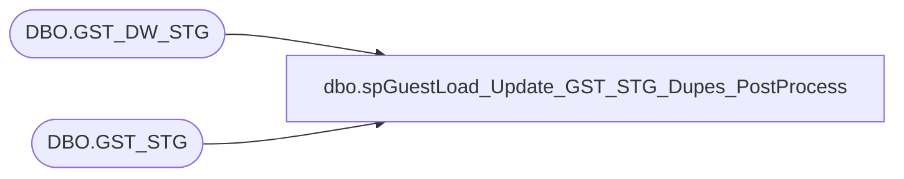

# dbo.spGuestLoad_Update_GST_STG_Dupes_PostProcess

**Database:** DWStaging  
**Server:** papamart  

## Architecture Diagram



## Table Dependencies

| Referenced Table |
|---|
| DBO.GST_DW_STG |
| DBO.GST_STG |

## Stored Procedure Code

```sql
CREATE PROC [dbo].[spGuestLoad_Update_GST_STG_Dupes_PostProcess]

AS 

-- =============================================================================================================
-- Name: spGuestLoad_Update_GST_STG_Dupes_PostProcess
--
-- Description:	
--		As we are now bypassing the Matchit system, this proc will perform some of the functions of the Matchit system.
--		Update dwstaging.dbo.gst_stg to:
--										set ovrlp_dta_set_cd = 'NEW' if there is no match to DWSTAGING.DBO.GST_DW_STG
--										set ovrlp_dta_set_cd = 'MATCH' if there is 1 match to DWSTAGING.DBO.GST_DW_STG
--										set ovrlp_dta_set_cd = 'MULTI' if there is > 1 match to DWSTAGING.DBO.GST_DW_STG
--
-- Revision History
--		Name:			Date:			Comments:
--		Dan Tweedie		08/17/2016		created proc
-- =============================================================================================================


set nocount on

--MARK MATCH
BEGIN

	;with 
			GST as
				(
					select
						gst_stg_id,
						crm_gst_nbr,
						lylty_gst_nbr,
						frst_nm,
						last_nm,
						brth_dt
					from
						DWSTAGING.DBO.GST_STG
				),
			GST_DW as
				(
					select
						gst_DW_stg_id,
						crm_gst_nbr,
						lylty_gst_nbr,
						frst_nm,
						last_nm,
						brth_dt
					from
						DWSTAGING.DBO.GST_DW_STG
				),
			FirstGstStgID as
				(
					select 
						min(gs.GST_DW_STG_ID) gst_stg_id
					from 
							 GST_DW gs
						join GST gs2 
						on 
							(
									(
										gs.crm_gst_nbr = gs2.crm_gst_nbr
										or
										gs.lylty_gst_nbr = gs2.lylty_gst_nbr
			
									)
								OR
									(
										gs.frst_nm = gs2.frst_nm
										and
										gs.last_nm = gs2.last_nm
										and
										gs.brth_dt = gs2.brth_dt
									)
							)
				),
			Multi_1 as
				(
					select 
						gs.GST_DW_STG_ID, gs2.gst_stg_id matchID
					from 
							 GST_DW gs
						join GST gs2 
						on 
							(
									(
										gs.crm_gst_nbr = gs2.crm_gst_nbr
										or
										gs.lylty_gst_nbr = gs2.lylty_gst_nbr
			
									)
								OR
									(
										gs.frst_nm = gs2.frst_nm
										and
										gs.last_nm = gs2.last_nm
										and
										gs.brth_dt = gs2.brth_dt
									)
							)

				),
			Multi_2 as
				(
					select
						GST_DW_STG_ID
					from 
						Multi_1
					group by GST_DW_STG_ID
					having
						count(*) > 1
				),
			Multi_3 as
				(
					select
						GST_DW_STG_ID, matchID
					from
						Multi_1
					where GST_DW_STG_ID in (select GST_DW_STG_ID from Multi_2)
				)

	update gs2
		set gs2.ovrlp_dta_set_cd = 'MATCH',
			gs2.ovrlp_rec_id = f.gst_stg_id ,
			gs2.ovrlp_scr_nbr = 100
	from 
				GST_DW gs
		join DWSTAGING.DBO.GST_STG gs2 
		on
				(
					(
						gs.crm_gst_nbr = gs2.crm_gst_nbr
						or
						gs.lylty_gst_nbr = gs2.lylty_gst_nbr
			
					)
				OR
					(
						gs.frst_nm = gs2.frst_nm
						and
						gs.last_nm = gs2.last_nm
						and
						gs.brth_dt = gs2.brth_dt
					)
			)
		join FirstGstStgID f on gs.gst_dw_stg_id = f.gst_stg_id
	where
		gs2.gst_stg_id not in (select GST_DW_STG_ID from Multi_3)
		and
		gs2.gst_stg_id not in (select matchID from Multi_3)

END
--======================================================================================================================================================

--MARK MULTI

BEGIN

	;with 
			GST as
				(
					select
						gst_stg_id,
						crm_gst_nbr,
						lylty_gst_nbr,
						frst_nm,
						last_nm,
						brth_dt
					from
						DWSTAGING.DBO.GST_STG
				),
			GST_DW as
				(
					select
						gst_DW_stg_id,
						crm_gst_nbr,
						lylty_gst_nbr,
						frst_nm,
						last_nm,
						brth_dt
					from
						DWSTAGING.DBO.GST_DW_STG
				),
			FirstGstStgID as
				(
					select 
						min(gs.GST_DW_STG_ID) gst_stg_id
					from 
							 GST_DW gs
						join GST gs2 
						on 
							(
									(
										gs.crm_gst_nbr = gs2.crm_gst_nbr
										or
										gs.lylty_gst_nbr = gs2.lylty_gst_nbr
			
									)
								OR
									(
										gs.frst_nm = gs2.frst_nm
										and
										gs.last_nm = gs2.last_nm
										and
										gs.brth_dt = gs2.brth_dt
									)
							)
				),
			Multi_1 as
				(
					select 
						gs.GST_DW_STG_ID, gs2.gst_stg_id matchID
					from 
							 GST_DW gs
						join GST gs2 
						on 
							(
									(
										gs.crm_gst_nbr = gs2.crm_gst_nbr
										or
										gs.lylty_gst_nbr = gs2.lylty_gst_nbr
			
									)
								OR
									(
										gs.frst_nm = gs2.frst_nm
										and
										gs.last_nm = gs2.last_nm
										and
										gs.brth_dt = gs2.brth_dt
									)
							)

				),
			Multi_2 as
				(
					select
						GST_DW_STG_ID
					from 
						Multi_1
					group by 
						GST_DW_STG_ID
					having
						count(*) > 1
				),
			Multi_3 as
				(
					select
						GST_DW_STG_ID, matchID
					from
						Multi_1
					where GST_DW_STG_ID in (select GST_DW_STG_ID from Multi_2)
				)

	update gs2
		set gs2.ovrlp_dta_set_cd = 'MULTI'
	from 
				GST_DW gs
		join DWSTAGING.DBO.GST_STG gs2 
		on
				(
					(
						gs.crm_gst_nbr = gs2.crm_gst_nbr
						or
						gs.lylty_gst_nbr = gs2.lylty_gst_nbr
			
					)
				OR
					(
						gs.frst_nm = gs2.frst_nm
						and
						gs.last_nm = gs2.last_nm
						and
						gs.brth_dt = gs2.brth_dt
					)
			)
		join FirstGstStgID f on gs.gst_dw_stg_id = f.gst_stg_id
	where
		gs2.gst_stg_id in (select GST_DW_STG_ID from Multi_3)
		OR
		gs2.gst_stg_id in (select matchID from Multi_3)

END
--======================================================================================================================================================
--MARK NEW
BEGIN
	;with 
			GST as
				(
					select
						gst_stg_id,
						crm_gst_nbr,
						lylty_gst_nbr,
						frst_nm,
						last_nm,
						brth_dt
					from
						DWSTAGING.DBO.GST_STG
				),
			GST_DW as
				(
					select
						gst_DW_stg_id,
						crm_gst_nbr,
						lylty_gst_nbr,
						frst_nm,
						last_nm,
						brth_dt
					from
						DWSTAGING.DBO.GST_DW_STG
				),
			FirstGstStgID as
				(
					select 
						min(gs.GST_DW_STG_ID) gst_stg_id
					from 
							 GST_DW gs
						join GST gs2 
						on 
							(
									(
										gs.crm_gst_nbr = gs2.crm_gst_nbr
										or
										gs.lylty_gst_nbr = gs2.lylty_gst_nbr
			
									)
								OR
									(
										gs.frst_nm = gs2.frst_nm
										and
										gs.last_nm = gs2.last_nm
										and
										gs.brth_dt = gs2.brth_dt
									)
							)
				)
	update gs2
		set gs2.ovrlp_dta_set_cd = 'NEW'
	from 
			DWSTAGING.DBO.GST_STG gs2 
	where
		gs2.gst_stg_id NOT in (select gst_stg_id FROM FirstGstStgID)
		
END
```

