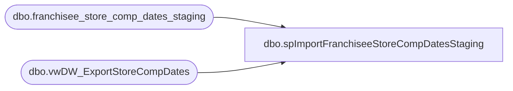

# dbo.spImportFranchiseeStoreCompDatesStaging

**Database:** DWStaging  
**Server:** papamart  

## Architecture Diagram



## Table Dependencies

| Referenced Table |
|---|
| dbo.franchisee_store_comp_dates_staging |
| dbo.vwDW_ExportStoreCompDates |

## Stored Procedure Code

```sql
CREATE PROCEDURE [dbo].[spImportFranchiseeStoreCompDatesStaging]
-- =============================================================================================================
-- Name: spImportFranchiseeStoreCompDatesStaging
--
-- Description:	
--	Generate the records to Insert into staging table. This extracts the information on bidb01
--		and makes it available to insert by way of spGet_Region_StoreCount.
--
-- Input:		
--
-- Output: 
--
-- Dependencies: 
--
-- Revision History
--		Name:				Date:			Comments:
--		Outside Contractor	4/14/2015		Created

-- =============================================================================================================
AS

	SET NOCOUNT ON

TRUNCATE TABLE DWStaging.dbo.franchisee_store_comp_dates_staging

INSERT INTO DWStaging.dbo.franchisee_store_comp_dates_staging
SELECT * FROM kodiak.FranchMstrData.dbo.vwDW_ExportStoreCompDates
```

