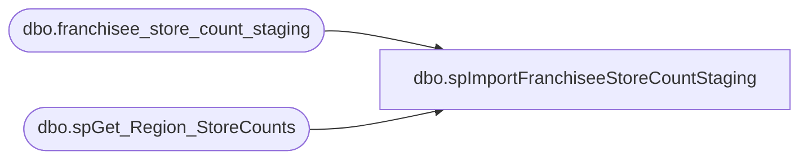

# dbo.spImportFranchiseeStoreCountStaging

**Database:** DWStaging  
**Server:** papamart  

## Architecture Diagram



## Table Dependencies

| Referenced Table |
|---|
| dbo.franchisee_store_count_staging |
| dbo.spGet_Region_StoreCounts |

## Stored Procedure Code

```sql
CREATE PROCEDURE [dbo].[spImportFranchiseeStoreCountStaging]
-- =============================================================================================================
-- Name: spImportFranchiseeStoreCountStaging
--
-- Description:	
--	Generate the records to Insert into staging table. This extracts the information on bidb01
--		and makes it available to insert by way of spGet_Region_StoreCount.
--
-- Input:		
--
-- Output: 
--
-- Dependencies: 
--
-- Revision History
--		Name:				Date:			Comments:
--		Outside Contractor	4/14/2015		Created

-- =============================================================================================================
AS

	SET NOCOUNT ON


TRUNCATE TABLE DWStaging.dbo.[franchisee_store_count_staging]


INSERT INTO  DWStaging.dbo.franchisee_store_count_staging (region_key,date_key, actual_date,fiscal_year,fiscal_week,numStores) 
EXEC Kodiak.FranchMstrData.dbo.spGet_Region_StoreCounts
```

