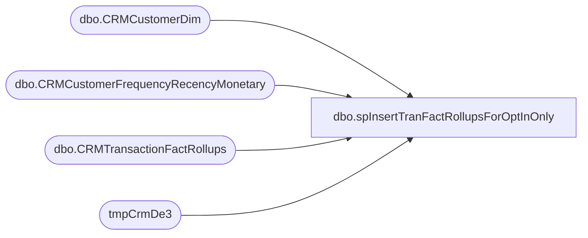

# dbo.spInsertTranFactRollupsForOptInOnly

**Database:** DWStaging  
**Server:** papamart  

## Architecture Diagram



## Table Dependencies

| Referenced Table |
|---|
| dbo.CRMCustomerDim |
| dbo.CRMCustomerFrequencyRecencyMonetary |
| dbo.CRMTransactionFactRollups |
| tmpCrmDe3 |

## Stored Procedure Code

```sql
-- =============================================
-- Author:		Ian Wallace
-- Create date: 01/17/2020
-- =============================================
CREATE PROCEDURE [dbo].[spInsertTranFactRollupsForOptInOnly] 
--@daysToGoBack AS INT = NULL
	
AS
BEGIN
	-- SET NOCOUNT ON added to prevent extra result sets from
	-- interfering with SELECT statements.
	SET NOCOUNT ON;

   INSERT INTO [tmpCrmDe3] ([CRMcustomerNumber],[transactionID],[purchaseDate],[purchaseChannel]
,[purchaseStoreNumber],[purchaseRevenue],[purchaseUnitCount],[stuffed],[unstuffed],[licensedORNot],[consumerGroup],[keyStory],[department],[Country],[sku])
SELECT cTFR.[CustomerNumber],
	   cTFR.[TransactionID],
       cTFR.[TransactionDate],
       cTFR.[StoreConcept],
	   cTFR.[StoreNumber],
	   cTFR.[Sales],
	   cTFR.[Units],
	  'stuffed' = case when  cTFR.Department = 'Stuffed' then 1 else 0 end,
	  'unstuffed' = case when  cTFR.Department = 'Unstuffed' then 1 else 0 end,
	    cTFR.[LicensedOrNot],
	    cTFR.[ConsumerGroup],
	    cTFR.[KeyStory],
	    cTFR.[Department],
	    cTFR.[Country],
		cTFR.sku
FROM [papamart].dw.dbo.[CRMTransactionFactRollups] cTFR
join [papamart].dw.dbo.[CRMCustomerDim] cDim on cTFR.CustomerNumber = cDim.CustomerNumber  and cDim.Emailable = 1
join [papamart].dw.dbo.[CRMCustomerFrequencyRecencyMonetary] cFRM on cFRM.CustomerNumber = cTFR.CustomerNumber
where cTFR.InsertDate > getdate() -2 or cTFR.UpdateDate > getdate() -2


--FROM [papamart].dw.dbo.[CRMTransactionFactRollups] cTFR
--join [papamart].dw.dbo.[CRMCustomerDim] cDim on cTFR.CustomerNumber = cDim.CustomerNumber -- and cDim.Emailable = 1
--where cTFR.CustomerNumber in 
--(
--select cFRM.CustomerNumber from [papamart].dw.dbo.[CRMCustomerFrequencyRecencyMonetary] cFRM 
--inner join [papamart].dw.dbo.[CRMCustomerDim] cDim on cFRM.CustomerNumber = cDim.CustomerNumber and cDim.Emailable = 1
--)


END

Accounting,Transaction_RawSummaryFromStoreServer_Load,-- =============================================-- =============================================
--	2018-10-22	- Dan Tweedie - Replace original update and insert sql with new Merge sql
--	2019-02-25	- Dan Tweedie - UPdated source view for web to query new table Accounting.WebFlashGaapStage
--	2020-12-29	- Dan Tweedie - Added post-merge update for web orders with new store number
--	2020-01-15	- Dan Tweedie	Updated to use new columns from web data source
-- =============================================-- =============================================
CREATE PROCEDURE [Accounting].[Transaction_RawSummaryFromStoreServer_Load]
	
AS


merge into Accounting.Sales_GAAP_RawFromStoreServer as target 
using 
		(
			select 
				sd.store_key,
				dd.date_key,
				s.location_code,
				s.location_name,
				s.RTL_TRN_ID as RTL_TRN_ID,
				s.STORE_NO,
				s.WORKSTATION_NO,
				s.RTL_TRN_NO as RTL_TRN_NO,
				s.OPERATOR_NO,
				s.RTL_TRN_TYPE_CODE,
				s.ITEM_NO,
				s.VOID_FLG,
				s.TransactionDatetime,
				s.net_sales,
				s.entry_date,
				s.source,
				s.TransactionID,
				s.WebOrderNumber,
				0 as isBOSISorBOPIS,
				NULL as SalesAuditRegisterNumber,
				NULL as SalesAuditTransactionRemark,
				NULL as GaapSalesDW,
				NULL as isGaapDW
			from  Accounting.Sales_GAAP_RawFromStoreServer_Staging s 
			join dw.dbo.store_dim sd  on cast(s.location_code as int) = sd.store_id
			join dw.dbo.date_dim dd on cast(s.TransactionDateTime as date) = cast(dd.actual_date as date)
			where s.location_code not in ('0013', '2013') ---not really needed, there should be no web sales in the table
			UNION
			select 
				sd.store_key,
				dd.date_key,
				s.FulfillmentLocation as location_code,
				s.FulfillmentLocationName as location_name,
				s.TransactionID as RTL_TRN_ID, --Orders.OrderID
				sd.store_id as STORE_NO,
				52 as WORKSTATION_NO,
				s.OrderNumber as RTL_TRN_NO, --web order number
				52 as OPERATOR_NO,
				s.TransactionType as RTL_TRN_TYPE_CODE,
				NULL as ITEM_NO,
				NULL as VOID_FLG,
				s.TransactionDate as TransactionDatetime,
				sum(s.FlashGaapSales) net_sales,
				s.TransactionDate as entry_date,
				'Web Cart' as source,
				s.SalesAuditTransactionID as TransactionID,
				s.OrderNumber as WebOrderNumber,
				s.isBOSISorBOPIS,
				s.SalesAuditRegisterNumber,
				s.SalesAuditTransactionRemark,
				s.GaapSalesDW,
				s.isGaapDW
			from  Accounting.WebFlashGaapStage s 
			join dw.dbo.store_dim sd  on cast(s.FulfillmentLocation as int) = sd.store_id
			join dw.dbo.date_dim dd on cast(s.TransactionDate as date) = cast(dd.actual_date as date)
			group by 
				sd.store_key,
				dd.date_key,
				s.FulfillmentLocation,
				s.FulfillmentLocationName,
				s.TransactionID,
				sd.store_id,
				s.OrderNumber,
				s.TransactionType,
				s.TransactionDate,
				s.SalesAuditTransactionID,
				s.isBOSISorBOPIS,
				s.SalesAuditRegisterNumber,
				s.SalesAuditTransactionRemark,
				s.GaapSalesDW,
				s.isGaapDW
		) as source 
on 
	(
		source.location_code = target.location_code 
		and source.TransactionDateTime = target.TransactionDateTime
		AND
			(
				(source.rtl_trn_id is NOT NULL and source.RTL_TRN_ID = target.rtl_trn_id )
				OR
				(source.RTL_TRN_ID is NULL and source.RTL_TRN_NO = target.RTL_TRN_NO)
			)
		AND
			(
				(source.location_code not in ('0013', '2013') and source.item_no = target.item_no)
				OR
				(source.location_code in ('0013', '2013') and isnull(source.item_no,0) = isnull(target.item_no,0))
				OR
				(source.location_code not in ('0013', '2013') and source.isBOSISorBOPIS=1 and isnull(source.item_no,0) = isnull(target.item_no,0))
			)
	)
when matched 
	and 
		(
			isnull(target.net_sales,0) <> isnull(source.net_sales,0)
			OR
			isnull(target.void_flg,9) <> isnull(source.void_flg,9)
			OR
			isnull(target.rtl_trn_type_code,99) <> isnull(source.rtl_trn_type_code,99)
			OR
			isnull(target.TransactionID, 0)<>isnull(source.TransactionID,0)
			OR
			isnull(target.WebOrderNumber,'x')<>isnull(source.WebOrderNumber,'x')
			or
			isnull(target.isBOSISorBOPIS,99)<>isnull(source.isBOSISorBOPIS,99)
			or
			isnull(target.SalesAuditRegisterNumber,99)<>isnull(source.SalesAuditRegisterNumber,99)
			or
			isnull(target.SalesAuditTransactionRemark,'xx')<>isnull(source.SalesAuditTransactionRemark,'xx')
			or
			isnull(target.GaapSalesDW,0)<>isnull(source.GaapSalesDW,0)
			or
			isnull(target.isGaapDW,99)<>isnull(source.isGaapDW,99)
		)
then update
	set 
		target.net_sales = source.net_sales,
		target.void_flg = source.void_flg,
		target.rtl_trn_type_code = source.rtl_trn_type_code,
		target.TransactionID=source.TransactionID,
		target.WebOrderNumber=source.WebOrderNumber,
		target.isBOSISorBOPIS=source.isBOSISorBOPIS,
		target.SalesAuditRegisterNumber=source.SalesAuditRegisterNumber,
		target.SalesAuditTransactionRemark=source.SalesAuditTransactionRemark,
		target.GaapSalesDW=source.GaapSalesDW,
		target.isGaapDW=source.isGaapDW,
		target.UpdateDate = getdate()

when not matched by target
	then insert
		(
			store_key,
			date_key,
			TransactionDatetime,
			location_code,
			location_name,
			net_sales,
			entry_date,
			source,
			RTL_TRN_ID,
			STORE_NO,
			WORKSTATION_NO ,
			RTL_TRN_NO,
			OPERATOR_NO,
			RTL_TRN_TYPE_CODE,
			ITEM_NO,
			VOID_FLG,
			TransactionID,
			WebOrderNumber,
			isBOSISorBOPIS,
			SalesAuditRegisterNumber,
			SalesAuditTransactionRemark,
			GaapSalesDW,
			isGaapDW,
			InsertDate
		)
	values
		(
			source.store_key,
			source.date_key,
			source.TransactionDatetime,
			source.location_code,
			source.location_name,
			source.net_sales,
			source.entry_date,
			source.source,
			source.RTL_TRN_ID,
			source.STORE_NO,
			source.WORKSTATION_NO ,
			source.RTL_TRN_NO,
			source.OPERATOR_NO,
			source.RTL_TRN_TYPE_CODE,
			source.ITEM_NO,
			source.VOID_FLG,
			source.TransactionID,
			source.WebOrderNumber,
			source.isBOSISorBOPIS,
			source.SalesAuditRegisterNumber,
			source.SalesAuditTransactionRemark,
			source.GaapSalesDW,
			source.isGaapDW,
			getdate()
		)
;

----post merge update for web orders with updated location code (easier here than in the merge..)
--I think no longer necessary since I'm using OrderID instead of TransactionID from web data
--update dw
--set dw.location_code=s.LocationCode
--from Accounting.Sales_GAAP_RawFromStoreServer dw with (nolock)
--join Accounting.WebFlashGaapStage s on dw.RTL_TRN_ID=s.TransactionID
--where dw.location_code<>s.LocationCode
```

