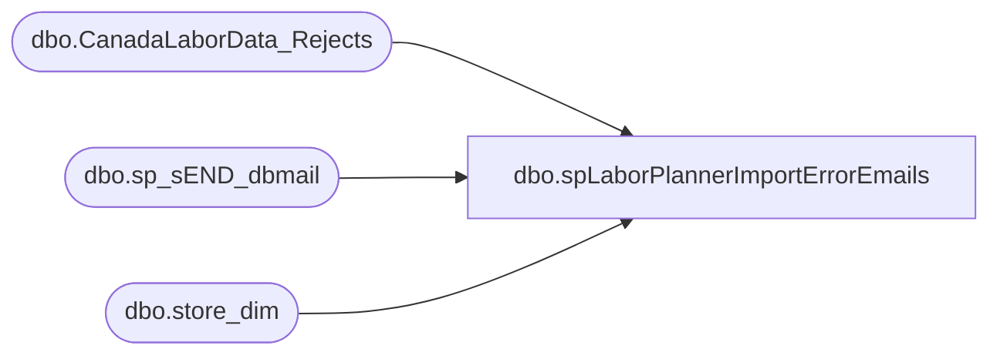

# dbo.spLaborPlannerImportErrorEmails

**Database:** DWStaging  
**Server:** papamart  

## Architecture Diagram



## Table Dependencies

| Referenced Table |
|---|
| dbo.CanadaLaborData_Rejects |
| dbo.sp_sEND_dbmail |
| dbo.store_dim |

## Stored Procedure Code

```sql
-- =====================================================================================================
-- Name: spLaborPlannerImportErrorEmails
--
-- Description:	Send Email to stores when employee does not have a clockout time in labor Planner
--
-- Input:
--
-- Dependencies: None
--
-- Revision History
--		Name:			Date:			Comments:
--		Brian Byas		3/31/2016		Created
-- =====================================================================================================
CREATE PROCEDURE [dbo].[spLaborPlannerImportErrorEmails] 
	

AS
BEGIN
	-- SET NOCOUNT ON added to prevent extra result sets from
	-- interfering with SELECT statements.
	SET NOCOUNT ON;

DECLARE @subject nvarchar(max)
DECLARE @body    nvarchar(max)
DECLARE	@query_result nvarchar(max)
DECLARE	@nsql nvarchar(max)
DECLARE	@storeId varchar(4)
DECLARE @iLoop int
DECLARE @dLoop int
DECLARE @str_email varchar(100)


IF (SELECT Count(*)
  FROM [DWStaging].[dbo].[CanadaLaborData_Rejects] WITH(NOLOCK)
  WHERE Status = 1) >= 1

BEGIN

	-- SET LOOP BY DISTINCT STORE ID
SELECT @iLoop = count(distinct storeId) 
FROM [DWStaging].[dbo].[CanadaLaborData_Rejects] cr WITH(NOLOCK) INNER JOIN
	dw.dbo.store_dim sd WITH(NOLOCK)
		ON cr.StoreId = sd.store_id
WHERE country = 'UK'
AND Status = 1

	SET @dLoop = @iLoop

	WHILE (@dLoop > 0 )
	BEGIN

			-- SET STORE ID
			SELECT TOP 1 @storeId = storeId 
			FROM [DWStaging].[dbo].[CanadaLaborData_Rejects] cr WITH(NOLOCK) INNER JOIN
				dw.dbo.store_dim sd WITH(NOLOCK)
					ON cr.StoreId = sd.store_id
			WHERE country = 'UK'
			AND Status = 1

	------------------------------------------------------------------------- 
	-- HTML Code & Query
	-------------------------------------------------------------------------
			 SET @body = cast( '<table border=1 cellpadding=1 cellspacing=1>' as nvarchar(max) )
			 SET @body = @body + '<th>Store#</th><th>EmployeeId</th><th>ClockinDate</th><th>ClockOutDate</th>'
				--  Form the query, use XML PATH to get the HTML

				SET @nsql = '
				select @qr =
				   CAST( (SELECT( SELECT [StoreId] FOR  XML Path (''td''),type) 
							,( SELECT EmployeeId FOR XML Path (''td''),type)  
							,( SELECT convert(varchar,[ClockinDate],120) FOR XML Path (''td''),type)
							,( SELECT convert(varchar,[ClockOutDate],23) FOR XML Path (''td''),type)
							FROM [DWStaging].[dbo].[CanadaLaborData_Rejects] cr WITH(NOLOCK) INNER JOIN
							dw.dbo.store_dim sd WITH(NOLOCK)
								ON cr.StoreId = sd.store_id
							WHERE country = ''UK''
							AND Status = 1
			  AND storeId = ' + CONVERT(varchar,@storeId) +'

								   for xml path( ''tr'' ), type

								   ) as nvarchar(max) )'

				EXEC sp_EXECutesql @nsql, N'@qr nvarchar(max) output', @query_result output

				SET @body = @body + @query_result
				SET @body = @body + cast( '</table>' as nvarchar(max) )

	
	-------------------------------------------------------------------------
	-- SEND EMAIL
	-------------------------------------------------------------------------

				SET @str_email = 'store'+ @storeId +'@buildabear.com'
				SET @subject = 'Labor Planner Missing Information'
				SET @body = 'The below list of Employee(s) has labor hours with no clock out time, please correct immediatlely or these hours will not be reported. <br><br>' + @body 
				EXEC msdb.dbo.sp_sEND_dbmail  @from_address = 'BIAdmin@buildabear.com',
											  @recipients = @str_email,
											  --@recipients = 'brianb@buildabear.com', --TESTING
											  @copy_recipients = 'biadmin@buildabear.com',
											  @body_format = 'HTML',
											  @body = @body,
											  @subject = @subject

			-- UPDATE THE STATUS OF EMAILS SENT TO ZERO
			UPDATE [DWStaging].[dbo].[CanadaLaborData_Rejects] SET [Status] = 0
			WHERE StoreId = @storeId

			-- DECREMENT LOOP
			SET @dLoop = @dLoop - 1

			
	END
END


END

-- UPDATE THE REMAINING CAN STORE STATUS OF EMAILS SENT TO ZERO
UPDATE [DWStaging].[dbo].[CanadaLaborData_Rejects] SET [Status] = 0
```

