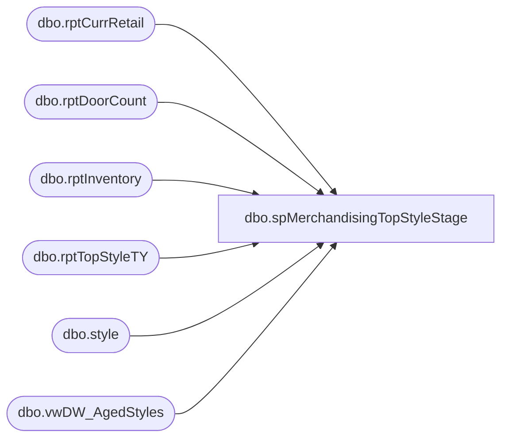

# dbo.spMerchandisingTopStyleStage

**Database:** DWStaging  
**Server:** papamart  

## Architecture Diagram



## Table Dependencies

| Referenced Table |
|---|
| dbo.rptCurrRetail |
| dbo.rptDoorCount |
| dbo.rptInventory |
| dbo.rptTopStyleTY |
| dbo.style |
| dbo.vwDW_AgedStyles |

## Stored Procedure Code

```sql
CREATE proc [dbo].[spMerchandisingTopStyleStage]

as 

-- =============================================================================================================
-- Name: spMerchandisingTopStyleStage
--
-- Description:	Stages data for Domo. 
--			Data queried has been pre-staged by this point, via other scheduled proc:
--					bedrockdb02.ma_01.dbo.spDW_TopStyleTy		--> stages data into bedrockdb02.ma_01.dbo.rptTopStyleTY
--					bedrockdb02.ma_01.dbo.spDW_Inventory		--> stages data into ma_01.dbo.rptInventory					
--					bedrockdb02.me_01.dbo.spDW_CurrentRetail	--> stages to bedrockdb02.ma_01.dbo.rptCurrRetail
--					bedrockdb02.me_01.dbo.spDW_DoorCount		--> stages to bedrockb02.ma_01.dbo.rptDoorCount
--
--		Name:				Date:			Comments:
--		Dan Tweedie			12/16/2014		CREATED
-- =============================================================================================================

set nocount on


if (object_id('tempdb..#TradingGroup') is not null) drop table #TradingGroup
select
	style_code,
	case 
		when style_code < 400000 then 'NA'
		when style_code >= 400000 and style_code < 800000 then 'EU'
		when style_code >= 800000 then 'AS'
	end as TradingGroup
into #TradingGroup
from bedrockdb02.ma_01.dbo.style

--======RANKS========--
if (object_id('tempdb..#DeptRankLastWeek') is not null) drop table #DeptRankLastWeek;
WITH 
DeptRank as
	(
		select 
			ts.Department,
			g.TradingGroup,
			ts.style_code,
			ts.style_desc,
			ts.NetSalesUnits1WeekAgo,
			row_number() OVER ( partition by ts.Department, g.TradingGroup order by ts.NetSalesUnits1WeekAgo desc ) DeptRankLW,
			InDate, 
			OutDate, 
			OutDateNote
		from bedrockdb02.ma_01.dbo.rptTopStyleTY ts
		join #TradingGroup g on ts.style_code = g.style_code
		where ts.NetSalesUnits1WeekAgo > 0
	)
select *
into #DeptRankLastWeek
from DeptRank
;

if (object_id('tempdb..#DeptRankWeekBeforLastWeek') is not null) drop table #DeptRankWeekBeforLastWeek;
WITH 
DeptRank as
	(
		select 
			ts.Department,
			g.TradingGroup,
			ts.style_code,
			ts.style_desc,
			ts.NetSalesUnits2WeeksAgo,
			row_number() OVER ( partition by ts.Department, g.TradingGroup order by ts.NetSalesUnits2WeeksAgo desc ) DeptRankLLW,
			InDate, 
			OutDate, 
			OutDateNote
		from bedrockdb02.ma_01.dbo.rptTopStyleTY ts
		join #TradingGroup g on ts.style_code = g.style_code
		where ts.NetSalesUnits2WeeksAgo > 0
	)
select *
into #DeptRankWeekBeforLastWeek
from DeptRank
where style_code in (select style_code from #DeptRankLastWeek);

if (object_id('tempdb..#DeptRankLastYear') is not null) drop table #DeptRankLastYear;
WITH 
DeptRank as
	(
		select 
			ts.Department,
			g.TradingGroup,
			ts.style_code,
			ts.style_desc,
			ts.NetSalesUnits1WeekAgo,
			row_number() OVER ( partition by ts.Department, g.TradingGroup order by ts.NetSalesUnitsLast1WeekLY desc ) DeptRankLY,
			InDate, 
			OutDate, 
			OutDateNote
		from bedrockdb02.ma_01.dbo.rptTopStyleTY ts
		join #TradingGroup g on ts.style_code = g.style_code
		where ts.NetSalesUnitsLast1WeekLY > 0
	)
select *
into #DeptRankLastYear
from DeptRank
;

if (object_id('tempdb..#DeptRankLWLastYear') is not null) drop table #DeptRankLWLastYear;
WITH 
DeptRank as
	(
		select 
			ts.Department,
			g.TradingGroup,
			ts.style_code,
			ts.style_desc,
			ts.NetSalesUnits1WeekAgo,
			row_number() OVER ( partition by ts.Department, g.TradingGroup order by ts.NetSalesUnitsLast2WeeksLY desc ) DeptRankLWLY,
			InDate, 
			OutDate, 
			OutDateNote
		from bedrockdb02.ma_01.dbo.rptTopStyleTY ts
		join #TradingGroup g on ts.style_code = g.style_code
		where ts.NetSalesUnitsLast1WeekLY > 0
	)
select *
into #DeptRankLWLastYear
from DeptRank
;

if (object_id('tempdb..#ConsGrpRankLastWeek') is not null) drop table #ConsGrpRankLastWeek;
WITH 
ConsumerGroupRank as
	(
		select 
			ts.Department,
			ts.ChainLabel as ConsumerGroup, 
			g.TradingGroup,
			ts.style_code,
			ts.style_desc,
			ts.NetSalesUnits1WeekAgo,
			row_number() OVER ( partition by ts.ChainLabel, g.TradingGroup order by ts.NetSalesUnits1WeekAgo desc ) ConsumerGroupRankLW,
			InDate, 
			OutDate, 
			OutDateNote
		from bedrockdb02.ma_01.dbo.rptTopStyleTY ts
		join #TradingGroup g on ts.style_code = g.style_code
		where ts.NetSalesUnits1WeekAgo > 0
	)
select *
into #ConsGrpRankLastWeek
from ConsumerGroupRank
where style_code in (select style_code from #DeptRankLastWeek);

if (object_id('tempdb..#ConsGrpRankWeekBeforLastWeek') is not null) drop table #ConsGrpRankWeekBeforLastWeek;
WITH 
ConsumerGroupRank as
	(
		select 
			ts.Department,
			ts.ChainLabel as ConsumerGroup, 
			g.TradingGroup,
			ts.style_code,
			ts.style_desc,
			ts.NetSalesUnits2WeeksAgo,
			row_number() OVER ( partition by ts.ChainLabel, g.TradingGroup order by ts.NetSalesUnits2WeeksAgo desc ) ConsumerGroupRankLLW,
			InDate, 
			OutDate, 
			OutDateNote
		from bedrockdb02.ma_01.dbo.rptTopStyleTY ts
		join #TradingGroup g on ts.style_code = g.style_code
		where ts.NetSalesUnits1WeekAgo > 0
	)
select *
into #ConsGrpRankWeekBeforLastWeek
from ConsumerGroupRank
where style_code in (select style_code from #DeptRankLastWeek);

if (object_id('tempdb..#ConsGrpRankLastYear') is not null) drop table #ConsGrpRankLastYear;
WITH 
ConsumerGroupRank as
	(
		select 
			ts.Department,
			ts.ChainLabel as ConsumerGroup, 
			g.TradingGroup,
			ts.style_code,
			ts.style_desc,
			ts.NetSalesUnits2WeeksAgo,
			row_number() OVER ( partition by ts.ChainLabel, g.TradingGroup order by ts.NetSalesUnitsLast1WeekLY desc ) ConsumerGroupRankLY,
			InDate, 
			OutDate, 
			OutDateNote
		from bedrockdb02.ma_01.dbo.rptTopStyleTY ts
		join #TradingGroup g on ts.style_code = g.style_code
		where ts.NetSalesUnits1WeekAgo > 0
	)
select *
into #ConsGrpRankLastYear
from ConsumerGroupRank
where style_code in (select style_code from #DeptRankLastWeek);

if (object_id('tempdb..#ConsGrpRankLWLastYear') is not null) drop table #ConsGrpRankLWLastYear;
WITH 
ConsumerGroupRank as
	(
		select 
			ts.Department,
			ts.ChainLabel as ConsumerGroup, 
			g.TradingGroup,
			ts.style_code,
			ts.style_desc,
			ts.NetSalesUnits2WeeksAgo,
			row_number() OVER ( partition by ts.ChainLabel, g.TradingGroup order by ts.NetSalesUnitsLast2WeeksLY desc ) ConsumerGroupRankLWLY,
			InDate, 
			OutDate, 
			OutDateNote
		from bedrockdb02.ma_01.dbo.rptTopStyleTY ts
		join #TradingGroup g on ts.style_code = g.style_code
		where ts.NetSalesUnits1WeekAgo > 0
	)
select *
into #ConsGrpRankLWLastYear
from ConsumerGroupRank
where style_code in (select style_code from #DeptRankLastWeek);


if (object_id('tempdb..#DeptRankYTD') is not null) drop table #DeptRankYTD;
WITH 
YTDRank as
	(
		select 
			ts.Department,
			g.TradingGroup,
			ts.style_code,
			ts.style_desc,
			ts.NetSalesUnitsThisYear,
			row_number() OVER ( partition by ts.Department, g.TradingGroup order by ts.NetSalesUnitsThisYear desc ) YTDRank,
			InDate, 
			OutDate, 
			OutDateNote
		from bedrockdb02.ma_01.dbo.rptTopStyleTY ts
		join #TradingGroup g on ts.style_code = g.style_code
		where ts.NetSalesUnits1WeekAgo > 0
	)
select *
into #DeptRankYTD
from YTDRank
where style_code in (select style_code from #DeptRankLastWeek);

if (object_id('tempdb..#TopStyle') is not null) drop table #TopStyle;
select 
	*,
	case 
		when style_code < 400000 then 'NA'
		when style_code >= 400000 and style_code < 800000 then 'EU'
		when style_code >= 800000 then 'AS'
	end as TradingGroup
into #TopStyle
from bedrockdb02.ma_01.dbo.rptTopStyleTY 

if (object_id('tempdb..#Inventory') is not null) drop table #Inventory;
select *
into #Inventory
from bedrockdb02.ma_01.dbo.rptInventory

if (object_id('tempdb..#CurrRetail') is not null) drop table #CurrRetail;
select 
	case 
		when jurisdiction_code = 'HOME' then 'NA'
		when jurisdiction_code = 'UK' then 'EU'
		when jurisdiction_code = 'CN' then 'AS'
	end as TradingGroup, 
	style_code, 
	current_selling_retail,
	original_selling_retail
into #CurrRetail
from bedrockdb02.ma_01.dbo.rptCurrRetail
where jurisdiction_code in ('UK', 'HOME', 'CN')

if (object_id('tempdb..#DoorCount') is not null) drop table #DoorCount;
select TradingGroup, store_count as DoorCount
into #DoorCount
from bedrockdb02.ma_01.dbo.rptDoorCount

if (object_id('tempdb..#Aged') is not null) drop table #Aged;
select *
into #Aged
from bedrockdb02.me_01.dbo.vwDW_AgedStyles

if (object_id('tempdb..#InventorySummary') is not null) drop table #InventorySummary;
select 
	TradingGroup,
	style_code,
	sum(Chain) as Chain,
	sum(Outlet) as Outlet,
	sum(Web) as Web,
	sum(Ohio980) as Ohio980,
	sum(OhioLocked1000) as OhioLocked1000,
	sum(WC960) as WC960,
	sum(UK2970) as UK2970
into #InventorySummary
from 
	(
		select 
			tg.TradingGroup,
			i.style_code,
			sum(i.EOPOnHandUnitsTotalCurrent) as Chain,
			0 as Outlet,
			0 as Web,
			0 as Ohio980,
			0 as OhioLocked1000,
			0 as WC960,
			0 as UK2970
		from #Inventory i
		join #TradingGroup tg on i.style_code = tg.style_code
		where i.LocationType = 'Chain'
		group by tg.TradingGroup, i.style_code
		UNION
		select 
			tg.TradingGroup,
			i.style_code,
			0 as Chain,
			sum(i.EOPOnHandUnitsTotalCurrent) as Outlet,
			0 as Web,
			0 as Ohio980,
			0 as OhioLocked1000,
			0 as WC960,
			0 as UK2970
		from #Inventory i
		join #TradingGroup tg on i.style_code = tg.style_code
		where i.LocationType = 'Outlet'
		group by tg.TradingGroup, i.style_code
		UNION
		select 
			tg.TradingGroup,
			i.style_code,
			0 as Chain,
			0 as Outlet,
			sum(i.EOPOnHandUnitsTotalCurrent) as Web,
			0 as Ohio980,
			0 as OhioLocked1000,
			0 as WC960,
			0 as UK2970
		from #Inventory i
		join #TradingGroup tg on i.style_code = tg.style_code
		where i.LocationType = 'Web'
		group by tg.TradingGroup, i.style_code
		UNION
		select 
			tg.TradingGroup,
			i.style_code,
			0 as Chain,
			0 as Outlet,
			0 as Web,
			0 as Ohio980,
			0 as OhioLocked1000,
			0 as WC960,
			0 as UK2970
		from #Inventory i
		join #TradingGroup tg on i.style_code = tg.style_code
		where i.LocationType = 'DC'
		group by tg.TradingGroup, i.style_code
		UNION
		select 
			tg.TradingGroup,
			i.style_code,
			0 as Chain,
			0 as Outlet,
			0 as Web,
			sum(i.EOPOnHandUnitsTotalCurrent) as Ohio980,
			0 as OhioLocked1000,
			0 as WC960,
			0 as UK2970
		from #Inventory i
		join #TradingGroup tg on i.style_code = tg.style_code
		where i.location_code = '0980'
		group by tg.TradingGroup, i.style_code
		UNION
		select 
			tg.TradingGroup,
			i.style_code,
			0 as Chain,
			0 as Outlet,
			0 as Web,
			0 as Ohio980,
			sum(i.EOPOnHandUnitsTotalCurrent) as OhioLocked1000,
			0 as WC960,
			0 as UK2970
		from #Inventory i
		join #TradingGroup tg on i.style_code = tg.style_code
		where i.location_code = '1000'
		group by tg.TradingGroup, i.style_code
		UNION
		select 
			tg.TradingGroup,
			i.style_code,
			0 as Chain,
			0 as Outlet,
			0 as Web,
			0 as Ohio980,
			0 as OhioLocked1000,
			sum(i.EOPOnHandUnitsTotalCurrent) as WC960,
			0 as UK2970
		from #Inventory i
		join #TradingGroup tg on i.style_code = tg.style_code
		where i.location_code = '0960'
		group by tg.TradingGroup, i.style_code
		UNION
		select 
			tg.TradingGroup,
			i.style_code,
			0 as Chain,
			0 as Outlet,
			0 as Web,
			0 as Ohio980,
			0 as OhioLocked1000,
			0 as WC960,
			sum(i.EOPOnHandUnitsTotalCurrent) as UK2970
		from #Inventory i
		join #TradingGroup tg on i.style_code = tg.style_code
		where i.location_code = '2970'
		group by tg.TradingGroup, i.style_code
	) x
group by TradingGroup, style_code


if (object_id('dwstaging..TopStyleDomoStage') is not null) drop table TopStyleDomoStage;
select 
	d1.TradingGroup,
	d1.Department as Department,
	d1.DeptRankLW as DepartmentRank, 
	d2.DeptRankLLW as DepartmentRankPreviousWeek, 
	c1.ConsumerGroupRankLW as ConsumerGroupRank, 
	c2.ConsumerGroupRankLLW ConsumerGroupRankPreviousWeek, 
	ytd.YTDRank as YearToDateRank,
	drLY.DeptRankLY as DepartmentRankLastYear,
	crLY.ConsumerGroupRankLY as ConsumerGroupRankLastYear,
	drlwLY.DeptRankLWLY as DeptRankLastWeekLY,
	crlwLY.ConsumerGroupRankLWLY,
	TS.KeyStory as KeyStory,
	ts.ChainLabel as ConsumerGroup,
	d1.style_code as Style,
	d1.style_desc as StyleDescription,
	cr.current_selling_retail as Non_PromoRetail_US_CA,
	ts.MerchandiseStatus as MSTAT,
	ts.NetSalesUnits1WeekAgo as SalesUnits1WeekAgo,
	ts.NetSalesUnits2WeeksAgo as  SalesUnits2WeeksAgo,
	ts.NetSalesUnits3WeeksAgo as SalesUnits3WeeksAgo,
	ts.NetSalesUnitsThisYear as SalesUnitsThisYear,
	ts.NetSalesRetailTe1WeekAgo as SalesRetailTE1WeekAgo,
	(ts.NetSalesRetailTe1WeekAgo / NULLIF(ts.NetSalesUnits1WeekAgo,0)) as AvgUnitRetail,
	((cr.current_selling_retail - (ts.NetSalesRetailTe1WeekAgo / NULLIF(ts.NetSalesUnits1WeekAgo,0))) / NULLIF(cr.current_selling_retail,0)) as AvgNonCLR_Markdown,
	(ts.NetSalesUnits1WeekAgo / NULLIF(dc.DoorCount,0)) as Velocity,
	ts.NetSalesUnits1WeekAgo / NULLIF((EOPOnHandStrUnitsTotal1WeekAgo + ts.NetSalesUnits1WeekAgo),0) as InStoreSellThroughPercentage,
	i1.Chain as ChainInventory,
	i1.Outlet as OutletInventory,
	i1.Web as WebInventory,
	i1.Ohio980 as Ohio980Inventory,
	i1.OhioLocked1000 as OhioLocked1000Inventory,
	i1.WC960 as WC960Inventory,
	i1.UK2970 as UK2970Inventory,
	dc.DoorCount as DoorCount,
	ts.PastPlusCurrOO as PastDuePlusCurrent,
	ts.OnOrderUnitsNext1Period as OnOrderNextPeriod,
	ts.OnOrderUnitsNext2Period as OnOrderNextPeriod2,
	ts.OnOrderUnitsNext3Period as OnOrderNextPeriod3,
	ts.OnOrderUnitsNext4Period + ts.OnOrderUnitsNext5Period as OnOrderNextPeriod4n5,
	a.Aged,
	d1.InDate, 
	d1.OutDate, 
	d1.OutDateNote
into dwstaging.dbo.TopStyleDomoStage
from #DeptRankLastWeek d1
join #DeptRankWeekBeforLastWeek d2 on d1.TradingGroup = d2.TradingGroup and d1.style_code = d2.style_code
join #ConsGrpRankLastWeek c1 on d1.TradingGroup = c1.TradingGroup and d1.style_code = c1.style_code
join #ConsGrpRankWeekBeforLastWeek c2 on d1.TradingGroup = c2.TradingGroup and d1.style_code = c2.style_code
join #DeptRankYTD ytd on d1.TradingGroup = ytd.TradingGroup and d1.style_code = ytd.style_code
join #DeptRankLastYear drLY on d1.TradingGroup = drLY.TradingGroup and d1.style_code = drLY.style_code
join #ConsGrpRankLastYear crLY on d1.TradingGroup = crLY.TradingGroup and d1.style_code = crLY.style_code
join #DeptRankLWLastYear drlwLY on d1.TradingGroup = drlwLY.TradingGroup and d1.style_code = drlwLY.style_code
join #ConsGrpRankLWLastYear crlwLY on d1.TradingGroup = crlwLY.TradingGroup and d1.style_code = crlwLY.style_code
join #TopStyle ts on d1.style_code = ts.style_code and d1.TradingGroup = ts.TradingGroup
join #CurrRetail cr on d1.style_code = cr.style_code and d1.TradingGroup = cr.TradingGroup 
join #DoorCount dc on d1.TradingGroup = dc.TradingGroup
join #InventorySummary i1 on d1.TradingGroup = i1.TradingGroup and d1.style_code = i1.style_code
join #Aged a on d1.style_code = a.style_code
order by d1.TradingGroup, d1.Department, d1.DeptRankLW
```

