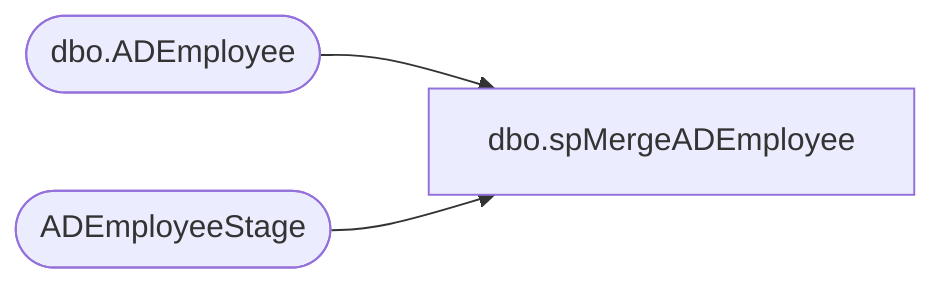

# dbo.spMergeADEmployee

**Database:** DWStaging  
**Server:** papamart  

## Architecture Diagram



## Table Dependencies

| Referenced Table |
|---|
| dbo.ADEmployee |
| ADEmployeeStage |

## Stored Procedure Code

```sql
CREATE proc [dbo].[spMergeADEmployee]

as 

--===================================================================================================================
--	Dan Tweedie	2019-04-10	Created proc - AD data is being extracted and held in DW for integrations with UltiPro
--===================================================================================================================

set nocount on


merge into DW.dbo.ADEmployee as target
using (select * from ADEmployeeStage where samaccountname is not null and samaccountname <> 'no data' and samaccountname <> '') as source 
	on 
		target.EmployeeID=source.EmployeeID
when matched 
	and 
		isnull(target.cn,'x')<>isnull(source.cn,'x')
		OR
		isnull(target.company,'x')<>isnull(source.company,'x')
		OR
		isnull(target.description,'x')<>isnull(source.description,'x')
		OR
		isnull(target.displayName,'x')<>isnull(source.displayName,'x')
		OR
		isnull(target.mail,'x')<>isnull(source.mail,'x')
		OR
		isnull(target.manager,'x')<>isnull(source.manager,'x')
		OR
		isnull(target.samaccountName,'x')<>isnull(source.samaccountName,'x')
		OR
		isnull(target.sn,'x')<>isnull(source.sn,'x')
		OR
		isnull(target.Department,'x')<>isnull(source.Department,'x')
		OR
		isnull(target.givenname,'x')<>isnull(source.givenName,'x')
		or 
		isnull(target.title,'x')<>isnull(source.title,'x')
		or
		isnull(target.memberOf,'x')<>isnull(source.memberOf,'x')
	then
		update 
			set 
				target.cn=source.cn,
				target.company=source.company,
				target.description=source.description,
				target.displayName=source.displayName,
				target.mail=source.mail,
				target.manager=source.manager,
				target.samaccountname=source.samaccountname,
				target.sn=source.sn,
				target.Department=source.Department,
				target.GivenName=source.GivenName,
				target.title=source.title,
				target.memberof=source.memberof,
				target.UpdateDate=getdate()
when not matched by target
	then insert
		(
			EmployeeID,
			cn,
			company,
			description,
			displayName,
			mail,
			manager,
			samaccountName,
			sn,
			Department,
			GivenName,
			Title,
			memberOf,
			InsertDate
		)
	values 
		(
			source.EmployeeID,
			source.cn,
			source.company,
			source.description,
			source.displayName,
			source.mail,
			source.manager,
			source.samaccountName,
			source.sn,
			source.Department,
			source.GivenName,
			source.Title,
			source.memberOf,
			getdate()
		)

;
```

